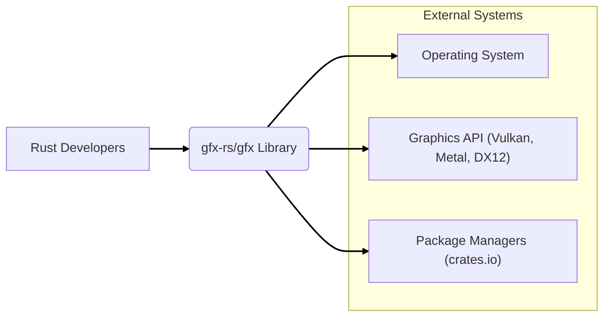

# BUSINESS POSTURE

This project, gfx-rs/gfx, is an open-source, low-level graphics library written in Rust. Its primary goal is to provide a portable and efficient abstraction over modern graphics APIs like Vulkan, Metal, and DirectX 12.

- Business Priorities and Goals:
  - Provide a robust and performant graphics abstraction layer for Rust developers.
  - Enable cross-platform graphics development in Rust.
  - Foster a community around Rust graphics programming.
  - Maintain compatibility with various graphics backends and operating systems.
  - Ensure the library is reliable and secure for its users.

- Business Risks:
  - Risk of vulnerabilities in the library leading to security issues in applications using it.
  - Risk of instability or bugs affecting application performance and reliability.
  - Risk of lack of adoption if the library is not performant, feature-rich, or easy to use.
  - Risk of community fragmentation or lack of contributions impacting maintenance and development.
  - Risk of dependency on external graphics backend libraries introducing vulnerabilities or instability.

# SECURITY POSTURE

- Existing Security Controls:
  - security control: Code is open source and publicly reviewed on GitHub. (Implemented: GitHub Repository)
  - security control: Pull requests are used for code contributions, allowing for review before merging. (Implemented: GitHub Workflow)
  - security control: Rust's memory safety features mitigate certain classes of vulnerabilities (e.g., buffer overflows). (Implemented: Language Choice - Rust)
  - security control: Use of crates.io for dependency management, which has some level of package verification. (Implemented: Dependency Management)

- Accepted Risks:
  - accepted risk: Reliance on external contributors for security vulnerability identification and patching.
  - accepted risk: Potential vulnerabilities in underlying graphics backend drivers and libraries that are outside the control of gfx-rs/gfx.
  - accepted risk: Open-source nature means vulnerabilities are publicly known once discovered.

- Recommended Security Controls:
  - security control: Implement automated security scanning (SAST/DAST) in the CI/CD pipeline to detect potential vulnerabilities early.
  - security control: Conduct regular security audits of the codebase, potentially involving external security experts.
  - security control: Establish a clear process for reporting and handling security vulnerabilities, including a security policy and contact information.
  - security control: Implement fuzz testing to identify potential crashes and vulnerabilities in the library.
  - security control: Sign release artifacts to ensure integrity and authenticity.

- Security Requirements:
  - Authentication: Not directly applicable as a library. However, for any related services (website, documentation), standard authentication practices should be used.
  - Authorization: Not directly applicable as a library. Access control is relevant for repository maintainers and contributors on GitHub.
  - Input Validation: Crucial for library APIs to prevent unexpected behavior or vulnerabilities when applications pass data to the library. Validate all inputs from applications to gfx-rs/gfx APIs.
  - Cryptography: May be relevant if the library handles any cryptographic operations or interacts with systems that use cryptography. Ensure proper and secure use of cryptographic libraries if needed.

# DESIGN

## C4 CONTEXT



- Context Diagram Elements:
  - Element:
    - Name: Rust Developers
    - Type: User
    - Description: Developers who use the gfx-rs/gfx library to build graphics applications or libraries in Rust.
    - Responsibilities: Integrate gfx-rs/gfx into their projects, provide input and feedback on the library.
    - Security controls: Responsible for securely using the library in their applications, following best practices for input validation and secure coding.
  - Element:
    - Name: gfx-rs/gfx Library
    - Type: Software System
    - Description: A low-level, portable graphics API written in Rust, providing an abstraction over modern graphics APIs.
    - Responsibilities: Provide a safe, performant, and cross-platform graphics abstraction. Handle interactions with underlying operating systems and graphics APIs.
    - Security controls: Input validation, memory safety (inherent in Rust), adherence to secure coding practices, vulnerability management.
  - Element:
    - Name: Operating System
    - Type: External System
    - Description: The operating system on which applications using gfx-rs/gfx are run (e.g., Windows, Linux, macOS, Android, iOS).
    - Responsibilities: Provide system resources and services to applications and graphics APIs.
    - Security controls: Operating system level security controls, such as process isolation, memory protection, and access control.
  - Element:
    - Name: Graphics API (Vulkan, Metal, DX12)
    - Type: External System
    - Description: Low-level graphics APIs that gfx-rs/gfx abstracts over.
    - Responsibilities: Provide hardware acceleration for graphics rendering.
    - Security controls: Security controls implemented by the graphics API drivers and runtime environment.
  - Element:
    - Name: Package Managers (crates.io)
    - Type: External System
    - Description: Rust package registry used to distribute and manage gfx-rs/gfx library.
    - Responsibilities: Host and distribute Rust packages, provide package verification and integrity checks.
    - Security controls: Package verification, checksums, and potentially signing of packages.

## C4 CONTAINER

```mermaid
flowchart LR
    subgraph "gfx-rs/gfx Library"
        A["Core API (Rust Crate)"]
        B["Backend Implementations (Vulkan, Metal, DX12, etc.)"]
        C["Examples and Tests"]
        D["Documentation"]
    end
    E["Rust Developers"]

    E --> A
    A --> B
    A --> D
    B --> "Graphics API (Vulkan, Metal, DX12)"
    B --> "Operating System"

    linkStyle 0,1,2,3,4 stroke:#000,stroke-width:2px;
```

- Container Diagram Elements:
  - Element:
    - Name: Core API (Rust Crate)
    - Type: Container - Library
    - Description: The main Rust crate (`gfx`) that provides the public API for developers to interact with. It defines the graphics abstraction and interfaces.
    - Responsibilities: Expose a safe and user-friendly API, manage backend selection and dispatch, handle resource management at a high level.
    - Security controls: Input validation on API calls, memory safety enforced by Rust, secure coding practices in API implementation.
  - Element:
    - Name: Backend Implementations (Vulkan, Metal, DX12, etc.)
    - Type: Container - Libraries/Modules
    - Description: Modules within gfx-rs/gfx that provide backend-specific implementations for different graphics APIs. These modules translate the abstract API calls to concrete API calls of the underlying graphics backend.
    - Responsibilities: Implement the gfx API for specific graphics backends, manage backend-specific resource allocation and command encoding, handle interactions with the operating system and graphics drivers.
    - Security controls: Input validation when interacting with backend APIs, error handling, secure interaction with OS and drivers, mitigation of backend-specific vulnerabilities.
  - Element:
    - Name: Examples and Tests
    - Type: Container - Code
    - Description: Example applications and unit/integration tests that demonstrate how to use the gfx-rs/gfx library and verify its functionality.
    - Responsibilities: Provide usage examples for developers, ensure the library functions correctly, and serve as regression tests.
    - Security controls: Tests should cover security-relevant scenarios, such as handling invalid inputs and error conditions. Examples should demonstrate secure usage patterns.
  - Element:
    - Name: Documentation
    - Type: Container - Documentation
    - Description: Documentation for the gfx-rs/gfx library, including API documentation, tutorials, and guides.
    - Responsibilities: Provide clear and accurate documentation for developers to use the library correctly and securely. Include security considerations and best practices in the documentation.
    - Security controls: Documentation should be reviewed for accuracy and security relevance.

## DEPLOYMENT

gfx-rs/gfx is a library, not a standalone application. Deployment in this context refers to how the library is made available to developers for use in their applications. The primary deployment method is via crates.io, the Rust package registry.

```mermaid
flowchart LR
    subgraph "Developer Environment"
        A["Developer Machine"]
        B["Rust Toolchain (cargo)"]
        C["Application Code"]
    end
    D["crates.io"]
    E["User Application"]
    F["Target Environment (User Machine)"]

    A --> B
    B --> D: "cargo publish"
    B --> C
    C --> B: "cargo build"
    B --> E: "cargo add gfx"
    E --> F: "Deployment"
    F --> "Operating System"
    F --> "Graphics API"

    linkStyle 0,1,2,3,4,5,6 stroke:#000,stroke-width:2px;
```

- Deployment Diagram Elements:
  - Element:
    - Name: crates.io
    - Type: Package Registry
    - Description: The Rust package registry where gfx-rs/gfx crate is published and distributed.
    - Responsibilities: Host and distribute the gfx-rs/gfx crate, provide versioning and dependency management.
    - Security controls: Package verification, checksums, potentially crate signing, TLS for download.
  - Element:
    - Name: Developer Machine
    - Type: Environment
    - Description: The development environment where developers build and test applications using gfx-rs/gfx.
    - Responsibilities: Development, testing, and building of applications.
    - Security controls: Developer machine security practices, secure development environment setup.
  - Element:
    - Name: Rust Toolchain (cargo)
    - Type: Tool
    - Description: The Rust build tool and package manager used to build, test, and manage Rust projects, including downloading and using crates like gfx-rs/gfx.
    - Responsibilities: Build Rust code, manage dependencies, download crates from crates.io.
    - Security controls: Cargo's built-in security features, such as dependency checksum verification, TLS for downloads from crates.io.
  - Element:
    - Name: User Application
    - Type: Software System
    - Description: An application built by a developer that uses the gfx-rs/gfx library.
    - Responsibilities: Utilize gfx-rs/gfx to perform graphics rendering, handle application logic.
    - Security controls: Application-level security controls, secure coding practices, proper usage of gfx-rs/gfx API.
  - Element:
    - Name: Target Environment (User Machine)
    - Type: Environment
    - Description: The environment where the user application is deployed and run.
    - Responsibilities: Execute the user application, provide resources and services.
    - Security controls: Operating system and environment security controls.

## BUILD

```mermaid
flowchart LR
    A["Developer"] --> B{Code Changes};
    B --> C[GitHub Repository];
    C --> D[GitHub Actions CI];
    D --> E{Build & Test};
    E --> F{Security Checks (SAST, Linters)};
    F --> G{Artifacts (crates.io)};
    G --> H[Users/Developers];

    style B fill:#ccf,stroke:#000,stroke-width:2px
    style C fill:#ccf,stroke:#000,stroke-width:2px
    style D fill:#ccf,stroke:#000,stroke-width:2px
    style E fill:#ccf,stroke:#000,stroke-width:2px
    style F fill:#ccf,stroke:#000,stroke-width:2px
    style G fill:#ccf,stroke:#000,stroke-width:2px

    linkStyle 0,1,2,3,4,5,6 stroke:#000,stroke-width:2px;
```

- Build Process Elements:
  - Element:
    - Name: Developer
    - Type: Person
    - Description: A software developer contributing to the gfx-rs/gfx project.
    - Responsibilities: Write code, submit pull requests, address code review feedback.
    - Security controls: Secure coding practices, code review participation.
  - Element:
    - Name: Code Changes
    - Type: Code
    - Description: Modifications to the gfx-rs/gfx codebase.
    - Responsibilities: Implement new features, fix bugs, address security vulnerabilities.
    - Security controls: Code review, version control (Git).
  - Element:
    - Name: GitHub Repository
    - Type: Code Repository
    - Description: The central repository hosting the gfx-rs/gfx source code on GitHub.
    - Responsibilities: Version control, code hosting, pull request management, access control.
    - Security controls: GitHub's security features, access control, branch protection, audit logs.
  - Element:
    - Name: GitHub Actions CI
    - Type: CI/CD System
    - Description: GitHub Actions workflows used for automated building, testing, and publishing of gfx-rs/gfx.
    - Responsibilities: Automate build process, run tests, perform security checks, publish artifacts.
    - Security controls: Secure CI/CD pipeline configuration, secret management, build environment security, artifact signing.
  - Element:
    - Name: Build & Test
    - Type: Build Process Step
    - Description: Compilation of the Rust code and execution of automated tests.
    - Responsibilities: Ensure code compiles successfully and tests pass, verify functionality.
    - Security controls: Build environment isolation, dependency integrity checks, test coverage.
  - Element:
    - Name: Security Checks (SAST, Linters)
    - Type: Build Process Step
    - Description: Automated security analysis of the codebase using static analysis tools (SAST) and linters.
    - Responsibilities: Identify potential security vulnerabilities and code quality issues early in the development cycle.
    - Security controls: SAST tools, linters, configuration of security checks, vulnerability reporting.
  - Element:
    - Name: Artifacts (crates.io)
    - Type: Package Registry
    - Description: The published gfx-rs/gfx crate on crates.io, ready for developers to download and use.
    - Responsibilities: Distribute the library to users, ensure package integrity and availability.
    - Security controls: Package signing, checksums, crates.io security measures.
  - Element:
    - Name: Users/Developers
    - Type: User
    - Description: Developers who download and use the gfx-rs/gfx library from crates.io.
    - Responsibilities: Integrate the library into their projects, report issues, contribute feedback.
    - Security controls: Verify package integrity, follow secure coding practices when using the library.

# RISK ASSESSMENT

- Critical Business Processes:
  - Maintaining the integrity and availability of the gfx-rs/gfx library on crates.io.
  - Ensuring the library is free from vulnerabilities that could be exploited by applications using it.
  - Maintaining the trust of the developer community in the security and reliability of gfx-rs/gfx.

- Data to Protect and Sensitivity:
  - Source code: Sensitive, as it contains the intellectual property and logic of the library. Confidentiality and integrity are important.
  - Build artifacts (crates): Sensitive, as compromised artifacts could introduce vulnerabilities into user applications. Integrity and availability are critical.
  - Developer credentials and secrets used in the build process: Highly sensitive, as compromise could lead to unauthorized code changes or artifact manipulation. Confidentiality and integrity are paramount.
  - Issue tracker and communication data: Moderately sensitive, as it may contain information about vulnerabilities or development plans. Confidentiality and integrity are relevant.

# QUESTIONS & ASSUMPTIONS

- Questions:
  - Are there any specific compliance requirements or industry standards that gfx-rs/gfx needs to adhere to?
  - Is there a dedicated security team or individual responsible for security aspects of the project?
  - Are there any existing security policies or guidelines for contributors?
  - What is the process for handling security vulnerability reports?
  - Are there any plans for formal security audits or penetration testing?

- Assumptions:
  - The primary goal is to provide a secure and reliable graphics library for the Rust ecosystem.
  - Security is a significant concern for the project maintainers and users.
  - The project benefits from the inherent memory safety features of Rust.
  - The project relies on community contributions for security vulnerability identification and patching.
  - The library is primarily distributed through crates.io.
  - GitHub Actions is used for CI/CD.