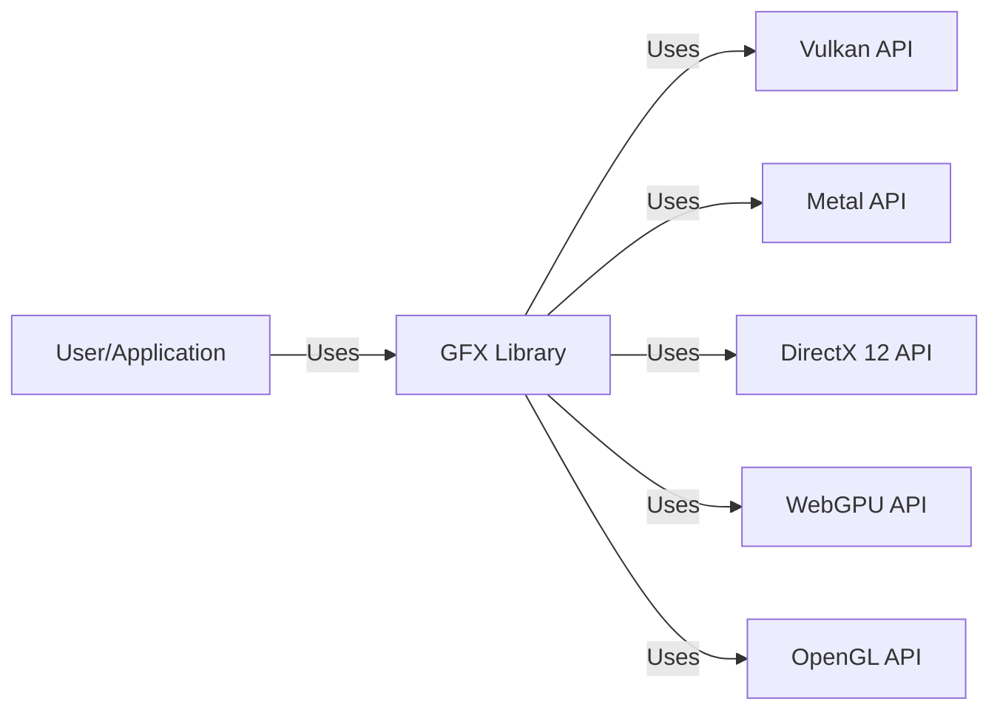
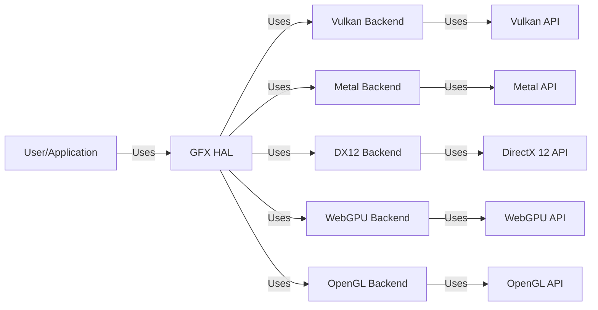
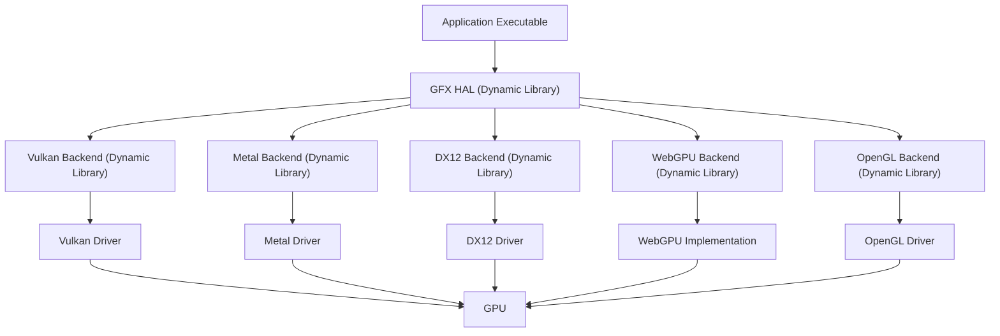
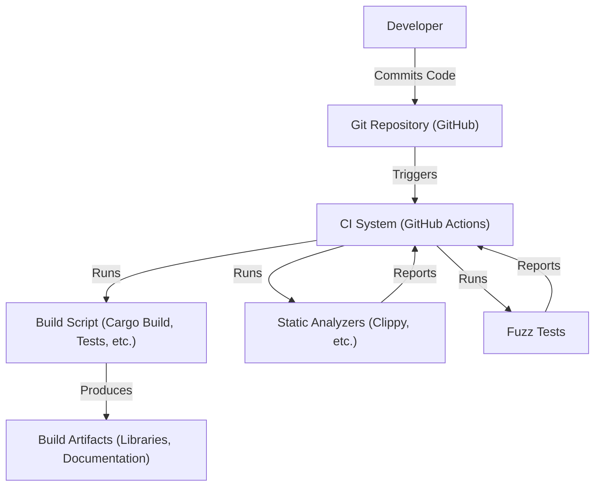

# BUSINESS POSTURE

Business Priorities and Goals:

*   Provide a low-overhead, cross-platform graphics and compute abstraction layer.
*   Enable high-performance rendering across a variety of hardware and operating systems.
*   Offer a modern and flexible API that caters to the needs of game developers and graphics programmers.
*   Maintain a robust and well-tested codebase.
*   Foster a vibrant community and ecosystem around the project.

Business Risks:

*   Inability to support new hardware or API features, leading to obsolescence.
*   Performance bottlenecks that limit the usability of the library in demanding applications.
*   Security vulnerabilities that could be exploited by malicious actors.
*   Lack of adoption due to complexity or competition from other libraries.
*   Difficulty in maintaining compatibility across different platforms and APIs.

# SECURITY POSTURE

Existing Security Controls:

*   security control: Code reviews: All changes to the codebase are subject to review by other developers. (Mentioned in CONTRIBUTING.md)
*   security control: Continuous Integration (CI): Automated builds and tests are run on every commit to ensure code quality and prevent regressions. (Visible in GitHub Actions workflows)
*   security control: Static Analysis: The project uses static analysis tools to identify potential bugs and security vulnerabilities. (Mentioned in CONTRIBUTING.md and visible in CI workflows)
*   security control: Fuzz Testing: The project uses fuzz testing to find potential vulnerabilities by providing invalid, unexpected, or random data as inputs to the library. (Mentioned in CONTRIBUTING.md and visible in CI workflows)
*   security control: Memory Safety: The project is written in Rust, a language that provides memory safety guarantees, preventing common vulnerabilities like buffer overflows and use-after-free errors. (Implicit in the choice of Rust)
*   security control: Dependency Management: The project uses Cargo, Rust's package manager, to manage dependencies and ensure that only trusted and up-to-date libraries are used. (Implicit in the use of Cargo)

Accepted Risks:

*   accepted risk: Reliance on underlying graphics APIs: The project relies on the security of the underlying graphics APIs (Vulkan, Metal, DX12, etc.) and drivers. Vulnerabilities in these components could impact the security of the project.
*   accepted risk: Complexity of graphics programming: Graphics programming is inherently complex, and subtle errors can lead to security vulnerabilities.

Recommended Security Controls:

*   security control: Dynamic Application Security Testing (DAST): Implement DAST to test the running application for vulnerabilities.
*   security control: Regular Security Audits: Conduct regular security audits by independent experts to identify potential vulnerabilities.
*   security control: Security Training: Provide security training to developers to raise awareness of common vulnerabilities and best practices.

Security Requirements:

*   Authentication: Not directly applicable, as this is a library, not a service. Authentication would be handled by the application using the library.
*   Authorization: Not directly applicable. Authorization would be handled by the application using the library.
*   Input Validation:
    *   The library should validate all inputs from the user application to prevent unexpected behavior or vulnerabilities. This includes validating buffer sizes, texture formats, shader parameters, and other inputs.
    *   The library should handle invalid inputs gracefully, returning error codes or panicking in a controlled manner.
*   Cryptography:
    *   If the library handles any sensitive data (e.g., encryption keys), it should use appropriate cryptographic algorithms and protocols to protect that data.
    *   The library should not implement its own cryptographic primitives but rely on established and well-vetted libraries.
*   Error Handling:
    *   The library should have robust error handling to prevent information leaks and ensure that errors are handled gracefully.
    *   Error messages should be informative but not reveal sensitive information.

# DESIGN

## C4 CONTEXT

Context Diagram Element List:

*   Element:
    *   Name: User/Application
    *   Type: User/External System
    *   Description: Represents the user or application that utilizes the GFX library for rendering and compute tasks.
    *   Responsibilities:
        *   Provides input data to the GFX library.
        *   Receives output from the GFX library (e.g., rendered frames).
        *   Manages the lifecycle of GFX resources.
    *   Security controls:
        *   Application-level security controls (e.g., authentication, authorization, input validation).

*   Element:
    *   Name: GFX Library
    *   Type: System
    *   Description: The core of the project, providing a cross-platform graphics and compute abstraction.
    *   Responsibilities:
        *   Provides a unified API for interacting with different graphics APIs.
        *   Manages graphics resources (buffers, textures, shaders, etc.).
        *   Handles command buffer creation and submission.
        *   Abstracts away platform-specific details.
    *   Security controls:
        *   Input validation.
        *   Memory safety (Rust).
        *   Code reviews.
        *   Static analysis.
        *   Fuzz testing.

*   Element:
    *   Name: Vulkan API
    *   Type: External System
    *   Description: A low-level, cross-platform graphics and compute API.
    *   Responsibilities:
        *   Provides direct access to GPU hardware.
        *   Executes graphics and compute commands.
    *   Security controls:
        *   Driver-level security controls.
        *   Hardware-level security features.

*   Element:
    *   Name: Metal API
    *   Type: External System
    *   Description: Apple's low-level graphics and compute API for its platforms.
    *   Responsibilities:
        *   Provides direct access to GPU hardware on Apple devices.
        *   Executes graphics and compute commands.
    *   Security controls:
        *   Driver-level security controls.
        *   Hardware-level security features.

*   Element:
    *   Name: DirectX 12 API
    *   Type: External System
    *   Description: Microsoft's low-level graphics and compute API for Windows and Xbox.
    *   Responsibilities:
        *   Provides direct access to GPU hardware on Windows and Xbox.
        *   Executes graphics and compute commands.
    *   Security controls:
        *   Driver-level security controls.
        *   Hardware-level security features.

*   Element:
    *   Name: WebGPU API
    *   Type: External System
    *   Description: A web standard for graphics and compute, currently under development.
    *   Responsibilities:
        *   Provides access to GPU hardware from web browsers.
        *   Executes graphics and compute commands.
    *   Security controls:
        *   Browser-level security controls.
        *   Driver-level security controls.
        *   Hardware-level security features.

*   Element:
    *   Name: OpenGL API
    *   Type: External System
    *   Description: Legacy graphics API.
    *   Responsibilities:
        *   Provides access to GPU hardware.
        *   Executes graphics and compute commands.
    *   Security controls:
        *   Driver-level security controls.
        *   Hardware-level security features.

## C4 CONTAINER

Container Diagram Element List:

*   Element:
    *   Name: User/Application
    *   Type: User/External System
    *   Description: Represents the user or application that utilizes the GFX library.
    *   Responsibilities:
        *   Provides input data.
        *   Receives output.
        *   Manages GFX resource lifecycle.
    *   Security controls:
        *   Application-level security.

*   Element:
    *   Name: GFX HAL
    *   Type: Container
    *   Description: The Hardware Abstraction Layer (HAL) provides a common interface for interacting with different graphics backends.
    *   Responsibilities:
        *   Abstracts away backend-specific details.
        *   Provides a unified API for resource management and command submission.
        *   Handles dispatching commands to the appropriate backend.
    *   Security controls:
        *   Input validation.
        *   Error handling.

*   Element:
    *   Name: Backend Vulkan
    *   Type: Container
    *   Description: Implements the GFX HAL interface using the Vulkan API.
    *   Responsibilities:
        *   Translates GFX HAL commands into Vulkan API calls.
        *   Manages Vulkan-specific resources.
    *   Security controls:
        *   Relies on Vulkan API security.

*   Element:
    *   Name: Backend Metal
    *   Type: Container
    *   Description: Implements the GFX HAL interface using the Metal API.
    *   Responsibilities:
        *   Translates GFX HAL commands into Metal API calls.
        *   Manages Metal-specific resources.
    *   Security controls:
        *   Relies on Metal API security.

*   Element:
    *   Name: Backend DX12
    *   Type: Container
    *   Description: Implements the GFX HAL interface using the DirectX 12 API.
    *   Responsibilities:
        *   Translates GFX HAL commands into DirectX 12 API calls.
        *   Manages DirectX 12-specific resources.
    *   Security controls:
        *   Relies on DirectX 12 API security.

*   Element:
    *   Name: Backend WebGPU
    *   Type: Container
    *   Description: Implements the GFX HAL interface using the WebGPU API.
    *   Responsibilities:
        *   Translates GFX HAL commands into WebGPU API calls.
        *   Manages WebGPU-specific resources.
    *   Security controls:
        *   Relies on WebGPU API security.

*   Element:
    *   Name: Backend OpenGL
    *   Type: Container
    *   Description: Implements the GFX HAL interface using the OpenGL API.
    *   Responsibilities:
        *   Translates GFX HAL commands into OpenGL API calls.
        *   Manages OpenGL-specific resources.
    *   Security controls:
        *   Relies on OpenGL API security.

*   Element:
    *   Name: Vulkan API
    *   Type: External System
    *   Description: Low-level graphics and compute API.
    *   Responsibilities:
        *   Direct GPU access.
        *   Executes commands.
    *   Security controls:
        *   Driver and hardware security.

*   Element:
    *   Name: Metal API
    *   Type: External System
    *   Description: Apple's graphics and compute API.
    *   Responsibilities:
        *   Direct GPU access (Apple devices).
        *   Executes commands.
    *   Security controls:
        *   Driver and hardware security.

*   Element:
    *   Name: DirectX 12 API
    *   Type: External System
    *   Description: Microsoft's graphics and compute API.
    *   Responsibilities:
        *   Direct GPU access (Windows/Xbox).
        *   Executes commands.
    *   Security controls:
        *   Driver and hardware security.

*   Element:
    *   Name: WebGPU API
    *   Type: External System
    *   Description: Web standard for graphics and compute.
    *   Responsibilities:
        *   GPU access from web browsers.
        *   Executes commands.
    *   Security controls:
        *   Browser, driver, and hardware security.

*   Element:
    *   Name: OpenGL API
    *   Type: External System
    *   Description: Legacy graphics API.
    *   Responsibilities:
        *   Provides access to GPU hardware.
        *   Executes graphics and compute commands.
    *   Security controls:
        *   Driver-level security controls.
        *   Hardware-level security features.

## DEPLOYMENT

Possible Deployment Solutions:

1.  Static Linking: The GFX library can be statically linked into the user application. This is the simplest deployment model, as it results in a single executable file.
2.  Dynamic Linking: The GFX library can be dynamically linked into the user application. This allows for smaller executable sizes and easier updates to the library, but it requires the library to be distributed alongside the application.
3.  System-Wide Installation: The GFX library can be installed system-wide, making it available to all applications. This is common on Linux systems, where libraries are typically installed in standard locations.

Chosen Solution (Dynamic Linking):

Deployment Diagram Element List:

*   Element:
    *   Name: Application Executable
    *   Type: Executable
    *   Description: The compiled user application.
    *   Responsibilities:
        *   Runs the application logic.
        *   Loads and uses the GFX HAL dynamic library.
    *   Security controls:
        *   Standard executable security measures (e.g., code signing).

*   Element:
    *   Name: GFX HAL (Dynamic Library)
    *   Type: Dynamic Library
    *   Description: The dynamically linked GFX HAL library.
    *   Responsibilities:
        *   Provides the GFX API to the application.
        *   Loads and uses the appropriate backend dynamic library.
    *   Security controls:
        *   Input validation.
        *   Error handling.
        *   Code signing.

*   Element:
    *   Name: Vulkan Backend (Dynamic Library)
    *   Type: Dynamic Library
    *   Description: The dynamically linked Vulkan backend.
    *   Responsibilities:
        *   Implements the GFX HAL interface using Vulkan.
        *   Loads the Vulkan driver.
    *   Security controls:
        *   Relies on Vulkan driver security.
        *   Code signing.

*   Element:
    *   Name: Metal Backend (Dynamic Library)
    *   Type: Dynamic Library
    *   Description: The dynamically linked Metal backend.
    *   Responsibilities:
        *   Implements the GFX HAL interface using Metal.
        *   Loads the Metal driver.
    *   Security controls:
        *   Relies on Metal driver security.
        *   Code signing.

*   Element:
    *   Name: DX12 Backend (Dynamic Library)
    *   Type: Dynamic Library
    *   Description: The dynamically linked DirectX 12 backend.
    *   Responsibilities:
        *   Implements the GFX HAL interface using DirectX 12.
        *   Loads the DX12 driver.
    *   Security controls:
        *   Relies on DX12 driver security.
        *   Code signing.

*   Element:
    *   Name: WebGPU Backend (Dynamic Library)
    *   Type: Dynamic Library
    *   Description: The dynamically linked WebGPU backend.
    *   Responsibilities:
        *   Implements the GFX HAL interface using WebGPU.
        *   Loads the WebGPU implementation.
    *   Security controls:
        *   Relies on WebGPU implementation security.
        *   Code signing.

*   Element:
    *   Name: OpenGL Backend (Dynamic Library)
    *   Type: Dynamic Library
    *   Description: The dynamically linked OpenGL backend.
    *   Responsibilities:
        *   Implements the GFX HAL interface using OpenGL.
        *   Loads the OpenGL driver.
    *   Security controls:
        *   Relies on OpenGL driver security.
        *   Code signing.

*   Element:
    *   Name: Vulkan Driver
    *   Type: Driver
    *   Description: The system-provided Vulkan driver.
    *   Responsibilities:
        *   Provides the Vulkan API.
        *   Interacts with the GPU.
    *   Security controls:
        *   Driver-level security.

*   Element:
    *   Name: Metal Driver
    *   Type: Driver
    *   Description: The system-provided Metal driver.
    *   Responsibilities:
        *   Provides the Metal API.
        *   Interacts with the GPU.
    *   Security controls:
        *   Driver-level security.

*   Element:
    *   Name: DX12 Driver
    *   Type: Driver
    *   Description: The system-provided DirectX 12 driver.
    *   Responsibilities:
        *   Provides the DirectX 12 API.
        *   Interacts with the GPU.
    *   Security controls:
        *   Driver-level security.

*   Element:
    *   Name: WebGPU Implementation
    *   Type: Library/Driver
    *   Description: The system or browser-provided WebGPU implementation.
    *   Responsibilities:
        *   Provides the WebGPU API.
        *   Interacts with the GPU.
    *   Security controls:
        *   Implementation-level security (browser or system).

*   Element:
    *   Name: OpenGL Driver
    *   Type: Driver
    *   Description: The system-provided OpenGL driver.
    *   Responsibilities:
        *   Provides the OpenGL API.
        *   Interacts with the GPU.
    *   Security controls:
        *   Driver-level security.

*   Element:
    *   Name: GPU
    *   Type: Hardware
    *   Description: The Graphics Processing Unit.
    *   Responsibilities:
        *   Executes graphics and compute commands.
    *   Security controls:
        *   Hardware-level security.

## BUILD

Build Process Description:

1.  Developers write code and commit it to the Git repository hosted on GitHub.
2.  GitHub Actions, the CI/CD system, is triggered by new commits.
3.  The CI system runs build scripts defined in the repository (using Cargo, Rust's build system). These scripts compile the code, run tests, and generate documentation.
4.  Static analysis tools (like Clippy) are run as part of the CI process to identify potential code quality and security issues.
5.  Fuzz tests are executed to discover potential vulnerabilities by providing random or malformed inputs.
6.  The build process produces build artifacts, such as compiled libraries and documentation.
7.  The results of static analysis and fuzz tests are reported back to the CI system, and any failures prevent the build from succeeding.

Security Controls:

*   security control: CI/CD Pipeline: GitHub Actions automates the build and testing process, ensuring consistency and reducing the risk of manual errors.
*   security control: Static Analysis: Clippy and other static analysis tools are used to identify potential code quality and security issues early in the development process.
*   security control: Fuzz Testing: Fuzz tests are run to discover potential vulnerabilities that might be missed by traditional testing methods.
*   security control: Dependency Management: Cargo ensures that only trusted and up-to-date dependencies are used.
*   security control: Code Review: All code changes are reviewed by other developers before being merged.

# RISK ASSESSMENT

Critical Business Processes:

*   Providing a reliable and performant graphics abstraction layer.
*   Maintaining compatibility with various hardware and software platforms.
*   Enabling developers to create high-quality graphics applications.

Data to Protect and Sensitivity:

*   Source Code: The source code of the GFX library itself is not highly sensitive, as it is open source. However, protecting the integrity of the codebase is crucial to prevent the introduction of malicious code.
*   Build Artifacts: The compiled libraries are moderately sensitive. Tampering with these artifacts could lead to the distribution of malicious code to users.
*   User Data: The GFX library itself does not directly handle user data. However, applications built using GFX may handle sensitive user data. The security of that data is the responsibility of the application developer, but GFX should provide a secure foundation.
*   Graphics Data: The library processes graphics data (textures, models, shaders, etc.). The sensitivity of this data depends on the application. GFX should ensure that this data is handled securely within the library's memory management.

# QUESTIONS & ASSUMPTIONS

Questions:

*   Are there any specific compliance requirements (e.g., PCI DSS, HIPAA) that the applications using GFX need to adhere to? This would influence the security requirements for GFX.
*   What is the expected threat model for applications using GFX? Are they primarily client-side applications, web applications, or server-side applications?
*   What level of security expertise is expected from the developers using GFX? This will influence the design of the API and the documentation.
*   What are the specific performance requirements for different target platforms?
*   What is the long-term support plan for different graphics APIs (e.g., OpenGL)?

Assumptions:

*   BUSINESS POSTURE: The primary goal is to provide a high-quality, open-source graphics library. Profitability is not a direct concern, but adoption and community growth are important.
*   SECURITY POSTURE: The project follows standard secure development practices, including code reviews, static analysis, and fuzz testing. The developers are security-conscious but may not be security experts.
*   DESIGN: The library is designed to be used in a variety of applications, from games to scientific visualization. The primary deployment model is dynamic linking, but static linking is also supported. The build process is automated using GitHub Actions.