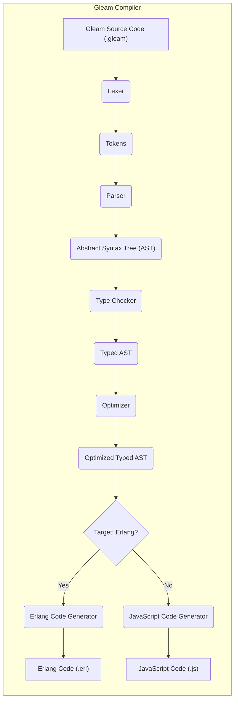
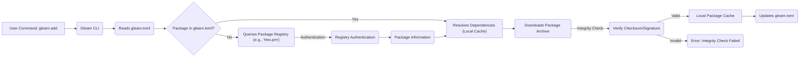

# Project Design Document: Gleam Programming Language

**Version:** 1.1
**Date:** October 26, 2023
**Author:** AI Software Architect

## 1. Introduction

This document provides a detailed architectural design of the Gleam programming language project, focusing on aspects relevant to security threat modeling. It outlines the key components, their interactions, and data flows within the system, with a particular emphasis on potential security implications. This document serves as a foundation for subsequent threat modeling activities, enabling a comprehensive understanding of potential security vulnerabilities.

## 2. Goals

The primary goals of the Gleam project are:

*   To provide a functional programming language with a focus on type safety and developer experience.
*   To compile Gleam source code to efficient and reliable Erlang and JavaScript code.
*   To foster a strong and secure ecosystem through a well-designed package manager and standard library.
*   To enable the development of robust, scalable, and secure applications.

## 3. Architecture Overview

Gleam's architecture centers around a sophisticated compiler that transforms human-readable Gleam code into machine-executable code for either the Erlang or JavaScript virtual machines. The ecosystem includes a package manager for managing external dependencies, a standard library offering core functionalities, and various supporting tools that facilitate development and deployment. Security is considered throughout the design, particularly in the compiler, package manager, and the interaction with external resources.

## 4. Key Components

*   **Gleam Compiler:**
    *   **Description:** The core component responsible for the entire compilation pipeline.
    *   **Inputs:** Gleam source code files (`.gleam`), dependency information from `gleam.toml`.
    *   **Stages:**
        *   **Lexing:** Converts source code into tokens.
        *   **Parsing:** Builds an Abstract Syntax Tree (AST) from the tokens.
        *   **Type Checking:** Enforces Gleam's type system, ensuring type safety.
        *   **Optimization:** Performs various optimizations on the typed AST.
        *   **Code Generation:** Translates the optimized AST into either Erlang or JavaScript code.
    *   **Outputs:** Erlang source code (`.erl`) or JavaScript source code (`.js`).
    *   **Security Relevance:** Vulnerabilities in any stage could lead to denial-of-service, code injection in the generated code, or information disclosure.
*   **Gleam Package Manager (gleam):**
    *   **Description:** Manages project dependencies and integrates with package registries.
    *   **Functionality:**
        *   Reads and validates the `gleam.toml` manifest file.
        *   Resolves project dependencies, potentially recursively.
        *   Interacts with configured package registries (e.g., Hex.pm for Erlang dependencies).
        *   Authenticates with package registries (if required).
        *   Downloads package archives.
        *   Verifies package integrity (e.g., using checksums).
        *   Manages a local package cache.
    *   **Security Relevance:** A critical component for supply chain security. Vulnerabilities here can lead to the introduction of malicious code into a project.
*   **Gleam Standard Library:**
    *   **Description:** Provides a set of fundamental modules and functions readily available to Gleam programs.
    *   **Content:** Includes data structures, I/O operations, concurrency primitives, and other essential utilities.
    *   **Implementation:** Primarily implemented in Gleam itself, but may interface with underlying platform libraries.
    *   **Security Relevance:**  Bugs or vulnerabilities in the standard library can directly impact the security of applications built with Gleam.
*   **Build System:**
    *   **Description:** Orchestrates the compilation and linking process.
    *   **Process:**
        *   Reads project configuration (e.g., `gleam.toml`).
        *   Invokes the Gleam compiler for each Gleam module.
        *   May integrate with target platform build tools (e.g., `rebar3` for Erlang, `npm`/`yarn` for JavaScript).
        *   Handles linking and packaging of the final application.
    *   **Security Relevance:**  Manipulation of the build process can lead to the inclusion of unintended code or the modification of the final output.
*   **Language Server (Optional):**
    *   **Description:** Provides IDE features like autocompletion, go-to-definition, and error highlighting.
    *   **Communication:** Communicates with code editors via the Language Server Protocol (LSP).
    *   **Functionality:** Analyzes Gleam code in real-time.
    *   **Security Relevance:**  If not properly sandboxed, a compromised language server could potentially execute arbitrary code on the developer's machine.
*   **Documentation Generator:**
    *   **Description:** Generates API documentation from Gleam source code comments.
    *   **Output:** Typically produces HTML or Markdown.
    *   **Process:** Parses Gleam code and extracts documentation comments.
    *   **Security Relevance:**  Vulnerabilities could lead to cross-site scripting (XSS) in the generated documentation if user-provided content is not properly sanitized.

## 5. Data Flow Diagrams

### 5.1. Compilation Process (Detailed)

### 5.2. Package Management (Detailed)

## 6. Security Considerations (Detailed for Threat Modeling)

*   **Compiler Vulnerabilities:**
    *   **Malicious Input Exploitation:** Crafted Gleam source code designed to crash the compiler (Denial of Service) or exploit vulnerabilities in the parser or type checker.
    *   **Code Injection:** Flaws in the code generation phase leading to the generation of insecure or malicious code in the target languages (Erlang/JavaScript).
    *   **Information Disclosure:** Compiler errors or internal state leaks revealing sensitive information about the compilation process or source code.
*   **Package Manager Vulnerabilities:**
    *   **Dependency Confusion/Substitution Attacks:**  Installing a malicious package from a public registry that shares a name with a private or internal dependency.
    *   **Supply Chain Attacks:** Compromised package registries serving malicious packages or attackers injecting malicious code into legitimate packages.
    *   **Insecure Downloads:** Lack of or weak integrity checks (e.g., missing or easily bypassed checksum verification) allowing for man-in-the-middle attacks.
    *   **Authentication and Authorization Issues:** Weak or missing authentication mechanisms for accessing private package registries.
    *   **Dependency Resolution Vulnerabilities:**  Exploiting vulnerabilities in the dependency resolution algorithm to force the installation of vulnerable dependency versions.
*   **Standard Library Vulnerabilities:**
    *   **Buffer Overflows/Underflows:**  Memory safety issues in standard library functions, potentially exploitable if they handle untrusted input.
    *   **Injection Vulnerabilities:**  Standard library functions that construct commands or queries without proper sanitization, leading to command injection or SQL injection in the target language context.
    *   **Cryptographic Weaknesses:**  Use of insecure cryptographic algorithms or improper implementation of cryptographic functions.
*   **Build System Vulnerabilities:**
    *   **Build Script Injection:**  Vulnerabilities allowing attackers to inject malicious commands into build scripts executed during the build process.
    *   **Path Traversal:**  Exploiting vulnerabilities in how the build system handles file paths to access or modify files outside the intended project directory.
    *   **Exposure of Secrets:**  Accidental inclusion of sensitive information (API keys, passwords) in build configurations or output.
*   **Language Server Vulnerabilities:**
    *   **Remote Code Execution:**  Exploiting vulnerabilities in the LSP implementation to execute arbitrary code on the developer's machine.
    *   **Information Disclosure:**  Leaking sensitive information from the developer's environment through the LSP communication channel.
    *   **Denial of Service:**  Crashing the language server by sending specially crafted requests.
*   **Documentation Generator Vulnerabilities:**
    *   **Cross-Site Scripting (XSS):**  Failing to sanitize user-provided content in documentation comments, allowing attackers to inject malicious scripts into the generated documentation.
    *   **Content Injection:**  Exploiting vulnerabilities to inject arbitrary content into the generated documentation.

## 7. Assumptions and Constraints

*   The Gleam project is an open-source project with community contributions. Security relies on code reviews and community vigilance.
*   The compiler relies on the security of the underlying Erlang and JavaScript virtual machines and their respective ecosystems.
*   The package manager's security is partially dependent on the security practices of external package registries.
*   Users are expected to follow secure development practices when writing Gleam code and managing dependencies.

## 8. Future Considerations

*   Formal security audits of the compiler, package manager, and core standard library modules.
*   Implementation of static analysis tools and linters to automatically detect potential security vulnerabilities in Gleam code.
*   Adoption of secure coding guidelines and best practices within the Gleam project.
*   Clear documentation and guidance for developers on writing secure Gleam applications.
*   Consideration of features like software bill of materials (SBOM) generation for Gleam projects.
*   Regular security updates and vulnerability disclosure processes.

This document provides a more detailed architectural overview of the Gleam project with a strong focus on security considerations. It serves as a valuable resource for conducting thorough threat modeling and identifying potential vulnerabilities across the various components and their interactions.
