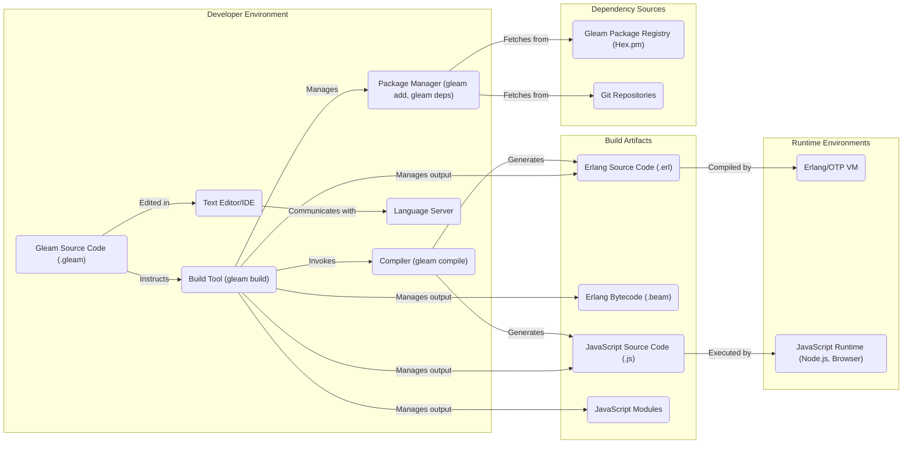
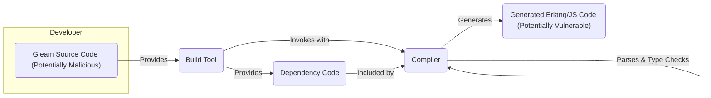
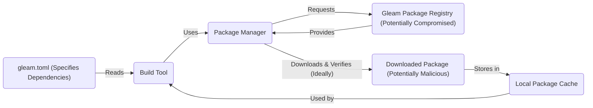

# Project Design Document: Gleam Programming Language

**Document Version:** 1.1
**Date:** October 26, 2023
**Author:** AI Software Architect

## 1. Introduction

This document provides a detailed architectural overview of the Gleam programming language project, specifically tailored for threat modeling activities. It describes the key components, their interactions, and relevant data flows within the Gleam ecosystem, highlighting potential areas of security concern.

Gleam is a statically typed functional programming language that compiles to both Erlang and JavaScript. Its design prioritizes developer experience, type safety, and seamless interoperability with the Erlang/OTP ecosystem while also enabling front-end development through JavaScript compilation.

## 2. Goals and Objectives

The primary goals of the Gleam project are:

* To offer a robust and expressive functional programming language with a strong type system.
* To enable seamless integration and interoperability with the Erlang/OTP platform.
* To facilitate front-end development by compiling to performant JavaScript.
* To provide a user-friendly development experience through helpful tooling and clear error messages.
* To cultivate an active and supportive community around the language.

## 3. High-Level Architecture

The Gleam project comprises several interconnected components that facilitate the development, building, and execution of Gleam code:

* **Compiler:** The central component responsible for transforming Gleam source code into target code (Erlang or JavaScript). This involves parsing, type checking, and code generation.
* **Build Tool:** A command-line interface (CLI) tool that orchestrates the entire build process, including invoking the compiler, managing dependencies, running tests, and formatting code.
* **Standard Library:** A curated collection of core modules providing essential functionalities and data structures for Gleam programs.
* **Package Manager:** A tool for managing external dependencies, allowing developers to easily integrate and utilize third-party Gleam packages.
* **Language Server:**  A background process that provides language-specific intelligence to code editors and Integrated Development Environments (IDEs), enhancing the developer experience.
* **Documentation:** Official documentation serving as the primary resource for learning and understanding the Gleam language, standard library, and tooling.
* **Community Resources:** Various online platforms and channels facilitating communication, collaboration, and support within the Gleam community.

## 4. Detailed Component Descriptions

### 4.1. Compiler

* **Functionality:**
    * **Parsing:** Transforms Gleam source code into an Abstract Syntax Tree (AST), representing the code's structure.
    * **Type Checking:** Enforces the Gleam type system, ensuring type safety and catching potential errors at compile time.
    * **Optimization:** Applies various optimizations to the AST to improve the performance of the generated code.
    * **Code Generation:** Translates the optimized AST into target code, either Erlang source code (.erl) or JavaScript source code (.js).
    * **Error Reporting:** Provides informative error and warning messages to the developer during the compilation process.
* **Inputs:**
    * Gleam source code files (`.gleam`).
    * Compiler configuration settings (e.g., target platform).
    * Type information from project dependencies.
* **Outputs:**
    * Erlang source code files (`.erl`).
    * Erlang bytecode files (`.beam`) (via the Erlang compiler).
    * JavaScript source code files (`.js`).
    * Diagnostic messages (errors and warnings).
* **Key Technologies:** Primarily implemented in Rust, utilizing custom parsing and type checking logic.
* **Potential Security Considerations:**
    * **Parser vulnerabilities:** Bugs in the parser could potentially be exploited with crafted malicious Gleam code, leading to denial-of-service or unexpected behavior during compilation.
    * **Type system flaws:**  Logical errors in the type system could allow unsafe code to pass type checking, potentially leading to runtime errors or vulnerabilities in the generated code.
    * **Code generation bugs:** Errors in the code generation phase could introduce vulnerabilities in the generated Erlang or JavaScript code (e.g., generating unsafe JavaScript that's susceptible to XSS).

### 4.2. Build Tool

* **Functionality:**
    * **Compilation Orchestration:** Manages the compilation process by invoking the Gleam compiler for individual modules and handling dependencies.
    * **Dependency Resolution:** Reads the `gleam.toml` manifest file, resolves project dependencies, and downloads necessary packages.
    * **Test Execution:**  Discovers and executes unit tests defined within Gleam projects.
    * **Code Formatting:** Enforces consistent code style through an integrated code formatter.
    * **Project Management:** Provides commands for creating new projects, managing dependencies, and other build-related tasks.
* **Inputs:**
    * `gleam.toml` project manifest file.
    * Gleam source code files.
    * Command-line arguments and user input.
    * Dependency information retrieved from the package registry.
* **Outputs:**
    * Compiled Erlang bytecode or JavaScript files.
    * Test results (successes and failures).
    * Formatted Gleam source code.
    * Downloaded dependencies in the project's dependency directory.
* **Key Technologies:** Implemented in Rust, interacts with the Gleam compiler, package manager, and potentially external systems (e.g., Git for dependency fetching).
* **Potential Security Considerations:**
    * **Dependency confusion attacks:** If the build tool prioritizes fetching packages from unintended sources, malicious packages could be introduced.
    * **Malicious build dependencies:**  Downloaded dependencies could contain malicious code that gets executed during the build process.
    * **Command injection vulnerabilities:** If the build tool executes external commands based on user input or configuration, it could be vulnerable to command injection attacks.
    * **Insecure handling of credentials:** If the build tool needs to interact with private repositories or registries, improper handling of authentication credentials could lead to leaks.

### 4.3. Standard Library

* **Functionality:**
    * Provides a foundational set of modules offering common data structures (e.g., lists, maps), utility functions (e.g., string manipulation, I/O), and abstractions over platform-specific functionalities.
    * Aims to provide reliable and well-tested building blocks for Gleam applications.
* **Inputs:**
    * Utilized by Gleam source code through `import` statements.
* **Outputs:**
    * Provides functionality and data structures to Gleam programs.
* **Key Technologies:** Implemented in Gleam itself, leveraging Erlang/OTP libraries for the Erlang target and standard JavaScript APIs for the JavaScript target.
* **Potential Security Considerations:**
    * **Bugs in standard library modules:** Vulnerabilities in standard library functions could be exploited by applications using them.
    * **Unsafe abstractions:**  Abstractions over platform-specific functionalities might introduce security risks if not carefully designed and implemented (e.g., insecure file I/O operations).
    * **Denial-of-service vulnerabilities:**  Inefficient algorithms or resource-intensive operations in the standard library could be exploited to cause denial-of-service.

### 4.4. Package Manager

* **Functionality:**
    * **Package Discovery:** Allows developers to search for and discover available Gleam packages in the package registry (e.g., Hex.pm).
    * **Package Installation:** Downloads and installs specified packages and their dependencies into the project.
    * **Dependency Management:** Tracks project dependencies and ensures compatible versions are used.
    * **Package Publishing:** Enables developers to publish their own Gleam packages to the registry.
* **Inputs:**
    * `gleam.toml` manifest file specifying dependencies.
    * User commands (e.g., `gleam add`, `gleam deps`).
    * API requests to the package registry.
    * Package archives (e.g., `.tar.gz` files).
* **Outputs:**
    * Downloaded package source code or pre-compiled artifacts in the project's dependency directory.
    * Updates to the project's lock file (`gleam.lock`).
* **Key Technologies:** Implemented in Rust, interacts with package registries over HTTP/HTTPS, performs cryptographic verification of downloaded packages.
* **Potential Security Considerations:**
    * **Man-in-the-middle attacks:** If communication with the package registry is not properly secured (e.g., using HTTPS), attackers could intercept and potentially modify package downloads.
    * **Compromised package registry:** If the package registry itself is compromised, malicious packages could be injected and distributed to users.
    * **Malicious packages:**  Developers might inadvertently install packages containing malicious code.
    * **Lack of integrity checks:** If downloaded packages are not cryptographically verified, they could be tampered with.
    * **Account takeovers:** If developer accounts on the package registry are compromised, attackers could publish malicious versions of existing packages.

### 4.5. Language Server

* **Functionality:**
    * **Autocompletion:** Provides suggestions for code completion as the developer types.
    * **Go-to-Definition:** Allows developers to quickly navigate to the definition of symbols (functions, variables, etc.).
    * **Find References:** Enables finding all occurrences of a particular symbol in the codebase.
    * **Error Highlighting:**  Displays real-time error and warning messages in the code editor.
    * **Code Formatting:**  Automatically formats code according to configured style rules.
* **Inputs:**
    * Gleam source code being edited in the IDE.
    * Editor commands and requests via the Language Server Protocol (LSP).
    * Compiler diagnostics.
* **Outputs:**
    * Language features and information displayed in the code editor (e.g., completion suggestions, error underlines).
* **Key Technologies:** Implemented in Rust, adheres to the Language Server Protocol (LSP).
* **Potential Security Considerations:**
    * **Path traversal vulnerabilities:** If the language server interacts with the file system based on user input without proper sanitization, attackers could potentially access sensitive files outside the project directory.
    * **Code execution vulnerabilities:** Bugs in the language server could potentially be exploited to execute arbitrary code on the developer's machine.
    * **Information disclosure:** The language server might inadvertently expose sensitive information about the project or the developer's environment.

### 4.6. Documentation

* **Functionality:**
    * Provides comprehensive documentation for the Gleam language syntax, semantics, standard library modules, and tooling.
    * Includes tutorials, guides, API references, and examples to aid developers in learning and using Gleam.
* **Inputs:**
    * Gleam source code comments and documentation strings.
    * Markdown files and other documentation sources.
* **Outputs:**
    * Rendered HTML documentation accessible through a website or other means.
* **Key Technologies:** Likely utilizes a static site generator (e.g., mdBook, Docusaurus) to build the documentation website.
* **Potential Security Considerations:**
    * **Cross-site scripting (XSS) vulnerabilities:** If user-provided content or code snippets are not properly sanitized when rendered in the documentation, attackers could inject malicious scripts.
    * **Inclusion of vulnerable dependencies:** The documentation website itself might rely on third-party libraries with known vulnerabilities.
    * **Phishing attacks:**  If the documentation website is compromised, it could be used to host phishing attacks targeting Gleam developers.

### 4.7. Community Resources

* **Functionality:**
    * Provides platforms for community interaction, discussion, support, and collaboration among Gleam users and developers.
    * Includes forums, chat channels (e.g., Discord, Slack), and potentially other online communities.
* **Inputs:**
    * User-generated content (posts, messages, code snippets, etc.).
* **Outputs:**
    * Shared information, discussions, and support within the community.
* **Key Technologies:**  Various web platforms and communication tools (e.g., Discourse, Discord, Slack).
* **Potential Security Considerations:**
    * **Account security:**  Vulnerabilities in the platforms used for community resources could lead to account takeovers.
    * **Malware distribution:** Malicious actors could potentially share links to malware or malicious code through community channels.
    * **Social engineering attacks:** Attackers could use community channels to trick developers into revealing sensitive information or performing malicious actions.

## 5. Data Flow Diagrams

### 5.1. Compilation Process with Security Focus

### 5.2. Dependency Resolution with Security Focus

## 6. Security Considerations (Detailed)

This section expands on the preliminary security considerations, providing more specific examples of potential threats and vulnerabilities for each component.

* **Compiler:**
    * **Input validation vulnerabilities:** Failure to properly validate input could lead to denial-of-service or unexpected behavior when compiling maliciously crafted Gleam code.
    * **Code injection in generated code:** Bugs in the code generation phase could lead to the injection of unintended or malicious code into the generated Erlang or JavaScript output.
    * **Type confusion vulnerabilities:** Flaws in the type system could allow for type confusion, leading to unsafe operations in the generated code.
* **Build Tool:**
    * **Dependency hijacking:** Attackers could attempt to inject malicious dependencies by exploiting vulnerabilities in the dependency resolution process.
    * **Arbitrary code execution:** Improper handling of build scripts or external commands could allow attackers to execute arbitrary code on the build machine.
    * **Exposure of sensitive information:** The build tool might inadvertently expose sensitive information like API keys or credentials during the build process.
* **Standard Library:**
    * **Buffer overflows or underflows:** Bugs in memory management within standard library functions could lead to buffer overflows or underflows.
    * **Cryptographic vulnerabilities:** If the standard library provides cryptographic functionalities, flaws in their implementation could lead to security breaches.
    * **Resource exhaustion:**  Inefficient algorithms or unbounded resource usage in standard library functions could be exploited for denial-of-service attacks.
* **Package Manager:**
    * **Registry compromise:** A compromise of the Gleam package registry could allow attackers to distribute malware to a large number of users.
    * **Typosquatting:** Attackers could create packages with names similar to legitimate ones to trick developers into installing malicious dependencies.
    * **Lack of verifiable provenance:** Without strong mechanisms to verify the origin and integrity of packages, it's difficult to trust their contents.
* **Language Server:**
    * **Remote code execution:**  Vulnerabilities in the language server could potentially be exploited to execute arbitrary code on the developer's machine remotely.
    * **Information leakage:** The language server might inadvertently expose sensitive information about the codebase or the developer's environment.
    * **Denial of service:**  Maliciously crafted code could be used to crash or overload the language server.
* **Documentation:**
    * **Cross-site scripting (XSS):**  Unsanitized user input or code examples could be exploited to inject malicious scripts into the documentation website.
    * **Drive-by downloads:** Compromised documentation websites could be used to trick users into downloading malware.
    * **Redirection attacks:** Attackers could redirect users from the official documentation to malicious websites.
* **Community Resources:**
    * **Phishing attacks:** Attackers could use community channels to impersonate legitimate members and trick users into revealing sensitive information.
    * **Malware distribution:** Malicious actors could share links to malware or malicious code through community channels.
    * **Social engineering:** Attackers could manipulate community members to gain access to sensitive information or systems.

## 7. Deployment Considerations

Gleam projects can be deployed in various environments depending on the target platform:

* **Erlang/OTP Environments:** Gleam code compiled to Erlang bytecode can be deployed on any system running the Erlang/OTP virtual machine. This includes servers, embedded systems, and distributed systems. Deployment often involves packaging the `.beam` files and any necessary Erlang dependencies. Security considerations include securing the Erlang VM and the deployment environment.
* **JavaScript Environments:** Gleam code compiled to JavaScript can be deployed in web browsers, Node.js environments, and other JavaScript runtimes. Deployment typically involves bundling the generated JavaScript files and any required assets. Security considerations include standard web application security practices, such as preventing XSS and ensuring secure communication.
* **Hybrid Environments:**  Projects might utilize both Erlang and JavaScript components. Deployment in such scenarios requires managing both Erlang and JavaScript deployment processes and ensuring secure communication between the different parts of the application.

Security considerations during deployment include:

* **Secure artifact transfer:** Ensuring that compiled artifacts are transferred securely to the deployment environment (e.g., using HTTPS, SSH).
* **Secure storage of secrets:** Properly managing and storing sensitive information like API keys and database credentials.
* **Regular security updates:** Keeping the underlying runtime environments (Erlang VM, Node.js, browsers) and dependencies up-to-date with security patches.
* **Access control:** Implementing appropriate access controls to restrict access to deployed applications and their resources.

## 8. Future Considerations

Potential future developments in the Gleam project that could impact the architecture and security include:

* **New Target Platforms:**  Expanding compilation targets to other languages or platforms could introduce new security challenges related to those platforms.
* **Enhanced Language Features:**  The introduction of new language features might introduce new attack vectors or require adjustments to the compiler and tooling to maintain security.
* **Plugin System:**  If a plugin system is introduced, the security of the plugin ecosystem would need careful consideration to prevent malicious extensions.
* **WebAssembly Support:** Compiling Gleam to WebAssembly could introduce new security considerations related to the WebAssembly security model and its interaction with the browser environment.
* **Formal Verification Efforts:**  Exploring formal verification techniques could help improve the security and reliability of the compiler and core libraries.

This document provides a comprehensive architectural overview of the Gleam project, specifically focusing on aspects relevant to threat modeling. It serves as a crucial input for identifying potential vulnerabilities and designing appropriate security measures.