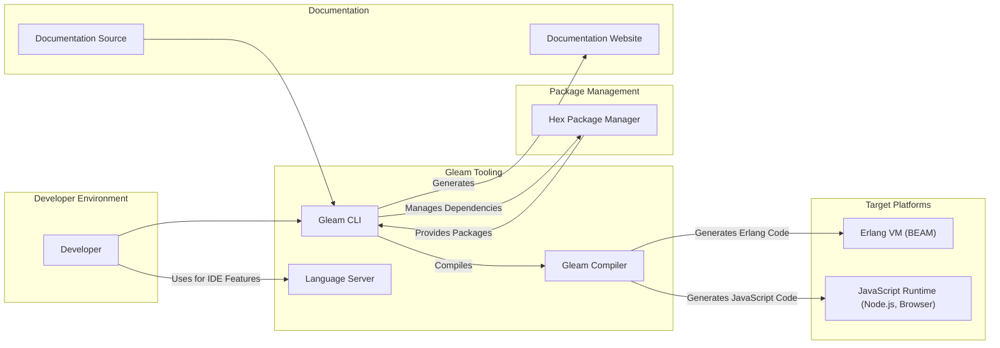
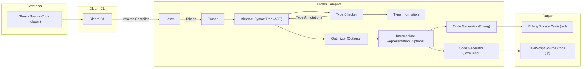
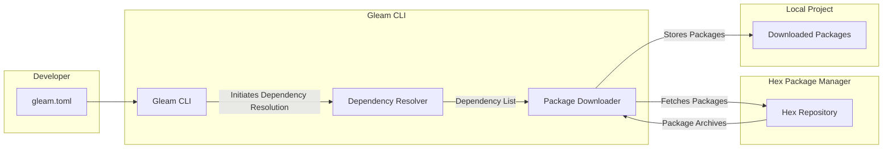

# Project Design Document: Gleam Programming Language

**Version:** 1.1
**Date:** October 26, 2023
**Author:** Gemini (AI Language Model)

## 1. Introduction

This document details the architectural design of the Gleam programming language project, as hosted on GitHub at [https://github.com/gleam-lang/gleam](https://github.com/gleam-lang/gleam). It provides a comprehensive overview of the system's components, their interactions, and data flows, serving as a foundation for subsequent threat modeling. Gleam is a functional, statically-typed language that compiles to both Erlang and JavaScript, emphasizing developer experience and concurrency.

## 2. Goals and Objectives

The primary goals of the Gleam project are:

*   To provide a user-friendly functional programming language.
*   To offer robust static typing for enhanced code reliability and maintainability.
*   To enable seamless integration with existing Erlang and JavaScript ecosystems.
*   To facilitate the development of concurrent and distributed applications.
*   To maintain a well-documented, accessible, and secure codebase.

The objectives of this design document are:

*   To clearly define the major components of the Gleam project.
*   To describe the interactions and data flow between these components in detail.
*   To identify key areas and interfaces relevant for security analysis.
*   To provide a solid basis for identifying potential threats and vulnerabilities within the Gleam ecosystem.

## 3. High-Level Architecture

The Gleam project comprises several key components that work together:

*   **Gleam Compiler:**  The core engine responsible for transforming Gleam source code into executable Erlang or JavaScript.
*   **Gleam CLI (Command Line Interface):**  The primary tool for developers to interact with the Gleam ecosystem, managing projects, dependencies, and builds.
*   **Standard Library:** A curated collection of modules providing essential functionalities for Gleam programs.
*   **Hex Package Manager Integration:**  Leverages the Hex package manager for managing external Gleam and Erlang dependencies.
*   **Language Server:**  Provides IDE integration features, enhancing the developer experience through code analysis and assistance.
*   **Documentation Infrastructure:**  The system for generating and hosting the official Gleam documentation.
*   **Community and Ecosystem:** The broader community of developers, contributors, and the collection of third-party libraries and tools.

## 4. Detailed Component Descriptions

### 4.1. Gleam Compiler

*   **Functionality:** The central component responsible for the entire compilation pipeline of Gleam code.
*   **Key Processes:**
    *   **Lexing:** Converts Gleam source code (plain text) into a stream of tokens.
    *   **Parsing:**  Organizes the tokens into an Abstract Syntax Tree (AST), representing the program's structure.
    *   **Type Checking:** Enforces Gleam's static type system, verifying the correctness of type annotations and ensuring type safety. This involves type inference and checking against defined types.
    *   **Optimization (Intermediate Representation):**  May involve optimizations on an intermediate representation of the code before final code generation.
    *   **Code Generation (Erlang):** Translates the AST into Erlang source code (`.erl` files). This involves mapping Gleam constructs to equivalent Erlang constructs.
    *   **Code Generation (JavaScript):** Translates the AST into JavaScript source code (`.js` files). This involves mapping Gleam constructs to equivalent JavaScript constructs, often with the aid of a runtime library for handling functional concepts.
*   **Inputs:** Gleam source code files (`.gleam`).
*   **Outputs:** Erlang source code files (`.erl`) or JavaScript source code files (`.js`).
*   **Security Considerations:**
    *   Vulnerabilities in the lexer or parser could allow for denial-of-service attacks through maliciously crafted input files.
    *   Bugs in the type checker could lead to the generation of unsafe code that bypasses type safety guarantees.
    *   Flaws in the code generation phase could introduce vulnerabilities in the generated Erlang or JavaScript code, such as code injection possibilities.

### 4.2. Gleam CLI (Command Line Interface)

*   **Functionality:** Provides a command-line interface for developers to manage Gleam projects and interact with the Gleam toolchain.
*   **Key Features:**
    *   **`gleam compile`:** Invokes the Gleam compiler to build the project, handling dependency resolution and compilation order.
    *   **`gleam run`:** Compiles and executes a Gleam program.
    *   **`gleam test`:** Runs unit tests defined within the project.
    *   **`gleam format`:**  Automatically formats Gleam code according to defined style guidelines.
    *   **`gleam new`:** Creates a new Gleam project with a basic structure.
    *   **`gleam deps download`:** Downloads project dependencies as specified in `gleam.toml`.
    *   **`gleam deps upgrade`:** Updates project dependencies.
    *   **`gleam doc`:** Generates documentation for the project.
*   **Inputs:** Project configuration files (`gleam.toml`), Gleam source code, command-line arguments.
*   **Outputs:** Compiled Erlang or JavaScript code, test results, formatted code, documentation, managed dependencies.
*   **Security Considerations:**
    *   The CLI interacts with external resources (Hex package manager). Vulnerabilities in how it handles downloaded packages could lead to supply chain attacks (e.g., malicious packages).
    *   Improper handling of user-provided input (e.g., project names, file paths) could lead to command injection vulnerabilities.
    *   The execution of build scripts or custom commands defined in project configurations needs careful security consideration.

### 4.3. Standard Library

*   **Functionality:** Provides a set of core modules offering essential functionalities commonly needed in Gleam programs, reducing the need for developers to implement these from scratch.
*   **Examples of Modules:** `gleam/list`, `gleam/string`, `gleam/io`, `gleam/result`, `gleam/option`.
*   **Implementation:** Primarily implemented in Gleam itself, but may leverage underlying platform capabilities in Erlang and JavaScript for certain functionalities.
*   **Security Considerations:**
    *   Vulnerabilities within the standard library could directly impact the security of any application using those modules. This necessitates rigorous testing and potentially formal verification of critical components.
    *   Care must be taken to avoid introducing functions that could be easily misused to create security vulnerabilities (e.g., functions that perform unsafe operations without proper validation).

### 4.4. Hex Package Manager Integration

*   **Functionality:**  Allows Gleam projects to depend on and utilize external libraries and packages hosted on the Hex package manager (primarily used for the Erlang ecosystem).
*   **Key Processes:**
    *   **Dependency Declaration:**  Developers specify dependencies in the `gleam.toml` file.
    *   **Dependency Resolution:** The Gleam CLI resolves the dependency graph, determining the specific versions of packages to download.
    *   **Package Download:** The CLI downloads package archives from the Hex repository.
    *   **Installation:**  Downloaded packages are stored in a local dependency directory within the project.
*   **Inputs:** `gleam.toml` file specifying project dependencies.
*   **Outputs:** Downloaded and installed package files in the project's dependency directory.
*   **Security Considerations:**
    *   **Supply Chain Attacks:**  The biggest security risk is the potential for malicious actors to publish compromised packages to Hex. Gleam relies on the security measures implemented by Hex.
    *   **Dependency Confusion:**  The possibility of accidentally or maliciously using a package with the same name as an internal or standard library package.
    *   **Vulnerabilities in Dependencies:**  Security vulnerabilities in the external packages themselves can be a risk to Gleam projects.

### 4.5. Language Server

*   **Functionality:** Provides language-specific intelligence and features to Integrated Development Environments (IDEs) via the Language Server Protocol (LSP). This enhances the developer experience by providing real-time feedback and assistance.
*   **Key Features:**
    *   **Autocompletion:** Suggests code completions as the developer types.
    *   **Error Highlighting (Diagnostics):**  Identifies syntax and type errors in the code editor.
    *   **Go to Definition:** Allows navigation to the definition of symbols (functions, types, etc.).
    *   **Find References:**  Locates all usages of a particular symbol within the project.
    *   **Formatting:**  Applies code formatting rules.
    *   **Hover Information:** Displays type information and documentation when hovering over symbols.
*   **Inputs:** Gleam source code being edited in the IDE.
*   **Outputs:** Language intelligence information sent to the IDE (e.g., completions, diagnostics).
*   **Security Considerations:**
    *   The language server processes potentially untrusted code. It should be designed to prevent malicious code from causing harm to the developer's machine or the IDE environment.
    *   Vulnerabilities in the language server itself could be exploited by malicious code opened in the IDE.

### 4.6. Documentation Infrastructure

*   **Functionality:**  The system responsible for generating, building, and hosting the official Gleam documentation.
*   **Key Components:**
    *   **Documentation Source:**  Markdown files and potentially code comments containing documentation.
    *   **Documentation Generator:**  A tool (likely part of the Gleam CLI or a separate tool) that parses the documentation source and generates static HTML files.
    *   **Documentation Website:**  The hosted website where the generated documentation is accessible.
*   **Inputs:** Documentation source files, Gleam code with documentation comments.
*   **Outputs:** Static HTML files for the documentation website.
*   **Security Considerations:**
    *   **Cross-Site Scripting (XSS):** If user-provided content or code comments are not properly sanitized during documentation generation, it could lead to XSS vulnerabilities on the documentation website.
    *   **Information Disclosure:**  Care must be taken to avoid accidentally exposing sensitive information in the documentation.

### 4.7. Community and Ecosystem

*   **Functionality:**  Encompasses the developers who use, contribute to, and build upon the Gleam language. This includes third-party libraries, tools, and resources.
*   **Contributions:**  Bug reports, feature requests, code contributions, community-developed libraries, and educational materials.
*   **Security Considerations:**
    *   The security of the broader Gleam ecosystem depends on the security practices of its contributors.
    *   Third-party libraries may contain vulnerabilities that could affect Gleam projects using them.
    *   Mechanisms for community code review and vulnerability reporting are crucial for maintaining the security of the ecosystem.

## 5. Data Flow Diagrams

### 5.1. Compilation Process (Detailed)

### 5.2. Dependency Resolution and Download

## 6. Security Considerations (Detailed)

*   **Gleam Compiler:**
    *   **Threat:** Maliciously crafted Gleam code could exploit vulnerabilities in the lexer or parser, leading to denial-of-service.
    *   **Threat:** Bugs in the type checker could allow type confusion, leading to unsafe code generation.
    *   **Threat:** Code injection vulnerabilities in the code generation phase could allow attackers to execute arbitrary code on the target platform.
*   **Gleam CLI:**
    *   **Threat:** A compromised Hex package could be downloaded and included in a project, leading to supply chain attacks.
    *   **Threat:** Command injection vulnerabilities could be exploited by manipulating project configuration files or command-line arguments.
    *   **Threat:**  Insecure handling of credentials or API keys when interacting with external services.
*   **Standard Library:**
    *   **Threat:** Buffer overflows or other memory safety issues in standard library functions.
    *   **Threat:**  Logic errors in standard library functions that could be exploited to bypass security checks.
    *   **Threat:**  Introduction of functions with insecure defaults or that encourage insecure coding practices.
*   **Hex Package Manager Integration:**
    *   **Threat:**  Dependency confusion attacks where a malicious package with the same name as an internal package is used.
    *   **Threat:**  Compromised packages on the Hex repository containing malware or vulnerabilities.
    *   **Threat:**  Lack of integrity checks on downloaded packages, allowing for tampering.
*   **Language Server:**
    *   **Threat:**  Malicious code opened in the IDE could exploit vulnerabilities in the language server to gain access to the developer's system.
    *   **Threat:**  Denial-of-service attacks against the language server, impacting the developer experience.
    *   **Threat:**  Information leakage from the language server about the developer's code or environment.
*   **Documentation Infrastructure:**
    *   **Threat:** Cross-site scripting (XSS) vulnerabilities on the documentation website, potentially allowing attackers to execute malicious scripts in users' browsers.
    *   **Threat:**  Information disclosure through unintentionally exposed sensitive information in the documentation.
*   **Community and Ecosystem:**
    *   **Threat:**  Vulnerabilities in community-developed libraries that are widely used.
    *   **Threat:**  Malicious actors contributing backdoors or vulnerabilities to the Gleam project or its ecosystem.
    *   **Threat:**  Social engineering attacks targeting Gleam developers to gain access to sensitive information or systems.

## 7. Assumptions and Constraints

*   This design document reflects the current understanding of the Gleam project as of the specified date and is subject to change.
*   The security considerations outlined are not exhaustive and will be further explored during dedicated threat modeling activities.
*   The security of the underlying Erlang and JavaScript platforms is assumed, although potential interoperability issues are considered.
*   This document focuses on the core Gleam language and its primary tooling. Security considerations for specific applications built with Gleam are outside the scope of this document.

## 8. Future Considerations

*   Conduct thorough threat modeling workshops based on this design document to identify and prioritize potential vulnerabilities.
*   Perform security audits of the Gleam compiler, standard library, and Gleam CLI.
*   Implement security best practices in the development of all Gleam components, including input validation, output encoding, and secure coding guidelines.
*   Explore and implement mechanisms for verifying the integrity and provenance of Gleam packages.
*   Establish clear guidelines and processes for reporting and addressing security vulnerabilities within the Gleam project and its ecosystem.
*   Consider integrating static analysis tools into the Gleam development workflow to automatically detect potential security flaws.
*   Develop and promote secure coding practices and educational resources for the Gleam community.