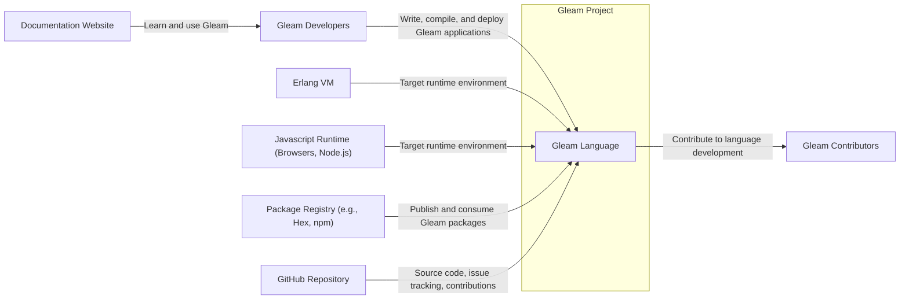
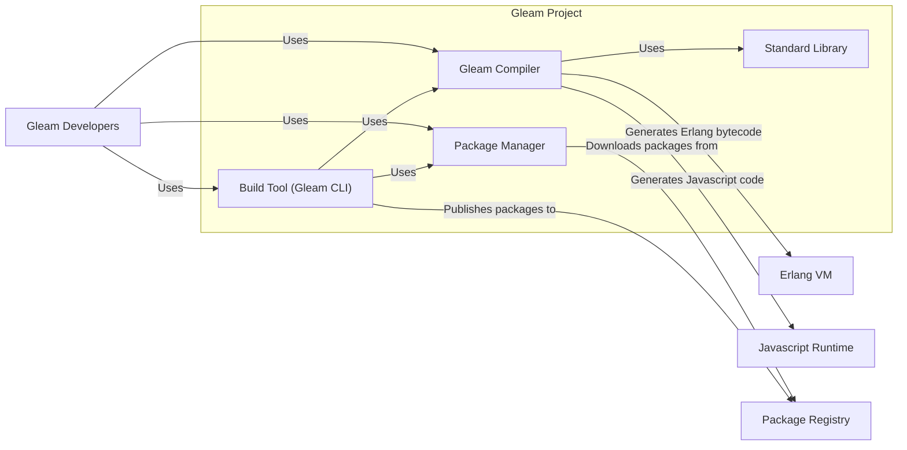
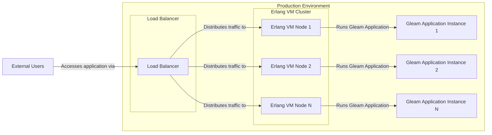
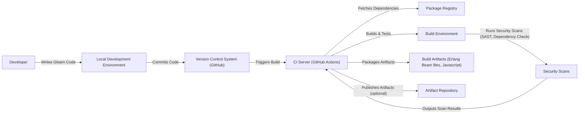

# BUSINESS POSTURE

- Business Priorities and Goals:
  - Gleam aims to provide a friendly, type-safe, and scalable programming language that compiles to both Erlang VM and Javascript.
  - The project prioritizes developer experience, aiming for a language that is enjoyable and productive to use.
  - Gleam seeks to foster a strong community and ecosystem around the language, including libraries, tools, and documentation.
  - A key goal is to enable developers to build reliable and performant applications for various platforms using a single language.
- Business Risks:
  - Adoption risk: Gleam is a new language and may face challenges in gaining widespread adoption compared to established languages.
  - Ecosystem maturity risk: The Gleam ecosystem (libraries, tools) is still developing and may not yet be as mature as more established ecosystems.
  - Community growth risk: The success of Gleam depends on building and maintaining a strong and active community of contributors and users.
  - Security vulnerabilities in the compiler or core libraries could undermine trust and adoption.
  - Compatibility issues between different Gleam versions or target platforms could hinder developer productivity.

# SECURITY POSTURE

- Existing Security Controls:
  - security control: Code hosted on GitHub, leveraging GitHub's security features for repository access control and vulnerability scanning. (Implemented: GitHub repository settings)
  - security control: Open-source project with public code review, increasing transparency and community scrutiny for potential security issues. (Implemented: Open GitHub repository)
  - security control: Use of static typing in Gleam language, reducing the likelihood of certain classes of runtime errors and vulnerabilities. (Implemented: Gleam language design)
  - security control: Reliance on underlying platform security (Erlang VM, Javascript environments) for runtime security. (Implemented: Language design and target platform choice)
- Accepted Risks:
  - accepted risk: Potential vulnerabilities in dependencies (Erlang libraries, Javascript libraries) used by Gleam projects.
  - accepted risk: Security vulnerabilities might be discovered in the Gleam compiler or standard library as the project is actively developed.
  - accepted risk: Risk of supply chain attacks targeting Gleam packages or build tools.
- Recommended Security Controls:
  - security control: Implement automated security scanning (SAST, DAST) in the CI/CD pipeline for the Gleam compiler and standard library.
  - security control: Establish a clear process for reporting and handling security vulnerabilities in Gleam.
  - security control: Conduct regular security audits of the Gleam compiler and core libraries.
  - security control: Implement dependency scanning and management to track and mitigate vulnerabilities in project dependencies.
  - security control: Provide security guidelines and best practices for Gleam developers to build secure applications.
- Security Requirements:
  - Authentication: Not directly applicable to the Gleam language itself, but relevant for related services like package registries or community forums if implemented.
  - Authorization: Not directly applicable to the Gleam language itself, but relevant for access control to Gleam project repositories and related infrastructure.
  - Input Validation: Gleam's type system helps with input validation at compile time. Runtime input validation might be needed in Gleam applications depending on external data sources.
  - Cryptography: Gleam applications might require cryptographic functionalities. Ensure that Gleam can interoperate with secure cryptographic libraries available in target platforms (Erlang crypto, Javascript Web Crypto API).

# DESIGN

## C4 CONTEXT

- Context Diagram Elements:
  - Element:
    - Name: Gleam Language
    - Type: Software System
    - Description: The Gleam programming language, including its compiler, standard library, and build tools.
    - Responsibilities: Compiling Gleam code to Erlang VM bytecode and Javascript, providing a type-safe and developer-friendly programming experience.
    - Security controls: Security controls are primarily focused on the build and release process to ensure the compiler and standard library are free from vulnerabilities.
  - Element:
    - Name: Gleam Developers
    - Type: Person
    - Description: Software developers who use Gleam to build applications.
    - Responsibilities: Writing, compiling, testing, and deploying Gleam applications.
    - Security controls: Responsible for writing secure Gleam code, following security best practices, and managing dependencies securely.
  - Element:
    - Name: Erlang VM
    - Type: Software System
    - Description: The Erlang Virtual Machine, a runtime environment for Erlang and BEAM languages, targeted by Gleam.
    - Responsibilities: Executing Gleam applications compiled to Erlang bytecode, providing concurrency, fault tolerance, and distribution capabilities.
    - Security controls: Relies on Erlang VM's security features and configurations. Gleam applications benefit from Erlang VM's security posture.
  - Element:
    - Name: Javascript Runtime (Browsers, Node.js)
    - Type: Software System
    - Description: Javascript runtime environments, including web browsers and Node.js, targeted by Gleam.
    - Responsibilities: Executing Gleam applications compiled to Javascript, enabling front-end and back-end development.
    - Security controls: Relies on the security features of Javascript runtimes and the underlying operating system. Gleam applications need to be mindful of Javascript security best practices.
  - Element:
    - Name: Package Registry (e.g., Hex, npm)
    - Type: Software System
    - Description: Repositories for publishing and distributing Gleam packages and dependencies.
    - Responsibilities: Hosting and serving Gleam packages, managing package versions and dependencies.
    - Security controls: Package registries need to ensure the integrity and authenticity of packages to prevent supply chain attacks. Gleam package management tools should verify package integrity.
  - Element:
    - Name: Documentation Website
    - Type: Software System
    - Description: Website hosting Gleam documentation, tutorials, and examples.
    - Responsibilities: Providing information and guidance for Gleam developers.
    - Security controls: Standard web security practices for public websites, protecting against common web vulnerabilities.
  - Element:
    - Name: GitHub Repository
    - Type: Software System
    - Description: GitHub repository hosting the Gleam source code, issue tracker, and contribution platform.
    - Responsibilities: Version control, issue tracking, code review, and collaboration for Gleam development.
    - Security controls: GitHub's security features for access control, vulnerability scanning, and code integrity.
  - Element:
    - Name: Gleam Contributors
    - Type: Person
    - Description: Developers who contribute to the development of the Gleam language and ecosystem.
    - Responsibilities: Contributing code, documentation, bug fixes, and feature enhancements to Gleam.
    - Security controls: Code review processes, contribution guidelines, and access control to the GitHub repository.

## C4 CONTAINER

- Container Diagram Elements:
  - Element:
    - Name: Gleam Compiler
    - Type: Software Container
    - Description: The Gleam compiler, responsible for parsing Gleam code, type checking, and generating target code (Erlang bytecode or Javascript).
    - Responsibilities: Compiling Gleam source code, ensuring type safety, and optimizing code generation.
    - Security controls: Security scanning of compiler source code, secure build process for compiler binaries, input validation during compilation to prevent malicious code injection.
  - Element:
    - Name: Standard Library
    - Type: Software Container
    - Description: The Gleam standard library, providing core functionalities and utilities for Gleam programs.
    - Responsibilities: Offering essential functions and data structures, ensuring code reusability and consistency.
    - Security controls: Security review of standard library code, vulnerability scanning, and ensuring no insecure or deprecated functions are included.
  - Element:
    - Name: Build Tool (Gleam CLI)
    - Type: Software Container
    - Description: Command-line interface tool for managing Gleam projects, including building, testing, and running Gleam applications.
    - Responsibilities: Project setup, dependency management, build automation, testing, and deployment support.
    - Security controls: Secure handling of project configurations, dependency management to prevent malicious packages, secure communication with package registries.
  - Element:
    - Name: Package Manager
    - Type: Software Container
    - Description: Tool for managing Gleam packages and dependencies, including downloading, installing, and publishing packages.
    - Responsibilities: Resolving dependencies, downloading packages from registries, managing package versions, and publishing Gleam packages.
    - Security controls: Package integrity verification (checksums, signatures), secure communication with package registries (HTTPS), preventing dependency confusion attacks.

## DEPLOYMENT

- Deployment Architecture Options:
  - Option 1: Deploying Gleam applications compiled to Erlang bytecode on Erlang VM clusters (for backend services, distributed systems).
  - Option 2: Deploying Gleam applications compiled to Javascript in web browsers (for frontend applications).
  - Option 3: Deploying Gleam applications compiled to Javascript on Node.js servers (for backend or full-stack applications).

- Detailed Deployment Architecture (Option 1: Erlang VM Cluster):

- Deployment Diagram Elements (Option 1):
  - Element:
    - Name: Load Balancer
    - Type: Infrastructure
    - Description: Distributes incoming traffic across multiple Erlang VM nodes for scalability and high availability.
    - Responsibilities: Traffic distribution, health checks, SSL termination (optional).
    - Security controls: DDoS protection, rate limiting, SSL/TLS encryption, access control lists.
  - Element:
    - Name: Erlang VM Node 1, 2, ..., N
    - Type: Infrastructure (Virtual Machine or Container)
    - Description: Individual servers or containers running the Erlang VM.
    - Responsibilities: Hosting and executing Gleam application instances, providing runtime environment.
    - Security controls: Operating system hardening, network firewalls, intrusion detection systems, regular security patching, access control to the nodes.
  - Element:
    - Name: Gleam Application Instance 1, 2, ..., N
    - Type: Software Instance
    - Description: Running instances of the Gleam application compiled to Erlang bytecode.
    - Responsibilities: Handling application logic, processing requests, interacting with databases or other services.
    - Security controls: Application-level security measures (authentication, authorization, input validation), secure configuration, logging and monitoring.
  - Element:
    - Name: External Users
    - Type: Person/System
    - Description: Users or external systems accessing the Gleam application.
    - Responsibilities: Interacting with the application, sending requests, receiving responses.
    - Security controls: User authentication (if applicable), secure communication channels (HTTPS).

## BUILD

- Build Process Elements:
  - Element:
    - Name: Developer
    - Type: Person
    - Description: Software developer writing Gleam code.
    - Responsibilities: Writing code, running local builds and tests, committing code to version control.
    - Security controls: Secure development practices, code review, using secure development environment.
  - Element:
    - Name: Local Development Environment
    - Type: Software Environment
    - Description: Developer's local machine with Gleam compiler, build tools, and dependencies.
    - Responsibilities: Code editing, local compilation, testing, and development.
    - Security controls: Keeping development tools up-to-date, secure operating system configuration, protecting development environment from malware.
  - Element:
    - Name: Version Control System (GitHub)
    - Type: Software System
    - Description: GitHub repository hosting the Gleam project's source code.
    - Responsibilities: Version control, code collaboration, triggering CI/CD pipelines.
    - Security controls: Access control, branch protection, audit logs, vulnerability scanning by GitHub.
  - Element:
    - Name: CI Server (GitHub Actions)
    - Type: Software System
    - Description: Continuous Integration server (e.g., GitHub Actions) automating the build, test, and security scanning process.
    - Responsibilities: Automated build, testing, security scanning, artifact packaging, and deployment (optional).
    - Security controls: Secure CI/CD pipeline configuration, access control to CI/CD system, secure secrets management, build environment isolation.
  - Element:
    - Name: Package Registry
    - Type: Software System
    - Description: Repository for Gleam packages and dependencies (e.g., Hex, npm).
    - Responsibilities: Hosting and serving Gleam packages.
    - Security controls: Package integrity verification, secure communication (HTTPS).
  - Element:
    - Name: Build Environment
    - Type: Software Environment
    - Description: Isolated environment in the CI server where the Gleam project is built and tested.
    - Responsibilities: Compiling code, running tests, generating build artifacts.
    - Security controls: Isolated build environment, minimal tools installed, secure access control.
  - Element:
    - Name: Security Scans
    - Type: Software Tools
    - Description: Static Application Security Testing (SAST) tools and dependency vulnerability scanners used in the CI pipeline.
    - Responsibilities: Identifying potential security vulnerabilities in the code and dependencies.
    - Security controls: Regularly updated security scanning tools, configured to detect relevant vulnerabilities, automated reporting of scan results.
  - Element:
    - Name: Build Artifacts (Erlang Beam files, Javascript)
    - Type: Data
    - Description: Compiled output of the Gleam project, ready for deployment.
    - Responsibilities: Deployable application binaries or code.
    - Security controls: Integrity checks (checksums) for build artifacts, secure storage of artifacts.
  - Element:
    - Name: Artifact Repository (optional)
    - Type: Software System
    - Description: Repository for storing and managing build artifacts (e.g., container registry, package repository).
    - Responsibilities: Storing and distributing build artifacts.
    - Security controls: Access control, secure storage, artifact integrity verification.

# RISK ASSESSMENT

- Critical Business Processes:
  - The critical business process is the development and distribution of the Gleam language itself. This includes the compiler, standard library, build tools, and package ecosystem.
  - Ensuring the integrity and security of the Gleam language is crucial for its adoption and trust by developers.
  - A compromised Gleam compiler or standard library could have widespread impact on all applications built with Gleam.
- Data Sensitivity:
  - The Gleam project primarily deals with source code, build artifacts, and package metadata.
  - Source code is generally considered public in open-source projects, but maintaining its integrity is important.
  - Build artifacts (compiler binaries, libraries) need to be protected from tampering to prevent supply chain attacks.
  - Package metadata (package names, versions, descriptions) is also public but needs to be accurate and trustworthy.
  - No highly sensitive personal data is directly processed or stored by the Gleam project itself. However, related services like community forums or package registries might handle user data, which would require appropriate data protection measures.

# QUESTIONS & ASSUMPTIONS

- Questions:
  - Are there any specific regulatory compliance requirements that Gleam needs to adhere to (e.g., related to data privacy if community services are planned)?
  - What is the intended process for handling security vulnerability reports for Gleam?
  - Are there plans for formal security audits of the Gleam compiler and core libraries?
  - What are the priorities for implementing the recommended security controls?
- Assumptions:
  - BUSINESS POSTURE: The primary goal is to grow the Gleam language and community, with a focus on developer experience and language quality. Security is important for building trust and ensuring long-term sustainability.
  - SECURITY POSTURE: The project currently relies on standard open-source security practices and GitHub's security features. There is an understanding of the need for further security controls, especially in the build and release pipeline.
  - DESIGN: The design is based on a typical open-source language project structure, with a compiler, standard library, build tools, and package ecosystem. Deployment scenarios are assumed to be flexible, targeting both Erlang VM and Javascript runtimes.