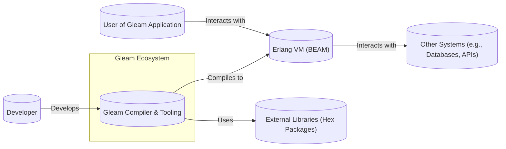
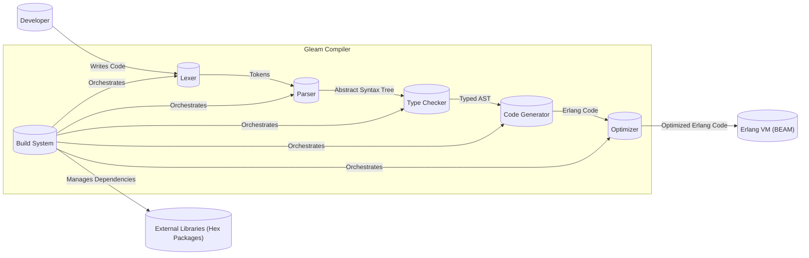
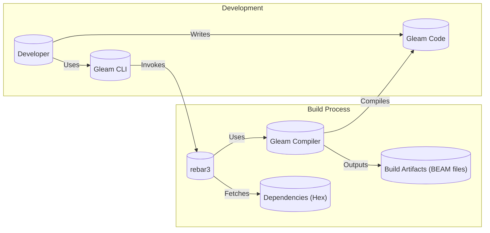

Okay, let's create a design document for the Gleam project, focusing on aspects relevant to threat modeling.

# BUSINESS POSTURE

Gleam is a functional programming language designed for building type-safe and scalable systems, particularly on the Erlang virtual machine (BEAM).  It emphasizes developer experience, aiming for a friendly and easy-to-use language.  Given its nature as a programming language itself, the "business" priorities are centered around adoption, community growth, and the success of projects built using Gleam.

Priorities and Goals:

*   Widespread adoption by developers, particularly those already in the Erlang/Elixir ecosystem.
*   Growth of a vibrant and supportive community.
*   Development of robust and reliable tooling (compiler, build system, package manager, etc.).
*   Enablement of successful, production-grade applications built with Gleam.
*   Maintainability and evolution of the language itself.

Business Risks:

*   Low adoption rate: If developers don't find Gleam compelling or easy to use, the project may fail to gain traction.
*   Security vulnerabilities in the compiler or runtime:  This could lead to exploits in applications built with Gleam, damaging its reputation and hindering adoption.
*   Lack of essential tooling or libraries:  This could make it difficult for developers to build complex applications, limiting Gleam's usefulness.
*   Inability to scale to large projects: If Gleam doesn't perform well or handle concurrency effectively, it won't be suitable for many real-world applications.
*   Community fragmentation or lack of contribution: A healthy open-source project relies on a strong community.
*   Supply chain attacks: Compromised dependencies or build processes could introduce vulnerabilities.

# SECURITY POSTURE

Gleam, as a language and compiler, has a unique security posture. It's not a directly deployed application, but rather a tool used to build applications. Therefore, the security posture focuses on the security of the compiler, the generated code, and the development lifecycle of Gleam itself.

Existing Security Controls:

*   security control: Type safety: Gleam's core feature is its strong static typing, which prevents many common programming errors at compile time. This is a significant security control, reducing the likelihood of runtime errors that could lead to vulnerabilities. Implemented in the compiler.
*   security control: Immutability: Gleam, like Erlang, emphasizes immutable data structures. This reduces the risk of concurrency-related bugs and side effects, which can often be sources of security vulnerabilities. Implemented in the language design and compiler.
*   security control: Actor model concurrency: Gleam leverages the Erlang VM's actor model, which provides a robust and well-understood approach to concurrency. This helps prevent race conditions and other concurrency-related issues. Implemented in the language design and runtime (BEAM).
*   security control: GitHub Actions for CI/CD: The project uses GitHub Actions for continuous integration and continuous delivery, providing some level of automation and security checks. Described in the `.github/workflows` directory.
*   security control: Regular dependency updates: The project appears to actively manage and update its dependencies, reducing the risk of known vulnerabilities in third-party libraries. Described in `rebar.config` and `gleam.toml`.
*   security control: Code reviews: As an open-source project on GitHub, Gleam benefits from community code reviews, which can help identify potential security issues. Implemented through the GitHub pull request process.

Accepted Risks:

*   accepted risk: Reliance on the Erlang VM (BEAM): Gleam's security is inherently tied to the security of the BEAM. While the BEAM is generally considered secure, any vulnerabilities in it would directly impact Gleam applications.
*   accepted risk: Emerging language maturity: As a relatively new language, Gleam may have undiscovered vulnerabilities or limitations in its compiler or runtime.
*   accepted risk: Limited built-in security features: Gleam, by design, is a relatively small language. It doesn't have extensive built-in security features beyond type safety and the actor model. Developers are responsible for implementing appropriate security measures in their applications.

Recommended Security Controls:

*   security control: Static Application Security Testing (SAST): Integrate SAST tools into the CI/CD pipeline to automatically scan the Gleam compiler's source code for potential vulnerabilities.
*   security control: Software Composition Analysis (SCA): Implement SCA tooling to identify and track known vulnerabilities in all dependencies, including transitive dependencies.
*   security control: Fuzz testing: Introduce fuzz testing to the compiler to identify potential edge cases and vulnerabilities that might not be caught by traditional testing.
*   security control: Security-focused code reviews: Explicitly include security considerations in code reviews, focusing on potential vulnerabilities and attack vectors.
*   security control: Supply chain security measures: Implement measures to verify the integrity of dependencies and build artifacts, such as signing releases and using checksums.

Security Requirements:

*   Authentication: Not directly applicable to the Gleam language itself, but Gleam applications should implement robust authentication mechanisms where needed.
*   Authorization: Similarly, authorization is the responsibility of Gleam applications, not the language itself. Gleam should provide mechanisms (e.g., libraries or patterns) to facilitate secure authorization.
*   Input Validation: Gleam's type system provides a strong foundation for input validation. However, developers should still be mindful of validating data from external sources (e.g., user input, network requests) to prevent injection attacks and other vulnerabilities.
*   Cryptography: Gleam should provide access to robust cryptographic libraries (likely through Erlang interop) to allow developers to securely handle sensitive data. The language itself should not attempt to implement its own cryptographic primitives.

# DESIGN

## C4 CONTEXT



Element Descriptions:

*   1. Name: Developer
    *   Type: Person
    *   Description: A software developer who writes Gleam code.
    *   Responsibilities: Writing, testing, and debugging Gleam code; contributing to the Gleam project.
    *   Security controls: Follows secure coding practices; participates in code reviews.

*   2. Name: Gleam Compiler & Tooling
    *   Type: Software System
    *   Description: The core of the Gleam project, including the compiler, build system, and other related tools.
    *   Responsibilities: Compiling Gleam code to Erlang bytecode; managing dependencies; providing a development environment.
    *   Security controls: Type safety; immutability; regular dependency updates; CI/CD with GitHub Actions; code reviews.

*   3. Name: Erlang VM (BEAM)
    *   Type: Software System
    *   Description: The runtime environment for Gleam applications.
    *   Responsibilities: Executing compiled Gleam code; providing concurrency and distribution features.
    *   Security controls: Actor model concurrency; robust and well-tested virtual machine.

*   4. Name: External Libraries (Hex Packages)
    *   Type: Software System
    *   Description: Third-party libraries that Gleam applications can use.
    *   Responsibilities: Providing additional functionality not included in the Gleam standard library.
    *   Security controls: Dependency management; vulnerability scanning (recommended).

*   5. Name: User of Gleam Application
    *   Type: Person
    *   Description: An end-user who interacts with an application built using Gleam.
    *   Responsibilities: Using the application as intended.
    *   Security controls: None directly applicable; relies on the security of the Gleam application.

*   6. Name: Other Systems (e.g., Databases, APIs)
    *   Type: Software System
    *   Description: External systems that Gleam applications may interact with.
    *   Responsibilities: Providing data or services to Gleam applications.
    *   Security controls: Depend on the specific system; Gleam applications should use secure communication protocols and authentication mechanisms.

## C4 CONTAINER

Since Gleam is a compiler, the "containers" are more conceptual than in a typical web application. The primary container is the compiler itself.



Element Descriptions:

*   1. Name: Lexer
    *   Type: Component
    *   Description: The first stage of the compiler, responsible for converting source code into a stream of tokens.
    *   Responsibilities: Tokenizing the input source code.
    *   Security controls: Input validation (to the extent of recognizing valid Gleam syntax).

*   2. Name: Parser
    *   Type: Component
    *   Description: Takes the stream of tokens from the lexer and constructs an Abstract Syntax Tree (AST).
    *   Responsibilities: Parsing the token stream and creating an AST.
    *   Security controls: Input validation (ensuring the code conforms to the Gleam grammar).

*   3. Name: Type Checker
    *   Type: Component
    *   Description: Enforces Gleam's type system, ensuring that the code is type-safe.
    *   Responsibilities: Type checking the AST.
    *   Security controls: Type safety (the core security feature of Gleam).

*   4. Name: Code Generator
    *   Type: Component
    *   Description: Translates the typed AST into Erlang code.
    *   Responsibilities: Generating Erlang code.
    *   Security controls: Ensuring the generated code adheres to the semantics of Gleam and the Erlang VM.

*   5. Name: Optimizer
    *   Type: Component
    *   Description: Optimizes the generated Erlang code for performance.
    *   Responsibilities: Optimizing code.
    *   Security controls: Ensuring optimizations do not introduce security vulnerabilities.

*   6. Name: Build System
    *   Type: Component
    *   Description: Manages the compilation process, dependencies, and build artifacts.
    *   Responsibilities: Orchestrating the compilation pipeline; managing dependencies.
    *   Security controls: Dependency management; build process integrity (recommended).

## DEPLOYMENT

Gleam code is compiled to Erlang bytecode and runs on the Erlang VM. Deployment typically involves packaging the compiled code and any necessary dependencies into a release, which can then be deployed to a server or cluster running the BEAM.

Possible Deployment Solutions:

*   Manual deployment: Copying the release files to the target server and starting the application.
*   Automated deployment with tools like `rebar3`: Using `rebar3`'s release functionality to create and deploy releases.
*   Containerized deployment with Docker: Packaging the Gleam application and the Erlang VM into a Docker container for deployment to container orchestration platforms like Kubernetes.
*   Deployment to cloud platforms: Using platform-specific tools and services to deploy Gleam applications to cloud providers like AWS, Google Cloud, or Azure.

Chosen Solution (Containerized Deployment with Docker):

```mermaid
graph LR
    subgraph Development Environment
        Developer_Machine[("Developer Machine")]
    end

    subgraph Docker Build
        Dockerfile[("Dockerfile")]
        Gleam_Source[("Gleam Source Code")]
        Dependencies[("Dependencies")]
        Docker_Image[("Docker Image")]
    end
    
    subgraph Docker Registry
        Image_Registry[("Image Registry (e.g., Docker Hub)")]
    end

    subgraph Production Environment (Kubernetes)
        Kubernetes_Cluster[("Kubernetes Cluster")]
        Pod[("Pod")]
        Container[("Container (Gleam App)")]
    end
    
    Developer_Machine -- Writes Code --> Gleam_Source
    Dockerfile -- Uses --> Gleam_Source
    Dockerfile -- Uses --> Dependencies
    Docker_Image -- Contains --> Gleam_Source
    Docker_Image -- Contains --> Dependencies
    Docker_Image -- Contains --> Erlang_VM[("Erlang VM")]
    Docker Build -- Builds --> Docker_Image
    Docker_Image -- Pushed to --> Image_Registry
    Kubernetes_Cluster -- Pulls --> Image_Registry
    Kubernetes_Cluster -- Creates --> Pod
    Pod -- Runs --> Container
    Container -- Contains --> Gleam_Source
    Container -- Contains --> Dependencies
    Container -- Contains --> Erlang_VM
```

Element Descriptions:

*   1. Name: Developer Machine
    *   Type: Node
    *   Description: The developer's local machine where they write and test Gleam code.
    *   Responsibilities: Development and testing.
    *   Security controls: Secure development environment; code signing (recommended).

*   2. Name: Dockerfile
    *   Type: File
    *   Description: A text file that contains instructions for building a Docker image.
    *   Responsibilities: Defining the build process for the Docker image.
    *   Security controls: Using a minimal base image; avoiding unnecessary packages; regular updates of the base image.

*   3. Name: Gleam Source Code
    *   Type: File
    *   Description: The source code of the Gleam application.
    *   Responsibilities: Implementing the application logic.
    *   Security controls: Secure coding practices; code reviews.

*   4. Name: Dependencies
    *   Type: File
    *   Description: The external libraries that the Gleam application depends on.
    *   Responsibilities: Providing additional functionality.
    *   Security controls: Dependency management; vulnerability scanning (recommended).

*   5. Name: Docker Image
    *   Type: Artifact
    *   Description: A packaged version of the Gleam application and its runtime environment.
    *   Responsibilities: Providing a consistent and reproducible environment for running the application.
    *   Security controls: Image signing (recommended); vulnerability scanning of the image.

*   6. Name: Image Registry (e.g., Docker Hub)
    *   Type: Node
    *   Description: A repository for storing and distributing Docker images.
    *   Responsibilities: Storing and serving Docker images.
    *   Security controls: Access control; image scanning (if provided by the registry).

*   7. Name: Kubernetes Cluster
    *   Type: Node
    *   Description: A cluster of machines that run containerized applications.
    *   Responsibilities: Orchestrating the deployment and management of containers.
    *   Security controls: Network segmentation; role-based access control (RBAC); security context constraints.

*   8. Name: Pod
    *   Type: Node
    *   Description: The smallest deployable unit in Kubernetes, representing a single instance of an application.
    *   Responsibilities: Running one or more containers.
    *   Security controls: Resource limits; security context.

*   9. Name: Container (Gleam App)
    *   Type: Node
    *   Description: A running instance of the Gleam application Docker image.
    *   Responsibilities: Executing the application logic.
    *   Security controls: Running as a non-root user; read-only filesystem (where possible).

## BUILD

The Gleam build process typically involves using the `gleam build` command, which leverages the underlying Erlang build tool `rebar3`.



Security Controls in Build Process:

*   security control: Dependency Management: `rebar3` and `gleam.toml` manage dependencies, fetching them from Hex (the Erlang package manager).
*   security control: Build Automation: The `gleam build` command automates the compilation process.
*   security control: Compilation: The Gleam compiler performs type checking and generates Erlang bytecode.

Recommended Security Controls:

*   security control: Software Composition Analysis (SCA): Integrate SCA tooling to scan dependencies for known vulnerabilities during the build process.
*   security control: Static Application Security Testing (SAST): Integrate SAST tooling to scan the Gleam source code for potential vulnerabilities.
*   security control: Reproducible Builds: Ensure that the build process is deterministic and produces the same output given the same input, enhancing auditability and security.
*   security control: Build Artifact Signing: Sign the build artifacts to ensure their integrity and authenticity.

# RISK ASSESSMENT

Critical Business Processes:

*   The primary critical business process is enabling developers to build reliable and scalable applications. The success of Gleam depends on its ability to facilitate this.
*   Maintaining the integrity and security of the Gleam compiler and tooling is also critical, as vulnerabilities here could compromise all applications built with Gleam.

Data to Protect and Sensitivity:

*   Gleam itself doesn't directly handle sensitive data. However, applications built with Gleam *may* handle sensitive data, such as:
    *   User data (PII, credentials, etc.): High sensitivity.
    *   Financial data: High sensitivity.
    *   Business-critical data: Sensitivity varies depending on the specific application.
*   The Gleam source code itself is also valuable and should be protected from unauthorized modification.

# QUESTIONS & ASSUMPTIONS

Questions:

*   What specific security standards or compliance requirements (if any) are relevant to Gleam or applications built with Gleam?
*   What is the expected threat model for typical Gleam applications? (e.g., web applications, backend services, etc.)
*   What level of security expertise is assumed for developers using Gleam?
*   Are there any plans to develop official security guidelines or best practices for Gleam developers?
*   What is the process for reporting and handling security vulnerabilities discovered in Gleam?

Assumptions:

*   BUSINESS POSTURE: The primary goal is to promote the adoption and successful use of Gleam, prioritizing developer experience and language features that enhance reliability and scalability.
*   SECURITY POSTURE: Gleam relies heavily on the inherent security features of the Erlang VM and its type system. It is assumed that developers using Gleam will have some understanding of security principles and will implement appropriate security measures in their applications.
*   DESIGN: The design focuses on the core components of the Gleam compiler and its interaction with the Erlang ecosystem. It is assumed that deployment will typically involve packaging the compiled code into a release and deploying it to a server or cluster running the BEAM, or via containerization. The build process is assumed to be standard Gleam/Erlang build process.