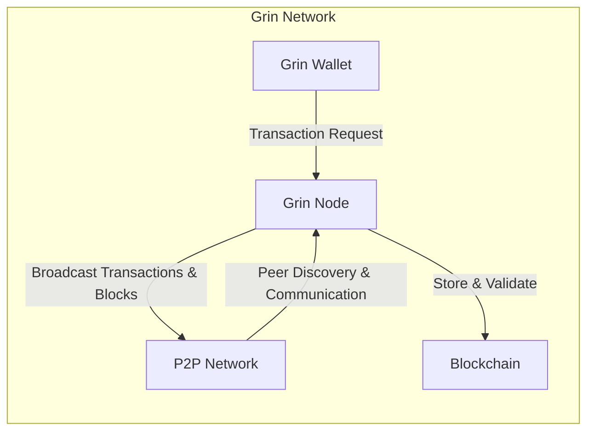
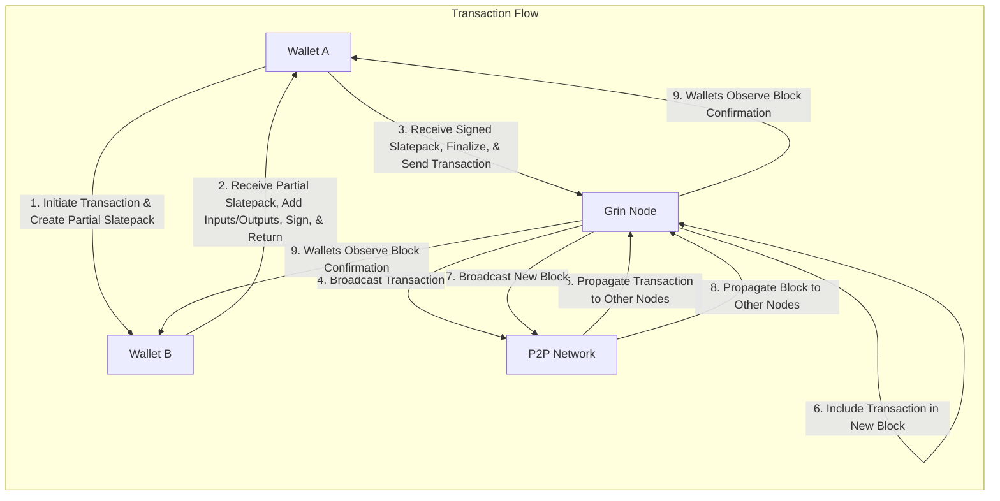

## Project Design Document: Grin Cryptocurrency (Improved)

**1. Introduction**

This document provides an enhanced design overview of the Grin cryptocurrency project, drawing upon information from the official GitHub repository: [https://github.com/mimblewimble/grin](https://github.com/mimblewimble/grin). The primary goal is to offer a clear and detailed description of the system's architecture, functionalities, and data flows, specifically tailored for subsequent threat modeling exercises.

Grin is a decentralized, privacy-focused cryptocurrency built upon the innovative Mimblewimble protocol. Mimblewimble's core strengths lie in its inherent privacy features, achieved by obscuring transaction amounts and participants, and its scalability, facilitated by a process known as transaction cut-through. This document focuses on the fundamental elements of the Grin network and its operational mechanisms.

**2. Goals and Objectives**

The overarching goals of the Grin project, as understood from its design and available documentation, are:

* **Enhanced Privacy:** To ensure transaction details, including amounts and the identities of senders and receivers, remain confidential and are not publicly accessible on the blockchain.
* **Improved Scalability:** To enable the network to efficiently process and validate a growing number of transactions without compromising performance.
* **True Fungibility:** To make all Grin coins indistinguishable from one another, thereby bolstering privacy and simplifying usage.
* **Robust Decentralization:** To maintain a distributed network structure that operates without reliance on any central authority.
* **Strong Security:** To protect the network and its users from malicious activities and potential vulnerabilities.

**3. High-Level Architecture**

The Grin network functions as a peer-to-peer (P2P) network composed of interconnected nodes. The key components are:

* **Grin Node:** The fundamental software application responsible for participating in the network, validating transactions against consensus rules, and maintaining a synchronized copy of the blockchain.
* **Grin Wallet:**  The software application used by users to manage their Grin holdings, construct and sign transactions, and interact with the Grin network.
* **Blockchain:** The distributed, immutable ledger that records all validated Grin transactions.
* **P2P Network:** The underlying communication infrastructure that enables Grin nodes to discover and communicate with each other.

**4. Component Details**

This section provides a more in-depth description of each key component within the Grin architecture.

* **4.1. Grin Node:**
    * **Core Responsibilities:**
        * Active participation in the P2P network.
        * Receiving and propagating transactions and blocks across the network.
        * Rigorous validation of transactions and blocks according to the established consensus rules.
        * Maintaining a local, up-to-date copy of the Grin blockchain.
        * Performing transaction aggregation, a key aspect of Mimblewimble known as "cut-through."
        * Implementing the core logic of the Mimblewimble protocol.
        * Providing Application Programming Interfaces (APIs) to facilitate interaction with Grin wallets.
    * **Key Functionalities:**
        * **Peer Management:** Discovering, connecting to, and maintaining connections with other nodes in the network.
        * **Transaction Pool (Mempool):**  Temporarily storing unconfirmed transactions awaiting inclusion in a block.
        * **Block Validation:**  Verifying the cryptographic integrity and adherence to consensus rules of newly received blocks.
        * **Chain Synchronization:**  Downloading and verifying the blockchain from peer nodes to ensure the local copy is current.
        * **Kernel Aggregation:**  Combining transaction kernels to reduce the overall size of the blockchain.
        * **Output Management:**  Tracking the status of unspent transaction outputs (UTXOs).
        * **API Endpoints:**  Providing interfaces for wallets to submit newly created transactions and query the current state of the network.

* **4.2. Grin Wallet:**
    * **Core Responsibilities:**
        * Securely managing user private keys, which are essential for authorizing transactions.
        * Constructing and cryptographically signing Grin transactions.
        * Interacting with Grin nodes to broadcast completed transactions to the network.
        * Receiving and managing incoming Grin funds.
        * Maintaining a record of past transaction activity.
        * Generating and handling payment proofs, known as "Slatepacks," for interactive transaction building.
    * **Key Functionalities:**
        * **Key Generation and Management:**  Generating and securely storing private keys, often using techniques like mnemonic phrases or hardware wallets.
        * **Transaction Creation:**  Building Mimblewimble transactions, which involves creating transaction kernels and generating range proofs to ensure confidentiality.
        * **Transaction Signing:**  Using the user's private key to cryptographically sign the transaction kernel, authorizing the transfer of funds.
        * **Slatepack Handling:**  Creating, sending, and receiving Slatepacks, which are used for the interactive exchange of information required to build Mimblewimble transactions.
        * **UTXO Management:**  Tracking the user's owned unspent transaction outputs, which represent their available Grin balance.
        * **Communication with Node:**  Utilizing the Grin node's APIs to submit transactions and retrieve network information.
        * **Address Generation (Implicit):**  Grin does not utilize traditional address formats. Instead, interactive key exchange via Slatepacks is employed to facilitate transactions.

* **4.3. Blockchain:**
    * **Structure:**  Organized as a chain of interconnected blocks, where each block contains:
        * **Header:**  Metadata about the block, including its height, timestamp, and the hash of the preceding block.
        * **Kernels:**  Aggregated transaction signatures and associated transaction fees.
        * **Inputs:**  References to previously existing transaction outputs that are being spent in the current block's transactions.
        * **Outputs:**  Cryptographic commitments representing newly created unspent transaction outputs.
        * **Cut-through:**  Intermediate transaction data is removed after validation, leaving only the essential inputs, outputs, and kernels, contributing to scalability.
    * **Key Characteristics:**
        * **Immutability:**  Once a block is added to the blockchain, its contents cannot be altered, ensuring the integrity of the transaction history.
        * **Distributed Nature:**  Copies of the blockchain are maintained by all full nodes participating in the network.
        * **Append-Only Structure:**  New blocks are sequentially added to the end of the existing chain.
        * **Privacy Preservation:**  Transaction amounts and the identities of participants are obfuscated through the use of cryptographic techniques.

* **4.4. P2P Network:**
    * **Underlying Technology:**  Likely relies on standard networking protocols such as TCP/IP for communication.
    * **Core Functionality:**
        * **Peer Discovery:**  Nodes actively search for and identify other nodes to establish connections with.
        * **Message Passing:**  Nodes exchange various types of information, including transactions, blocks, and peer discovery information.
        * **Gossip Protocol:**  An efficient mechanism for propagating information across the network, ensuring that all nodes eventually receive updates.
    * **Security Considerations:**  Potentially susceptible to network-level attacks, such as Sybil attacks, eclipse attacks, and denial-of-service attacks.

**5. Data Flow**

This section illustrates the typical sequence of data exchange during a Grin transaction.

**Detailed Steps:**

1. **Transaction Initiation:** Wallet A, intending to send Grin to Wallet B, initiates the transaction process and creates a preliminary "Slatepack" containing details of its intended inputs and proposed outputs.
2. **Slatepack Exchange:** Wallet A transmits the partially constructed Slatepack to Wallet B, typically using an out-of-band communication channel (e.g., direct message, email, or QR code).
3. **Slatepack Completion:** Wallet B receives the partial Slatepack, incorporates its own necessary inputs and outputs (which might include change outputs), cryptographically signs the transaction kernel, and returns the completed Slatepack to Wallet A.
4. **Transaction Finalization and Broadcast:** Wallet A receives the signed Slatepack back from Wallet B, finalizes the transaction by combining all the components, and sends the fully formed transaction to a Grin node it is connected to.
5. **Transaction Broadcasting:** The receiving Grin node broadcasts the newly submitted transaction to the wider P2P network.
6. **Transaction Propagation:** Other Grin nodes on the network receive the broadcast transaction and relay it to their peers, ensuring widespread dissemination.
7. **Block Inclusion:** A mining node selects the transaction from its mempool and includes it in a newly created block.
8. **Block Broadcasting:** The mining node that successfully created a new block broadcasts this block to the network.
9. **Block Propagation:** Other Grin nodes receive the newly broadcast block, validate it, and add it to their local copy of the blockchain.
10. **Confirmation:** Both Wallet A and Wallet B, by monitoring the blockchain through their connected nodes, observe the block containing their transaction being added to the chain, thus confirming the transaction's completion.

**6. Security Considerations (For Threat Modeling)**

This section outlines key security considerations that are crucial for effective threat modeling of the Grin project.

* **6.1. Node Security:**
    * **Denial of Service (DoS) Attacks:**  Malicious actors could attempt to overwhelm nodes with excessive requests or invalid data, disrupting their operation.
    * **Sybil Attacks:**  An attacker could create a large number of fake nodes to gain undue influence over the network's behavior.
    * **Eclipse Attacks:**  An attacker could attempt to isolate a specific node from the rest of the network, allowing for manipulation of its view of the blockchain.
    * **Byzantine Fault Tolerance:**  The network's ability to function correctly even when some nodes are behaving maliciously or experiencing failures is critical.
    * **Code Vulnerabilities:**  Bugs or flaws in the Grin node software could be exploited by attackers to compromise node security.
    * **Data Integrity:**  Mechanisms to ensure the integrity and authenticity of the blockchain data are essential to prevent tampering.

* **6.2. Wallet Security:**
    * **Private Key Security:**  The compromise of a user's private keys would allow an attacker to spend their Grin funds.
    * **Transaction Malleability:**  While Mimblewimble inherently mitigates traditional transaction malleability, understanding potential variations or related attack vectors is important.
    * **Phishing Attacks:**  Users could be tricked into revealing their private keys or sending funds to attacker-controlled destinations (though Grin's interactive transaction process offers some protection).
    * **Software Vulnerabilities:**  Bugs in wallet software could be exploited to steal private keys or manipulate transactions.
    * **Slatepack Security:**  Ensuring the secure exchange and handling of Slatepacks is crucial to prevent transaction interception or manipulation.

* **6.3. Network Security:**
    * **Network Partitioning:**  Attacks that aim to split the network into isolated segments could disrupt consensus and network functionality.
    * **Man-in-the-Middle (MitM) Attacks:**  Interception of communication between nodes or between wallets and nodes could allow attackers to eavesdrop or manipulate data.
    * **51% Attacks:**  If a single entity gains control of a majority of the mining power, they could potentially rewrite transaction history or censor transactions.

* **6.4. Cryptographic Security:**
    * **Elliptic Curve Cryptography:**  The security of Grin relies on the robustness of the chosen elliptic curve cryptography.
    * **Range Proofs:**  The soundness and privacy guarantees provided by range proofs are fundamental to Mimblewimble's security.
    * **Commitments:**  The security of the cryptographic commitments used to obscure transaction values is essential.

* **6.5. Consensus Mechanism:**
    * **Proof-of-Work (PoW):**  The PoW consensus mechanism is vulnerable to attacks if mining power becomes overly centralized.
    * **Forking:**  The possibility of chain splits (forks) requires mechanisms for resolving them and ensuring network stability.

**7. Deployment Considerations**

* **Grin Nodes:** Can be deployed on various operating systems, including Linux, macOS, and Windows. They require sufficient computational resources (CPU, RAM, disk space) and reliable network connectivity.
* **Grin Wallets:** Available primarily as command-line interface (CLI) applications, with potential for graphical user interface (GUI) development.
* **Network Infrastructure:** The Grin network relies on the public internet for peer-to-peer communication between nodes.

**8. Future Considerations**

* **Scalability Enhancements:**  Continued research and development into techniques for further improving the network's transaction processing capacity.
* **Privacy Innovations:**  Exploring and potentially implementing new cryptographic techniques to enhance user privacy.
* **Interoperability Solutions:**  Investigating ways to enable seamless interaction and exchange of value with other cryptocurrencies or blockchain systems.
* **Usability Improvements:**  Efforts to make Grin more accessible and user-friendly for a broader audience, potentially through improved wallet interfaces and educational resources.

This improved design document provides a more detailed and refined overview of the Grin cryptocurrency project. It emphasizes the key architectural components, data flows involved in transactions, and crucial security considerations relevant for thorough threat modeling. This information serves as a solid foundation for identifying potential vulnerabilities and developing effective mitigation strategies to ensure the long-term security and resilience of the Grin network.