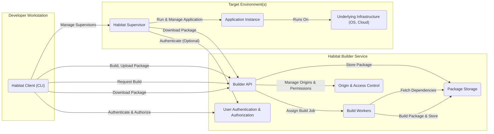

# Project Design Document: Habitat

**Version:** 1.1
**Date:** October 26, 2023
**Author:** Gemini (AI Language Model)

## 1. Introduction

This document provides a detailed architectural design of the Habitat project, an open-source automation technology that provides a modern approach to building, deploying, and managing applications. This document is intended to be used as a basis for subsequent threat modeling activities, ensuring a comprehensive understanding of the system's components and interactions.

## 2. Goals

The primary goals of this design document are:

* To clearly describe the architecture and key components of the Habitat project, emphasizing aspects relevant to security.
* To outline the interactions between different components, highlighting data exchange and control flow.
* To identify key data flows within the system, focusing on the movement of sensitive information.
* To serve as a solid foundation for identifying potential security threats and vulnerabilities, facilitating a structured threat modeling process.

## 3. Scope

This document covers the core components and functionalities of the Habitat project as represented in the provided GitHub repository (https://github.com/habitat-sh/habitat). This includes:

* The Habitat Client (CLI) and its primary functions.
* The Habitat Supervisor and its role in application management.
* The Habitat Builder service, including its core sub-components and their responsibilities.
* Habitat packages (.hart files) and their structure.
* The overall workflow of building, deploying, and managing applications with Habitat, with a focus on security-relevant aspects.

This document does not delve into the specific implementation details of individual modules or libraries within the Habitat codebase, nor does it cover specific deployment configurations or integrations with external systems in detail.

## 4. High-Level Architecture

The Habitat ecosystem is designed around the principle of packaging applications with all their dependencies and runtime instructions. The following diagram illustrates the high-level architecture, emphasizing the communication pathways:

**Key Components:**

* **Habitat Client (CLI):** The primary interface for developers and operators to interact with the Habitat ecosystem. It facilitates package creation, management, and interaction with the Builder and Supervisors.
* **Habitat Supervisor:** The runtime agent responsible for downloading, configuring, and managing Habitat-packaged applications on target environments. It ensures the application runs according to the instructions within the package.
* **Habitat Builder Service:** A central, potentially shared service that manages the lifecycle of Habitat packages. It provides facilities for building, storing, and distributing packages, along with access control mechanisms. Its key sub-components are:
    * **Builder API:** The programmatic interface for interacting with the Builder service, handling requests for package management, builds, and authentication.
    * **Package Storage:** The repository where built Habitat packages (.hart files) are securely stored.
    * **Build Workers:**  Isolated environments where package build processes are executed, ensuring consistency and preventing interference.
    * **Origin & Access Control:** Manages namespaces (origins) for packages and controls who can create, upload, and manage packages within those origins.
    * **User Authentication & Authorization:** Handles user authentication and authorization for accessing the Builder service and its resources.
* **Habitat Packages (.hart files):**  Immutable, self-contained archives containing the application, its dependencies, runtime instructions, and metadata. These packages are cryptographically signed to ensure integrity.
* **Underlying Infrastructure:** The host operating system, cloud provider, or other infrastructure where the Habitat Supervisors and applications are deployed. This provides the necessary resources for execution.

## 5. Detailed Design

This section provides a more detailed breakdown of the key components, their functionalities, and interactions, with a focus on security-relevant aspects.

### 5.1. Habitat Client (CLI)

* **Purpose:** To provide a command-line interface for developers and operators to manage the Habitat lifecycle.
* **Functionality:**
    * **Package Building (`hab pkg build`):** Compiles source code and packages it into a .hart file, including dependencies and runtime instructions. This process involves fetching dependencies and signing the resulting package.
    * **Package Uploading (`hab pkg upload`):** Securely transmits .hart files to the Habitat Builder service via authenticated API calls.
    * **Supervisor Management (`hab sup start`, `hab sup stop`, etc.):**  Sends commands to manage local or remote Habitat Supervisors, potentially involving secure communication channels.
    * **Key Management (`hab key generate`, `hab key export`, etc.):** Generates, exports, and manages cryptographic keys used for signing packages, ensuring their integrity and authenticity. Private key security is paramount here.
    * **Origin Management (`hab origin create`, `hab origin access`):** Interacts with the Builder API to create and manage package origins and their access control policies.
    * **Authentication (`hab auth login`):** Authenticates users with the Habitat Builder service, typically using API keys or other credentials.
* **Interactions:**
    * Communicates with the Habitat Builder API over HTTPS, using authentication tokens for secure access.
    * Communicates with Habitat Supervisors, potentially over a network, for management tasks. The security of this communication channel is important.

### 5.2. Habitat Supervisor

* **Purpose:** To run and manage Habitat-packaged applications on target environments, ensuring their proper configuration and lifecycle.
* **Functionality:**
    * **Package Downloading:** Downloads .hart packages from the Habitat Builder service, verifying their integrity using cryptographic signatures.
    * **Package Extraction:** Extracts the contents of downloaded .hart packages into a designated directory.
    * **Dependency Management:**  Ensures that all declared dependencies of a package are available and satisfied.
    * **Configuration Management:**  Applies configuration settings to applications, potentially sourced from environment variables, configuration files within the package, or external sources.
    * **Service Supervision:**  Monitors the health and lifecycle of application processes, restarting them if necessary.
    * **Service Discovery:**  Provides mechanisms for services to discover and communicate with each other, often using a gossip protocol.
    * **Health Checking:**  Performs health checks on running services and reports their status.
    * **Eventing:**  Emits events related to service lifecycle, health, and configuration changes.
    * **Secrets Management:**  Handles the secure retrieval and injection of secrets into running applications, potentially using encrypted configuration or external secret stores.
* **Interactions:**
    * Communicates with the Habitat Builder service over HTTPS to download packages, potentially authenticating to access private packages.
    * Communicates with other Supervisors using a gossip protocol for service discovery and coordination. The security of this network traffic is a concern.
    * Interacts with the underlying operating system to manage processes, file system access, and network resources.

### 5.3. Habitat Builder Service

* **Purpose:** To provide a centralized platform for building, storing, and distributing Habitat packages, with built-in access control.
* **Functionality:**
    * **Package Reception:**  Receives uploaded .hart packages from authenticated users.
    * **Package Storage:**  Stores .hart packages securely, ensuring their integrity and availability. Access control mechanisms are crucial here.
    * **Build Orchestration:**  Manages the process of building packages from source code, including triggering builds based on code changes or manual requests.
    * **Build Execution:**  Executes build jobs in isolated Build Worker environments, ensuring that builds are reproducible and don't interfere with each other.
    * **Dependency Resolution:**  Resolves dependencies for package builds, potentially fetching them from other origins or external repositories.
    * **Origin Management:**  Provides a namespace for organizing and managing packages, with granular access control policies.
    * **User Authentication and Authorization:**  Authenticates users and authorizes their actions based on their roles and permissions within specific origins.
    * **API Endpoints:**  Provides a secure API for interacting with the service, including endpoints for package management, build requests, and authentication.
* **Interactions:**
    * Receives package uploads and build requests from the Habitat Client over HTTPS, requiring authentication.
    * Stores and retrieves packages from Package Storage, which needs to be a secure and reliable storage backend.
    * Assigns build jobs to Build Workers, ensuring secure communication and isolation.
    * Authenticates and authorizes users based on credentials provided by the Habitat Client.
    * Manages origin and access control policies, enforcing restrictions on package creation, modification, and download.

### 5.4. Habitat Packages (.hart files)

* **Purpose:** To provide a self-contained, immutable unit of application deployment, ensuring consistency across different environments.
* **Functionality:**
    * **Application Code:** Contains the application's executable files, libraries, and other necessary resources.
    * **Dependencies:** Includes all required runtime dependencies, ensuring consistent execution.
    * **Metadata:** Contains information about the package, such as its name, version, dependencies, and maintainer.
    * **Runtime Instructions (Plans):** Defines how the application should be run and configured by the Supervisor.
    * **Signing Information:**  Cryptographic signatures (using public/private key pairs) to verify the package's integrity and authenticity.
* **Interactions:**
    * Created by the Habitat Client during the build process, leveraging build dependencies.
    * Stored and retrieved by the Habitat Builder service.
    * Downloaded and extracted by the Habitat Supervisor on target environments. The signature is verified before extraction.

## 6. Data Flow

The following list outlines the key data flows within the Habitat ecosystem, highlighting potential security implications:

* **Secure Package Build and Upload:**
    * Developer builds a package using the Habitat Client, signing it with their private key.
    * The Habitat Client authenticates with the Habitat Builder API and uploads the signed .hart file over HTTPS.
    * The Builder API verifies the package signature and stores the package in secure Package Storage.
* **Authenticated Package Build Request:**
    * Developer authenticates with the Habitat Builder API using the Habitat Client.
    * The Habitat Client sends a build request to the Habitat Builder API over HTTPS.
    * The Builder API authenticates the request and assigns the build job to an isolated Build Worker.
    * The Build Worker fetches necessary dependencies from Package Storage.
    * The Build Worker builds the package and securely stores the resulting signed .hart file in Package Storage.
* **Secure Package Download and Execution:**
    * The Habitat Supervisor on a target environment requests a package from the Habitat Builder API over HTTPS, potentially authenticating to access private packages.
    * The Builder API authenticates the request and retrieves the package from Package Storage.
    * The Supervisor downloads the .hart file over HTTPS and verifies its cryptographic signature before extraction and execution.
* **Secure Supervisor Management:**
    * Operator uses the Habitat Client to send commands to a Habitat Supervisor, potentially over a secure channel (e.g., SSH or a dedicated management API).
    * The Habitat Client authenticates with the Supervisor to execute the commands.
* **Service Discovery via Gossip:**
    * Running application instances register their presence and metadata with the local Supervisor.
    * Supervisors communicate with each other using a gossip protocol over a network. The security of this communication channel (e.g., encryption, authentication) is important.

## 7. Key Security Considerations

Based on the architecture and data flows, the following are key areas for security consideration during threat modeling, with specific examples:

* **Authentication and Authorization:**
    * **Threat:** Unauthorized users could upload malicious packages to the Builder if authentication is weak or compromised.
    * **Threat:** Lack of proper authorization could allow users to delete or modify packages they shouldn't have access to.
    * **Consideration:** How are API keys or other authentication credentials managed and protected?
    * **Consideration:** Are there robust role-based access control mechanisms within the Builder?
* **Package Integrity and Authenticity:**
    * **Threat:** An attacker could inject malicious code into a package if package signing is compromised or not enforced.
    * **Threat:** If package signatures are not verified by the Supervisor, it could execute tampered packages.
    * **Consideration:** How are private keys used for signing packages secured?
    * **Consideration:** Is signature verification mandatory at all stages (upload, download, execution)?
* **Secrets Management:**
    * **Threat:** Secrets stored in plain text within packages or Supervisor configurations could be exposed.
    * **Threat:** If secret injection mechanisms are insecure, attackers could intercept or modify secrets.
    * **Consideration:** How are secrets encrypted at rest and in transit?
    * **Consideration:** Are there mechanisms for integrating with external secret management systems?
* **Network Security:**
    * **Threat:** Man-in-the-middle attacks could compromise communication between the Client, Builder, and Supervisors if HTTPS is not enforced or configured correctly.
    * **Threat:**  Unprotected gossip traffic between Supervisors could leak sensitive service discovery information.
    * **Consideration:** Is TLS/SSL used for all network communication? Are certificates properly validated?
    * **Consideration:** Is the gossip protocol secured (e.g., encrypted, authenticated)?
* **Supply Chain Security:**
    * **Threat:** Malicious dependencies introduced during the build process could compromise the final package.
    * **Threat:** Compromised build workers could inject malicious code into packages.
    * **Consideration:** Are there mechanisms for verifying the integrity of build dependencies?
    * **Consideration:** Are build workers isolated and secured?
* **Supervisor Security:**
    * **Threat:** A compromised Supervisor could be used to attack other services or the underlying infrastructure.
    * **Threat:** Vulnerabilities in the Supervisor itself could be exploited by attackers.
    * **Consideration:** How is the Supervisor protected from unauthorized access and modification?
    * **Consideration:** Are Supervisors regularly updated with security patches?
* **Data Security:**
    * **Threat:** Package data in the Builder's storage could be accessed by unauthorized individuals if storage is not properly secured.
    * **Threat:** Sensitive data handled during the build process could be leaked if build environments are not secure.
    * **Consideration:** How is data at rest encrypted in the Builder's storage?
    * **Consideration:** Are build environments isolated and purged after use?
* **Logging and Auditing:**
    * **Threat:** Insufficient logging could hinder incident response and forensic analysis.
    * **Threat:** If audit logs are not securely stored and protected, they could be tampered with.
    * **Consideration:** What security-relevant events are logged and audited?
    * **Consideration:** Are logs securely stored and access-controlled?

## 8. Glossary

* **Habitat Client:** The command-line interface for interacting with the Habitat ecosystem.
* **Habitat Supervisor:** The runtime engine for running and managing Habitat packages.
* **Habitat Builder:** The service responsible for building, storing, and distributing Habitat packages.
* **.hart file:** The package format used by Habitat, containing the application and its dependencies.
* **Origin:** A namespace within the Habitat Builder for managing packages and their ownership.
* **Service:** An application instance managed by a Habitat Supervisor.
* **Plan:** A file within a Habitat package that defines how the application should be built, configured, and run.
* **Gossip Protocol:** A decentralized communication protocol used by Supervisors for service discovery and coordination.

This improved document provides a more detailed and security-focused overview of the Habitat project's architecture, serving as a more robust foundation for subsequent threat modeling activities. The expanded security considerations offer concrete examples of potential threats to guide the analysis.
