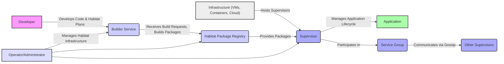
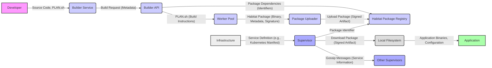

# Project Design Document: Habitat

**Version:** 1.1
**Date:** October 26, 2023
**Author:** AI Software Architect

## 1. Introduction

This document provides an enhanced and detailed design overview of the Habitat project, an open-source automation technology designed to streamline the building, deployment, and management of applications across diverse environments. These environments range from traditional data centers to containerized platforms and cloud infrastructures. This document serves as a foundational resource for subsequent threat modeling activities, providing a comprehensive understanding of the system's architecture and components.

## 2. Goals

The core objectives of Habitat are:

* **Achieve Universal Application Portability:**  Enable applications to be built once and operate consistently across a wide array of operating systems and infrastructure platforms without modification.
* **Implement Comprehensive Runtime Automation:** Automate the complete application lifecycle, encompassing deployment, configuration, updates, service discovery, and health monitoring.
* **Establish Operational Consistency:** Deliver a unified and predictable operational model for applications, abstracting away the complexities of the underlying infrastructure.
* **Facilitate Secure Application Delivery Pipelines:**  Promote and enforce secure practices for application packaging, distribution, and deployment.
* **Enable Self-Managing and Resilient Applications:** Empower applications to monitor their own health, detect failures, and automatically initiate recovery procedures.

## 3. High-Level Architecture

Habitat's architecture is centered around the "Habitat package" and the "Supervisor" process. The following diagram illustrates the primary components and their interactions in greater detail:

Key components with expanded descriptions:

* **Developer:**  Writes application code and defines the build, runtime, and operational characteristics of the application through Habitat plan files (`PLAN.sh`).
* **Builder Service:** A centralized service responsible for compiling application code, resolving dependencies, and packaging applications into immutable Habitat packages based on the provided plan files. It also handles package signing for integrity.
* **Habitat Package Registry:** A repository for storing and distributing signed Habitat packages. It provides mechanisms for versioning, access control, and metadata management for packages.
* **Infrastructure:** The underlying computing environment where Habitat applications are deployed and run. This can include virtual machines, container orchestration platforms like Kubernetes, or cloud provider infrastructure.
* **Supervisor:** The core runtime agent that manages the lifecycle of Habitat applications on a given host. It downloads packages, configures applications, manages processes, provides service discovery, and performs health checks.
* **Application:** The actual software being managed by the Habitat Supervisor. It runs within the context provided by the Supervisor.
* **Service Group:** A logical grouping of Supervisors running the same application. This enables coordination, service discovery, leader election, and rolling updates across multiple instances of the application.
* **Other Supervisors:** Other instances of the Supervisor process, potentially managing different applications or participating in different service groups. They communicate via a gossip protocol.
* **Operator/Administrator:**  Individuals or automated systems responsible for managing the Habitat infrastructure, including the Builder Service, Package Registry, and Supervisor deployments.

## 4. Detailed Design

### 4.1. Habitat Package (Detailed)

* **Definition:** A digitally signed, immutable artifact containing all the necessary components to run an application, including binaries, libraries, configuration defaults, and operational instructions.
* **Structure (with more detail):**
    * `/hab/pkgs/<origin>/<name>/<version>/<release>`: The root directory where the package is installed on a host.
    * `/hab/pkgs/<origin>/<name>/<version>/<release>/CONTENTS`: Contains the application's executable files, libraries, and other runtime assets.
    * `/hab/pkgs/<origin>/<name>/<version>/<release>/PLAN.sh`: A Bash script that defines the build process, dependencies, runtime configuration, and service hooks for the application.
    * `/hab/pkgs/<origin>/<name>/<version>/<release>/IDENT`: A plain text file containing the unique identifier of the package: `<origin>/<name>/<version>/<release>`.
    * `/hab/pkgs/<origin>/<name>/<version>/<release>/DEPS`: A plain text file listing the package dependencies required by this package, specified by their identifiers.
    * `/hab/pkgs/<origin>/<name>/<version>/<release>/EXPORTS`: A directory containing files that define configuration settings that can be overridden at runtime.
    * `/hab/pkgs/<origin>/<name>/<version>/<release>/SUP`: A directory containing files and directories specific to the Supervisor's management of the package, including:
        * `hooks/`: Scripts that are executed at various stages of the service lifecycle (e.g., `init`, `reconfigure`, `health_check`).
        * `default.toml`: Default configuration settings for the service.
        * `ctl-gateway-port`:  Specifies the port for the Supervisor's control gateway.
    * `/hab/pkgs/<origin>/<name>/<version>/<release>/META`: A directory containing metadata about the package, including the digital signature.

### 4.2. Supervisor (Detailed)

* **Role:** The runtime engine for Habitat applications, responsible for fetching, configuring, running, monitoring, and updating services.
* **Key Functions (expanded):**
    * **Package Acquisition:** Downloads specified Habitat packages from configured registries, verifying their signatures for authenticity and integrity.
    * **Service Initialization:**  Sets up the runtime environment for the application based on the package's `PLAN.sh` and configuration.
    * **Process Management:** Starts, stops, restarts, and monitors the application processes defined within the package.
    * **Dynamic Configuration:** Applies configuration settings sourced from default configurations, user-provided files, and environment variables. Supports dynamic reconfiguration without service restarts in many cases.
    * **Service Discovery (Gossip Protocol):** Utilizes a peer-to-peer gossip protocol to discover other Supervisors within the same service group, enabling service-to-service communication and coordination.
    * **Health Checking:** Executes health check scripts defined in the package to determine the health status of the managed application.
    * **Event Emission:**  Generates events related to service lifecycle changes, health status, and configuration updates, which can be consumed by monitoring systems.
    * **Control Plane (gRPC and HTTP):** Provides gRPC and HTTP APIs for interacting with the Supervisor, allowing for remote management and monitoring.
* **Internal Modules:**
    * **Launcher:** Responsible for starting and managing application processes.
    * **Census:** Maintains the state of the local Supervisor and the service group it belongs to.
    * **Gossip Engine:** Implements the gossip protocol for communication and service discovery.
    * **Config Watcher:** Monitors for configuration changes and triggers reconfiguration events.
    * **Health Checker:** Executes health check scripts and reports the service's health status.
    * **API Server:** Provides the gRPC and HTTP control plane interfaces.
* **Communication (more specific):**
    * **Gossip Protocol (Scuttlebutt):** A decentralized, eventually consistent protocol used for peer-to-peer communication, service discovery, and agreement on group membership.
    * **gRPC (over TLS):** Used for secure communication between the `hab` command-line interface and the Supervisor, and for internal communication between Supervisor components.
    * **HTTP (with optional TLS):** Used for the Supervisor's control plane API, allowing for programmatic interaction.

### 4.3. Builder Service (Detailed)

* **Role:**  Provides a scalable and reliable platform for building Habitat packages from source code and plan files.
* **Key Functions (expanded):**
    * **Build Job Management:**  Receives and queues build requests, managing the execution of builds across a pool of workers.
    * **Source Code Retrieval:**  Fetches source code from various sources, including Git repositories and local filesystems.
    * **Dependency Resolution and Caching:** Resolves package dependencies and utilizes caching mechanisms to optimize build times.
    * **Build Environment Provisioning:**  Creates isolated build environments for each package build to ensure reproducibility.
    * **Package Signing (using private keys):** Cryptographically signs the built Habitat package using a private key, ensuring its integrity and authenticity.
    * **Package Metadata Generation:**  Generates metadata about the built package, including dependencies, build time, and builder information.
    * **Package Upload to Registry:** Securely uploads the built and signed package to the configured Habitat Package Registry.
* **Components (more detail):**
    * **Builder API (gRPC):** Provides a gRPC interface for submitting build requests, querying build status, and managing build configurations.
    * **Worker Pool (with autoscaling):** Manages a dynamic pool of build workers that execute the build process. Can scale based on demand.
    * **Package Uploader (with retry logic):** Handles the secure upload of built packages to the registry, including retry mechanisms for network resilience.
    * **Database (for job tracking and metadata):**  Stores information about build jobs, package metadata, and worker status.
    * **Key Management System:** Securely stores and manages the private keys used for package signing.

### 4.4. Habitat Package Registry (Detailed)

* **Role:** A robust and secure repository for storing, managing, and distributing Habitat packages.
* **Key Functions (expanded):**
    * **Package Storage (Object Storage):** Stores Habitat packages as binary objects, often utilizing object storage solutions for scalability and durability.
    * **Package Indexing and Search:** Provides an efficient index for searching and retrieving packages based on origin, name, version, and other metadata.
    * **Authentication and Authorization (Role-Based Access Control):**  Implements authentication mechanisms to verify the identity of users and systems, and authorization policies to control access to packages based on roles and permissions.
    * **Package Provenance Tracking:**  Maintains a history of package builds, including the builder, build time, and source code used.
    * **API (HTTP):** Provides an HTTP API for interacting with the registry, including uploading, downloading, and querying packages.
* **Implementations (with more detail):**
    * **Habitat SaaS Registry (Chef Habitat Stable Channel):** A publicly hosted registry service managed by Chef, offering a stable and readily available option.
    * **Self-Hosted Registry (Open Source):**  Users can deploy and manage their own instances of the Habitat Package Registry, providing greater control and customization. This typically involves deploying the `hab-sup` and configuring it to act as a registry.

### 4.5. Habitat Operator (Kubernetes Integration) (Detailed)

* **Role:**  Extends Kubernetes to natively understand and manage Habitat applications as first-class citizens.
* **Key Functions (expanded):**
    * **Custom Resource Definitions (CRDs):** Introduces Kubernetes custom resources like `Habitat`, `HabitatService`, and `HabitatPackage` to represent Habitat concepts within the Kubernetes API.
    * **Controllers (Operators):**  Implements Kubernetes controllers that watch for changes to Habitat CRs and reconcile the desired state with the actual state in the cluster. This involves deploying and managing Habitat Supervisors and services.
    * **Sidecar Injection (using Mutating Webhooks):** Automatically injects the Habitat Supervisor as a sidecar container into application pods, enabling Habitat management within Kubernetes.
    * **Service Discovery Integration (Kubernetes Services):** Integrates with Kubernetes service discovery mechanisms, allowing Habitat services to be discovered and accessed by other Kubernetes workloads.
    * **Configuration Management (using Kubernetes ConfigMaps and Secrets):** Leverages Kubernetes ConfigMaps and Secrets to manage the configuration of Habitat applications running in Kubernetes.

## 5. Data Flow (Enhanced)

The following diagram illustrates the data flow within the Habitat ecosystem with more specific data types:

Key data flows with more detail:

* **Source Code, PLAN.sh:** Developers create application source code and Habitat plan files defining the build and runtime behavior.
* **Build Request (Metadata):** A request containing metadata about the build, such as the package origin, name, and version, is sent to the Builder Service.
* **Package Dependencies (Identifiers):** The Builder Service retrieves identifiers of required package dependencies from the Habitat Package Registry.
* **PLAN.sh (Build Instructions):** The Worker Pool uses the instructions in the `PLAN.sh` file to compile and package the application.
* **Habitat Package (Binary, Metadata, Signature):** The Worker Pool produces a signed Habitat package containing the application binary, metadata, and digital signature.
* **Upload Package (Signed Artifact):** The Package Uploader securely uploads the signed Habitat package to the Habitat Package Registry.
* **Service Definition (e.g., Kubernetes Manifest):**  A definition of the service to be deployed, potentially including the Habitat package identifier, is provided to the infrastructure.
* **Package Identifier:** The Supervisor retrieves the identifier of the Habitat package to be run.
* **Download Package (Signed Artifact):** The Supervisor downloads the signed Habitat package from the registry, verifying its signature.
* **Application Binaries, Configuration:** The Supervisor extracts the application binaries and configuration from the downloaded package.
* **Gossip Messages (Service Information):** Supervisors exchange gossip messages containing information about their services, including address, port, and health status.

## 6. Key Technologies (Expanded)

* **Rust:** The primary programming language for the Supervisor (`hab-sup`), Builder Service (`hab-builder`), and other core components, chosen for its performance, safety, and concurrency features.
* **gRPC:** A high-performance, open-source universal RPC framework used for inter-process communication between various Habitat components.
* **Protocol Buffers:** A language-neutral, platform-neutral, extensible mechanism for serializing structured data, used for defining data structures in gRPC communication.
* **HTTP/2:** Used for the Supervisor's control plane API, providing a standard interface for management and monitoring.
* **Bash:** The scripting language used for writing `PLAN.sh` files, providing flexibility in defining build and runtime behavior.
* **Kubernetes:** A container orchestration platform that Habitat integrates with via the Habitat Operator, enabling the management of Habitat applications within Kubernetes clusters.
* **Scuttlebutt:** The gossip protocol implementation used for peer-to-peer communication and service discovery between Supervisors.
* **Ring:** A Rust cryptography library used for cryptographic operations, including package signing and verification.
* **Toml:** A configuration file format used for Supervisor and other component configurations.

## 7. Security Considerations (More Specific)

This section outlines security considerations for threat modeling:

* **Package Integrity:**
    * **Threat:** Malicious actors could tamper with Habitat packages, injecting malicious code.
    * **Mitigation:** Cryptographic signing of packages by the Builder Service and signature verification by the Supervisor before execution.
* **Supply Chain Security:**
    * **Threat:** Compromised build dependencies or build environments could lead to compromised packages.
    * **Mitigation:** Secure build pipelines, dependency scanning, and potentially using reproducible builds.
* **Authentication and Authorization:**
    * **Threat:** Unauthorized access to the Habitat Package Registry could lead to the distribution of malicious packages. Unauthorized access to the Supervisor API could lead to service disruption.
    * **Mitigation:** Implementing robust authentication mechanisms (e.g., API keys, OAuth) and role-based access control for the registry and Supervisor API.
* **Secrets Management:**
    * **Threat:** Sensitive information like API keys or database credentials could be exposed within packages or configuration.
    * **Mitigation:** Utilizing Habitat's configuration features to securely manage secrets, potentially integrating with dedicated secrets management solutions.
* **Network Security:**
    * **Threat:** Unsecured communication channels could be intercepted, leading to data breaches or man-in-the-middle attacks.
    * **Mitigation:** Enforcing TLS encryption for communication between Supervisors, the Builder Service, and the Package Registry. Securing network access to Supervisor control plane ports.
* **Supervisor Security:**
    * **Threat:** A compromised Supervisor could be used to gain control over the managed application or the host system.
    * **Mitigation:** Running the Supervisor with minimal privileges, regularly patching vulnerabilities, and potentially using security hardening techniques.
* **Data at Rest and in Transit:**
    * **Threat:** Sensitive data within packages or during communication could be exposed.
    * **Mitigation:** Encrypting sensitive data within packages where necessary and ensuring secure communication channels.
* **Gossip Protocol Security:**
    * **Threat:** Malicious actors could inject false information into the gossip network, disrupting service discovery or coordination.
    * **Mitigation:**  While the current gossip protocol has limited built-in security, future enhancements could include authentication and encryption of gossip messages.

## 8. Assumptions and Constraints (Clarified)

* **Secure Network Infrastructure:** It is assumed that the underlying network infrastructure provides basic security measures, such as firewalls and network segmentation.
* **Trusted Habitat Package Registry:** The Habitat Package Registry being used is assumed to be a trusted source of packages. For self-hosted registries, the organization is responsible for its security.
* **Secure Key Management Practices:**  It is assumed that private keys used for package signing are securely generated, stored, and managed.
* **Focus on Core Habitat Functionality:** This design document primarily focuses on the core components and workflows of Habitat and may not cover all edge cases, less common features, or specific integrations.
* **Kubernetes Security Best Practices:** For deployments utilizing the Habitat Operator, it is assumed that standard Kubernetes security best practices are followed.

## 9. Future Considerations (More Specific)

* **Enhanced Security Features:**
    * Implementing authentication and encryption for the gossip protocol.
    * Adding more granular access control mechanisms for the Supervisor API.
    * Integrating with security scanning tools to automatically identify vulnerabilities in packages.
* **Integration with Observability Platforms:**  Deeper integration with monitoring and logging platforms like Prometheus and Elasticsearch for enhanced observability.
* **Improved Package Provenance:**  More detailed tracking of the package build process, including source code commit hashes and build environment details.
* **Support for Additional Orchestration Platforms:** Expanding integration to other container orchestration platforms beyond Kubernetes.
* **Advanced Configuration Management:**  Exploring more sophisticated configuration management techniques and integrations.

This improved document provides a more detailed and comprehensive design overview of the Habitat project, offering a stronger foundation for subsequent threat modeling activities. The enhanced descriptions of components, data flows, key technologies, and security considerations will facilitate a more thorough and effective analysis of potential security vulnerabilities.