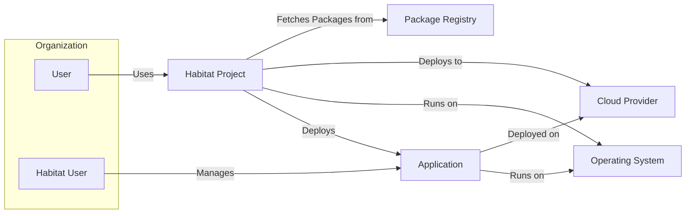
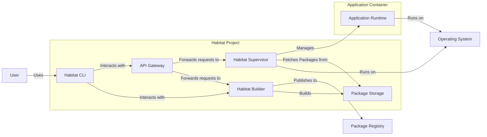
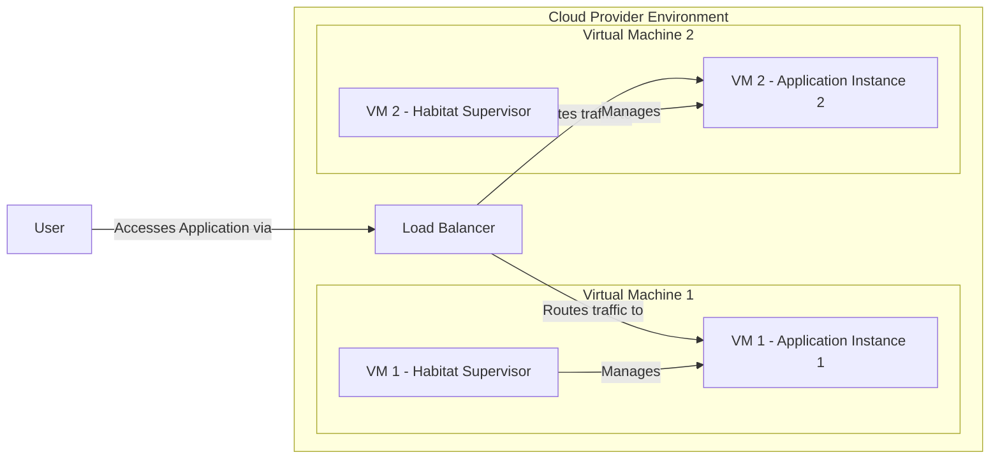
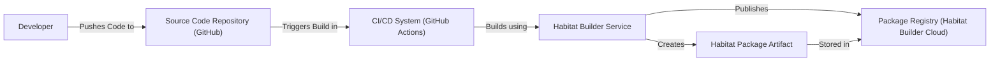

# BUSINESS POSTURE

This project, Habitat, aims to provide a system for automating the building, deployment, and management of applications across different environments. It focuses on application-centric automation, aiming to make applications self-aware and portable.

Business Priorities and Goals:
- Simplify application deployment and management across diverse infrastructure.
- Increase application portability and reduce environment-specific configurations.
- Enable consistent and repeatable application deployments.
- Improve application runtime reliability and observability.
- Empower development and operations teams to collaborate more effectively on application lifecycle management.

Business Risks:
- Complexity of adopting a new application management paradigm.
- Potential for misconfiguration leading to application failures or security vulnerabilities.
- Reliance on a specific technology stack (Habitat ecosystem).
- Integration challenges with existing infrastructure and tooling.
- Security risks associated with automated deployment and management processes, especially around secrets management and access control.

# SECURITY POSTURE

Existing Security Controls:
- security control: Code hosted on GitHub, leveraging GitHub's security features for repository access control and vulnerability scanning. (Implemented: GitHub platform)
- security control: Open source project with community review, potentially leading to identification and resolution of security vulnerabilities. (Implemented: Open Source Development Model)
- security control: Use of standard cryptographic libraries and practices within the codebase (Assumption, needs verification). (Implemented: Codebase)

Accepted Risks:
- accepted risk: Reliance on community contributions for security vulnerability identification and patching.
- accepted risk: Potential for vulnerabilities in dependencies used by Habitat.
- accepted risk: Security of user-provided Habitat plans and application code.

Recommended Security Controls:
- security control: Implement automated security scanning (SAST/DAST) in the CI/CD pipeline for Habitat codebase.
- security control: Conduct regular security audits and penetration testing of Habitat components.
- security control: Implement robust secrets management within Habitat for handling sensitive application configurations and credentials.
- security control: Provide clear security guidelines and best practices for Habitat users, especially regarding plan development and secure application packaging.
- security control: Implement role-based access control (RBAC) within Habitat for managing user permissions and access to resources.

Security Requirements:
- Authentication:
    - Requirement: Secure authentication mechanism for accessing Habitat services and APIs.
    - Requirement: Support for different authentication methods (e.g., API keys, tokens, integration with existing identity providers).
- Authorization:
    - Requirement: Role-based access control to manage permissions for different Habitat operations and resources.
    - Requirement: Granular authorization policies to control access to specific applications and environments.
- Input Validation:
    - Requirement: Strict input validation for all user-provided data, including Habitat plans, configuration files, and API requests.
    - Requirement: Protection against common injection vulnerabilities (e.g., command injection, SQL injection).
- Cryptography:
    - Requirement: Secure storage and handling of sensitive data, including secrets and credentials, using strong encryption algorithms.
    - Requirement: Secure communication channels using TLS/SSL for all network interactions between Habitat components and external systems.

# DESIGN

## C4 CONTEXT

Context Diagram Elements:

- Name: User
  - Type: Person
  - Description: Represents a general user who might interact with systems managed by Habitat, potentially indirectly.
  - Responsibilities: Interacting with applications deployed and managed by Habitat.
  - Security controls: Authentication and authorization mechanisms implemented by the applications they use.

- Name: Habitat User
  - Type: Person
  - Description: Represents operations or development personnel who directly interact with Habitat to manage applications.
  - Responsibilities: Creating Habitat plans, packaging applications, deploying and managing applications using Habitat.
  - Security controls: Authentication and authorization controls within Habitat to manage access to Habitat services and resources.

- Name: Habitat Project
  - Type: Software System
  - Description: The Habitat system itself, responsible for automating application building, deployment, and management.
  - Responsibilities: Packaging applications, orchestrating deployments, managing application lifecycle, providing runtime supervision.
  - Security controls: Authentication, authorization, input validation, secrets management, secure communication, and secure build processes.

- Name: Operating System
  - Type: Software System
  - Description: The underlying operating system on which Habitat and managed applications run (e.g., Linux, Windows).
  - Responsibilities: Providing core system services, resource management, and security features for Habitat and applications.
  - Security controls: Operating system level security controls like firewalls, user permissions, and security updates.

- Name: Cloud Provider
  - Type: Software System
  - Description: Cloud infrastructure providers (e.g., AWS, Azure, GCP) where Habitat might deploy and manage applications.
  - Responsibilities: Providing infrastructure resources (compute, storage, networking), and cloud-specific services.
  - Security controls: Cloud provider security controls like IAM, network security groups, and encryption at rest and in transit.

- Name: Package Registry
  - Type: Software System
  - Description: A repository for storing and distributing Habitat packages (e.g., Habitat Builder, Artifactory, Docker Registry).
  - Responsibilities: Storing and serving Habitat packages, managing package versions and metadata.
  - Security controls: Access control to package registry, integrity checks for packages, and vulnerability scanning of packages.

- Name: Application
  - Type: Software System
  - Description: Applications that are built, deployed, and managed using Habitat.
  - Responsibilities: Providing specific business functionality, processing data, and interacting with users.
  - Security controls: Application-level security controls, including authentication, authorization, input validation, and data protection, configured and managed through Habitat.

## C4 CONTAINER

Container Diagram Elements:

- Name: Habitat CLI
  - Type: Application
  - Description: Command-line interface for Habitat users to interact with Habitat services, build packages, and manage deployments.
  - Responsibilities: Providing user interface for Habitat operations, interacting with Habitat Builder and Supervisor APIs.
  - Security controls: User authentication and authorization for CLI commands, secure communication with Habitat services.

- Name: Habitat Supervisor
  - Type: Application
  - Description: The core runtime component of Habitat, responsible for running and managing applications on individual nodes.
  - Responsibilities: Downloading and installing packages, configuring applications, starting and monitoring application processes, providing runtime services.
  - Security controls: Secure package download and verification, process isolation for applications, runtime security monitoring, secrets management within the supervisor.

- Name: Habitat Builder
  - Type: Application
  - Description: A service for building Habitat packages from source code and plans.
  - Responsibilities: Compiling code, packaging applications, signing packages, publishing packages to registries.
  - Security controls: Secure build environment, input validation for build plans, code scanning during build, secure package signing, access control to builder service.

- Name: Package Storage
  - Type: Data Store
  - Description: Local storage on each node where Habitat Supervisor caches downloaded packages.
  - Responsibilities: Storing downloaded Habitat packages for local access by the Supervisor.
  - Security controls: Access control to package storage directory, integrity checks for stored packages.

- Name: API Gateway
  - Type: Application
  - Description: An optional component that provides a centralized API endpoint for accessing Habitat services (Builder, Supervisor).
  - Responsibilities: Routing API requests, authentication and authorization for API access, rate limiting, and other API management functions.
  - Security controls: API authentication and authorization, input validation for API requests, TLS/SSL for API communication, protection against common API vulnerabilities.

- Name: Operating System
  - Type: Infrastructure
  - Description: The underlying operating system providing the runtime environment for Habitat containers.
  - Responsibilities: Providing core system services, resource isolation, and security features.
  - Security controls: OS-level security hardening, security updates, firewalls, and intrusion detection systems.

- Name: Package Registry
  - Type: External System
  - Description: External package registry (e.g., Habitat Builder Cloud, Artifactory) for storing and distributing Habitat packages.
  - Responsibilities: Hosting and serving Habitat packages, managing package versions and metadata.
  - Security controls: Access control to package registry, package integrity verification, vulnerability scanning of packages.

- Name: Application Runtime
  - Type: Container
  - Description: The runtime environment for the application managed by Habitat Supervisor, running within a process or container.
  - Responsibilities: Executing application code, providing application services, interacting with the operating system and other services.
  - Security controls: Application-level security controls, process isolation, resource limits, and security configurations managed by Habitat Supervisor.

## DEPLOYMENT

Deployment Architecture Option: Standalone Supervisor on Virtual Machines

Deployment Diagram Elements (Standalone Supervisor on VMs):

- Name: VM 1 - Habitat Supervisor
  - Type: Virtual Machine
  - Description: Virtual machine instance running the Habitat Supervisor process.
  - Responsibilities: Managing application instances on the same VM, communicating with other Supervisors (if clustered), and reporting status.
  - Security controls: VM-level security hardening, OS security controls, Supervisor authentication and authorization, secure communication with other Supervisors.

- Name: VM 1 - Application Instance 1
  - Type: Application Process
  - Description: Instance of the application managed by the Habitat Supervisor on VM 1.
  - Responsibilities: Running application code, serving user requests, and interacting with other services.
  - Security controls: Application-level security controls, process isolation provided by the OS and Supervisor, resource limits.

- Name: VM 2 - Habitat Supervisor
  - Type: Virtual Machine
  - Description: Virtual machine instance running the Habitat Supervisor process.
  - Responsibilities: Managing application instances on the same VM, communicating with other Supervisors (if clustered), and reporting status.
  - Security controls: VM-level security hardening, OS security controls, Supervisor authentication and authorization, secure communication with other Supervisors.

- Name: VM 2 - Application Instance 2
  - Type: Application Process
  - Description: Instance of the application managed by the Habitat Supervisor on VM 2.
  - Responsibilities: Running application code, serving user requests, and interacting with other services.
  - Security controls: Application-level security controls, process isolation provided by the OS and Supervisor, resource limits.

- Name: Load Balancer
  - Type: Network Device
  - Description: Load balancer distributing traffic across multiple application instances.
  - Responsibilities: Distributing incoming traffic, health checking application instances, and ensuring high availability.
  - Security controls: TLS/SSL termination, DDoS protection, access control lists, and security monitoring.

## BUILD

Build Process Diagram Elements:

- Name: Developer
  - Type: Person
  - Description: Software developer writing code and Habitat plans.
  - Responsibilities: Writing secure code, creating Habitat plans, and committing code to the repository.
  - Security controls: Secure development practices, code reviews, and access control to source code repository.

- Name: Source Code Repository (GitHub)
  - Type: Software System
  - Description: Version control system hosting the source code and Habitat plans (e.g., GitHub).
  - Responsibilities: Storing source code, managing versions, and triggering CI/CD pipelines.
  - Security controls: Access control to repository, branch protection, and audit logging.

- Name: CI/CD System (GitHub Actions)
  - Type: Software System
  - Description: Continuous Integration and Continuous Delivery system automating the build and deployment process (e.g., GitHub Actions).
  - Responsibilities: Automating build process, running tests, performing security scans, and triggering package building.
  - Security controls: Secure pipeline configuration, secrets management for CI/CD workflows, and access control to CI/CD system.

- Name: Habitat Builder Service
  - Type: Software System
  - Description: Habitat Builder service responsible for building Habitat packages.
  - Responsibilities: Compiling code, packaging applications, signing packages, and publishing packages.
  - Security controls: Secure build environment, input validation for build plans, code scanning during build, secure package signing, and access control to builder service.

- Name: Package Registry (Habitat Builder Cloud)
  - Type: Software System
  - Description: Habitat Builder Cloud or other package registry for storing and distributing Habitat packages.
  - Responsibilities: Storing and serving Habitat packages, managing package versions and metadata.
  - Security controls: Access control to package registry, package integrity verification, and vulnerability scanning of packages.

- Name: Habitat Package Artifact
  - Type: Data Artifact
  - Description: The resulting Habitat package containing the application and its dependencies.
  - Responsibilities: Deployable unit containing the application and runtime instructions.
  - Security controls: Package signing for integrity and authenticity, vulnerability scanning of package contents.

# RISK ASSESSMENT

Critical Business Processes:
- Application deployment and updates: Habitat automates the process of deploying and updating applications, which is critical for maintaining service availability and delivering new features.
- Application runtime management: Habitat manages the runtime of applications, ensuring they are running correctly and are monitored. This is crucial for application stability and reliability.

Data Sensitivity:
- Application configuration data: Habitat manages application configuration, which may include sensitive information like database credentials, API keys, and other secrets. This data is highly sensitive and requires strong protection.
- Application code: The application code itself is valuable intellectual property and may contain sensitive logic or data handling routines. Protecting the integrity and confidentiality of the application code is important.
- Operational logs and metrics: Habitat collects logs and metrics about application runtime and system performance. While generally less sensitive, these logs might contain some operational details that should be protected from unauthorized access.

# QUESTIONS & ASSUMPTIONS

Questions:
- What specific authentication and authorization mechanisms are currently implemented in Habitat components (CLI, Supervisor, Builder, API Gateway)?
- How are secrets managed within Habitat currently? Is there a built-in secrets management solution or recommendation?
- What security scanning tools are currently used in the Habitat build process, if any?
- What are the recommended best practices for securing Habitat deployments?
- Is there a formal security audit or penetration testing report available for Habitat?

Assumptions:
- BUSINESS POSTURE: The primary business goal is to improve application deployment efficiency and portability, with a secondary goal of enhancing application security through consistent management.
- SECURITY POSTURE:  Habitat is intended to be used in environments with moderate security requirements, where confidentiality, integrity, and availability are all important.  Security is considered but might not be the absolute top priority compared to ease of use and automation.
- DESIGN: The design assumes a typical deployment scenario involving virtual machines or cloud environments. The build process is assumed to be automated using CI/CD pipelines.