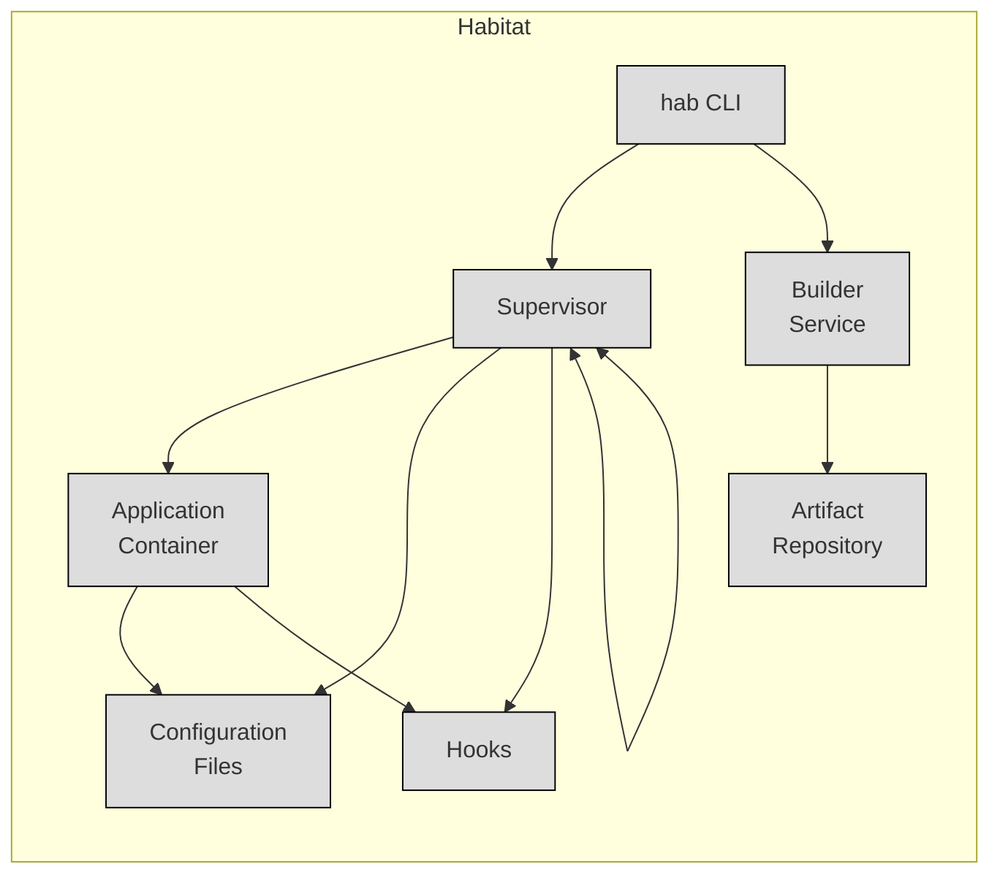
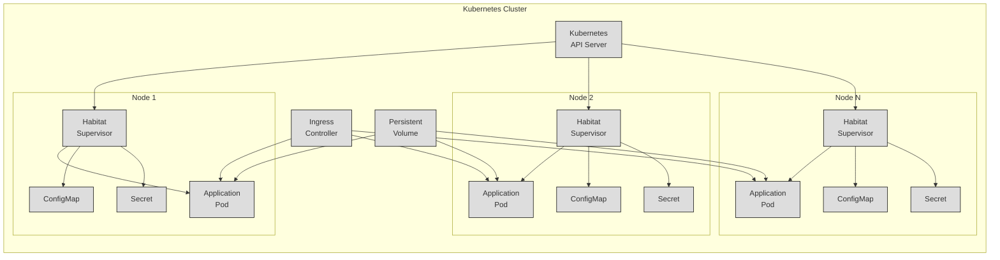

Okay, let's create a design document for the Habitat project, focusing on aspects relevant for threat modeling.

# BUSINESS POSTURE

Habitat is a build and deployment automation tool, aiming to simplify and standardize the process of packaging, deploying, and managing applications across various environments. It introduces the concept of "application automation," where the application package itself contains the necessary information for its deployment and management.

Business Priorities and Goals:

*   Reduce operational overhead: Automate application deployment and management, minimizing manual intervention.
*   Improve application portability: Enable applications to run consistently across different environments (development, testing, production, cloud, on-premise).
*   Increase deployment frequency and reliability: Facilitate faster and more reliable releases.
*   Enhance developer productivity: Streamline the build and deployment process, allowing developers to focus on application logic.
*   Improve scalability and resilience: Provide mechanisms for scaling applications and handling failures.

Most Important Business Risks:

*   Supply chain attacks: Compromised packages or dependencies could introduce vulnerabilities into the system.
*   Unauthorized access: Weak access controls could allow attackers to modify or deploy malicious packages.
*   Configuration errors: Incorrectly configured Habitat packages or environments could lead to application failures or security vulnerabilities.
*   Data breaches: Sensitive data stored within packages or exposed during deployment could be compromised.
*   Denial of service: Attacks targeting the Habitat Supervisor or the applications it manages could disrupt service availability.
*   Lack of visibility and auditability: Insufficient logging and monitoring could hinder incident response and compliance efforts.

# SECURITY POSTURE

Existing Security Controls (as inferred from the GitHub repository and general knowledge of the project):

*   security control: Cryptographic signing of packages: Habitat uses cryptographic signatures (using Curve25519 keys) to verify the integrity and authenticity of packages. Implemented in the `hab` CLI and Supervisor. Described in the documentation and code.
*   security control: Package origin verification: Habitat allows configuring trusted origins for packages, preventing the installation of packages from untrusted sources. Implemented in the `hab` CLI and Supervisor. Described in the documentation.
*   security control: Supervisor communication over TLS: The Habitat Supervisor can be configured to use TLS for secure communication between supervisors. Implemented in the Supervisor. Described in the documentation.
*   security control: Limited capabilities within containers: Habitat packages are typically run within containers (e.g., Docker), which provide some level of isolation and resource constraints. Implemented by the container runtime (e.g., Docker).
*   security control: Read-only filesystem mounts: Habitat encourages the use of read-only filesystem mounts for application code, reducing the impact of potential vulnerabilities. Implemented in the Supervisor and package build process.
*   security control: Least privilege principle: Habitat encourages running applications with minimal necessary privileges. Implemented in the package build process and runtime configuration.

Accepted Risks:

*   accepted risk: Reliance on external container runtime security: Habitat relies on the security of the underlying container runtime (e.g., Docker, containerd) for isolation and resource constraints. Vulnerabilities in the container runtime could impact Habitat-managed applications.
*   accepted risk: Complexity of configuration: The flexibility of Habitat's configuration can lead to complex setups, increasing the risk of misconfiguration.
*   accepted risk: Dependency management challenges: While Habitat manages its own packages, it may still rely on external dependencies (e.g., system libraries), which could introduce vulnerabilities.

Recommended Security Controls (High Priority):

*   Implement robust secret management: Provide a secure mechanism for storing and accessing sensitive data (e.g., API keys, passwords) used by Habitat packages. Integrate with existing secret management solutions (e.g., HashiCorp Vault).
*   Enhance auditing and logging: Implement comprehensive logging of all Habitat-related activities, including package builds, deployments, and Supervisor actions. Centralize logs for analysis and monitoring.
*   Implement network policies: Define network policies to restrict communication between Habitat-managed applications and external services, limiting the attack surface.
*   Regular security audits and penetration testing: Conduct regular security assessments to identify and address potential vulnerabilities in the Habitat system and its components.
*   Implement a vulnerability management process: Establish a process for tracking and addressing vulnerabilities in Habitat itself and its dependencies.

Security Requirements:

*   Authentication:
    *   The `hab` CLI should authenticate users before allowing them to perform sensitive actions (e.g., publishing packages).
    *   The Habitat Supervisor should authenticate other supervisors before establishing communication.
    *   Access to the Habitat Builder service (if used) should be authenticated.
*   Authorization:
    *   Implement role-based access control (RBAC) to restrict access to Habitat resources based on user roles and permissions.
    *   Control which users can publish packages to specific origins.
    *   Control which users can deploy packages to specific environments.
*   Input Validation:
    *   Validate all user-provided input to the `hab` CLI and any Habitat APIs.
    *   Validate package metadata and configuration files to prevent injection attacks.
    *   Sanitize user-provided data before using it in shell scripts or other executable code within packages.
*   Cryptography:
    *   Use strong cryptographic algorithms and key management practices for package signing and TLS communication.
    *   Protect private keys used for package signing.
    *   Regularly rotate cryptographic keys.

# DESIGN

## C4 CONTEXT

```mermaid
graph LR
    subgraph Habitat System
        A[Habitat]
    end
    B[Developers] --> A
    C[Users] --> A
    D[External\nDependencies] --> A
    E[Container\nRegistry] --> A
    F[Operating\nSystem] --> A
    G[Builder\nService] --> A
    H[Artifact\nRepository] <-- A

    classDef box fill:#ddd,stroke:#000,stroke-width:1px;
    class A box
```

Element Descriptions:

*   1.  Name: Habitat
    *   Type: Software System
    *   Description: The core Habitat system, including the `hab` CLI, Supervisor, and related components.
    *   Responsibilities: Building, deploying, and managing applications.
    *   Security controls: Package signing, origin verification, TLS communication, least privilege principle.

*   2.  Name: Developers
    *   Type: Person
    *   Description: Individuals who create and maintain Habitat packages.
    *   Responsibilities: Writing application code, defining package metadata, building packages.
    *   Security controls: Authentication to `hab` CLI and Builder service, RBAC.

*   3.  Name: Users
    *   Type: Person
    *   Description: Individuals who interact with applications managed by Habitat.
    *   Responsibilities: Using the applications.
    *   Security controls: Application-level security controls (authentication, authorization, etc.).

*   4.  Name: External Dependencies
    *   Type: Software System
    *   Description: Libraries, frameworks, and other software components that Habitat packages depend on.
    *   Responsibilities: Providing functionality to Habitat packages.
    *   Security controls: Vulnerability management, dependency scanning.

*   5.  Name: Container Registry
    *   Type: Software System
    *   Description: A registry for storing and distributing container images (e.g., Docker Hub, private registry).
    *   Responsibilities: Storing container images used by Habitat.
    *   Security controls: Authentication, authorization, image scanning.

*   6.  Name: Operating System
    *   Type: Software System
    *   Description: The underlying operating system on which Habitat runs.
    *   Responsibilities: Providing the foundation for the Habitat Supervisor and containers.
    *   Security controls: OS-level security controls (firewall, SELinux, etc.).

*   7.  Name: Builder Service
    *   Type: Software System
    *   Description: An optional service for building Habitat packages in a centralized and controlled environment.
    *   Responsibilities: Building Habitat packages.
    *   Security controls: Authentication, authorization, input validation, secure build environment.

*   8.  Name: Artifact Repository
    *   Type: Software System
    *   Description: Repository for storing and retrieving Habitat artifacts (.hart files).
    *   Responsibilities: Storing Habitat artifacts.
    *   Security controls: Authentication, authorization, access control.

## C4 CONTAINER



Element Descriptions:

*   1.  Name: hab CLI
    *   Type: Command-line tool
    *   Description: The primary interface for interacting with Habitat.
    *   Responsibilities: Building packages, managing Supervisors, interacting with the Builder service.
    *   Security controls: Authentication, input validation.

*   2.  Name: Supervisor
    *   Type: Daemon process
    *   Description: The core runtime component of Habitat, responsible for managing application lifecycles.
    *   Responsibilities: Starting, stopping, and monitoring applications, applying configuration updates, handling failures.
    *   Security controls: TLS communication, origin verification, least privilege principle.

*   3.  Name: Application Container
    *   Type: Container
    *   Description: A containerized instance of an application managed by Habitat.
    *   Responsibilities: Running the application code.
    *   Security controls: Container isolation, resource constraints, read-only filesystem mounts.

*   4.  Name: Configuration Files
    *   Type: Data
    *   Description: Files containing configuration settings for the application.
    *   Responsibilities: Providing configuration data to the application.
    *   Security controls: Input validation, secure storage (if sensitive data is present).

*   5.  Name: Hooks
    *   Type: Scripts
    *   Description: Scripts that are executed at various points in the application lifecycle (e.g., install, run, health check).
    *   Responsibilities: Performing custom actions during the application lifecycle.
    *   Security controls: Input validation, secure coding practices.

*   6.  Name: Builder Service
    *   Type: Software System
    *   Description: An optional service for building Habitat packages.
    *   Responsibilities: Building Habitat packages.
    *   Security controls: Authentication, authorization, input validation, secure build environment.

*   7.  Name: Artifact Repository
    *   Type: Software System
    *   Description: Repository for storing and retrieving Habitat artifacts (.hart files).
    *   Responsibilities: Storing Habitat artifacts.
    *   Security controls: Authentication, authorization, access control.

## DEPLOYMENT

Habitat can be deployed in various ways, including:

1.  **Local Development:** Running the Supervisor and applications directly on a developer's machine.
2.  **Single Server:** Deploying the Supervisor and applications to a single server.
3.  **Cluster (e.g., Kubernetes, Nomad):** Deploying the Supervisor and applications to a cluster of servers managed by an orchestrator.
4.  **Cloud Platforms (e.g., AWS, Azure, GCP):** Utilizing cloud-specific services for deployment and management.

We'll describe the **Kubernetes cluster** deployment in detail:



Element Descriptions:

*   1.  Name: Habitat Supervisor
    *   Type: DaemonSet
    *   Description: Runs as a Kubernetes DaemonSet, ensuring that a Supervisor instance runs on each node in the cluster.
    *   Responsibilities: Managing application lifecycles within the node.
    *   Security controls: TLS communication, origin verification, least privilege principle.

*   2.  Name: Application Pod
    *   Type: Pod
    *   Description: A Kubernetes Pod containing the application container(s) managed by Habitat.
    *   Responsibilities: Running the application code.
    *   Security controls: Container isolation, resource constraints, read-only filesystem mounts, network policies.

*   3.  Name: ConfigMap
    *   Type: ConfigMap
    *   Description: A Kubernetes ConfigMap containing non-sensitive configuration data for the application.
    *   Responsibilities: Providing configuration data to the application.
    *   Security controls: Access control via Kubernetes RBAC.

*   4.  Name: Secret
    *   Type: Secret
    *   Description: A Kubernetes Secret containing sensitive configuration data (e.g., passwords, API keys).
    *   Responsibilities: Providing sensitive configuration data to the application.
    *   Security controls: Encryption at rest, access control via Kubernetes RBAC.

*   5-12. Name: Habitat Supervisor, Application Pod, ConfigMap, Secret (Node 2 and Node N)
    *   Type, Description, Responsibilities, Security Controls: Same as above, but on different nodes.

*   13. Name: Kubernetes API Server
    *   Type: API Server
    *   Description: The central control plane component of Kubernetes.
    *   Responsibilities: Managing the cluster state, scheduling pods, handling API requests.
    *   Security controls: Authentication, authorization, TLS communication, audit logging.

*   14. Name: Ingress Controller
    *   Type: Ingress Controller
    *   Description: A component that manages external access to services within the cluster.
    *   Responsibilities: Routing external traffic to the appropriate application pods.
    *   Security controls: TLS termination, access control, web application firewall (WAF).

*   15. Name: Persistent Volume
    *   Type: Persistent Volume
    *   Description: A storage volume that persists beyond the lifecycle of a pod.
    *   Responsibilities: Providing persistent storage for applications.
    *   Security controls: Access control, encryption at rest.

## BUILD

Habitat's build process typically involves the following steps:

1.  **Developer:** A developer writes application code and creates a `plan.sh` (or `plan.ps1` for Windows) file that defines the build process.
2.  **hab studio enter:** The developer enters a clean build environment using `hab studio enter`.
3.  **build:** Inside the studio, the `build` command executes the `plan.sh` file, which typically involves:
    *   Downloading dependencies.
    *   Compiling the application code.
    *   Creating a Habitat package (.hart file).
4.  **hab pkg upload:** The developer uploads the .hart file to a Habitat Builder service or artifact repository.
5.  **Artifact Repository:** The .hart file is stored in the repository.

```mermaid
graph LR
    A[Developer] --> B[hab studio enter]
    B --> C[build (plan.sh)]
    C --> D[Habitat Package\n(.hart)]
    D --> E[hab pkg upload]
    E --> F[Artifact\nRepository]
        classDef box fill:#ddd,stroke:#000,stroke-width:1px;
        class A,B,C,D,E,F box
```

Security Controls in the Build Process:

*   **Clean Build Environment:** `hab studio enter` provides a clean, isolated environment for building packages, reducing the risk of contamination from the developer's local system.
*   **Package Signing:** Habitat packages are cryptographically signed, ensuring their integrity and authenticity.
*   **Dependency Management:** Habitat's build process manages dependencies, but it's crucial to scan dependencies for vulnerabilities.
*   **Static Analysis (SAST):** Integrate SAST tools into the `plan.sh` file or the Builder service to automatically scan code for vulnerabilities during the build process.
*   **Software Composition Analysis (SCA):** Use SCA tools to identify and track open-source components and their known vulnerabilities.
*   **Build Automation (CI/CD):** Integrate Habitat builds with a CI/CD system (e.g., GitHub Actions, Jenkins) to automate the build and testing process.  This allows for consistent, repeatable builds and the integration of security checks as part of the pipeline.

# RISK ASSESSMENT

Critical Business Processes:

*   Application deployment and management.
*   Software build and packaging.
*   Configuration management.

Data Sensitivity:

*   **Application Code:** Sensitivity varies depending on the application. Could range from public open-source code to highly confidential proprietary code.
*   **Configuration Data:** May contain sensitive information such as API keys, passwords, database credentials. High sensitivity.
*   **Package Metadata:** Generally low sensitivity, but could potentially leak information about the application.
*   **Logs:** May contain sensitive information depending on the application's logging practices. Sensitivity varies.
*   **.hart files:** Contains compiled code and metadata. Medium sensitivity.

# QUESTIONS & ASSUMPTIONS

Questions:

*   What specific cloud providers or on-premise infrastructure are targeted for deployment? This will influence the specific security controls and configurations needed.
*   What are the specific compliance requirements (e.g., PCI DSS, HIPAA, GDPR) that need to be met?
*   What is the existing security infrastructure (e.g., firewalls, intrusion detection systems, SIEM)?
*   What is the level of expertise of the operations team in managing containerized applications and Kubernetes (if applicable)?
*   Are there any specific performance or scalability requirements?
*   What level of access do developers have to production environments?
*   Is there a centralized secret management solution in place?
*   What is the process for handling security incidents?

Assumptions:

*   BUSINESS POSTURE: The organization has a moderate risk appetite, balancing the need for agility and innovation with the need for security.
*   SECURITY POSTURE: The organization has some basic security controls in place (e.g., firewalls, access controls), but may not have a comprehensive security program. The development team is aware of secure coding practices but may not have extensive experience with container security.
*   DESIGN: The primary deployment target is a Kubernetes cluster. The organization is using or plans to use a container registry and an artifact repository. The build process will be automated using a CI/CD system.