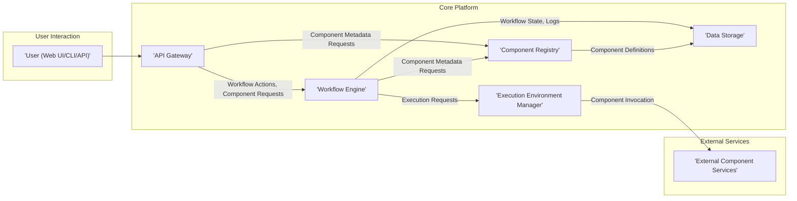
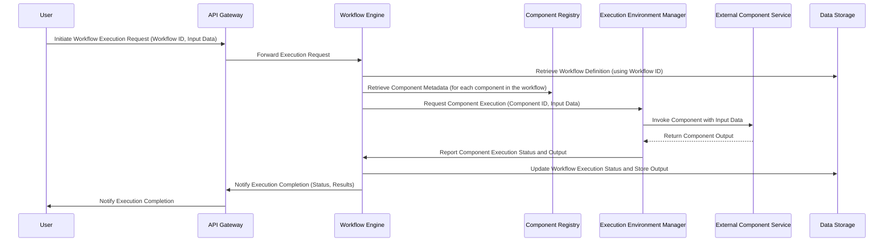

# Project Design Document: Bend - AI Workflow Platform

**Version:** 1.1
**Date:** October 26, 2023
**Prepared By:** AI Software Architect

## 1. Introduction

This document provides a detailed design overview of the Bend project, an open-source platform for building and deploying AI workflows. This document serves as a foundation for understanding the system's architecture, components, and data flow, and will be used as input for subsequent threat modeling activities. This revision includes more detail on component interactions and security considerations.

## 2. Goals

* Provide a comprehensive architectural overview of the Bend platform.
* Detail the key components and their responsibilities, including inter-component communication.
* Describe the data flow within the system, highlighting sensitive data paths.
* Identify key technologies and dependencies for each component.
* Serve as a robust basis for threat modeling and security analysis.

## 3. High-Level Architecture

The Bend platform adopts a microservices-oriented architecture, promoting modularity and scalability. Users define workflows composed of reusable components, which are then executed and managed by the platform.

**Components:**

* **User (Web UI/CLI/API):** The interface through which users interact with the Bend platform. This includes a web-based user interface, a command-line interface, and a programmatic API for integration.
* **API Gateway:** The single entry point for all external requests. It handles authentication, authorization, rate limiting, and routes requests to the appropriate internal services.
* **Workflow Engine:** The core orchestrator, responsible for managing the lifecycle of workflow executions. It interprets workflow definitions, schedules component executions, and manages workflow state.
* **Component Registry:** A central repository for storing and managing metadata about reusable workflow components, including their inputs, outputs, and execution requirements.
* **Execution Environment Manager:** Responsible for provisioning and managing the execution environments for workflow components, abstracting away the underlying infrastructure.
* **Data Storage:** Persistent storage for workflow definitions, component metadata, execution logs, workflow state, and potentially intermediate data generated during workflow execution.
* **External Component Services:** Independent services that host the actual executable code for workflow components. These are invoked by the Execution Environment Manager based on instructions from the Workflow Engine.

## 4. Component Details

### 4.1. User (Web UI/CLI/API)

* **Purpose:** Provides various means for users to interact with the Bend platform.
* **Responsibilities:**
    * Allows users to create, edit, and manage workflow definitions (likely stored as YAML or JSON).
    * Enables users to browse, search, and manage components within the Component Registry.
    * Provides interfaces for triggering new workflow executions and monitoring the status of existing ones.
    * Handles user authentication (e.g., username/password, OAuth 2.0) and authorization based on roles.
* **Technology:**
    * **Web UI:** Likely a modern JavaScript framework (React, Angular, Vue.js) communicating with the API Gateway via RESTful APIs.
    * **CLI:** Potentially built with Python (e.g., using `click` or `argparse`) interacting with the API Gateway.
    * **API:**  A RESTful API (likely using JSON for data exchange) exposed through the API Gateway.

### 4.2. API Gateway

* **Purpose:** Acts as a reverse proxy and central security enforcement point for the Bend platform.
* **Responsibilities:**
    * **Request Routing:** Directs incoming requests to the appropriate backend services based on path and headers.
    * **Authentication:** Verifies the identity of users and services making requests (e.g., using JWTs, API keys).
    * **Authorization:** Enforces access control policies to ensure users only access resources they are permitted to.
    * **Rate Limiting:** Protects backend services from being overwhelmed by excessive requests.
    * **TLS Termination:** Handles SSL/TLS encryption and decryption.
    * **Request Transformation:** May modify requests or responses as needed.
* **Technology:**
    * A dedicated API Gateway solution like Kong, Tyk, or a cloud-managed service (AWS API Gateway, Azure API Management, Google Cloud API Gateway).
    * Alternatively, Nginx or Envoy configured as an API Gateway.

### 4.3. Workflow Engine

* **Purpose:** Orchestrates the execution of workflows defined by users.
* **Responsibilities:**
    * **Workflow Parsing and Validation:** Interprets workflow definitions and ensures they are valid.
    * **State Management:** Tracks the current state of each running workflow instance.
    * **Task Scheduling:** Determines the order in which components need to be executed based on dependencies.
    * **Component Invocation:** Instructs the Execution Environment Manager to execute specific components with the necessary input data.
    * **Error Handling:** Manages errors that occur during workflow execution, including retries and failure handling.
    * **Logging and Monitoring:** Records events and metrics related to workflow execution.
    * **Data Passing:** Facilitates the transfer of data between components during execution.
* **Technology:**
    * A workflow orchestration engine like Apache Airflow, Prefect, Argo Workflows, or a custom-built solution.
    * Likely uses a persistent queue (e.g., Redis, RabbitMQ) for task scheduling and communication.

### 4.4. Component Registry

* **Purpose:**  Serves as a catalog of available and reusable workflow components.
* **Responsibilities:**
    * **Component Definition Storage:** Stores metadata about each component, including its name, version, description, inputs, outputs, and execution requirements (e.g., required resources, container image).
    * **Search and Discovery:** Allows users and the Workflow Engine to search for and retrieve component metadata.
    * **Version Management:** Tracks different versions of components.
    * **Potentially Stores Component Code References:** May store pointers to the actual code or container images for components.
* **Technology:**
    * A database (e.g., PostgreSQL, MySQL) or a specialized registry service.
    * Potentially integrates with container registries (e.g., Docker Hub, private registries).

### 4.5. Execution Environment Manager

* **Purpose:**  Manages the infrastructure required to execute workflow components.
* **Responsibilities:**
    * **Resource Provisioning:**  Dynamically allocates resources (e.g., containers, VMs) as needed for component execution.
    * **Component Deployment:** Deploys and starts the necessary component code or containers.
    * **Execution Monitoring:** Tracks the status and resource usage of running components.
    * **Scaling:**  Scales the execution environment up or down based on demand.
    * **Communication with Components:** Facilitates communication between the Workflow Engine and the running components.
* **Technology:**
    * A container orchestration platform like Kubernetes.
    * Alternatively, a serverless compute platform (e.g., AWS Lambda, Google Cloud Functions).
    * May use message queues for asynchronous communication with components.

### 4.6. Data Storage

* **Purpose:** Provides persistent storage for the Bend platform's data.
* **Responsibilities:**
    * **Workflow Definition Storage:** Stores the definitions of workflows created by users.
    * **Component Metadata Storage:** Stores the metadata managed by the Component Registry.
    * **Workflow Execution State Storage:** Persists the current state of running workflows.
    * **Execution Log Storage:** Stores logs generated during workflow execution.
    * **Potentially Stores Intermediate Data:** May store data generated and used by components during workflow execution.
* **Technology:**
    * A relational database (e.g., PostgreSQL, MySQL) for structured data like workflow definitions and component metadata.
    * A NoSQL database (e.g., MongoDB, Cassandra) for flexible data storage like execution logs and intermediate data.
    * Object storage (e.g., AWS S3, Azure Blob Storage, Google Cloud Storage) for storing large files or intermediate data.

### 4.7. External Component Services

* **Purpose:**  Host the actual executable logic of individual workflow components.
* **Responsibilities:**
    * **Component Execution:** Executes the component's logic based on input data received from the Execution Environment Manager.
    * **Data Processing:** Performs the specific task defined by the component.
    * **Output Generation:** Produces output data that is returned to the Execution Environment Manager.
    * **Self-Management:**  Manages its own dependencies, resources, and health.
* **Technology:**
    * Can be implemented using various programming languages and frameworks (e.g., Python, Java, Node.js).
    * Often deployed as containerized applications.
    * Communicate with the Execution Environment Manager via APIs (e.g., REST, gRPC).

## 5. Data Flow

The following diagram illustrates a typical workflow execution data flow, highlighting the movement of data between components:

**Key Data Flows:**

* **Workflow Definition:** User creates a workflow definition (e.g., in YAML/JSON) and it's stored in Data Storage.
* **Component Metadata:** The Component Registry holds metadata about components, accessed by the Workflow Engine.
* **Execution Request:** User initiates execution via the API Gateway, sending workflow ID and input data.
* **Component Invocation:** The Workflow Engine instructs the Execution Environment Manager to run a specific component, passing input data.
* **Data Transfer Between Components:** Output from one component becomes input for the next, managed by the Workflow Engine and Execution Environment Manager. This might involve direct transfer or using shared storage.
* **Execution Status and Logs:** The Workflow Engine updates the execution status and stores logs in Data Storage.
* **Results:**  Final results of the workflow execution are stored and presented to the user.

## 6. Security Considerations (Detailed)

This section expands on the initial security considerations, providing more specific examples and potential threats.

* **Authentication and Authorization:**
    * **Threat:** Unauthorized users accessing the platform or executing workflows.
    * **Mitigation:** Implement strong authentication mechanisms (e.g., OAuth 2.0, multi-factor authentication) for user access to the Web UI, CLI, and API. Use API keys or JWTs for service-to-service authentication. Implement role-based access control (RBAC) to restrict user actions based on their roles.
* **API Security:**
    * **Threat:** Exploitation of API vulnerabilities (e.g., injection attacks, cross-site scripting (XSS), cross-site request forgery (CSRF)).
    * **Mitigation:** Implement input validation and sanitization on the API Gateway. Enforce HTTPS for all API communication. Use a Web Application Firewall (WAF) to protect against common web attacks. Implement rate limiting and request throttling to prevent denial-of-service (DoS) attacks. Securely store and manage API keys and tokens.
* **Workflow Definition Security:**
    * **Threat:** Malicious workflow definitions that could compromise the system or data.
    * **Mitigation:** Implement validation of workflow definitions to prevent unexpected or harmful actions. Sanitize any user-provided data within workflow definitions. Consider using a sandboxed environment for executing untrusted workflows.
* **Component Security:**
    * **Threat:** Vulnerabilities in components that could be exploited. Compromised components could leak data or perform unauthorized actions.
    * **Mitigation:** Scan component code and container images for vulnerabilities. Implement strong isolation between component execution environments (e.g., using containers with resource limits and network policies). Securely manage secrets and credentials used by components (e.g., using a secrets management service). Implement a process for verifying the integrity and authenticity of components from the registry.
* **Data Security:**
    * **Threat:** Unauthorized access, modification, or disclosure of sensitive data (workflow definitions, component metadata, execution logs, intermediate data).
    * **Mitigation:** Encrypt sensitive data at rest and in transit. Implement access controls to restrict access to data based on the principle of least privilege. Regularly audit data access logs. Consider data masking or anonymization techniques for sensitive data.
* **Execution Environment Security:**
    * **Threat:** Compromise of the underlying infrastructure where components are executed.
    * **Mitigation:** Follow security best practices for the chosen execution environment (e.g., hardening container images, applying security patches, configuring network security groups). Regularly scan the execution environment for vulnerabilities.
* **Supply Chain Security:**
    * **Threat:** Introduction of vulnerabilities through compromised dependencies or third-party libraries.
    * **Mitigation:** Maintain an inventory of all dependencies. Regularly scan dependencies for known vulnerabilities. Use trusted and reputable sources for dependencies. Implement software composition analysis (SCA) tools.
* **Logging and Monitoring Security:**
    * **Threat:** Unauthorized access to logs or manipulation of logs to hide malicious activity.
    * **Mitigation:** Securely store and manage logs. Implement access controls for log data. Monitor logs for suspicious activity.

## 7. Deployment Architecture

The Bend platform is designed for deployment using containerization and orchestration technologies, enabling scalability and resilience.

* **Containerization:** Each core component (API Gateway, Workflow Engine, Component Registry, Execution Environment Manager) and potentially individual workflow components will be packaged as Docker containers.
* **Orchestration:** Kubernetes will be used to manage the deployment, scaling, networking, and health of the containers.
* **Infrastructure:** The platform can be deployed on various infrastructure providers, including cloud platforms (AWS, Azure, GCP) or on-premise data centers.
* **Networking:**  A service mesh (e.g., Istio, Linkerd) can be implemented to manage inter-service communication, providing features like mutual TLS authentication, traffic management, and observability.
* **Secrets Management:** A dedicated secrets management solution (e.g., HashiCorp Vault, AWS Secrets Manager, Azure Key Vault, Google Cloud Secret Manager) will be used to securely store and manage sensitive credentials and API keys.

## 8. Technologies Used

* **Programming Languages:** Python, Java, Go (likely candidates for different components)
* **Web Frameworks:** React, Angular, Vue.js (for the UI)
* **API Frameworks:** Flask, FastAPI (Python), Spring Boot (Java), Node.js (for backend services)
* **Workflow Engine:** Apache Airflow, Prefect, Argo Workflows
* **Containerization:** Docker
* **Orchestration:** Kubernetes
* **Databases:** PostgreSQL, MySQL (for structured data), MongoDB, Cassandra (for flexible data)
* **Message Queue:** RabbitMQ, Kafka (for asynchronous communication)
* **API Gateway:** Kong, Tyk, AWS API Gateway, Azure API Management, Google Cloud API Gateway
* **Secrets Management:** HashiCorp Vault, AWS Secrets Manager, Azure Key Vault, Google Cloud Secret Manager

## 9. Future Considerations

* **Enhanced Monitoring and Observability:** Implementing comprehensive monitoring, logging, and tracing capabilities for all components to gain deeper insights into system behavior and performance.
* **Scalability and Performance Optimization:** Continuously evaluating and optimizing the platform's architecture and components for high throughput and low latency.
* **Extensibility and Plugin Architecture:** Developing a robust plugin architecture to allow for easier integration of new components, data sources, and functionalities.
* **Advanced Security Features:** Exploring and implementing more advanced security features such as intrusion detection and prevention systems (IDPS), security information and event management (SIEM) systems, and policy enforcement mechanisms.
* **Support for Different Workflow Languages:** Potentially supporting other workflow definition languages beyond YAML/JSON.

This improved design document provides a more detailed and comprehensive overview of the Bend project, incorporating more specific information about component interactions and security considerations. This enhanced document will serve as a more robust foundation for the subsequent threat modeling activities.
