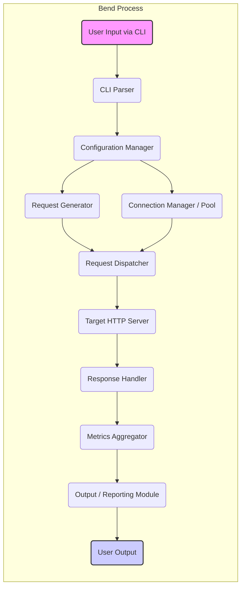

# Project Design Document: Bend - High-Performance HTTP Benchmarking Tool

**Version:** 1.1
**Date:** October 26, 2023
**Author:** AI Software Architect

## 1. Introduction

This document provides an enhanced and detailed design of the `bend` project, a high-performance HTTP benchmarking tool available at [https://github.com/higherorderco/bend](https://github.com/higherorderco/bend). This document aims to provide a clear and comprehensive understanding of the system's architecture, components, and data flow, serving as a robust foundation for subsequent threat modeling activities and further development.

## 2. Project Overview

`bend` is a command-line tool engineered for generating substantial load against a target HTTP server. It empowers users to meticulously configure various parameters, including the number of concurrent connections, the total number of requests to be sent, specific HTTP methods (GET, POST, PUT, DELETE, etc.), custom headers, and request bodies. The tool diligently measures and reports crucial performance metrics, such as individual request latency, overall throughput achieved, and the frequency of error responses encountered.

## 3. System Architecture

The fundamental architecture of `bend` is structured around several distinct components that collaborate to execute the benchmarking process.

### 3.1. Components

*   **Command Line Interface (CLI) Parser:**
    *   **Responsibility:**  The initial point of interaction, responsible for interpreting command-line arguments supplied by the user.
    *   **Technology:** Leverages robust libraries like `spf13/cobra` within the Go ecosystem for efficient argument parsing and validation.
    *   **Functionality:**
        *   Extracts critical configuration parameters, including the target URL, the desired number of requests, the level of concurrency, the HTTP method to employ, any custom headers, and the content of the request body (if applicable).
        *   Interprets and processes various flags and options that allow users to fine-tune the benchmarking process according to their specific needs.
        *   Provides user-friendly error messages for invalid or missing arguments.

*   **Configuration Manager:**
    *   **Responsibility:** Takes the raw, parsed command-line arguments and transforms them into a structured, internal configuration object that the rest of the application can readily use.
    *   **Functionality:**
        *   Performs rigorous validation checks on the provided configuration values to ensure they are within acceptable ranges and of the correct type.
        *   Assigns default values to optional parameters if the user has not explicitly provided them, ensuring a functional baseline configuration.
        *   Guarantees that the final configuration is logically consistent and valid before allowing the benchmarking process to commence, preventing runtime errors due to misconfiguration.

*   **Request Generator:**
    *   **Responsibility:**  The engine that creates the individual HTTP requests that will be sent to the target server.
    *   **Functionality:**
        *   Constructs `http.Request` objects, the standard representation of HTTP requests in Go, populating them with the specified HTTP method, target URL, headers, and request body.
        *   May incorporate templating mechanisms or data generation techniques in more advanced scenarios to create dynamic and varied request bodies.
        *   Manages the creation of the total number of requests required for the benchmark, as defined in the configuration.

*   **Connection Manager / Pool:**
    *   **Responsibility:**  Efficiently manages a pool of concurrent HTTP connections to the target server, optimizing resource utilization and performance.
    *   **Technology:**  Utilizes Go's built-in `net/http` package, which provides robust mechanisms for handling HTTP connections.
    *   **Functionality:**
        *   Establishes and maintains the specified number of concurrent connections, allowing for parallel request processing.
        *   Implements connection reuse strategies, such as HTTP keep-alive, to minimize the overhead of establishing new connections for each request.
        *   May incorporate logic for connection health checks and automatic reconnection in case of failures.

*   **Request Dispatcher:**
    *   **Responsibility:**  Orchestrates the sending of generated requests to the available connections within the connection pool.
    *   **Functionality:**
        *   Distributes the workload evenly across the established connections, ensuring that the target server receives the intended level of concurrent requests.
        *   Manages the rate at which requests are dispatched to prevent overwhelming either the target server or the benchmarking tool itself.
        *   May implement queuing or buffering mechanisms to handle scenarios where request generation outpaces connection availability.

*   **Response Handler:**
    *   **Responsibility:**  Receives and processes the HTTP responses returned by the target server in response to the sent requests.
    *   **Functionality:**
        *   Extracts and records key information from each response, including the HTTP status code, response headers, and the response body (if required for analysis).
        *   Calculates the latency for each individual request, measuring the time elapsed between sending the request and receiving the complete response.
        *   Implements error handling to gracefully manage potential issues during request processing, such as network errors, timeouts, or unexpected response formats.

*   **Metrics Aggregator:**
    *   **Responsibility:**  Collects, consolidates, and analyzes the performance data gathered by the Response Handler.
    *   **Functionality:**
        *   Calculates a range of statistical metrics that provide insights into the target server's performance under load, including:
            *   Total number of requests sent.
            *   Number of requests that were successfully processed.
            *   Number of requests that resulted in errors.
            *   Average, minimum, and maximum request latency observed.
            *   Request throughput, typically measured in requests per second.
            *   Error rate, expressed as a percentage of failed requests.
            *   Percentile latencies (e.g., the 50th, 90th, and 99th percentile), providing a more detailed view of latency distribution.

*   **Output/Reporting Module:**
    *   **Responsibility:**  Formats and presents the aggregated performance metrics to the user in a clear and understandable manner.
    *   **Functionality:**
        *   Typically outputs the results to the console, providing immediate feedback to the user.
        *   May offer options to output the results in various formats, such as JSON or CSV, to facilitate further analysis or integration with other tools.
        *   Displays key performance indicators prominently, allowing users to quickly assess the results of the benchmark.

### 3.2. Data Flow Diagram

### 3.3. Deployment Architecture

`bend` is primarily intended as a command-line tool that is executed directly on a user's local machine or within a server environment. Its deployment is generally straightforward.

*   **Execution Environment:**  Typically launched from a terminal or shell prompt.
*   **Prerequisites:** Requires the Go runtime environment to be installed on the system. It also relies on external Go libraries, which are managed and downloaded using Go modules.
*   **Network Requirements:** Necessitates network connectivity to the specific target HTTP server that is being benchmarked. Firewalls or network configurations might need adjustments to allow communication.
*   **Resource Considerations:**  The amount of system resources (CPU, memory, network bandwidth) consumed by `bend` will dynamically scale based on the configured concurrency level and the volume of load being generated. Users should be mindful of these resource implications, especially when running benchmarks with high concurrency.

## 4. Detailed Component Design

This section delves deeper into the design specifics of several key components within `bend`.

### 4.1. CLI Parser

*   **Technology:** Employs the `spf13/cobra` library, a popular choice in the Go community for building command-line interfaces.
*   **Functionality:**
    *   Defines the structure of the command, including potential subcommands (though currently `bend` is a single command).
    *   Defines individual flags (e.g., `-url`, `-n`, `-c`, `-m`, `-H`, `-body`, `-timeout`) with clearly associated data types (string, integer, duration) and descriptive explanations for user understanding.
    *   Implements basic validation rules for input values, such as ensuring that the number of requests and concurrency levels are positive integers.
    *   Automatically generates helpful text for usage instructions and available flags, enhancing the user experience.
*   **Example Flags and their Purpose:**
    *   `-url`: Specifies the complete URL of the target HTTP endpoint to be benchmarked.
    *   `-n`:  Determines the total number of HTTP requests that `bend` will send to the target server during the benchmark.
    *   `-c`:  Sets the level of concurrency, defining the number of simultaneous HTTP connections that `bend` will establish and use.
    *   `-m`:  Allows the user to specify the HTTP method to be used for the requests (e.g., GET, POST, PUT, DELETE). Defaults to GET if not provided.
    *   `-H`: Enables the user to include custom HTTP headers in the requests, provided in a key:value format. Multiple headers can be specified.
    *   `-body`:  Used to provide the request body for HTTP methods like POST or PUT. The content can be a string or a path to a file containing the body.
    *   `-timeout`:  Sets a timeout duration for each individual HTTP request, preventing the benchmark from hanging indefinitely due to unresponsive servers.

### 4.2. Configuration Manager

*   **Data Structures:**  Utilizes a well-defined Go struct (likely named `Config` or similar) to encapsulate all the parsed configuration parameters in a structured manner.
*   **Validation Logic:**
    *   Performs comprehensive validation to ensure the target URL is a syntactically valid URL.
    *   Verifies that numerical parameters like the number of requests and concurrency level are indeed positive integers, preventing logical errors.
    *   Checks the validity of the provided HTTP method against a predefined set of allowed methods.
    *   Parses and validates custom headers to ensure they are in the correct format (key:value).
    *   Includes error handling mechanisms to gracefully manage situations where configuration parsing fails, providing informative error messages to the user.
*   **Default Values:**  Assigns sensible default values for optional parameters to simplify usage for basic benchmarking scenarios. For instance, the default HTTP method is often GET, and a default timeout value might be set.

### 4.3. Request Generator

*   **Request Creation:** Leverages the `net/http` package's functionalities to instantiate `http.Request` objects.
*   **Header Handling:**  Adds essential default headers, such as `User-Agent` (identifying `bend`), and incorporates any custom headers specified by the user through the CLI.
*   **Body Handling:**  Sets the request body based on the user's input. This might involve directly embedding a string provided via the `-body` flag or reading the content from a file if a file path is provided. Future enhancements could include more sophisticated body generation techniques.
*   **Concurrency Independence:** The Request Generator focuses solely on creating the requests. The actual concurrency and dispatching are handled by other components, ensuring a separation of concerns.

### 4.4. Connection Manager / Pool

*   **Implementation:** Might utilize Go's `sync.Pool` for efficient management of `http.Client` instances, or employ a custom-built pool with more fine-grained control.
*   **Connection Reuse (Keep-Alive):**  Crucially leverages HTTP keep-alive to maintain persistent connections, significantly reducing the overhead of establishing new TCP connections for subsequent requests to the same server.
*   **Concurrency Enforcement:**  Strictly enforces the configured concurrency limit, ensuring that the number of active, concurrent connections does not exceed the specified value. This is vital for controlling the load applied to the target server.
*   **Error and Failure Handling:** Incorporates mechanisms to detect and handle potential connection-related errors. This might involve retrying failed connection attempts or logging connection issues for debugging purposes.

### 4.5. Response Handler

*   **Response Processing:**  Reads the incoming HTTP response, extracting the status code (e.g., 200 OK, 404 Not Found), headers, and the response body (if the body content is needed for specific analysis or validation, though often it's just discarded for performance benchmarking).
*   **Latency Measurement:**  Accurately measures the time elapsed for each request-response cycle. This typically involves recording the timestamp just before sending the request and again immediately upon receiving the full response. The difference yields the latency.
*   **Error Identification:**  Categorizes and counts HTTP errors based on the response status codes (e.g., 4xx and 5xx status codes) and also tracks network-level errors that might occur during the request.
*   **Data Buffering (Potentially):** Might employ buffering techniques to efficiently handle the incoming response data, especially for larger responses.

### 4.6. Metrics Aggregator

*   **Data Structures:**  Uses variables (often atomic counters for thread safety in concurrent scenarios) to accumulate counts of successful requests, failed requests, and the sum of latencies. Data structures like slices or maps might be used to store individual latencies for percentile calculations.
*   **Statistical Calculations:** Implements the mathematical logic to calculate the various performance metrics: average latency (total latency / number of successful requests), minimum and maximum latencies observed, and percentile latencies (requiring sorting or specialized algorithms).
*   **Throughput Calculation:**  Calculates the request throughput by dividing the total number of successful requests by the total duration of the benchmarking run.
*   **Error Rate Calculation:** Determines the error rate by dividing the number of failed requests by the total number of requests attempted.

### 4.7. Output/Reporting Module

*   **Console Output:**  Utilizes Go's `fmt` package to format and present the calculated metrics in a user-friendly, readable format on the console.
*   **Formatting and Clarity:**  Emphasizes clear labeling of metrics (e.g., "Average Latency:", "Requests per Second:") and uses appropriate units.
*   **Future Output Formats:**  Designed with potential extensibility in mind to support outputting data in structured formats like JSON (for machine readability and integration with other tools) or CSV (for spreadsheet analysis).

## 5. Security Considerations (More Detailed)

This section expands on the initial security considerations, providing more specific examples and potential attack vectors.

*   **Input Validation Vulnerabilities:**
    *   **Command Injection:** If command-line arguments are not properly sanitized, malicious users could inject arbitrary commands into the system. For example, a crafted URL or header value might be able to execute shell commands.
    *   **Integer Overflow/Underflow:**  Insufficient validation of numerical inputs (like the number of requests or concurrency) could lead to integer overflows or underflows, potentially causing unexpected behavior or crashes.
*   **Resource Exhaustion Attacks:**
    *   **Denial of Service (DoS) against the Target:** While `bend`'s purpose is to load test, misconfiguration or malicious use could unintentionally cause a DoS attack against the target server.
    *   **Resource Exhaustion of the Benchmarking Host:**  Setting extremely high concurrency levels could exhaust the resources (CPU, memory, network) of the machine running `bend`, impacting its performance and potentially other applications on the same host.
*   **Network Security Weaknesses:**
    *   **Lack of TLS/SSL Verification:** If `bend` does not properly verify TLS/SSL certificates of the target server, it could be vulnerable to man-in-the-middle attacks.
    *   **Exposure of Sensitive Data:** If request bodies or headers contain sensitive information and the connection to the target is not secure (HTTPS), this data could be intercepted.
*   **Dependency Vulnerabilities:**
    *   **Using Outdated Libraries:**  If `bend` relies on outdated versions of its dependencies (e.g., `cobra`, HTTP libraries), it could inherit known security vulnerabilities present in those libraries. Regular dependency updates are crucial.
*   **Information Disclosure:**
    *   **Verbose Error Messages:** Overly detailed error messages could reveal sensitive information about the internal workings of `bend` or the target server.
    *   **Accidental Logging of Sensitive Data:**  Care must be taken to avoid logging sensitive information contained in request headers or bodies.

## 6. Assumptions and Constraints

*   **Valid Network Configuration:**  Assumes that the network environment is correctly configured, allowing communication between the machine running `bend` and the target server. This includes DNS resolution and routing.
*   **Target Server Functionality:**  Assumes that the target HTTP server is functioning correctly and will respond to requests in a predictable manner.
*   **Resource Availability on Benchmarking Host:** Assumes the machine running `bend` has sufficient CPU, memory, and network bandwidth to generate the desired load without significant performance degradation of the benchmarking process itself.
*   **Accuracy Limitations:**  Acknowledges that the accuracy of the reported metrics can be influenced by various factors, including network latency, server load, and the stability of both the benchmarking host and the target server.
*   **Scope of Functionality:**  Constraints the current functionality to basic HTTP benchmarking. Advanced features like authentication handling, complex request body generation, or distributed benchmarking are considered out of scope for the current design.

## 7. Future Enhancements

*   **Support for Additional Output Formats:** Implementing support for outputting results in formats like JSON and CSV to facilitate integration with other analysis and reporting tools.
*   **Advanced Request Body Generation:**  Adding capabilities for generating more complex and dynamic request bodies, potentially including reading data from external files, using templates, or generating randomized data.
*   **Support for HTTP/2 and HTTP/3:** Enhancing the tool to support newer HTTP protocols like HTTP/2 and the upcoming HTTP/3, allowing for benchmarking of modern web services.
*   **Integration with Monitoring and Logging Systems:**  Adding options to export benchmark results to popular monitoring systems (e.g., Prometheus, Grafana) or logging platforms for real-time analysis and historical tracking.
*   **More Sophisticated Error Handling and Retry Mechanisms:** Implementing more robust error handling strategies, including configurable retry policies for failed requests.
*   **Authentication and Authorization Support:** Adding features to handle different authentication mechanisms (e.g., Basic Auth, OAuth) to benchmark protected endpoints.
*   **Distributed Benchmarking:**  Exploring the possibility of distributing the benchmarking load across multiple machines to simulate even higher traffic volumes.
*   **Scripting Capabilities:**  Allowing users to define more complex benchmarking scenarios through scripting or configuration files.

This improved design document provides a more detailed and comprehensive understanding of the `bend` project. It serves as a valuable resource for threat modeling, further development, and understanding the inner workings of this high-performance HTTP benchmarking tool.