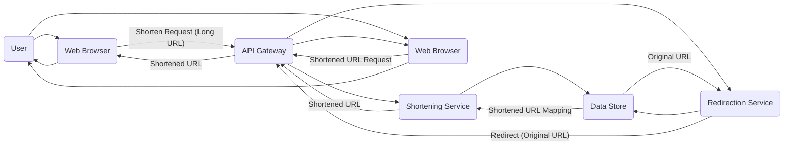

## Project Design Document: Bend - URL Shortener

**Version:** 1.1
**Date:** October 26, 2023
**Prepared By:** Gemini (AI Architecture Expert)

### 1. Introduction

This document details the design of "Bend," a URL shortening service based on the project available at [https://github.com/higherorderco/bend](https://github.com/higherorderco/bend). This document aims to provide a clear understanding of the system's architecture, its constituent components, and the flow of data within it. This understanding is crucial for conducting effective threat modeling activities later in the development lifecycle.

### 2. Goals and Objectives

The primary objectives of the Bend project are:

*   **URL Abbreviation:** To offer a service that transforms long URLs into shorter, more easily shareable links.
*   **Redirection Service:** To seamlessly redirect users from the shortened URL to the original, longer URL.
*   **Usage Analytics (Potential):** To potentially gather basic data on the usage of shortened links, such as the number of clicks.
*   **Scalability and Reliability:** To build a system capable of handling a significant volume of requests and maintaining consistent availability.

### 3. System Architecture

Bend employs a standard web application architecture, separating concerns for clarity and maintainability.

#### 3.1. High-Level Architecture



#### 3.2. Detailed Architecture

```mermaid
graph LR
    subgraph "Client Interaction"
        UA["User"]
        UB["Web Browser"]
    end
    subgraph "Entry Point"
        AGW["API Gateway (e.g., Nginx, Cloudflare, AWS API Gateway)"]
    end
    subgraph "Core Logic - Shortening"
        SS["Shortening Service (Application Logic - e.g., Python Flask/Django)"]
    end
    subgraph "Core Logic - Redirection"
        RS["Redirection Service (Application Logic - e.g., Python Flask/Django)"]
    end
    subgraph "Data Persistence"
        DS["Data Store (e.g., PostgreSQL, Redis, MongoDB)"]
    end
    subgraph "Performance Optimization (Optional)"
        CL["Caching Layer (e.g., Redis, Memcached)"]
    end
    subgraph "Data Analysis (Optional)"
        AS["Analytics Service (e.g., Kafka, Segment, Custom Implementation)"]
    end

    UB --> AGW -- "POST /shorten - { longUrl: ... }" --> SS
    SS --> DS -- "Store (shortCode, longUrl)"
    DS -- "shortCode" --> SS
    SS -- "Shortened URL" --> AGW
    AGW --> UB

    UB -- "GET /{shortCode}" --> AGW
    AGW -- "Extract shortCode" --> RS
    RS --> CL -- "Lookup shortCode"
    CL -- "longUrl (if found)" --> RS
    RS -- "Lookup shortCode (if not in cache)" --> DS
    DS -- "longUrl" --> RS
    RS -- "Store (shortCode, longUrl) in Cache" --> CL
    RS -- "HTTP Redirect (301/302) to longUrl" --> AGW
    AGW --> UB

    SS --> AS -- "Publish event: URL shortened"
    RS --> AS -- "Publish event: URL redirected"
```

### 4. Data Flow

The Bend system manages two primary data flows: the process of shortening a URL and the process of redirecting a user from a shortened URL to its original target.

*   **URL Shortening Process:**
    1. A user initiates a request to shorten a long URL through their web browser.
    2. The web browser sends an HTTP POST request containing the long URL to the API Gateway's `/shorten` endpoint.
    3. The API Gateway routes this request to the Shortening Service.
    4. The Shortening Service receives the long URL and generates a unique short code. This might involve techniques like base62 encoding of an incrementing ID or hashing.
    5. The Shortening Service persists the mapping between the generated short code and the original long URL in the Data Store.
    6. The Shortening Service returns the newly generated short code (as part of the complete shortened URL) back to the API Gateway.
    7. The API Gateway sends the shortened URL back to the user's web browser.

*   **URL Redirection Process:**
    1. A user clicks on a shortened URL in their web browser.
    2. The web browser sends an HTTP GET request to the API Gateway, with the short code included in the URL path (e.g., `bend.example.com/{shortCode}`).
    3. The API Gateway routes this request to the Redirection Service.
    4. The Redirection Service extracts the short code from the URL.
    5. The Redirection Service first checks the Caching Layer to see if the mapping for this short code is already present.
    6. If the mapping is found in the cache, the Redirection Service retrieves the original long URL.
    7. If the mapping is not found in the cache, the Redirection Service queries the Data Store to retrieve the original long URL associated with the short code.
    8. Once the original long URL is retrieved from the Data Store, the Redirection Service (optionally) updates the Caching Layer with this mapping for future requests.
    9. The Redirection Service sends an HTTP redirect response (either a 301 "Permanent Redirect" or a 302 "Found" redirect) back to the API Gateway, with the `Location` header set to the original long URL.
    10. The API Gateway forwards this redirect response to the user's web browser.
    11. The user's web browser automatically navigates to the original long URL specified in the redirect response.
    12. (Optional) The Redirection Service publishes an event to the Analytics Service indicating that a redirection occurred.

### 5. Key Components

*   **User:** The individual who interacts with the Bend service through a web browser.
*   **Web Browser:** The application used by the user to access and interact with the Bend service.
*   **API Gateway:**  The single entry point for all external requests to the Bend service. It handles tasks such as request routing, rate limiting to prevent abuse, and potentially authentication and authorization. Examples include Nginx, HAProxy, or cloud-managed services like AWS API Gateway or Cloudflare.
*   **Shortening Service:**  The core component responsible for generating unique short codes and managing the storage of the mapping between short codes and their corresponding long URLs. Key aspects include:
    *   **Short Code Generation Logic:**  The algorithm used to create unique and relatively short identifiers. Common techniques include base62 encoding of sequential IDs or using hash functions.
    *   **Input Validation:**  Ensuring that the submitted long URL is in a valid format.
*   **Redirection Service:**  The component responsible for receiving requests for shortened URLs, looking up the corresponding original long URL, and issuing the appropriate HTTP redirect response. Key aspects include:
    *   **Cache Lookup Mechanism:**  Efficiently querying the Caching Layer for frequently accessed mappings.
    *   **Data Store Query Logic:**  Retrieving the mapping from the Data Store when it's not found in the cache.
*   **Data Store:**  The persistent storage mechanism for the mappings between short codes and long URLs. Suitable options include:
    *   **Relational Databases (e.g., PostgreSQL, MySQL):** Offer strong consistency and transactional capabilities.
    *   **Key-Value Stores (e.g., Redis):** Provide fast read/write operations, suitable for high-traffic scenarios.
    *   **Document Databases (e.g., MongoDB):** Offer flexibility in data structure.
*   **Caching Layer (Optional):**  An in-memory data store used to improve the performance of the redirection process by storing frequently accessed short code to long URL mappings. This reduces the load on the Data Store. Common choices include Redis or Memcached.
*   **Analytics Service (Optional):**  A component responsible for collecting and processing data related to the usage of shortened links, such as the number of clicks, timestamps, and potentially geographic information. This could involve a message queue (e.g., Kafka) and a data processing pipeline.

### 6. Security Considerations (Preliminary)

This section outlines initial security considerations for the Bend service. A dedicated threat modeling exercise will provide a more in-depth analysis.

*   **Input Validation:**  Thoroughly validate and sanitize user-provided long URLs to prevent injection attacks such as Cross-Site Scripting (XSS) or Server-Side Request Forgery (SSRF).
*   **Short Code Generation Security:** Ensure the short code generation algorithm produces codes that are difficult to guess or predict, preventing malicious users from enumerating existing short links or creating predictable ones. Consider using sufficiently long and random short codes.
*   **Rate Limiting:** Implement rate limiting on the shortening endpoint to prevent abuse, such as excessive link creation by a single user or bot, which could lead to resource exhaustion.
*   **Redirection Security:**  Carefully handle redirects to prevent open redirect vulnerabilities. Ensure that the redirection logic only redirects to the intended target URL and not to arbitrary external sites controlled by attackers.
*   **Data Store Security:** Secure the Data Store by implementing appropriate access controls, encryption at rest and in transit, and regular backups.
*   **API Gateway Security:** Leverage the API Gateway's features for security, such as authentication and authorization if user accounts are implemented, and protection against common web attacks.
*   **HTTPS Enforcement:**  Enforce HTTPS for all communication to protect data in transit.
*   **Regular Security Audits:** Conduct periodic security audits and penetration testing to identify and address potential vulnerabilities.

### 7. Deployment

The Bend service can be deployed across various environments, with cloud platforms offering significant advantages in terms of scalability and management.

*   **Cloud Platforms (e.g., AWS, Azure, GCP):**
    *   **Compute:** Utilize services like AWS EC2, Azure Virtual Machines, or Google Compute Engine for hosting the Shortening and Redirection Services. Consider containerization with Docker and orchestration with Kubernetes (EKS, AKS, GKE).
    *   **API Gateway:** Leverage managed API Gateway services like AWS API Gateway, Azure API Management, or Google Cloud API Gateway.
    *   **Data Store:** Utilize managed database services like Amazon RDS (PostgreSQL, MySQL), Azure Database for PostgreSQL, Google Cloud SQL, or in-memory data stores like Amazon ElastiCache or Azure Cache for Redis.
    *   **Caching:** Employ managed caching services like Amazon ElastiCache or Azure Cache for Redis.
    *   **Load Balancing:** Use managed load balancers like AWS ELB, Azure Load Balancer, or Google Cloud Load Balancing to distribute traffic across multiple instances of the services.
    *   **CDN (Content Delivery Network):**  Consider using a CDN like Cloudflare or AWS CloudFront to cache responses and improve performance for geographically distributed users.
*   **Containerized Environments (e.g., Docker, Kubernetes):** Package the Shortening and Redirection Services into Docker containers and orchestrate them using Kubernetes for scalability and resilience.
*   **Serverless Architectures (e.g., AWS Lambda, Azure Functions, Google Cloud Functions):**  Potentially suitable for the Redirection Service, which is often stateless and can scale independently.

Key deployment considerations include:

*   **Scalability:** Design the system to handle a large volume of requests by horizontally scaling the Shortening and Redirection Services.
*   **High Availability:** Ensure the service remains available even if some components fail by implementing redundancy across different availability zones or regions.
*   **Monitoring and Logging:** Implement comprehensive monitoring and logging using tools like Prometheus, Grafana, or cloud-specific monitoring services to track performance, identify errors, and gain insights into usage patterns.
*   **Infrastructure as Code (IaC):** Utilize tools like Terraform or CloudFormation to manage and provision infrastructure in an automated and repeatable manner.

### 8. Future Considerations

*   **Custom Short Codes:** Allow users to specify their desired short codes, provided they are unique and not already taken. This requires additional validation and management logic.
*   **Link Expiration:** Implement the ability to set expiration dates for shortened links, after which they will no longer redirect to the original URL.
*   **Link Editing/Updating:**  Allow authenticated users to update the target URL associated with a shortened link. This requires careful consideration of security implications and versioning.
*   **Advanced Analytics:** Provide more detailed analytics, such as geographic location of clicks, referring websites, device information, and click timestamps.
*   **User Accounts and Management:** Implement user accounts to allow users to manage their created short links, view analytics, and potentially customize link behavior.
*   **API Access Control:** Implement API keys or other authentication mechanisms to control access to the shortening API for programmatic use.

This improved design document provides a more detailed and structured overview of the Bend URL shortening service, offering a solid foundation for subsequent threat modeling and development efforts.