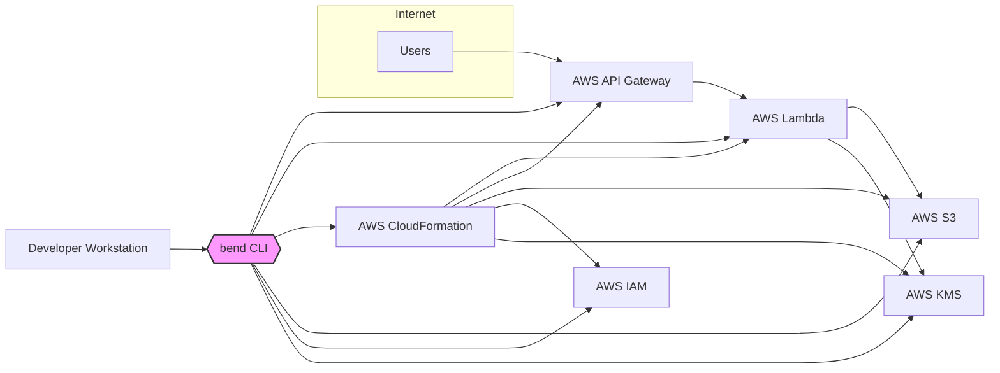
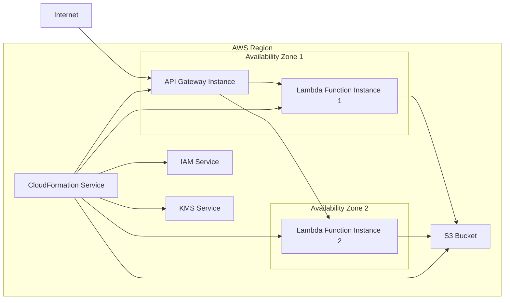
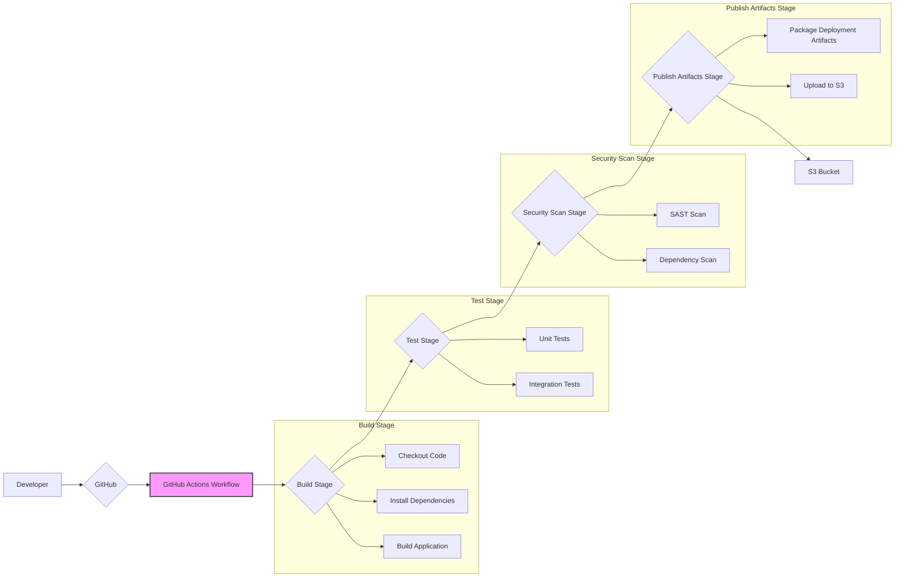

# BUSINESS POSTURE

This project, named 'bend', aims to simplify the development and deployment of serverless applications, specifically targeting AWS Lambda and API Gateway. It provides a framework and tooling to streamline the serverless workflow, potentially increasing developer productivity and reducing the complexity associated with serverless deployments.

Business Priorities and Goals:
- Accelerate serverless application development and deployment cycles.
- Reduce operational overhead associated with serverless infrastructure management.
- Improve developer experience in building and managing serverless applications.
- Enable faster iteration and innovation in serverless environments.
- Potentially reduce infrastructure costs by optimizing serverless deployments.

Business Risks:
- Vendor lock-in to the 'bend' framework, if it becomes tightly coupled with specific versions or features.
- Security vulnerabilities within the 'bend' framework itself could impact all applications built using it.
- Operational risks if the framework introduces complexities or dependencies that are not well understood or documented.
- Adoption risk if developers find the framework too opinionated or difficult to learn.
- Compatibility issues with future AWS service updates or changes in serverless best practices.

# SECURITY POSTURE

Existing Security Controls:
- security control: Secure Software Development Lifecycle (SSDLC) - assumed to be in place, including code reviews and testing, although specific details are not provided in the repository.
- security control: Infrastructure as Code (IaC) - likely used for defining and deploying serverless infrastructure, promoting consistency and auditability.
- security control: Principle of Least Privilege - assumed to be followed in IAM role configurations for Lambda functions and API Gateway.
- security control: Regular dependency updates - assumed to be practiced to address known vulnerabilities in Node.js dependencies.
- security control: Static code analysis - likely used by developers during development, although not explicitly enforced by the project.
- accepted risk: Reliance on community contributions - potential risk of vulnerabilities introduced by external contributors if contributions are not thoroughly vetted.
- accepted risk: Open-source nature - publicly available code might be scrutinized by malicious actors seeking vulnerabilities.

Recommended Security Controls:
- security control: Automated Security Scanning in CI/CD pipeline - Implement SAST and DAST tools to automatically detect vulnerabilities in code and configurations during the build and deployment process.
- security control: Dependency vulnerability scanning - Integrate tools to automatically scan dependencies for known vulnerabilities and alert developers.
- security control: Secrets Management - Implement a secure secrets management solution to avoid hardcoding sensitive information in code or configurations.
- security control: Security training for developers - Provide developers with security training focused on serverless security best practices and common vulnerabilities.
- security control: Penetration testing - Conduct regular penetration testing to identify vulnerabilities in deployed applications and infrastructure.

Security Requirements:
- Authentication:
  - requirement: API Gateway should enforce authentication for all external API endpoints.
  - requirement: Internal components should authenticate each other using secure mechanisms if direct communication is necessary.
- Authorization:
  - requirement: Implement fine-grained authorization controls to ensure users and services only have access to the resources they need.
  - requirement: Lambda functions should operate with the least privilege necessary to perform their tasks, enforced through IAM roles.
- Input Validation:
  - requirement: All external inputs to API Gateway and Lambda functions must be thoroughly validated to prevent injection attacks (e.g., SQL injection, command injection, cross-site scripting).
  - requirement: Input validation should be performed at multiple layers, both at the API Gateway level and within Lambda functions.
- Cryptography:
  - requirement: Sensitive data at rest should be encrypted using appropriate encryption mechanisms (e.g., KMS for Lambda environment variables, S3 encryption for data storage).
  - requirement: Data in transit should be encrypted using HTTPS for API Gateway and TLS for internal communications where applicable.
  - requirement: Securely manage and rotate cryptographic keys.

# DESIGN

## C4 CONTEXT



Context Diagram Elements:

- Element:
  - Name: Users
  - Type: Person
  - Description: End-users who will interact with the applications deployed using 'bend'.
  - Responsibilities: Consume the services exposed by the serverless applications.
  - Security controls: Authentication and authorization enforced by API Gateway.

- Element:
  - Name: "bend" CLI
  - Type: Software System
  - Description: Command-line interface tool provided by the 'bend' framework, used by developers to build, deploy, and manage serverless applications.
  - Responsibilities:  Orchestrate the deployment process, interact with AWS services, and manage application configurations.
  - Security controls:  Role-Based Access Control (RBAC) for CLI access (if applicable), secure storage of AWS credentials on developer workstations.

- Element:
  - Name: AWS API Gateway
  - Type: Software System
  - Description: AWS service that acts as the entry point for external requests to the serverless applications. Manages API routing, authentication, and authorization.
  - Responsibilities:  Expose APIs, handle request routing, enforce authentication and authorization, rate limiting, and API management.
  - Security controls:  API Gateway authentication (e.g., API keys, IAM roles, Cognito), authorization policies, WAF integration, TLS encryption.

- Element:
  - Name: AWS Lambda
  - Type: Software System
  - Description: AWS serverless compute service that executes the application code in response to events or API requests.
  - Responsibilities:  Execute application logic, process requests, interact with other AWS services, and return responses.
  - Security controls:  IAM roles for function permissions, environment variable encryption (KMS), input validation within function code, secure coding practices.

- Element:
  - Name: AWS CloudFormation
  - Type: Software System
  - Description: AWS Infrastructure-as-Code service used by 'bend' to provision and manage AWS resources required for serverless applications.
  - Responsibilities:  Automate infrastructure deployment, manage resource dependencies, and ensure consistent infrastructure configurations.
  - Security controls:  IAM roles for CloudFormation execution, secure storage of CloudFormation templates, version control of templates.

- Element:
  - Name: AWS S3
  - Type: Software System
  - Description: AWS Simple Storage Service used for storing application artifacts, deployment packages, and potentially application data.
  - Responsibilities:  Store deployment packages, serve static content, and provide general-purpose object storage.
  - Security controls:  S3 bucket policies, access control lists (ACLs), encryption at rest (SSE-S3, SSE-KMS), encryption in transit (HTTPS).

- Element:
  - Name: AWS IAM
  - Type: Software System
  - Description: AWS Identity and Access Management service used to manage access to AWS resources for 'bend' CLI, API Gateway, Lambda functions, and other services.
  - Responsibilities:  Manage user identities, roles, and permissions, enforce the principle of least privilege, and control access to AWS resources.
  - Security controls:  IAM policies, roles, groups, multi-factor authentication (MFA) for administrative access.

- Element:
  - Name: AWS KMS
  - Type: Software System
  - Description: AWS Key Management Service used for managing encryption keys and encrypting sensitive data, such as environment variables and data at rest in S3.
  - Responsibilities:  Generate, store, and manage encryption keys, provide encryption and decryption services.
  - Security controls:  Key policies, access control to KMS keys, audit logging of key usage.

- Element:
  - Name: Developer Workstation
  - Type: Person Location
  - Description:  Developer's local machine where they use the 'bend' CLI to develop and deploy applications.
  - Responsibilities:  Develop application code, configure 'bend' projects, and initiate deployments.
  - Security controls:  Local workstation security practices, secure storage of AWS credentials, access control to development tools and repositories.

## C4 CONTAINER

```mermaid
flowchart LR
    subgraph Internet
        A[Users]
    end
    subgraph Developer Workstation
        B{{"bend" CLI Container"}}
    end
    subgraph AWS Cloud
        subgraph AWS API Gateway Container
            C[API Gateway Endpoint]
        end
        subgraph AWS Lambda Container
            D[Lambda Function]
        end
        subgraph AWS S3 Container
            E[S3 Bucket]
        end
        subgraph AWS CloudFormation Container
            F[CloudFormation Stack]
        end
        subgraph AWS IAM Container
            G[IAM Roles & Policies]
        end
        subgraph AWS KMS Container
            H[KMS Keys]
        end
    end

    A --> C
    B --> C
    B --> D
    B --> F
    B --> E
    B --> G
    B --> H
    C --> D
    D --> E
    D --> H
    F --> D & C & E & G & H

    style B fill:#f9f,stroke:#333,stroke-width:2px
```

Container Diagram Elements:

- Element:
  - Name: "bend" CLI Container
  - Type: Container
  - Description:  Containerized application of the 'bend' CLI, encapsulating the command-line tool and its dependencies.
  - Responsibilities:  Provide a consistent and isolated environment for developers to use the 'bend' CLI, manage dependencies, and simplify installation.
  - Security controls:  Container image scanning for vulnerabilities, secure distribution of container image, access control to container registry.

- Element:
  - Name: API Gateway Endpoint
  - Type: Container
  - Description:  Specific API endpoint configured within AWS API Gateway to expose serverless application functionalities.
  - Responsibilities:  Receive and route incoming API requests, handle authentication and authorization, and manage API traffic.
  - Security controls:  API Gateway authentication methods, authorization policies, input validation, rate limiting, WAF integration, TLS encryption.

- Element:
  - Name: Lambda Function
  - Type: Container
  - Description:  Individual AWS Lambda function containing the application code and runtime environment.
  - Responsibilities:  Execute application logic, process requests from API Gateway or other event sources, and interact with other AWS services.
  - Security controls:  IAM roles for function permissions, environment variable encryption (KMS), input validation within function code, secure coding practices, dependency vulnerability scanning.

- Element:
  - Name: S3 Bucket
  - Type: Container
  - Description:  AWS S3 bucket used for storing application artifacts, deployment packages, and potentially application data.
  - Responsibilities:  Provide scalable and durable object storage for application-related data.
  - Security controls:  S3 bucket policies, access control lists (ACLs), encryption at rest (SSE-S3, SSE-KMS), encryption in transit (HTTPS), versioning, logging.

- Element:
  - Name: CloudFormation Stack
  - Type: Container
  - Description:  AWS CloudFormation stack used to define and manage the infrastructure resources for the serverless application.
  - Responsibilities:  Automate infrastructure provisioning, manage resource dependencies, and ensure consistent infrastructure configurations.
  - Security controls:  IAM roles for CloudFormation execution, secure storage of CloudFormation templates, version control of templates, drift detection.

- Element:
  - Name: IAM Roles & Policies
  - Type: Container
  - Description:  IAM roles and policies defined to grant necessary permissions to different components of the serverless application.
  - Responsibilities:  Enforce the principle of least privilege, control access to AWS resources, and manage identities and permissions.
  - Security controls:  Well-defined IAM policies, regular review of IAM roles and policies, principle of least privilege enforcement, MFA for administrative access.

- Element:
  - Name: KMS Keys
  - Type: Container
  - Description:  KMS keys used to encrypt sensitive data, such as environment variables and data at rest in S3.
  - Responsibilities:  Protect sensitive data through encryption, manage key lifecycle, and provide key access control.
  - Security controls:  Key policies, access control to KMS keys, key rotation, audit logging of key usage.

## DEPLOYMENT

Deployment Architecture: AWS Cloud



Deployment Diagram Elements:

- Element:
  - Name: API Gateway Instance
  - Type: Infrastructure
  - Description:  Instance of AWS API Gateway service deployed across multiple Availability Zones for high availability.
  - Responsibilities:  Handle API requests, routing, authentication, authorization, and traffic management.
  - Security controls:  AWS WAF, DDoS protection, TLS termination, API Gateway authentication and authorization features.

- Element:
  - Name: Lambda Function Instance 1 & 2
  - Type: Infrastructure
  - Description:  Multiple instances of the Lambda function deployed across different Availability Zones for scalability and fault tolerance.
  - Responsibilities:  Execute application code, process requests, and interact with other AWS services.
  - Security controls:  IAM roles, VPC networking (if applicable), function concurrency limits, resource quotas.

- Element:
  - Name: S3 Bucket
  - Type: Infrastructure
  - Description:  AWS S3 bucket providing storage for application artifacts and data, regionally resilient.
  - Responsibilities:  Store and serve application data, deployment packages, and static content.
  - Security controls:  S3 bucket policies, ACLs, encryption at rest (SSE-S3, SSE-KMS), encryption in transit (HTTPS), versioning, logging, cross-region replication (if needed).

- Element:
  - Name: CloudFormation Service
  - Type: AWS Service
  - Description:  AWS CloudFormation service managing the deployment and updates of the infrastructure stack.
  - Responsibilities:  Automate infrastructure provisioning and management, ensure consistent deployments.
  - Security controls:  IAM roles for CloudFormation, CloudTrail logging, template validation.

- Element:
  - Name: IAM Service
  - Type: AWS Service
  - Description:  AWS IAM service managing identities and access to AWS resources.
  - Responsibilities:  Authentication and authorization for AWS services and resources.
  - Security controls:  IAM policies, roles, groups, MFA, access keys management.

- Element:
  - Name: KMS Service
  - Type: AWS Service
  - Description:  AWS KMS service managing encryption keys for data at rest and in transit.
  - Responsibilities:  Key management, encryption and decryption services.
  - Security controls:  Key policies, access control to KMS keys, key rotation, audit logging.

## BUILD

Build Process: GitHub Actions based CI/CD



Build Process Description:

1. Developer commits and pushes code changes to the GitHub repository.
2. GitHub triggers a GitHub Actions workflow defined in the repository.
3. The workflow executes a series of stages:
    - Build Stage:
        - Checkout Code: Retrieves the latest code changes from the repository.
        - Install Dependencies: Installs necessary project dependencies (e.g., Node.js modules).
        - Build Application: Compiles and builds the application code.
    - Test Stage:
        - Unit Tests: Executes unit tests to verify the functionality of individual components.
        - Integration Tests: Runs integration tests to ensure different parts of the application work together correctly.
    - Security Scan Stage:
        - SAST Scan: Performs Static Application Security Testing to identify potential vulnerabilities in the source code.
        - Dependency Scan: Scans project dependencies for known vulnerabilities.
    - Publish Artifacts Stage:
        - Package Deployment Artifacts: Packages the built application and necessary deployment files into an artifact (e.g., ZIP file).
        - Upload to S3: Uploads the deployment artifact to an S3 bucket, making it ready for deployment.

Build Process Security Controls:
- security control: Secure GitHub repository - Access control to the repository, branch protection, code review process.
- security control: GitHub Actions secrets management - Securely store and manage secrets used in workflows (e.g., AWS credentials).
- security control: Workflow definition in code - Infrastructure as code approach for build and deployment pipelines, version controlled workflow definitions.
- security control: Automated testing - Unit and integration tests to catch functional defects early in the development cycle.
- security control: Static Application Security Testing (SAST) - Automated SAST tools integrated into the pipeline to identify code-level vulnerabilities.
- security control: Dependency vulnerability scanning - Automated scanning of dependencies to identify and alert on known vulnerabilities.
- security control: Artifact signing (optional) - Signing build artifacts to ensure integrity and authenticity.
- security control: Access control to S3 bucket - Restrict access to the S3 bucket where build artifacts are stored.

# RISK ASSESSMENT

Critical Business Processes:
- Deployment of serverless applications: The ability to reliably and securely deploy updates and new applications is critical for business agility and innovation.
- Availability of serverless applications: Ensuring the deployed applications are available and performant for end-users is crucial for business operations.
- Data processing within serverless applications: Secure and reliable processing of data by Lambda functions is essential for data integrity and business logic.

Data Sensitivity:
- Application code: Sensitive as it contains business logic and potential vulnerabilities. Confidentiality and integrity are important.
- Environment variables: May contain sensitive information like API keys, database credentials, etc. Confidentiality is critical.
- Application data (if stored in S3): Sensitivity depends on the application. Could be highly sensitive PII, financial data, etc. Confidentiality, integrity, and availability are important.
- Deployment artifacts: Less sensitive but integrity is important to ensure correct and secure deployments.
- Infrastructure configurations (CloudFormation templates): Sensitive as misconfigurations can lead to security vulnerabilities. Integrity and confidentiality are important.

# QUESTIONS & ASSUMPTIONS

Questions:
- What type of applications will be built using 'bend'? (e.g., public facing APIs, internal microservices, data processing pipelines). This will help refine security requirements and risk assessment.
- What is the expected data sensitivity of applications built with 'bend'? (e.g., PII, financial data, internal data). This will inform data protection requirements.
- What are the compliance requirements for applications built with 'bend'? (e.g., GDPR, HIPAA, PCI DSS). This will dictate specific security controls and compliance measures.
- What is the organization's risk appetite? (e.g., startup vs. Fortune 500). This will influence the prioritization of security controls.
- Are there existing security policies and standards that 'bend' needs to adhere to?

Assumptions:
- The 'bend' framework is intended for building and deploying serverless applications on AWS.
- Security is a concern for projects using 'bend', and threat modeling is a desired next step.
- Developers using 'bend' have some level of familiarity with AWS and serverless concepts.
- The target deployment environment is AWS Cloud.
- The build process utilizes GitHub Actions for CI/CD.
- The organization is looking for a balance between security and developer productivity when using 'bend'.