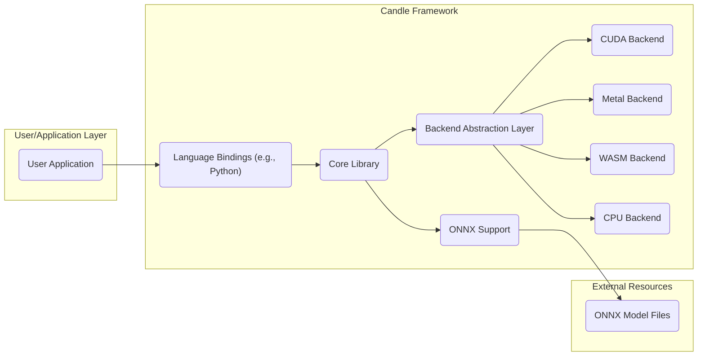
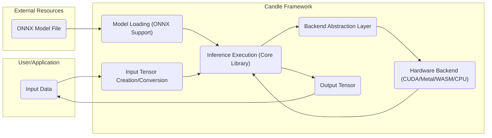

## Project Design Document: Candle - Minimalist ML Framework (Improved)

**1. Introduction**

This document provides an enhanced architectural design of the Candle project, a minimalist machine learning framework implemented in Rust. The primary objective is to offer a clear and detailed understanding of the system's architecture, components, and operational flow, specifically tailored for subsequent threat modeling activities. This document aims to be a comprehensive resource for security analysis.

**1.1. Project Overview**

Candle is engineered as a lightweight and highly efficient machine learning inference library. Its design prioritizes simplicity and performance, making it particularly suitable for resource-constrained environments. By leveraging the inherent safety and performance characteristics of Rust, Candle offers robust and fast inference capabilities with support for diverse hardware backends.

**1.2. Goals of this Document**

*   Provide a meticulously detailed outline of the architecture and constituent components of the Candle project.
*   Clearly articulate the flow of data within the system, highlighting key transformation points.
*   Identify and describe the core functionalities of Candle and their interdependencies.
*   Furnish a level of detail sufficient for conducting thorough and effective threat modeling exercises.
*   Serve as a central reference point for understanding the system's design from a security perspective.

**1.3. Scope**

This document concentrates on the fundamental architectural design of the Candle library and its principal functionalities relevant to inference. It includes in-depth descriptions of the core library, its interactions with various hardware backends, and the mechanisms for handling input and output data. The scope explicitly includes the loading and processing of ONNX models. While external tooling integrations are acknowledged, their internal workings are outside the scope unless directly interacting with the core library's security boundaries. This document focuses on the inference path and does not cover potential future training capabilities in detail.

**2. High-Level Architecture**

The Candle framework is conceptually organized into the following key architectural components:

*   **User Interface/Application Layer:** Represents the point of interaction for users or applications utilizing the Candle library.
*   **Core Library:** The foundational element of Candle, encompassing core data structures (tensors), mathematical operations, and the primary API exposed to users.
*   **Backend Abstraction Layer:** A crucial layer providing an abstraction that enables Candle to seamlessly utilize different hardware acceleration libraries (e.g., CUDA, Metal, WASM) without necessitating significant modifications to the Core Library. This promotes portability and adaptability.
*   **Hardware Backends:** The specific implementations for different hardware platforms, responsible for the actual execution of computations.
*   **Model Support (ONNX):** Functionality dedicated to loading, parsing, and executing machine learning models defined using the ONNX standard.
*   **Language Bindings:** Mechanisms that facilitate interaction with the Candle library from other programming languages, such as Python, expanding its usability.

**3. Component Details**

*   **Core Library:**
    *   Primarily implemented in Rust, leveraging its memory safety and performance features.
    *   Provides the fundamental `Tensor` data structure, the building block for representing numerical data and model parameters.
    *   Implements a comprehensive suite of mathematical operations on tensors, including arithmetic, linear algebra, and activation functions.
    *   Manages the allocation and deallocation of memory for `Tensor` objects, crucial for preventing memory leaks and ensuring efficient resource utilization.
    *   Defines the primary API for interacting with the framework, including functions for model loading, inference execution, and tensor manipulation.
    *   Handles device management, allowing users to specify whether computations should occur on the CPU or a specific GPU. This involves interacting with the Backend Abstraction Layer.

*   **Backend Abstraction Layer:**
    *   Acts as an intermediary, providing a consistent and stable interface for the Core Library to communicate with diverse hardware acceleration libraries.
    *   Abstracts the platform-specific details of each backend, such as API calls and memory management strategies, preventing the Core Library from being tightly coupled to any single backend.
    *   Facilitates the addition of new backend implementations without requiring significant changes to the Core Library, enhancing the framework's extensibility.
    *   Key backend implementations include:
        *   **CUDA Backend:** Utilizes the NVIDIA CUDA library for leveraging the parallel processing power of NVIDIA GPUs.
        *   **Metal Backend:** Employs Apple's Metal framework to harness the GPU capabilities on macOS and iOS devices.
        *   **WASM Backend:** Enables the execution of Candle models within WebAssembly environments, facilitating client-side inference in web browsers and other WASM runtimes.
        *   **CPU Backend:** Provides a default implementation for executing computations on the central processing unit.

*   **ONNX Support:**
    *   Provides the functionality to parse and load machine learning models stored in the ONNX format, a widely adopted standard for representing neural networks.
    *   Involves a parser that interprets the structure and operations defined in the ONNX model file.
    *   Maps the operators defined in the ONNX model to corresponding operations available within the Candle Core Library. This mapping is crucial for executing the model correctly.
    *   Handles the construction and execution of the computational graph represented by the loaded ONNX model.
    *   May rely on external crates or libraries for ONNX parsing, introducing potential external dependencies.

*   **Language Bindings (e.g., Python):**
    *   Enable developers to interact with the Candle library from other programming languages, broadening its accessibility and integration potential.
    *   Typically implemented using Rust's Foreign Function Interface (FFI) capabilities, allowing code written in different languages to call Rust functions.
    *   Provide wrapper functions and classes that mirror the core Candle API, making it easier for developers in other languages to use the library.
    *   Handle the necessary data type conversions between the binding language (e.g., Python's NumPy arrays) and Rust's `Tensor` objects. This conversion is a potential point of failure or vulnerability if not handled correctly.

**4. Data Flow (Inference)**

The typical data flow within Candle during an inference operation involves the following distinct stages:

1. **Model Loading Phase:**
    *   The user or application initiates the process of loading a pre-trained machine learning model. This can involve loading an ONNX file from disk or defining a model directly using Candle's native API.
    *   If an ONNX model is being loaded, the ONNX Support component takes over, parsing the contents of the ONNX file.
    *   The structure of the model, including its layers, operations, and the connections between them, is translated into Candle's internal representation of the computational graph.
    *   The weights and biases of the model, which are crucial parameters learned during training, are loaded into `Tensor` objects. These tensors are typically allocated on the designated device (CPU or GPU).

2. **Input Processing Phase:**
    *   The input data that the model will process is prepared. This data is typically represented as `Tensor` objects.
    *   If the user is interacting with Candle through language bindings (e.g., Python), the input data might need to be converted from the language's native data structures (like NumPy arrays) into Candle's `Tensor` format.
    *   The input tensors are then placed on the appropriate device (CPU or GPU) where the computation will take place.

3. **Inference Execution Phase:**
    *   The Core Library orchestrates the execution of the model's computational graph. This involves iterating through the operations defined in the model.
    *   For each operation in the graph, the Backend Abstraction Layer selects the most suitable backend implementation based on factors such as the target device (CPU or GPU) and the availability of specific backend implementations (CUDA, Metal, WASM).
    *   The selected backend performs the actual computation required by the operation. For example, a matrix multiplication operation might be executed using highly optimized CUDA kernels on an NVIDIA GPU.
    *   Intermediate results generated during the computation are stored in temporary `Tensor` objects.

4. **Output Generation Phase:**
    *   Once all the operations in the model's graph have been executed, the final output of the model is produced. This output is also represented as `Tensor` objects.
    *   If the user is interacting with Candle through language bindings, the output tensors might be converted back into the binding language's data structures for further processing or use by the application.

**5. Key Functionalities and Interactions**

*   **Tensor Creation and Manipulation:** Users can programmatically create tensors with specified shapes, data types, and initial values. The Core Library offers a rich set of functions for manipulating tensors, including reshaping, slicing, transposing, and performing element-wise operations. These functions are fundamental for data preprocessing and model building.
*   **Native Model Definition:** While primarily focused on ONNX for interoperability, Candle allows for defining simple models directly using its API. This involves composing layers and operations provided by the Core Library. This functionality is useful for experimentation and creating smaller, self-contained models.
*   **ONNX Model Loading and Execution:** The ONNX Support component is responsible for the crucial task of parsing and loading models saved in the ONNX format. This involves interpreting the model's structure and weights. It interacts with external libraries if necessary for parsing complex ONNX structures. The loaded model is then executed by the Core Library.
*   **Device Management and Backend Selection:** The Core Library provides mechanisms for users to specify the target device (CPU or GPU) for computations. The Backend Abstraction Layer plays a key role in selecting the appropriate hardware backend based on availability and user preferences. This ensures that computations are performed on the most suitable hardware.
*   **Inference Execution Orchestration:** The Core Library manages the overall execution flow of a loaded model. It iterates through the operations defined in the model's graph and invokes the corresponding functions on the selected backend through the Backend Abstraction Layer.
*   **Language Bindings Interface:** The language bindings (e.g., for Python) provide a bridge for other programming languages to access Candle's functionalities. They handle the translation of data structures and function calls between the foreign language and Rust, making Candle accessible to a wider range of developers.

**6. Security Considerations (Detailed for Threat Modeling)**

This section provides a more detailed examination of potential security concerns, intended to inform subsequent threat modeling activities.

*   **Input Validation Vulnerabilities:**
    *   **Malformed Tensors:**  The library must robustly handle malformed input tensors (e.g., incorrect shapes, invalid data types, out-of-range values) to prevent crashes, unexpected behavior, or potential exploits.
    *   **Adversarial Inputs:**  Careful consideration must be given to the potential for adversarial inputs designed to exploit vulnerabilities in the model or the inference process.
    *   **Injection Attacks:** If input data is used to construct dynamic operations or access resources, proper sanitization is crucial to prevent injection attacks.

*   **Dependency Management Risks:**
    *   **Vulnerable Crates:**  Candle's reliance on external Rust crates introduces potential vulnerabilities if those crates contain security flaws. Regular dependency audits and updates are essential.
    *   **Supply Chain Attacks:**  The risk of compromised dependencies being introduced into the build process needs to be considered.

*   **Memory Safety Concerns:**
    *   **Unsafe Code Blocks:** While Rust's memory safety features are a strength, the use of `unsafe` blocks requires careful scrutiny to prevent memory corruption vulnerabilities (e.g., buffer overflows, use-after-free).
    *   **FFI Boundaries:** Interactions with external libraries through FFI are potential points for memory safety issues if data passing and memory management are not handled correctly.

*   **Backend Security Implications:**
    *   **Driver Vulnerabilities:** Security vulnerabilities in the underlying hardware backend drivers (e.g., CUDA drivers) could potentially be exploited through Candle if the library interacts with the drivers in an unsafe manner.
    *   **Privilege Escalation:**  If the backend requires elevated privileges, vulnerabilities in the interaction could lead to privilege escalation.

*   **ONNX Model Security Risks:**
    *   **Maliciously Crafted Models:**  ONNX models from untrusted sources could be crafted to exploit vulnerabilities in the ONNX parsing or execution logic, potentially leading to denial of service or arbitrary code execution.
    *   **Model Poisoning:**  While less directly a vulnerability in Candle itself, the risk of using poisoned models that produce incorrect or biased outputs should be considered in the broader security context.

*   **WASM Environment Security:**
    *   **Sandbox Escapes:** When running in a WASM environment, the security of the WASM sandbox is paramount. Potential vulnerabilities in the WASM runtime could allow for sandbox escapes.
    *   **Host Interaction Risks:**  The interface between the WASM module and the host environment needs careful scrutiny to prevent vulnerabilities related to data exchange and resource access.

*   **Language Bindings Security:**
    *   **FFI Vulnerabilities:**  The FFI layer used for language bindings is a potential source of vulnerabilities if data marshalling or function calls are not handled securely.
    *   **Type Confusion:**  Incorrect handling of data types across the language boundary could lead to type confusion vulnerabilities.

**7. Deployment Considerations**

Candle's design allows for deployment in a variety of environments, each with its own security implications:

*   **Desktop and Server Applications:**  Deployed as a library within applications running on traditional operating systems. Security considerations include the application's overall security posture and the potential for local privilege escalation.
*   **Web Browsers (via WASM):**  Enables client-side machine learning inference, reducing server load and improving user experience. Security considerations are heavily focused on the WASM sandbox and the browser's security model.
*   **Embedded Systems:**  Its lightweight nature makes it suitable for resource-constrained embedded devices. Security considerations include the limited resources, the potential for physical access, and the need for secure boot and firmware updates.

**8. Future Considerations (Potential Security Impacts)**

Future extensions to Candle could introduce new security considerations:

*   **Training Capabilities:** Adding training functionality would introduce new attack surfaces related to data poisoning, gradient manipulation, and model extraction.
*   **Support for Distributed Inference:**  If Candle expands to support distributed inference across multiple machines, new security challenges related to network communication, authentication, and authorization would arise.
*   **Integration with Cloud Services:**  Direct integration with cloud-based model storage or deployment platforms would introduce security considerations related to cloud security best practices and API security.
*   **New Hardware Backends:**  Supporting new hardware backends might introduce dependencies on new drivers and libraries, each with its own potential security vulnerabilities.

This improved design document provides a more comprehensive and detailed overview of the Candle project, specifically tailored to facilitate thorough threat modeling activities. The enhanced descriptions of components, data flow, and security considerations aim to provide a solid foundation for identifying and mitigating potential security risks.
