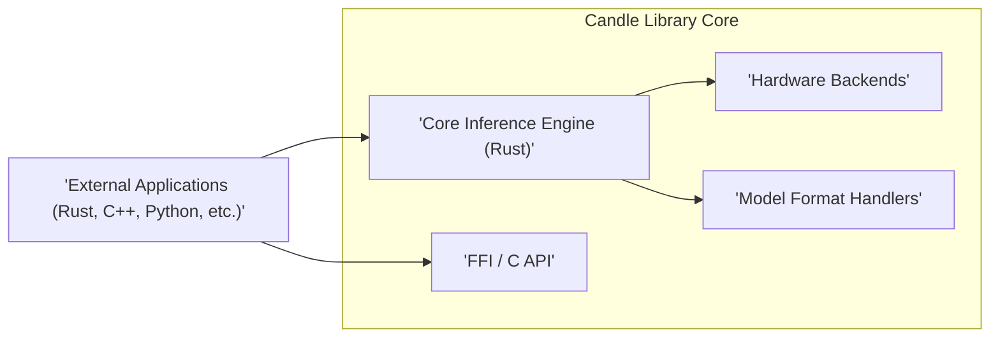
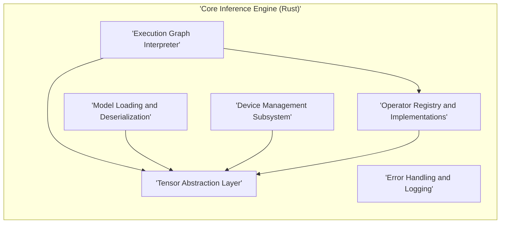
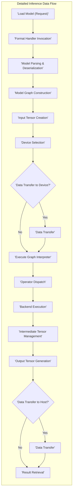

## Project Design Document: Candle - Minimalist ML Inference Library (Improved)

**1. Introduction**

This document provides an enhanced design overview of the Candle project, a lean and efficient machine learning inference library implemented in Rust. It builds upon the information available at the project's GitHub repository: [https://github.com/huggingface/candle](https://github.com/huggingface/candle). The purpose of this document is to offer a comprehensive and detailed understanding of Candle's architecture, components, and operational flow, specifically tailored for subsequent threat modeling activities. This improved version aims to enhance clarity and provide more granular detail.

**2. Goals and Objectives**

The core objectives guiding the development of the Candle project are:

* **Minimalism and Efficiency:** To create a focused inference library with a small footprint, minimizing dependencies and maximizing performance.
* **Memory Safety and Reliability:** Leveraging Rust's strong memory safety guarantees to prevent common classes of vulnerabilities and ensure robust operation.
* **High Performance Inference:** Achieving efficient execution of machine learning models, utilizing hardware acceleration capabilities where available (e.g., GPU).
* **Developer Friendliness:** Providing a clear and intuitive API for seamless integration of inference into Rust-based applications.
* **Cross-Platform Compatibility:** Supporting a wide range of operating systems and hardware architectures without requiring significant platform-specific modifications.
* **Hugging Face Ecosystem Integration:** Facilitating the direct use of pre-trained models from the Hugging Face Hub, often trained using frameworks like PyTorch and TensorFlow.

**3. High-Level Architecture**

Candle's architecture is structured around these primary components:

* **Core Inference Engine (Rust):** The central part of the library, containing the logic for tensor manipulation, model execution, and device management.
* **Foreign Function Interface (FFI) / C API:** A stable C interface enabling interoperability with applications written in other programming languages.
* **Hardware Backends:**  Specific implementations responsible for executing computations on different types of hardware (CPU, GPU via CUDA or Metal).
* **Model Format Handlers:** Modules dedicated to parsing and loading machine learning models stored in various file formats.



**4. Detailed Component Design**

**4.1. Core Inference Engine (Rust)**

This component is further subdivided into functional modules:

* **Tensor Abstraction Layer:**
    *  Manages the creation, manipulation, and destruction of multi-dimensional arrays (tensors).
    *  Provides a unified interface for tensor operations regardless of the underlying hardware backend.
    *  Supports various numerical data types (e.g., `f32`, `f16`, `i64`).
* **Model Loading and Deserialization:**
    *  Responsible for reading model definitions from disk.
    *  Parses the model's structure (layers, connections) and extracts parameters (weights, biases).
    *  Handles the deserialization of tensor data representing model weights.
* **Execution Graph Interpreter:**
    *  Orchestrates the execution of the model's computational graph.
    *  Traverses the graph, executing operations in the correct order.
    *  Manages the flow of tensor data between different layers.
    *  Handles control flow constructs within the model (e.g., conditional statements, loops).
* **Device Management Subsystem:**
    *  Abstracts the specifics of different hardware devices (CPU, GPU).
    *  Provides mechanisms for selecting the target device for inference.
    *  Handles the allocation and deallocation of memory on the chosen device.
    *  Manages data transfers between host memory and device memory.
* **Operator Registry and Implementations:**
    *  Maintains a registry of available neural network operations (e.g., convolution, linear transformation, activation functions).
    *  Contains optimized implementations of these operators, potentially with different versions for various hardware backends.
* **Error Handling and Logging:**
    *  Defines a consistent error handling mechanism for reporting and managing errors during model loading and inference.
    *  Provides facilities for logging events and debugging information.



**4.2. Foreign Function Interface (FFI) / C API**

This component facilitates interaction with Candle from other languages:

* **C Function Bindings:**  Provides a set of C-compatible function declarations that mirror key functionalities of the Rust core.
* **Data Structure Marshalling:** Defines how data structures (especially tensors) are represented and passed across the FFI boundary. This includes handling memory ownership and lifetimes.
* **Error Code Translation:**  Maps Rust error types to standard C error codes for consistent error reporting in calling applications.
* **Resource Management:**  Provides mechanisms for managing resources (e.g., model handles, tensor objects) created within the Rust library from the C side.

```mermaid
graph LR
    B1["'C Function Bindings'"]
    B2["'Data Structure Marshalling'"]
    B3["'Error Code Translation'"]
    B4["'Resource Management'"]
    subgraph "'FFI / C API'"
        B1
        B2
        B3
        B4
    end
    "'Core Inference Engine (Rust)'" --> B1
    B1 --> "'External Applications (C++, Python, etc.)'"
```

**4.3. Hardware Backends**

These components provide hardware-specific implementations of tensor operations:

* **CPU Backend:**
    *  Implements tensor operations using standard CPU instructions.
    *  May leverage optimized libraries like BLAS (Basic Linear Algebra Subprograms) or LAPACK (Linear Algebra PACKage) for performance.
    *  Handles multi-threading for parallel execution on multi-core CPUs.
* **GPU Backend (CUDA):**
    *  Utilizes NVIDIA's CUDA API to execute tensor operations on compatible GPUs.
    *  Requires the CUDA Toolkit and appropriate drivers.
    *  Involves kernel implementations written in CUDA C/C++.
* **GPU Backend (Metal):**
    *  Leverages Apple's Metal framework for GPU acceleration on macOS and iOS.
    *  Requires the Metal API and appropriate drivers.
    *  Involves shader implementations written in Metal Shading Language (MSL).
* **Abstraction Layer for Backends:**  A potential internal layer to provide a common interface for different backend implementations, simplifying the integration of new hardware support.

```mermaid
graph LR
    C1["'CPU Backend'"]
    C2["'GPU Backend (CUDA)'"]
    C3["'GPU Backend (Metal)'"]
    C4["'Abstraction Layer for Backends'"]
    subgraph "'Hardware Backends'"
        C1
        C2
        C3
        C4
    end
    "'Device Management Subsystem'" --> C1
    "'Device Management Subsystem'" --> C2
    "'Device Management Subsystem'" --> C3
    "'Operator Registry and Implementations'" --> C1
    "'Operator Registry and Implementations'" --> C2
    "'Operator Registry and Implementations'" --> C3
```

**4.4. Model Format Handlers**

These components are responsible for loading models from different file formats:

* **ONNX Model Handler:**
    *  Implements parsing logic for the ONNX (Open Neural Network Exchange) format.
    *  Deserializes the model graph and tensor data from ONNX files.
    *  Maps ONNX operators to Candle's internal operator implementations.
* **Safetensors Model Handler:**
    *  Provides support for the `safetensors` format, emphasizing security and efficient loading of tensor data.
    *  Focuses on direct memory mapping and avoids arbitrary code execution risks associated with traditional serialization formats.
* **Potential Future Format Handlers:**  Possibilities include support for TensorFlow SavedModel, PyTorch's `torch.save` format, or other emerging formats.

```mermaid
graph LR
    D1["'ONNX Model Handler'"]
    D2["'Safetensors Model Handler'"]
    D3["'Potential Future Format Handlers'"]
    subgraph "'Model Format Handlers'"
        D1
        D2
        D3
    end
    "'Model Loading and Deserialization'" --> D1
    "'Model Loading and Deserialization'" --> D2
```

**5. Data Flow (Detailed)**

A typical inference operation in Candle proceeds as follows:

1. **Model Loading Initiation:** The application requests the loading of a model, specifying the file path and format.
2. **Format Handler Invocation:** The appropriate `Model Format Handler` is selected based on the file extension or specified format.
3. **Model Parsing and Deserialization:** The chosen handler parses the model file, extracting the network structure and deserializing the tensor data representing weights and biases. These tensors are typically allocated using the `Tensor Abstraction Layer`.
4. **Model Graph Construction:** An internal representation of the model's computational graph is built within the `Execution Graph Interpreter`.
5. **Input Tensor Creation:** The application provides input data, which is converted into Candle's tensor representation using the `Tensor Abstraction Layer`.
6. **Device Selection:** The application (or the library's default settings) determines the target device for inference (CPU or GPU) via the `Device Management Subsystem`.
7. **Data Transfer to Device (If Necessary):** If the input tensors or model weights reside in host memory and the target device is a GPU, the `Device Management Subsystem` initiates data transfers to the GPU's memory.
8. **Execution Graph Traversal:** The `Execution Graph Interpreter` begins traversing the graph, executing operations node by node.
9. **Operator Dispatch:** For each operation in the graph, the interpreter dispatches the execution to the corresponding implementation in the `Operator Registry and Implementations`. The specific implementation used depends on the operation type and the selected hardware backend.
10. **Backend Execution:** The selected hardware backend (CPU or GPU) performs the actual computation on the input tensors, producing output tensors.
11. **Intermediate Tensor Management:** The `Tensor Abstraction Layer` manages the allocation and deallocation of intermediate tensors produced during the computation.
12. **Output Tensor Generation:** The final layer of the model produces the output tensor containing the inference results.
13. **Data Transfer to Host (If Necessary):** If the output tensor resides on a GPU and the application needs it in host memory, the `Device Management Subsystem` transfers the data back.
14. **Result Retrieval:** The application accesses the output tensor containing the inference results.



**6. Security Considerations (Expanded)**

This section expands on the preliminary security considerations, providing more detail for threat modeling:

* **Model Integrity and Authenticity:**
    *  Risk: Malicious actors could tamper with model files, injecting backdoors or altering behavior.
    *  Mitigation Strategies: Implementing verification mechanisms such as cryptographic signatures or checksums for model files. Utilizing trusted sources for model downloads. Leveraging the `safetensors` format which is designed to be safer than pickle-based formats.
* **Input Data Validation and Sanitization:**
    *  Risk: Processing maliciously crafted input data could lead to unexpected behavior, crashes, or even information leaks.
    *  Mitigation Strategies: Implementing robust input validation to ensure data conforms to expected types and ranges. Sanitizing input data to prevent injection attacks if the input is used in further processing or displayed.
* **Memory Safety Vulnerabilities:**
    *  Risk: Although Rust provides strong memory safety guarantees, unsafe code blocks or FFI interactions could introduce vulnerabilities like buffer overflows or use-after-free errors.
    *  Mitigation Strategies: Rigorous code reviews, static analysis tools, and careful auditing of unsafe code blocks and FFI boundaries. Utilizing memory-safe data structures and algorithms.
* **Denial of Service (DoS) Attacks:**
    *  Risk: Attackers could send requests that consume excessive computational resources or memory, making the inference service unavailable.
    *  Mitigation Strategies: Implementing resource limits (e.g., maximum input size, timeout values). Rate limiting requests. Properly handling large or malformed inputs to prevent resource exhaustion.
* **Side-Channel Attacks:**
    *  Risk: Information about the model or input data could be leaked through observable side effects like timing variations or power consumption.
    *  Mitigation Strategies: Employing constant-time algorithms where feasible, especially for security-sensitive operations. Being mindful of potential information leaks through caching behavior.
* **Dependency Management and Supply Chain Security:**
    *  Risk: Vulnerabilities in third-party dependencies could be exploited.
    *  Mitigation Strategies: Regularly auditing dependencies for known vulnerabilities. Using dependency pinning and checksum verification. Employing secure build processes.
* **Access Control and Authentication (in deployed environments):**
    *  Risk: Unauthorized access to the inference service or sensitive model data.
    *  Mitigation Strategies: Implementing appropriate authentication and authorization mechanisms for accessing the inference service. Securely storing and managing API keys or credentials.
* **Model Confidentiality (Intellectual Property):**
    * Risk: Unauthorized access to or copying of the trained model.
    * Mitigation Strategies: Encrypting model files at rest and in transit. Implementing access controls to restrict who can access the model files.

**7. Deployment Considerations (Refined)**

Candle's deployment scenarios include:

* **Direct Integration in Rust Applications:**  The most straightforward deployment, linking the Candle library directly into a Rust application.
* **Serverless Functions:** Deploying Candle within serverless environments (e.g., AWS Lambda, Azure Functions) for scalable inference on demand. Requires careful consideration of cold starts and resource limits.
* **Containerized Environments (Docker, Kubernetes):** Packaging Candle and its dependencies into containers for reproducible and scalable deployments.
* **Edge Devices and Embedded Systems:** Deploying Candle on resource-constrained devices for local inference. Requires careful optimization and consideration of hardware limitations.
* **Exposing Inference via APIs (REST, gRPC):** Building services that expose Candle's inference capabilities through network APIs. Requires implementing appropriate security measures for network communication.

**8. Technologies Used**

* **Primary Language:** Rust (for core logic and performance).
* **FFI Bindings:** C (for interoperability).
* **GPU Acceleration APIs:** CUDA (NVIDIA GPUs), Metal (Apple GPUs).
* **Model Format Libraries:**  Libraries for parsing ONNX and safetensors formats (potentially using crates like `onnx-rs` and `safetensors`).
* **Build System:** Cargo (Rust's build and dependency management tool).
* **Potential Dependencies:**  BLAS/LAPACK implementations for CPU backend, CUDA Toolkit, Metal SDK.

**9. Future Considerations (Further Details)**

* **Enhanced Quantization Support:** Implementing advanced quantization techniques (e.g., post-training quantization, quantization-aware training) to further reduce model size and improve inference speed.
* **Wider Hardware Backend Support:** Expanding support to more hardware accelerators like TPUs or other specialized AI chips.
* **Integration with Higher-Level ML Ecosystem Tools:**  Developing integrations or wrappers for popular Python-based ML tools and libraries to ease the transition for users.
* **Optimized Operator Kernels:** Continuously refining and optimizing the implementations of individual neural network operators for different hardware backends.
* **Asynchronous Inference Capabilities:**  Adding support for asynchronous inference execution to improve responsiveness in certain applications.
* **Support for More Complex Model Architectures:**  Ensuring compatibility with a wider range of modern neural network architectures and operations.

This improved design document provides a more granular and detailed understanding of the Candle project, enhancing its utility for threat modeling and further development efforts.