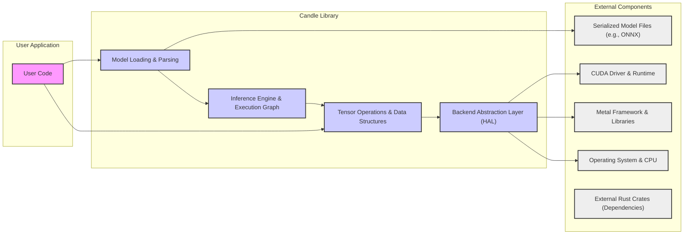
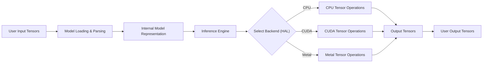

# Project Design Document: Candle - Minimalist ML Inference Library

**Version:** 1.1
**Date:** October 26, 2023
**Author:** AI Software Architect

## 1. Introduction

This document provides an enhanced and more detailed design overview of the Candle project, a minimalist machine learning inference library written in Rust. This document serves as a robust foundation for understanding the system's architecture, components, and data flow, which is crucial for subsequent threat modeling activities. This revision aims to provide greater clarity and depth compared to the initial version.

### 1.1. Project Goals

The primary goals of the Candle project are to:

* Provide a highly lightweight and efficient library specifically designed for performing machine learning inference.
* Offer a simple, intuitive, and Rust-idiomatic API for developers to integrate inference capabilities.
* Support a range of hardware accelerators, including NVIDIA GPUs (via CUDA) and Apple GPUs (via Metal), alongside standard CPU execution.
* Enable seamless integration within existing Rust-based ecosystems and projects.
* Facilitate the deployment of machine learning models in resource-constrained environments where efficiency is paramount.

### 1.2. Scope

This design document comprehensively covers the core components and functionalities of the Candle library as of the current project state. It focuses specifically on the inference process, detailing the interactions between different parts of the library and external dependencies. This document does not delve into the complexities of model training or the fine-grained implementation details of individual operator kernels.

### 1.3. Target Audience

This document is intended for a technical audience, including:

* Security engineers and architects responsible for conducting thorough threat modeling and security assessments.
* Developers actively contributing to the development and maintenance of the Candle project.
* Users of the Candle library seeking a deeper, more technical understanding of its internal architecture and workings.

## 2. System Architecture

Candle's architecture is intentionally designed to be modular, extensible, and focused on performance. It primarily revolves around the core library and its well-defined interactions with external components such as serialized model files and hardware acceleration frameworks.

### 2.1. High-Level Architecture Diagram

### 2.2. Component Description

* **User Code:** This represents the external application or code that directly utilizes the Candle library through its exposed public API to perform machine learning inference tasks.
* **Model Loading & Parsing:** This crucial component is responsible for taking serialized machine learning models from various file formats (e.g., ONNX protocol buffers) and parsing them into an internal, executable representation. This involves validating the model structure and extracting necessary parameters.
* **Inference Engine & Execution Graph:** This is the core of the library. It takes the parsed model and input data and orchestrates the execution of the operations defined within the model's computational graph. It manages the flow of tensors through the network layers.
* **Tensor Operations & Data Structures:** This component provides the fundamental building blocks for numerical computation. It includes implementations of various tensor operations (e.g., matrix multiplication, convolutions, activation functions) and manages the underlying data structures (tensors) that hold the numerical data.
* **Backend Abstraction Layer (HAL):** This layer provides a critical abstraction, decoupling the Inference Engine from the specifics of the underlying hardware. It offers a consistent interface for performing tensor operations, regardless of whether the computation is happening on the CPU, CUDA-enabled NVIDIA GPU, or an Apple GPU via Metal.
* **Serialized Model Files (e.g., ONNX):** These are files containing the serialized definition (structure and parameters) of the pre-trained machine learning model. ONNX is a common interchange format.
* **CUDA Driver & Runtime:** The necessary driver and runtime libraries provided by NVIDIA for utilizing their GPUs for accelerated computation via the CUDA API.
* **Metal Framework & Libraries:** Apple's framework and associated libraries that enable leveraging the computational power of GPUs on macOS and iOS devices.
* **Operating System & CPU:** The underlying operating system provides essential services and the CPU serves as the default backend for computation or when GPU acceleration is not available or explicitly requested.
* **External Rust Crates (Dependencies):** Candle relies on various external Rust libraries (crates) for functionalities such as linear algebra, serialization, and system interactions.

### 2.3. Key Interactions

* **Model Loading Initiation:** The User Code initiates the model loading process by providing the file path or data representing a Serialized Model File to the Candle API.
* **Model Parsing and Representation:** The Model Loading & Parsing component reads the Model File, parses its contents according to the specified format (e.g., ONNX), and constructs an internal representation of the model's computational graph and parameters.
* **Inference Request:** The User Code provides input data (typically as tensors) to the Inference Engine, along with a reference to the loaded model.
* **Execution Graph Traversal:** The Inference Engine traverses the loaded model's execution graph, determining the order of operations.
* **Backend Selection and Operation Dispatch:** For each operation in the graph, the Backend Abstraction Layer selects the appropriate hardware backend (CPU, CUDA, or Metal) based on availability, user configuration, and operation suitability. It then dispatches the tensor operation to the chosen backend.
* **Tensor Operation Execution:** The selected backend (CPU or GPU) performs the requested tensor operation using the provided input tensors and model parameters.
* **Output Generation and Return:** Once all operations in the graph are executed, the Inference Engine produces the final output tensors, representing the model's predictions, and returns them to the User Code.

## 3. Data Flow

The primary data flow within Candle centers around the processing of input data through a loaded machine learning model to generate predictions.

### 3.1. Inference Data Flow Diagram

### 3.2. Data Flow Description

1. **User Input Tensors:** The user application provides the input data to the Candle library in the form of numerical multi-dimensional arrays (tensors).
2. **Model Loading & Parsing:** The Model Loading & Parsing component reads and parses the Serialized Model File, creating an in-memory representation of the model's structure, parameters (weights and biases), and operations.
3. **Internal Model Representation:** This internal representation holds the complete definition of the machine learning model, ready for execution.
4. **Inference Engine:** The Inference Engine receives the input tensors and the internal model representation. It acts as the orchestrator of the inference process.
5. **Select Backend (HAL):** The Backend Abstraction Layer determines the most suitable hardware backend (CPU, CUDA, or Metal) for each individual tensor operation within the model. This decision can be based on factors like availability, user preferences, and the nature of the operation.
6. **CPU/CUDA/Metal Tensor Operations:** The actual computation of tensor operations is performed on the selected backend. This involves executing optimized code for matrix multiplications, convolutions, activation functions, and other mathematical operations.
7. **Output Tensors:** The result of the inference process is a set of output tensors containing the model's predictions or intermediate results.
8. **User Output Tensors:** The Candle library returns the final output tensors to the user application, completing the inference cycle.

## 4. Security Considerations (Detailed)

This section provides a more detailed examination of potential security concerns relevant to the Candle project, along with specific examples and mitigation strategies.

### 4.1. Potential Security Concerns

* **Malicious Model Files:**
    * **Threat:** Attackers could provide crafted Model Files containing malicious code or logic designed to exploit vulnerabilities in the Model Loading & Parsing component or the Inference Engine. This could lead to arbitrary code execution or denial of service.
    * **Mitigation:** Implement robust model validation and sanitization during the parsing process. Verify model integrity using cryptographic signatures or checksums. Employ sandboxing techniques during model loading to limit potential damage.
* **Supply Chain Vulnerabilities:**
    * **Threat:** Dependencies (external Rust crates) used by Candle might contain known security vulnerabilities. Exploiting these vulnerabilities could compromise the library's integrity.
    * **Mitigation:** Utilize dependency scanning tools to identify and address known vulnerabilities in dependencies. Regularly update dependencies to their latest secure versions. Consider vendoring dependencies to have more control over the supply chain.
* **Memory Safety Issues:**
    * **Threat:** Despite Rust's memory safety guarantees, `unsafe` code blocks, if not handled carefully, could introduce memory safety vulnerabilities like buffer overflows or use-after-free errors.
    * **Mitigation:** Minimize the use of `unsafe` code. Conduct rigorous code reviews and utilize memory safety analysis tools (e.g., Miri) to identify potential issues in `unsafe` blocks.
* **GPU Driver Exploits:**
    * **Threat:** Vulnerabilities in the CUDA or Metal drivers could be exploited through Candle's interaction with these drivers, potentially leading to privilege escalation or system compromise.
    * **Mitigation:** Stay updated with the latest security advisories for GPU drivers and recommend users to use the latest stable versions. Isolate GPU interactions as much as possible.
* **Input Data Attacks:**
    * **Threat:** Maliciously crafted input data could exploit vulnerabilities in the Tensor Operations component or the Inference Engine, leading to crashes, unexpected behavior, or even information disclosure.
    * **Mitigation:** Implement thorough input validation and sanitization to ensure data conforms to expected formats and ranges. Implement error handling to gracefully manage unexpected input.
* **Denial of Service (DoS):**
    * **Threat:** Attackers could provide extremely large or complex models, or carefully crafted input data, that consume excessive computational resources (CPU, GPU memory), leading to a denial of service.
    * **Mitigation:** Implement resource limits on model size and input data dimensions. Implement timeouts for inference operations.
* **Information Disclosure:**
    * **Threat:** Error messages, logging information, or debugging artifacts could inadvertently leak sensitive information about the model, input data, or the system's internal state.
    * **Mitigation:** Implement secure logging practices, avoiding the logging of sensitive data. Carefully review error handling to prevent information leakage. Disable debug symbols in production builds.
* **Side-Channel Attacks:**
    * **Threat:** Attackers might be able to infer information about the model or input data by observing side channels like timing variations or power consumption during inference.
    * **Mitigation:** While fully mitigating side-channel attacks is challenging, consider techniques like constant-time algorithms where feasible and be aware of potential risks.

### 4.2. Mitigation Strategies (Elaborated)

* **Model File Verification:** Implement cryptographic signature verification for Model Files to ensure authenticity and integrity. Use checksums to detect tampering.
* **Dependency Management:** Utilize tools like `cargo audit` to scan for known vulnerabilities. Implement a policy for reviewing and updating dependencies regularly. Consider using a software bill of materials (SBOM).
* **Code Auditing:** Conduct regular security code reviews, focusing on `unsafe` blocks and areas handling external data. Employ static analysis tools for automated vulnerability detection.
* **Secure GPU Interaction:** Follow the principle of least privilege when interacting with GPU drivers. Isolate GPU operations within well-defined boundaries.
* **Input Validation and Sanitization:** Define strict schemas for input data and enforce them. Sanitize input data to remove potentially harmful characters or patterns.
* **Resource Limits:** Configure maximum memory usage and execution time for inference operations. Implement mechanisms to detect and prevent resource exhaustion.
* **Secure Logging and Error Handling:** Sanitize sensitive data before logging. Provide generic error messages to users while logging detailed information securely for debugging.
* **Side-Channel Attack Awareness:**  Research and consider potential side-channel vulnerabilities relevant to the implemented algorithms. Explore techniques for mitigation where feasible.

## 5. Deployment Considerations

Candle's design allows for flexible deployment across various environments. However, each deployment scenario presents unique security considerations.

* **Standalone Applications:** When embedded directly into a Rust application, the security of Candle is tightly coupled with the security of the host application. Vulnerabilities in either can impact the other.
* **Embedded Systems:** Deployment on resource-constrained devices requires careful consideration of memory usage and potential attack vectors specific to the hardware and operating system. Secure boot and firmware integrity are crucial.
* **Cloud Environments:** When used as part of a larger cloud service, security measures like network segmentation, access control, and secure API endpoints are essential to protect Candle and the surrounding infrastructure.
* **WebAssembly (Future):** Deploying Candle in a web browser via WebAssembly introduces browser-specific security considerations, such as the browser's security sandbox and potential cross-site scripting (XSS) vulnerabilities if interacting with untrusted web content.

## 6. Technologies Used

* **Primary Programming Language:** Rust (emphasizing memory safety and performance)
* **Core Machine Learning Framework Support:** Primarily ONNX (Open Neural Network Exchange format)
* **Hardware Acceleration Backends:**
    * NVIDIA GPUs via CUDA (Compute Unified Device Architecture)
    * Apple GPUs via Metal framework
    * Standard CPUs (as a fallback or primary option)
* **Build System and Package Manager:** Cargo (the standard Rust build tool and package manager)
* **Potential External Dependencies (Examples):**
    * `ndarray` (for multi-dimensional array manipulation)
    * `onnx-rs` (for ONNX parsing)
    * `cuda-rs` (for CUDA bindings)
    * `metal-rs` (for Metal bindings)

## 7. Future Considerations

* **Expanded Model Format Support:**  Adding support for additional model formats beyond ONNX to increase interoperability.
* **Enhanced Quantization and Pruning Support:** Implementing advanced techniques for model optimization to improve performance and reduce resource consumption.
* **Improved WebAssembly Support:**  Further developing and hardening WebAssembly support for secure browser-based inference.
* **Formal Security Audits:** Conducting independent security audits by external experts to identify and address potential vulnerabilities.
* **Integration with Security Tooling:** Exploring integration with security scanning and monitoring tools.

This enhanced document provides a more in-depth understanding of the Candle project's design and security considerations. This detailed information is crucial for conducting thorough threat modeling and implementing appropriate security measures to protect the library and its users.