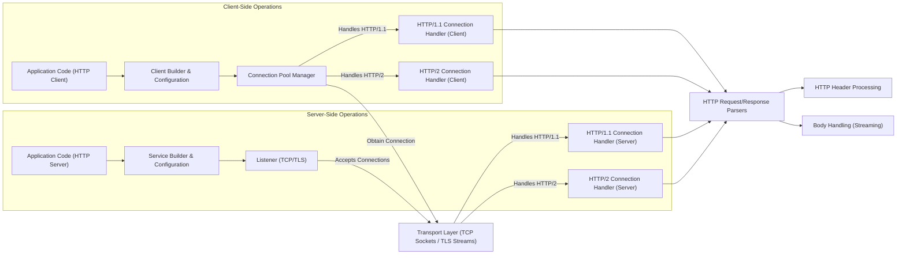

## Project Design Document: Hyper HTTP Library (Improved)

**1. Introduction**

This document provides an enhanced architectural design of the `hyper` HTTP library, a robust and widely-used HTTP implementation written in Rust. This detailed design aims to offer a comprehensive understanding of the library's structure, components, and data flow, specifically tailored for effective threat modeling.

**1.1. Purpose**

The primary objectives of this document are to:

* Provide a detailed architectural overview of the `hyper` library, suitable for security analysis.
* Clearly identify and describe the key components within `hyper` and their interactions.
* Thoroughly outline the data flow within the library for both client and server operations, highlighting potential interception points.
* Serve as a foundational resource for identifying potential security vulnerabilities, attack surfaces, and associated risks during subsequent threat modeling exercises.

**1.2. Scope**

This document encompasses the core architectural design of the `hyper` library, with a strong emphasis on its functionalities related to handling HTTP requests and responses. It covers both client-side (making requests) and server-side (handling requests) aspects of the library. While it describes the major components and their interactions, it does not delve into the intricate implementation details of every individual module or function within the `hyper` codebase. The focus remains on aspects relevant to security considerations.

**1.3. Audience**

This document is primarily intended for:

* Security engineers and architects tasked with performing threat modeling on the `hyper` library or systems that depend on it.
* Software developers requiring a deep understanding of `hyper`'s architecture for integration or extension purposes.
* Cybersecurity professionals seeking to understand the internal workings of a modern, high-performance HTTP library.
* Anyone interested in the design principles and operational flow of a foundational network communication library.

**2. Overview**

`hyper` is a high-performance and correct HTTP implementation written in the Rust programming language. It serves as a low-level building block for constructing both HTTP clients and servers. Its key characteristics include:

* **Asynchronous, Non-blocking I/O:** Leverages the `tokio` asynchronous runtime to achieve high concurrency and efficient resource utilization.
* **Comprehensive HTTP Protocol Support:** Implements both HTTP/1.1 and HTTP/2 protocols, with potential future support for HTTP/3.
* **Robust TLS Integration:**  Provides seamless integration with various TLS libraries (e.g., `rustls`, `native-tls`) for establishing secure HTTPS connections.
* **Extensible and Customizable Design:** Offers a flexible architecture that allows users to customize various aspects of HTTP processing through interceptors, middleware, and custom implementations.
* **Fine-grained Control over HTTP Semantics:** Exposes low-level APIs that provide developers with precise control over HTTP request and response construction and handling.

**3. Architectural Design**

The `hyper` library's architecture is logically divided into components responsible for client-side and server-side operations, with shared underlying infrastructure for core functionalities.

**3.1. High-Level Architecture Diagram**

**3.2. Component Descriptions**

* **Application Code (HTTP Client):** The user-written application code that utilizes the `hyper` client API to construct and send HTTP requests to remote servers.
* **Client Builder & Configuration:** Provides mechanisms to configure the `hyper` client, including setting timeouts, connection pool parameters, TLS settings, and proxies.
* **Connection Pool Manager:** Responsible for managing a pool of active and idle HTTP connections to remote servers. This component optimizes performance by reusing connections and reducing connection establishment overhead.
* **HTTP/1.1 Connection Handler (Client):** Manages the lifecycle of an HTTP/1.1 connection from the client's perspective, including sending requests, receiving responses, and handling connection closure.
* **HTTP/2 Connection Handler (Client):** Manages the lifecycle of an HTTP/2 connection from the client's perspective, including stream management, header compression (using HPACK), and handling server pushes.
* **Application Code (HTTP Server):** The user-written application code that implements the business logic to handle incoming HTTP requests and generate appropriate responses.
* **Service Builder & Configuration:** Provides mechanisms to configure the `hyper` server, including specifying the listening address and port, TLS configuration, and service handlers.
* **Listener (TCP/TLS):**  Responsible for listening for incoming TCP connections on a specified network address and port. This component handles the initial handshake and, if configured, the TLS handshake.
* **HTTP/1.1 Connection Handler (Server):** Processes incoming HTTP/1.1 requests on a connection, parses the request, dispatches it to the application's service logic, and sends the response back to the client.
* **HTTP/2 Connection Handler (Server):** Processes incoming HTTP/2 streams on a connection, manages stream concurrency, handles header decompression, dispatches requests to the application's service logic, and sends responses.
* **Transport Layer (TCP Sockets / TLS Streams):** Represents the underlying TCP sockets or TLS-encrypted streams used for transmitting raw byte data between the client and server. This layer is typically managed by the operating system's networking stack or a dedicated TLS library.
* **HTTP Request/Response Parsers:** Components responsible for parsing raw byte streams into structured HTTP request and response objects, including headers, body, and status codes. These parsers must adhere strictly to HTTP protocol specifications to avoid vulnerabilities.
* **HTTP Header Processing:** Handles the parsing, validation, and manipulation of HTTP headers. This component is crucial for security as headers can contain sensitive information or be vectors for attacks.
* **Body Handling (Streaming):** Manages the efficient handling of request and response bodies, often in a streaming fashion to accommodate large payloads without consuming excessive memory.

**3.3. Data Flow**

**3.3.1. Client-Side HTTP Request**

1. The **Application Code (HTTP Client)** constructs an HTTP request (method, URI, headers, body) using the **Client Builder & Configuration**.
2. The **Client Builder & Configuration** interacts with the **Connection Pool Manager** to either retrieve an existing idle connection to the target server or establish a new connection.
3. If a new connection is required, the **Connection Pool Manager** establishes a **Transport Layer** connection (TCP socket, potentially with TLS).
4. Based on protocol negotiation (e.g., ALPN during TLS handshake), either the **HTTP/1.1 Connection Handler (Client)** or the **HTTP/2 Connection Handler (Client)** is selected for the connection.
5. The request is serialized into a byte stream by the appropriate connection handler, utilizing the **HTTP Request/Response Parsers** and **HTTP Header Processing**.
6. The request body is handled by the **Body Handling (Streaming)** component and sent over the **Transport Layer**.
7. The server processes the request and sends an HTTP response back over the same **Transport Layer** connection.
8. The **HTTP/1.1 Connection Handler (Client)** or **HTTP/2 Connection Handler (Client)** receives the response byte stream.
9. The response is parsed by the **HTTP Request/Response Parsers** and **HTTP Header Processing**.
10. The response body is handled by the **Body Handling (Streaming)** component.
11. The complete HTTP response is returned to the **Application Code (HTTP Client)**.

**3.3.2. Server-Side HTTP Request Handling**

1. The **Listener (TCP/TLS)** accepts an incoming TCP connection. If TLS is configured, a TLS handshake occurs.
2. Based on protocol negotiation (e.g., ALPN), either the **HTTP/1.1 Connection Handler (Server)** or the **HTTP/2 Connection Handler (Server)** is instantiated to handle the connection.
3. The **Connection Handler** receives the incoming byte stream from the **Transport Layer**.
4. The **HTTP Request/Response Parsers** parse the byte stream into an HTTP request object.
5. **HTTP Header Processing** validates and extracts information from the request headers.
6. The request body is handled by the **Body Handling (Streaming)** component.
7. The parsed HTTP request is passed to the **Application Code (HTTP Server)** via the **Service Builder & Configuration**.
8. The **Application Code (HTTP Server)** processes the request and generates an HTTP response.
9. The response (headers and body) is passed back to the appropriate **Connection Handler**.
10. The **Connection Handler** serializes the response into a byte stream using the **HTTP Request/Response Parsers** and **HTTP Header Processing**.
11. The response body is handled by the **Body Handling (Streaming)** component and sent back to the client over the **Transport Layer**.

**4. Security Considerations (Detailed)**

This section expands on the initial security considerations, providing more specific examples of potential threats related to each component and data flow.

* **TLS Configuration Vulnerabilities:**
    * Using weak or deprecated cipher suites can make connections susceptible to eavesdropping.
    * Improper certificate validation can lead to man-in-the-middle attacks.
    * Outdated TLS protocol versions might contain known vulnerabilities.
* **Connection Handling Exploits:**
    * **Denial of Service (DoS):**  Attackers might attempt to exhaust server resources by opening a large number of connections without sending valid requests.
    * **Connection Hijacking:**  Exploiting vulnerabilities to take over an established connection.
    * **Connection Pool Poisoning:**  Manipulating the connection pool to reuse connections with malicious intent.
* **HTTP Parsing Vulnerabilities:**
    * **Header Injection:**  Injecting malicious headers into requests or responses to bypass security checks or manipulate application behavior.
    * **Request Smuggling:**  Exploiting discrepancies in how intermediaries and backend servers parse HTTP requests, leading to requests being routed incorrectly.
    * **Response Splitting:**  Injecting newline characters into headers to trick the client into interpreting subsequent data as a new response.
* **Dependency Vulnerabilities:**
    * Security flaws in underlying dependencies like `tokio` or TLS libraries can directly impact `hyper`'s security. Regular updates and vulnerability scanning are crucial.
* **Application Logic Vulnerabilities (Using Hyper):**
    * **Client-Side:**  Improper handling of server responses, leading to vulnerabilities like cross-site scripting (XSS) if rendering untrusted content.
    * **Server-Side:**  Vulnerabilities in the application's request handling logic, such as SQL injection or command injection, are independent of `hyper` but are exposed through it.
* **Resource Exhaustion Attacks:**
    * Sending excessively large request bodies can consume server memory and lead to denial of service.
    * Sending a high volume of requests can overwhelm the server's processing capacity.
* **HTTP/2 Specific Attacks:**
    * **Stream Multiplexing Abuse:**  Creating an excessive number of streams to exhaust server resources.
    * **Priority Manipulation:**  Manipulating stream priorities to starve other streams of resources.
    * **Header Compression (HPACK) Bomb:**  Sending specially crafted header blocks that consume excessive memory during decompression.

**5. Dependencies (Security Implications)**

`hyper` relies on several key dependencies, each with its own security considerations:

* **`tokio`:**  As the asynchronous runtime, vulnerabilities in `tokio` could lead to issues like task starvation or unexpected behavior in `hyper`.
* **`bytes`:**  Used for efficient byte buffer management. Vulnerabilities here could potentially lead to memory corruption or buffer overflows.
* **TLS Libraries (e.g., `rustls`, `native-tls`):**  Critical for HTTPS security. The chosen TLS library's security posture directly impacts `hyper`. Vulnerabilities in these libraries could compromise the confidentiality and integrity of communication.
* **`http` crate:** Provides fundamental HTTP types. Security issues here could affect how `hyper` represents and manipulates HTTP data.
* **`async-trait`:** Enables asynchronous traits. While less direct, vulnerabilities in core async infrastructure can have cascading effects.

**6. Deployment Considerations (Security Context)**

The way `hyper` is deployed significantly impacts its security profile:

* **Operating System Security:** The underlying OS's security features and patch level are crucial.
* **Containerization (e.g., Docker):**  Proper container image hardening and security scanning are necessary. Misconfigurations can introduce vulnerabilities.
* **Cloud Environments:**  Cloud provider security configurations (firewalls, network policies, IAM) play a vital role.
* **Reverse Proxies (e.g., Nginx, HAProxy):**  Often used for TLS termination, load balancing, and security filtering. Misconfigurations or vulnerabilities in the reverse proxy can expose `hyper` applications. Ensure the reverse proxy is properly configured to mitigate common web attacks before traffic reaches `hyper`.
* **Firewall Configuration:**  Properly configured firewalls are essential to restrict network access and prevent unauthorized connections.
* **Monitoring and Logging:**  Implementing robust monitoring and logging is crucial for detecting and responding to security incidents.

**7. Future Considerations (Security Impact)**

Potential future developments could introduce new security considerations:

* **HTTP/3 (QUIC) Support:**  QUIC introduces new security features and challenges that need careful consideration.
* **WebTransport Support:**  A newer protocol built on top of QUIC, also requiring security analysis.
* **Integration with new cryptographic libraries:**  Adopting new cryptographic libraries might introduce new vulnerabilities or require careful review.
* **Performance optimizations:**  Changes aimed at performance might inadvertently introduce security flaws if not carefully implemented.

**8. Glossary**

* **HTTP:** Hypertext Transfer Protocol.
* **HTTPS:** HTTP Secure, using TLS encryption.
* **TLS:** Transport Layer Security.
* **TCP:** Transmission Control Protocol.
* **ALPN:** Application-Layer Protocol Negotiation.
* **Asynchronous I/O:** Non-blocking input/output operations.
* **Rust:** A systems programming language.
* **Tokio:** An asynchronous runtime for Rust.
* **Stream (HTTP/2):** A bidirectional flow of bytes within an HTTP/2 connection.
* **Multiplexing (HTTP/2):** Sending multiple requests/responses concurrently over a single connection.
* **HPACK:** Header Compression for HTTP/2.
* **QUIC:** Quick UDP Internet Connections, the transport protocol for HTTP/3.
* **WebTransport:** A protocol framework for client/server communication over the web.
* **DoS:** Denial of Service.
* **XSS:** Cross-Site Scripting.
* **SQL Injection:** A code injection technique that exploits security vulnerabilities in an application's database layer.
* **Command Injection:** An attack in which the goal is execution of arbitrary commands on the host operating system.
* **IAM:** Identity and Access Management.
