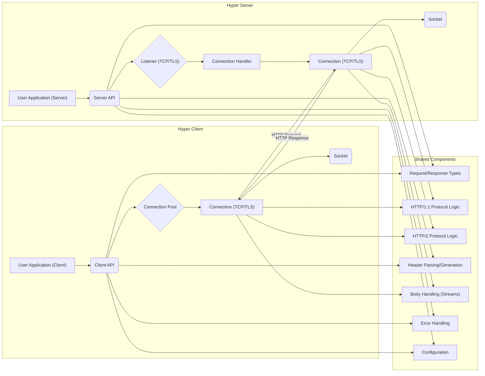

# Project Design Document: Hyper HTTP Library

**Version:** 1.1
**Date:** October 26, 2023
**Author:** AI Software Architect

## 1. Introduction

This document provides a detailed architectural design of the Hyper HTTP library, an asynchronous HTTP implementation written in Rust. This document serves as a foundation for subsequent threat modeling activities, outlining the key components, data flows, and security considerations of the library.

### 1.1. Purpose

The primary purpose of this document is to provide a comprehensive architectural overview of the Hyper library to facilitate effective threat modeling. It aims to clearly define the system boundaries, components, and interactions, enabling security experts to identify potential vulnerabilities and attack vectors. This document will be used to understand the attack surface and potential weaknesses within and around the Hyper library.

### 1.2. Scope

This document covers the core architectural components and functionalities of the Hyper library as of the current version (based on the provided GitHub repository). It focuses on aspects relevant to security, including network communication, data handling, and protocol implementation. It includes both client and server functionalities provided by the library. The scope includes the interaction of Hyper with the underlying operating system and external networks.

### 1.3. Target Audience

This document is intended for:

*   Security engineers and architects involved in threat modeling and security assessments of systems utilizing the Hyper library.
*   Developers who need a deeper understanding of Hyper's architecture for debugging, extending, or integrating with the library, particularly with a security mindset.

## 2. Overview of Hyper

Hyper is a fast and correct HTTP implementation written in Rust. It provides building blocks for creating HTTP clients and servers. Key features include:

*   Support for both HTTP/1.1 and HTTP/2 protocols, with negotiation mechanisms.
*   Asynchronous, non-blocking I/O operations managed by the Tokio runtime.
*   TLS (Transport Layer Security) support, often integrated through crates like `tokio-tls` or `native-tls`, for secure communication.
*   Extensible and modular design, allowing customization of various aspects like connection management and body handling.
*   Focus on performance and correctness, aiming to adhere strictly to HTTP specifications.
*   Provides low-level control, enabling developers to build higher-level HTTP abstractions.

## 3. Architectural Design

The following diagram illustrates the high-level architecture of Hyper, highlighting the separation between client and server roles and shared components:

### 3.1. Key Components

*   **User Application (Client/Server):** The application code that directly interacts with the Hyper library. This is where business logic resides and where vulnerabilities in application-specific usage of Hyper can occur.
*   **Client API:** Provides functions and structures for building and sending HTTP requests. This includes setting headers, methods, bodies, and configuring connection options. Potential vulnerabilities here involve incorrect API usage leading to malformed requests.
*   **Server API:** Provides interfaces for handling incoming HTTP requests. This involves defining request handlers, accessing request data, and constructing responses. Security considerations include proper input validation and secure response generation.
*   **Connection Pool (Client):** Manages a cache of active connections to remote servers. This improves performance but introduces complexity around connection reuse and potential for connection hijacking if not managed securely.
*   **Listener (TCP/TLS):**  Listens for incoming TCP connections on a specified port and address. Responsible for the initial handshake and TLS negotiation. Vulnerabilities here include misconfigured TLS settings or weaknesses in the underlying TLS implementation.
*   **Connection Handler (Server):**  Manages the lifecycle of an individual incoming connection. This includes parsing requests, dispatching them to the application, and sending responses. Security concerns involve handling multiple requests on a single connection (HTTP/2) and preventing resource exhaustion.
*   **Connection (TCP/TLS):** Represents an established TCP connection, potentially secured with TLS. Handles the raw byte stream and encryption/decryption. Vulnerabilities can arise from insecure socket options or weaknesses in the TLS implementation.
*   **Socket:** The operating system's socket used for network communication. This is the lowest level of network interaction and is subject to OS-level security policies and vulnerabilities.
*   **Request/Response Types:** Data structures representing HTTP requests and responses. These structures hold headers, bodies, and other metadata. Potential vulnerabilities involve parsing errors or manipulation of these structures.
*   **HTTP/1.1 Protocol Logic:** Implements the state machine and rules for the HTTP/1.1 protocol, including parsing, serialization, and handling of various HTTP/1.1 features. Vulnerabilities can arise from deviations from the specification or incorrect handling of edge cases.
*   **HTTP/2 Protocol Logic:** Implements the more complex state machine, framing, and logic for the HTTP/2 protocol, including stream management, header compression (HPACK), and flow control. This component is more complex and thus has a larger attack surface.
*   **Header Parsing/Generation:**  Handles the parsing of incoming HTTP headers and the generation of outgoing headers. Vulnerabilities here include header injection attacks if input is not properly sanitized.
*   **Body Handling (Streams):** Manages the streaming of request and response bodies, allowing for efficient handling of large payloads. Security considerations include preventing buffer overflows or denial-of-service attacks through excessively large bodies.
*   **Error Handling:**  Provides mechanisms for handling errors during request processing, connection management, and protocol handling. Important for preventing information leakage through error messages and ensuring graceful failure.
*   **Configuration:**  Settings that control the behavior of Hyper, such as timeouts, connection limits, TLS settings, and protocol preferences. Misconfiguration can lead to security vulnerabilities.

### 3.2. Data Flow

#### 3.2.1. Client Request Flow

1. The **User Application (Client)** constructs an HTTP request using the **Client API**, specifying the target URI, HTTP method, headers, and body.
2. The **Client API** interacts with the **Connection Pool**. If a suitable, healthy connection to the target server exists, it is retrieved. Otherwise, a new **Connection (TCP/TLS)** is established via the **Socket**, potentially involving a TLS handshake managed by the underlying TLS library.
3. The **Request/Response Types** are used to represent the outgoing request.
4. **Header Parsing/Generation** serializes the request headers into the appropriate format (HTTP/1.1 or HTTP/2).
5. **Body Handling** streams the request body data to the **Connection**.
6. The **HTTP/1.1 Protocol Logic** or **HTTP/2 Protocol Logic** formats the request according to the negotiated protocol and sends it over the **Connection**.
7. The raw bytes are transmitted over the **Socket**.
8. The remote server processes the request and sends a response back to the client's **Socket**.
9. The **Connection** receives the raw response data.
10. **Header Parsing/Generation** parses the response headers.
11. **Body Handling** manages the incoming response body stream.
12. The **HTTP/1.1** or **HTTP/2 Protocol Logic** interprets the response based on the protocol.
13. The **Client API** provides the parsed response (status code, headers, body) to the **User Application (Client)**.
14. **Error Handling** mechanisms are invoked if any errors occur during this process.

#### 3.2.2. Server Request Flow

1. The **Listener (TCP/TLS)** listens for incoming TCP connections on the configured **Socket**. Upon receiving a connection request, it performs a TCP handshake and potentially a TLS handshake.
2. The **Connection Handler** is created to manage the new **Connection (TCP/TLS)**.
3. Raw data arrives on the **Socket**.
4. **Header Parsing/Generation** parses the incoming request headers. Vulnerabilities can occur here if header parsing is not robust against malformed or excessively large headers.
5. **Body Handling** manages the incoming request body stream. This component needs to handle potentially large or malicious bodies.
6. The **HTTP/1.1 Protocol Logic** or **HTTP/2 Protocol Logic** interprets the request based on the protocol. HTTP/2 introduces complexities like stream multiplexing that need careful handling.
7. The parsed request (using **Request/Response Types**) is passed to the **Server API**.
8. The **Server API** invokes the appropriate request handling logic within the **User Application (Server)**.
9. The **User Application (Server)** generates an HTTP response.
10. The **Server API** uses **Header Parsing/Generation** to create the response headers. Care must be taken to avoid header injection vulnerabilities when constructing response headers.
11. **Body Handling** manages the outgoing response body stream.
12. The **HTTP/1.1 Protocol Logic** or **HTTP/2 Protocol Logic** formats the response according to the protocol.
13. The **Connection** sends the response data to the **Socket**.
14. **Error Handling** mechanisms are invoked if any errors occur during this process.

## 4. Security Considerations

This section outlines potential security considerations based on the architectural design. These will be further explored during the threat modeling process.

*   **TLS Configuration:**  Using weak ciphers, outdated TLS protocols (e.g., SSLv3, TLS 1.0), or improper certificate validation can lead to man-in-the-middle attacks, eavesdropping, and data manipulation. Configuration options should enforce strong security practices.
*   **Input Validation:**  Insufficient or improper validation of incoming headers (e.g., `Content-Length`, `Host`, custom headers) and body data can lead to vulnerabilities like header injection, cross-site scripting (if the server reflects user input), buffer overflows, and denial-of-service attacks.
*   **Denial of Service (DoS):**  The library needs to be resilient against various DoS attacks, such as slowloris (slowly sending headers), large header attacks, SYN floods (at the TCP level), and HTTP/2 specific attacks like stream exhaustion. Configuration options like timeouts and connection limits are crucial.
*   **Memory Safety:** While Rust's memory safety features mitigate many memory-related vulnerabilities (e.g., buffer overflows, use-after-free), logic errors or unsafe code blocks could still introduce vulnerabilities. Careful auditing of any `unsafe` code is necessary.
*   **Dependency Management:**  Vulnerabilities in underlying dependencies (e.g., `tokio`, `h2`, TLS libraries) can directly impact Hyper's security. Regularly updating dependencies and using vulnerability scanning tools is essential.
*   **HTTP/2 Specific Attacks:**  HTTP/2 introduces new attack vectors, such as stream multiplexing abuse (e.g., creating an excessive number of streams), priority manipulation (starvation of resources), and HPACK bomb (decompressing a maliciously crafted header block).
*   **Connection Handling:**  Improper handling of connection closure, reuse, or timeouts can lead to resource leaks or vulnerabilities like connection hijacking if session identifiers are not properly managed.
*   **Error Handling:**  Information leakage through overly verbose error messages (e.g., revealing internal paths or software versions) should be avoided. Error handling should be robust and prevent crashes that could lead to denial of service.
*   **State Management:**  Secure management of the HTTP state machine (for both HTTP/1.1 and HTTP/2) is crucial to prevent unexpected behavior or protocol confusion vulnerabilities.
*   **Trust Boundaries:** Understanding the trust boundaries within the system is critical. The boundary between the Hyper library and the user application is a key area to consider. Hyper should not blindly trust data provided by the user application. Similarly, the boundary between Hyper and external networks requires careful security measures.

## 5. Dependencies

Hyper relies on several external crates (Rust libraries). Key dependencies and their security relevance include:

*   `tokio`: Provides the asynchronous runtime environment. Vulnerabilities in `tokio` could affect Hyper's ability to handle network events securely and efficiently.
*   `bytes`: Provides utilities for working with byte buffers. Bugs in `bytes` could lead to memory corruption or incorrect data handling.
*   `http`: Provides foundational HTTP types. Vulnerabilities here could affect the correctness and security of HTTP message representation.
*   `h2`: Provides the HTTP/2 protocol implementation. As a complex protocol implementation, `h2` is a significant dependency from a security perspective, and vulnerabilities within it could directly impact Hyper.
*   `tokio-tls` or `native-tls`: Provides TLS support. These libraries are critical for secure communication, and vulnerabilities in them could compromise the confidentiality and integrity of data transmitted over HTTPS.
*   `async-trait`: Enables defining asynchronous traits. While less directly security-sensitive, vulnerabilities could potentially impact the stability of the library.
*   Other utility and support crates:  Each dependency introduces a potential point of failure or vulnerability. A thorough security assessment should consider the transitive dependencies as well.

## 6. Deployment Considerations

Hyper is typically used as a library within other Rust applications. Secure deployment considerations include:

*   **Configuration Hardening:**  Properly configure Hyper's settings, such as setting appropriate timeouts (for connections, requests, and idle connections), limiting the number of concurrent connections, and disabling features that are not required.
*   **TLS Configuration:**  Enforce strong TLS settings, including using the latest stable TLS protocol versions (TLS 1.3 or 1.2), disabling insecure ciphers, and ensuring proper certificate validation. Consider using tools like `sslscan` to verify TLS configuration.
*   **Resource Limits:**  Applications using Hyper should set appropriate resource limits at the operating system level (e.g., file descriptor limits, memory limits) to prevent resource exhaustion attacks.
*   **Security Updates:**  Staying up-to-date with the latest Hyper releases and its dependencies is crucial to patch any discovered vulnerabilities. Implement a process for regularly monitoring and applying security updates.
*   **Input Sanitization:**  Applications using Hyper must sanitize any user-provided input before using it in HTTP headers or bodies to prevent injection attacks.
*   **Principle of Least Privilege:**  Run applications using Hyper with the minimum necessary privileges to reduce the impact of potential security breaches.
*   **Monitoring and Logging:** Implement robust monitoring and logging to detect suspicious activity and potential attacks. Log relevant events, including connection attempts, errors, and request details (without logging sensitive data).

## 7. Future Considerations

Potential future enhancements that could impact the architecture and security include:

*   Support for HTTP/3 (QUIC):  Introducing QUIC will bring new security considerations related to its UDP-based transport and encryption mechanisms.
*   Improved observability and metrics:  Enhanced metrics can aid in detecting and responding to security incidents.
*   More granular control over security policies:  Allowing applications to configure more fine-grained security policies within Hyper could improve security posture.
*   Integration with security auditing tools:  Providing hooks or interfaces for security auditing tools could facilitate easier security assessments.

This document provides a solid foundation for understanding the architecture of the Hyper HTTP library and will be used as the basis for subsequent threat modeling activities. The detailed component descriptions, data flow diagrams, and security considerations aim to provide a comprehensive view for identifying potential vulnerabilities.