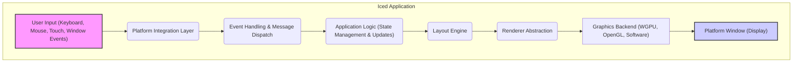
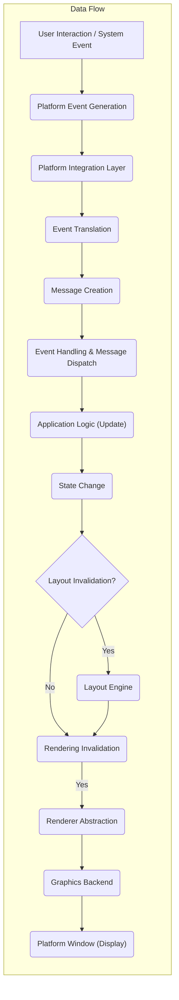

## Project Design Document: Iced GUI Framework - Improved

**Version:** 1.1
**Date:** October 26, 2023
**Author:** AI Software Architect

### 1. Introduction

This document provides an enhanced design overview of the Iced GUI framework, an open-source, cross-platform GUI library written in Rust. This improved version aims for greater clarity and detail regarding the architecture, components, and data flow within Iced, specifically tailored for effective threat modeling and security analysis.

### 2. Goals

The primary goals of Iced are:

* **Simplicity:** Provide an intuitive and easy-to-use API for building graphical user interfaces.
* **Type Safety:** Leverage Rust's strong type system and ownership model to prevent common GUI-related errors and memory safety issues.
* **Cross-Platform Compatibility:**  Support major desktop operating systems (Windows, macOS, Linux) and offer potential for web platform support through technologies like WebAssembly.
* **Performance:** Achieve efficient rendering and responsive event handling for a smooth user experience.
* **Extensibility:** Enable developers to create custom and reusable widgets, integrate with external libraries, and adapt the framework to specific needs.

### 3. Architecture Overview

Iced employs a reactive, event-driven architecture. User interactions and system events trigger messages that update the application state, leading to UI re-renders. The core components are interconnected and work collaboratively to manage the application lifecycle.

### 4. Component Details

This section provides a more detailed breakdown of the key components within the Iced framework:

* **User Input:** Represents all forms of user interaction and system-generated events:
    * Keyboard events (key presses, releases, text input).
    * Mouse events (movements, button clicks, scrolling, cursor enter/leave).
    * Touch events (gestures, taps).
    * Window events (resize, move, focus changes, close requests).

* **Platform Integration Layer:** This layer abstracts away platform-specific details, providing a consistent interface for the rest of the framework:
    * **Windowing:**  Manages the creation, manipulation, and destruction of application windows using libraries like `winit`.
    * **Event Polling:**  Continuously monitors the operating system for new input events.
    * **Platform Services:** Provides access to platform-specific functionalities (e.g., clipboard, timers).

* **Event Handling & Message Dispatch:** This crucial component manages the flow of events and messages within the application:
    * **Event Translation:** Converts raw platform events into Iced-specific event types.
    * **Message Queuing:**  Maintains a queue of messages to be processed.
    * **Message Dispatch:**  Routes messages to the appropriate parts of the application (typically the application's `update` function).

* **Application Logic (State Management & Updates):** This is where the core application logic resides, defined by the developer:
    * **State Definition:**  Defines the data structures that represent the application's state.
    * **Update Function:**  A function that takes a message and the current state as input and returns a new (or updated) state and potentially commands to be executed. This follows an Elm-like architecture pattern.
    * **Command Handling:**  Manages side effects and asynchronous operations triggered by the update function.

* **Layout Engine:** Responsible for determining the size and position of each widget in the UI:
    * **Layout Tree:**  Represents the hierarchical structure of the user interface.
    * **Layout Algorithms:**  Implements algorithms (often inspired by flexbox) to calculate widget layouts based on constraints and available space.
    * **Constraint Propagation:**  Passes size constraints down the widget tree.

* **Renderer Abstraction:** Provides an abstraction layer over different graphics backends, allowing Iced to be backend-agnostic:
    * **Rendering Primitives:** Defines common drawing operations (e.g., drawing rectangles, text, images).
    * **Backend Interface:**  Defines the interface that concrete graphics backends must implement.

* **Graphics Backend (WGPU, OpenGL, Software):**  The actual implementation responsible for drawing the UI on the screen:
    * **WGPU:** A modern graphics API that runs on top of native graphics APIs (like Vulkan, Metal, DirectX 12) and in the browser via WebGPU.
    * **OpenGL:** A widely adopted but older graphics API.
    * **Software Rendering:** A fallback option that performs rendering on the CPU.

* **Platform Window (Display):**  The operating system's window that hosts the rendered UI. It handles:
    * **Window Creation and Management:**  Interacting with the OS to create and manage the application window.
    * **Swapchain Management:**  Managing the buffers used for rendering and displaying the output.

* **Widgets:** Reusable UI building blocks with their own state, rendering logic, and event handling:
    * **Core Widgets:**  Basic widgets provided by Iced (e.g., buttons, text inputs, sliders, containers).
    * **Custom Widgets:** Widgets created by developers to extend Iced's functionality.
    * **State Management (within widgets):** Some widgets may manage their own internal state.

* **Theme:** Defines the visual appearance of the application:
    * **Style Definitions:**  Specifies colors, fonts, spacing, and other visual attributes.
    * **Theme Application:**  Applies the defined styles to widgets during rendering.

### 5. Data Flow

The data flow in an Iced application follows a predictable pattern:

1. **User Interaction or System Event:** An event occurs (e.g., a mouse click, a window resize).
2. **Platform Event Generation:** The operating system generates a raw event.
3. **Platform Integration:** The `Platform Integration Layer` receives the raw event.
4. **Event Translation:** The event is translated into an Iced-specific event.
5. **Message Creation:**  The event often triggers the creation of a message representing the user's intent or the system's state change.
6. **Message Dispatch:** The message is added to the `Event Handling & Message Dispatch` queue.
7. **Application Logic (Update):** The application's `update` function processes the message and updates the application state.
8. **State Change:** The application's state is modified based on the message.
9. **Layout Invalidation (Conditional):** If the state change affects the UI layout, the layout is marked as invalid.
10. **Layout Calculation (If Invalid):** The `Layout Engine` recalculates the layout of the UI.
11. **Rendering Invalidation:** The UI is marked for re-rendering.
12. **Rendering:** The `Renderer Abstraction` uses the selected `Graphics Backend` to draw the UI based on the current state and layout.
13. **Display:** The rendered output is presented on the `Platform Window`.

### 6. Communication Paths

Understanding how components communicate is crucial for threat modeling:

* **Events:** The primary mechanism for communicating user interactions and system events from the `Platform Integration Layer` to the `Event Handling & Message Dispatch`.
* **Messages:** The central way to trigger state updates in the `Application Logic`. Messages are dispatched from `Event Handling` to the `update` function.
* **Function Calls:** Components within the same layer often communicate through direct function calls (e.g., the `Layout Engine` querying widget properties).
* **Callbacks/Closures:** Used for event handling within widgets and for asynchronous operations.
* **Rendering Commands:** The `Renderer Abstraction` communicates with the `Graphics Backend` through a series of rendering commands.

### 7. State Management

Iced encourages a unidirectional data flow and explicit state management:

* **Single Source of Truth:** The application state is typically held in a central location within the `Application Logic`.
* **Immutable Updates:** The `update` function should ideally produce a new state rather than mutating the existing one, promoting predictability and easier debugging.
* **Message-Driven Updates:** All state changes are triggered by processing messages.
* **Widget-Local State:** While the main application state is central, individual widgets may manage their own internal state for UI-specific concerns.

### 8. Security Considerations (Pre-Threat Modeling)

Building upon the previous considerations, here are more specific areas for security analysis:

* **Input Sanitization and Validation:**
    * **Threat:** Injection attacks (e.g., cross-site scripting if rendering web content, command injection if passing input to external processes).
    * **Focus:**  Examine how user input is handled in text input widgets and any logic that processes external data.
* **Graphics Backend Vulnerabilities:**
    * **Threat:** Exploiting vulnerabilities in the underlying graphics drivers or APIs to cause crashes, information leaks, or even arbitrary code execution.
    * **Focus:** Analyze the interaction with the chosen graphics backend (WGPU, OpenGL) and any external libraries used for rendering.
* **State Mutation and Integrity:**
    * **Threat:** Unauthorized modification of the application state leading to unexpected behavior or security breaches.
    * **Focus:** Review the `update` function and how messages are handled to ensure state transitions are secure and predictable.
* **Dependency Vulnerabilities:**
    * **Threat:** Exploiting known vulnerabilities in third-party crates used by Iced or the application.
    * **Focus:**  Analyze the project's dependency tree and the security practices of those dependencies. Utilize tools for vulnerability scanning.
* **Platform Security Boundaries:**
    * **Threat:**  Escaping the sandbox or exploiting vulnerabilities in the underlying operating system.
    * **Focus:**  Consider interactions with platform-specific APIs and the security measures provided by the OS.
* **WebAssembly Security (if applicable):**
    * **Threat:** Standard web security risks like XSS, CSRF, and issues related to the WebAssembly sandbox.
    * **Focus:**  If targeting the web, analyze the communication between the WebAssembly module and the surrounding JavaScript environment, and the enforcement of web security policies.
* **Custom Widget Security:**
    * **Threat:**  Vulnerabilities introduced by developers in custom widgets, especially in their rendering logic or event handling.
    * **Focus:**  If custom widgets are used, their implementation needs careful scrutiny.
* **Command Handling Security:**
    * **Threat:**  Command injection if commands are constructed dynamically based on user input without proper sanitization.
    * **Focus:**  Analyze how commands are defined, triggered, and executed.

### 9. Deployment Model

Iced applications are typically deployed as:

* **Native Desktop Applications:**
    * **Compilation:** Rust code is compiled to platform-specific executables using the Rust toolchain.
    * **Packaging:** Executables are packaged along with necessary resources (assets, libraries).
    * **Distribution:** Distributed through platform-specific installers or package managers.
* **Web Applications (via WebAssembly):**
    * **Compilation:** Rust code is compiled to WebAssembly (Wasm).
    * **Integration:** The Wasm module is integrated into a web page, often with JavaScript glue code for interaction with the browser environment.
    * **Deployment:** Deployed as part of a standard web application.

### 10. Technology Stack

* **Core Language:** Rust
* **Windowing and Event Handling:** `winit`
* **Asynchronous Programming (Optional):** `async-std` or `tokio`
* **Graphics Abstraction:** `wgpu-rs` (for WGPU backend) or platform-specific OpenGL bindings.
* **Image Loading (Example):** `image` crate
* **Text Rendering (Example):** `rusttype` or `fontdue`
* **User Interface Primitives:** Provided by the `iced_core` and `iced_widget` crates.

### 11. Assumptions and Constraints

* **Rust's Memory Safety:** Iced relies on Rust's memory safety guarantees to prevent many common memory-related vulnerabilities.
* **Secure Development Practices:** Developers using Iced are expected to follow secure coding practices when implementing their application logic.
* **Up-to-Date Dependencies:** Maintaining up-to-date dependencies is crucial for mitigating known vulnerabilities.
* **Platform Security:** The security of Iced applications is inherently tied to the security of the underlying operating system and hardware.

This improved design document provides a more detailed and nuanced understanding of the Iced GUI framework, specifically focusing on aspects relevant to threat modeling. It highlights key components, data flows, communication paths, and potential security considerations to facilitate a more thorough security analysis.