## Project Design Document: Iced GUI Framework - Improved

**1. Introduction**

This document provides an enhanced architectural design of the Iced GUI framework, a cross-platform GUI library for Rust emphasizing simplicity, type safety, and a pleasant developer experience. This document aims to provide a more detailed understanding of the system's components, their interactions, and the flow of data, serving as a robust foundation for subsequent threat modeling and security analysis.

**2. Goals and Objectives**

* Provide a clear, concise, and more detailed overview of the Iced architecture.
* Identify key components and their specific responsibilities and sub-components.
* Describe the data flow and interactions between components with greater granularity.
* Highlight relevant technologies, dependencies, and their roles within the framework.
* Serve as a comprehensive basis for identifying potential security vulnerabilities, attack vectors, and areas for security hardening.

**3. Architectural Overview**

Iced employs a reactive, message-passing architecture where the user interface is a direct reflection of the application's state. The framework orchestrates state management, event processing, layout calculations, and rendering to present the UI.

```mermaid
graph LR
    subgraph "User"
        U["User Interaction"]
    end
    subgraph "Application Layer"
        AL_App["Application Logic"]
        AL_State["Application State"]
    end
    subgraph "Iced Framework Core"
        subgraph "Event Management"
            EM_Platform["Platform Event Receiver"]
            EM_Internal["Internal Event Bus"]
            EM_Dispatch["Message Dispatcher"]
        end
        subgraph "UI Definition & Layout"
            UI_WidgetTree["Widget Tree"]
            UI_LayoutEngine["Layout Calculation"]
            UI_Styling["Styling Engine"]
        end
        subgraph "Rendering Abstraction"
            RA_GraphicsAPI["Graphics API Abstraction (WGPU)"]
            RA_Renderer["Renderer Core"]
            RA_Primitives["Rendering Primitives"]
        end
    end
    subgraph "Platform Layer"
        PL_Windowing["Window Management"]
        PL_Input["Input Handling (Keyboard, Mouse, Touch)"]
        PL_Timers["Timer Events"]
    end

    U -- "User Events" --> PL_Input
    PL_Input -- "Platform Events" --> EM_Platform
    EM_Platform -- "Internal Events" --> EM_Internal
    EM_Internal -- "Messages" --> EM_Dispatch
    EM_Dispatch -- "Messages/Commands" --> AL_App
    AL_App -- "State Updates" --> AL_State
    AL_State -- "Widget Tree Definition" --> UI_WidgetTree
    UI_WidgetTree -- "Layout Requirements" --> UI_LayoutEngine
    UI_Styling -- "Styling Information" --> UI_LayoutEngine
    UI_LayoutEngine -- "Rendering Instructions" --> RA_Renderer
    RA_Renderer -- "Graphics API Calls" --> RA_GraphicsAPI
    RA_GraphicsAPI -- "Platform-Specific Rendering" --> PL_Windowing
    PL_Timers -- "Timer Events" --> EM_Platform
```

**4. Component Breakdown**

This section provides a more detailed breakdown of the key components within the Iced framework.

* **User Interaction:** Represents the user's direct engagement with the application's interface through input devices like mice, keyboards, and touchscreens.

* **Application Layer:** Contains the code specific to the application built using Iced.
    * **Application Logic:** The developer-defined code that implements the application's core functionality, business rules, and data processing. It receives messages from Iced and updates the application state.
    * **Application State:** Holds the data that defines the current state of the application. Changes to this state trigger UI updates.

* **Iced Framework Core:** The central part of the Iced library, responsible for managing the UI lifecycle.
    * **Event Management:** Handles events from the platform and within the framework.
        * **Platform Event Receiver:**  Receives raw events from the operating system (via the Platform Layer).
        * **Internal Event Bus:**  A mechanism for communicating events and messages within the Iced framework.
        * **Message Dispatcher:**  Routes messages to the appropriate parts of the Application Logic for processing.
    * **UI Definition & Layout:**  Manages the structure and appearance of the user interface.
        * **Widget Tree:** A hierarchical representation of the UI elements (widgets) that make up the application's interface.
        * **Layout Engine:**  Calculates the size and position of each widget in the `Widget Tree` based on layout rules, constraints, and available space.
        * **Styling Engine:**  Applies visual styles (colors, fonts, spacing) to the widgets based on themes and user-defined styles.
    * **Rendering Abstraction:**  Handles the process of drawing the UI on the screen.
        * **Graphics API Abstraction (WGPU):** Provides an interface to the WGPU graphics API, enabling cross-platform rendering by abstracting away platform-specific graphics details.
        * **Renderer Core:**  Takes the rendering instructions from the `Layout Engine` and translates them into commands for the `Graphics API Abstraction`.
        * **Rendering Primitives:** Defines the basic graphical elements (rectangles, text, images) that can be drawn by the renderer.

* **Platform Layer:** Provides an interface to platform-specific functionalities.
    * **Window Management:**  Handles the creation, manipulation, and destruction of application windows.
    * **Input Handling (Keyboard, Mouse, Touch):**  Receives and processes raw input events from the operating system, translating them into a platform-agnostic format for Iced.
    * **Timer Events:**  Provides a mechanism for scheduling events to occur at specific times or intervals.

**5. Data Flow (Detailed)**

The flow of data within an Iced application can be described in the following steps:

1. **User Interaction:** A user interacts with a UI element (e.g., clicks a button, types in a text field).
2. **Platform Input Event:** The operating system detects the interaction and generates a platform-specific input event.
3. **Platform Input Handling:** The `Platform Layer::Input Handling` component receives the raw input event.
4. **Platform Event Translation:** The `Platform Layer::Input Handling` translates the platform-specific event into a platform-agnostic Iced event.
5. **Platform Event Emission:** The translated event is passed to the `Iced Framework Core::Event Management::Platform Event Receiver`.
6. **Internal Event Propagation:** The `Platform Event Receiver` converts the platform event into an internal Iced event and publishes it on the `Internal Event Bus`.
7. **Message Creation:** Based on the event and the current state, Iced (or the application logic via Iced's mechanisms) creates a message representing the user's action or a system event.
8. **Message Dispatch:** The `Iced Framework Core::Event Management::Message Dispatcher` routes the message to the appropriate handler within the `Application Layer::Application Logic`.
9. **State Update:** The `Application Logic` receives the message and updates the `Application Layer::Application State` accordingly.
10. **Widget Tree Rebuild (if necessary):** If the state change requires a UI update, the `Application Logic` defines a new `Iced Framework Core::UI Definition & Layout::Widget Tree` based on the updated state.
11. **Layout Calculation:** The `Iced Framework Core::UI Definition & Layout::Layout Engine` calculates the layout (position and size) of each widget in the `Widget Tree`, taking into account styling information from the `Styling Engine`.
12. **Rendering Instructions Generation:** The `Layout Engine` generates rendering instructions based on the calculated layout and widget properties.
13. **Rendering API Calls:** The `Iced Framework Core::Rendering Abstraction::Renderer Core` translates the rendering instructions into calls to the `Graphics API Abstraction (WGPU)`.
14. **Graphics API Execution:** The `Graphics API Abstraction (WGPU)` translates the calls into platform-specific graphics API commands (e.g., DirectX, Vulkan, Metal).
15. **Window Update:** The `Platform Layer::Window Management` utilizes the platform's windowing system to render the UI on the screen.

**6. Security Considerations**

Security is a crucial aspect for applications built with Iced. Here's a breakdown of potential security considerations:

* **Input Validation (Application Layer):**  The primary responsibility for sanitizing and validating user inputs lies within the `Application Layer::Application Logic`. Failure to do so can lead to vulnerabilities like command injection or cross-site scripting (if the application interacts with web content).
* **Rendering Engine Security (Iced Framework Core):**
    * **WGPU Vulnerabilities:**  As Iced relies on WGPU, vulnerabilities in WGPU's implementation could potentially be exploited to cause crashes or even arbitrary code execution. Regular updates to the WGPU dependency are crucial.
    * **Resource Exhaustion:** Maliciously crafted UI elements or rapid state changes could potentially overwhelm the rendering pipeline, leading to denial-of-service.
* **Platform-Specific Vulnerabilities (Platform Layer):**  Security flaws in the underlying operating system's windowing system or input handling mechanisms could be exploited. Iced's security is partially dependent on the security of the platforms it runs on.
* **Dependency Management (Build Process):**  Iced and applications built with it rely on numerous Rust crates. Using crates with known vulnerabilities can introduce security risks. Employing tools for dependency scanning and regularly updating dependencies is essential.
* **Application Logic Security (Application Layer):**
    * **State Management Issues:** Improper handling of application state, especially if it involves sensitive data, can lead to information leaks or unauthorized access.
    * **Logic Flaws:**  Vulnerabilities in the application's logic can be exploited to bypass intended functionality or gain unauthorized access.
* **Resource Management (Application Layer & Iced Framework Core):**
    * **Memory Leaks:**  Improper memory management in the application logic or within Iced itself can lead to resource exhaustion and potential crashes.
    * **File System Access:** If the application interacts with the file system, proper permissions and validation are necessary to prevent unauthorized access or modification of files.
* **Communication Security (If Applicable):** If the Iced application communicates with external services (e.g., via network requests), standard security practices for network communication (TLS/SSL, authentication, authorization) must be implemented in the `Application Logic`.

**7. Technologies Used**

* **Rust:** The core programming language, providing memory safety, performance, and concurrency.
* **WGPU (WebGPU):** A cross-platform, modern graphics API that provides access to GPU capabilities.
* **`iced_wgpu`:**  The Iced renderer implementation built on top of WGPU.
* **`iced_core`:**  The core logic and abstractions of the Iced framework, independent of the rendering backend.
* **`iced_widget`:**  Provides a library of built-in UI widgets.
* **`futures` and `async-std` (or `tokio`):**  Rust's asynchronous programming libraries, used for handling events and non-blocking operations.
* **`winit`:** A window creation and event loop management library used by `iced_wgpu`.
* **Various other Rust Crates:** Iced leverages a rich ecosystem of Rust crates for tasks such as text rendering, image decoding, and platform integration.

**8. Deployment Considerations**

Deploying Iced applications involves compiling the Rust code for the target platform and distributing the resulting executable along with any necessary runtime libraries. Security considerations during deployment include:

* **Code Signing:** Digitally signing application binaries provides assurance to users about the software's authenticity and integrity, helping to prevent tampering.
* **Distribution Channels:**  Distributing applications through trusted app stores or official websites reduces the risk of users downloading malware-infected versions.
* **Update Mechanisms:** Implementing secure and reliable update mechanisms allows for patching vulnerabilities and delivering new features. Automatic updates, with user consent, are often preferred.
* **Sandboxing:** On some platforms, sandboxing technologies can be used to isolate the application and limit its access to system resources, mitigating the impact of potential vulnerabilities.
* **Dependency Bundling:**  Carefully managing and bundling dependencies ensures that the application uses the intended versions of libraries and avoids relying on potentially vulnerable system-wide installations.

**9. Future Considerations**

The Iced project is continuously evolving. Potential future developments and considerations include:

* **Enhanced Accessibility Features:** Improving support for screen readers and other assistive technologies to make Iced applications more inclusive.
* **WebAssembly Support:**  Exploring the possibility of running Iced applications within web browsers using WebAssembly, expanding the reach of the framework.
* **Improved Theming and Styling Capabilities:** Providing more flexible and powerful mechanisms for customizing the appearance of Iced applications.
* **Advanced Rendering Features:**  Incorporating support for more advanced graphics techniques and effects.
* **Formal Security Audits:**  Conducting thorough security audits of the Iced codebase to identify and address potential vulnerabilities proactively.

This improved design document provides a more detailed and nuanced understanding of the Iced GUI framework's architecture, components, and data flow. This enhanced information is crucial for conducting comprehensive threat modeling and ensuring the development of secure applications built with Iced.