# Project Design Document: Iced GUI Framework

**Version:** 1.1
**Date:** October 26, 2023
**Author:** Gemini (AI Language Model)
**Project:** Iced GUI Framework (https://github.com/iced-rs/iced)

## 1. Introduction

This document provides an enhanced and detailed design overview of the Iced GUI framework. It aims to comprehensively describe the system's architecture, key components, data flow, and interactions, with a stronger focus on aspects relevant to security analysis. This document will serve as a robust foundation for subsequent threat modeling activities.

Iced is a cross-platform GUI framework for Rust focused on simplicity, type safety, and a reactive programming model. Inspired by Elm, it aims to provide a pleasant and efficient developer experience for building robust desktop applications.

## 2. Goals and Objectives

The primary goal of this document is to provide a comprehensive and security-focused architectural understanding of Iced for effective threat modeling. Specific objectives include:

*   Clearly outlining the major components of the Iced framework and their interdependencies.
*   Describing the detailed interactions and data flow between these components, highlighting trust boundaries.
*   Identifying potential attack surfaces and areas of interest for security assessment with concrete examples.
*   Providing clear visual representations of the system architecture and data flow.

## 3. System Overview

Iced applications operate on a central, reactive application loop. This loop manages the application's state, processes events originating from user interactions or external sources, and renders the user interface based on the current state. The framework offers high-level abstractions for managing application state, handling diverse user inputs, and efficiently drawing graphical elements across different platforms.

Key characteristics of Iced include:

*   **Cross-platform Compatibility:** Designed to run on multiple operating systems, including Windows, macOS, Linux, and potentially web environments via WebAssembly.
*   **Reactive Programming Model:**  UI updates are triggered by changes in the application's state, simplifying state management and UI synchronization.
*   **Rust's Type Safety:** Leverages Rust's strong type system to minimize runtime errors and enhance application reliability.
*   **Modular Widget System:** Provides a rich set of reusable UI components (widgets) that can be composed to build complex user interfaces.
*   **Event-Driven Architecture:** User interactions and external events drive the application logic, triggering state updates and UI re-renders.

## 4. Component Description

This section provides a detailed description of the major components within the Iced framework and their specific responsibilities.

*   **`Application` Trait:**
    *   The central interface defining the core logic of an Iced application.
    *   Developers implement this trait to define application-specific behavior.
    *   Key methods include:
        *   `update(&mut self, message: Self::Message)`: Handles incoming messages (events) and updates the application's internal state. This is a critical point for input validation and security checks.
        *   `view(&self) -> Element<'_, Self::Message>`: Describes the user interface as a tree of widgets based on the current application state. This output is used for rendering.
        *   `subscription(&self) -> Subscription<Self::Message>`: Defines external event sources the application should listen to (e.g., timers, file system events).
        *   `theme(&self) -> Theme`: Specifies the visual theme of the application.
        *   `style(&self) -> Style`: Allows for custom styling of individual widgets.
    *   Serves as the primary entry point and orchestrator of the application's behavior.

*   **`Runtime`:**
    *   The core engine responsible for driving the application loop and managing the lifecycle of an Iced application.
    *   Manages the event queue, receiving events from the backend and dispatching them to the `update` function.
    *   Orchestrates the rendering process by translating the output of the `view` function into platform-specific draw commands.
    *   Interacts directly with the platform-specific `Backend` for window management, input handling, and rendering.

*   **`Backend` (Platform-Specific):**
    *   Provides the low-level interface to the underlying operating system's windowing system and graphics capabilities.
    *   Handles crucial platform-specific tasks:
        *   Window creation and management (opening, closing, resizing).
        *   Receiving raw input events from devices (keyboard, mouse, touch). This is a potential entry point for malicious input.
        *   Presenting the rendered output to the screen.
    *   Common implementations utilize libraries like `winit` for desktop platforms or browser APIs when targeting WebAssembly.

*   **`Event Loop`:**
    *   A continuous loop that constantly polls for events from the `Backend`.
    *   Queues these raw events for processing by the `Runtime`.
    *   Ensures timely processing of user interactions and system events.

*   **`Input Handling`:**
    *   Processes raw input events received from the `Backend`.
    *   Translates these low-level events into higher-level, semantic Iced messages (e.g., button press, text input).
    *   Dispatches these processed messages to the `update` function of the `Application` trait. Proper sanitization and validation at this stage are crucial.

*   **`Widget Tree`:**
    *   A hierarchical data structure representing the user interface, generated by the `view` function.
    *   Composed of various `Widget` implementations (e.g., buttons, text inputs, containers, custom widgets).
    *   This tree is used by the `Layout` and `Renderer` components to determine the visual presentation.

*   **`Layout`:**
    *   Calculates the precise position and size of each widget within the `Widget Tree`.
    *   Determines how widgets are arranged and spaced within their parent containers, respecting layout constraints.

*   **`Renderer`:**
    *   Takes the output of the `Layout` process and the `Widget Tree` as input.
    *   Generates platform-specific draw commands (e.g., drawing shapes, text, images) based on the visual representation of the widgets.
    *   Sends these commands to the `Backend` for actual rendering on the screen.
    *   Supports different rendering backends like `iced_wgpu` (using WebGPU) or `iced_glow` (using OpenGL).

*   **`Subscription`:**
    *   A mechanism allowing the `Application` to subscribe to external event sources that are not directly initiated by user input.
    *   Examples include:
        *   Time-based events (e.g., periodic updates).
        *   File system events (e.g., changes to a watched file).
        *   Custom events from external systems.
    *   Events from subscriptions are also dispatched as messages to the `update` function.

*   **`Command`:**
    *   Represents an asynchronous operation or side effect that the `Application` can request.
    *   Returned by the `update` function.
    *   Executed by the `Runtime`, potentially triggering further messages back to the `update` function upon completion or failure. Examples include network requests or file I/O.

## 5. Data Flow

The following diagram illustrates the typical data flow within an Iced application, highlighting potential trust boundaries.

```mermaid
graph LR
    subgraph "User Domain"
        A["'User Input' (Keyboard, Mouse)"]
    end
    subgraph "Iced Application"
        B["'Backend' (winit, etc.)"]
        C["'Event Loop'"]
        D["'Input Handling'"]
        E["'Runtime'"]
        F["'Application Trait (update)'"]
        G["'Application State'"]
        H["'Application Trait (view)'"]
        I["'Widget Tree'"]
        J["'Layout'"]
        K["'Renderer'"]
    end
    subgraph "System Domain"
        L["'Rendered Output'"]
    end

    A -- "Raw Input Events" --> B
    B -- "Raw Input Events" --> C
    C -- "Raw Input Events" --> D
    D -- "Iced Messages" --> E
    E -- "Iced Messages" --> F
    F -- "State Updates" --> G
    G -- "State Data" --> H
    H -- "Widget Tree Definition" --> I
    I -- "Widget Tree" --> J
    J -- "Layout Information" --> K
    K -- "Draw Commands" --> B
    B -- "Rendered Frames" --> L

    style A fill:#ccf,stroke:#333,stroke-width:2px
    style L fill:#ccf,stroke:#333,stroke-width:2px
    style B fill:#f9f,stroke:#333,stroke-width:2px,color:red
    style E fill:#aaf,stroke:#333,stroke-width:2px
    style F fill:#aaf,stroke:#333,stroke-width:2px

    linkStyle 0,1,2 color:red,strokeWidth:2px;
```

Detailed data flow steps:

*   **User Interaction:** The user interacts with the application through input devices.
*   **Backend:** The platform-specific `Backend` receives raw input events. This is a **trust boundary** as the application receives data from the external environment.
*   **Event Loop:** The `Event Loop` retrieves these raw events from the `Backend`.
*   **Input Handling:** The `Input Handling` component processes and translates the raw events into semantic Iced messages. **Input sanitization and validation should occur here.**
*   **Runtime:** The `Runtime` receives the Iced messages.
*   **Application Trait (`update`):** The `Runtime` dispatches the message to the `update` function of the `Application` trait. This is where application logic processes events and updates the application's state. **This is a critical point for enforcing application-specific security policies.**
*   **Application State:** The `update` function modifies the application's internal state based on the received message.
*   **Application Trait (`view`):** The `Runtime` calls the `view` function to generate a new `Widget Tree` based on the updated state.
*   **Widget Tree:** The `view` function returns a description of the UI as a tree of widgets.
*   **Layout:** The `Layout` component calculates the position and size of each widget in the tree.
*   **Renderer:** The `Renderer` generates platform-specific draw commands based on the layout and widget properties.
*   **Backend:** The `Renderer` sends these draw commands to the `Backend`.
*   **Rendered Output:** The `Backend` renders the UI to the screen.

## 6. Security Considerations

This section provides a more detailed examination of potential security concerns within the Iced framework, offering concrete examples.

*   **Input Validation and Sanitization:**
    *   **Vulnerability:**  Failure to properly validate and sanitize user input within the `update` function can lead to various vulnerabilities. For example, processing untrusted text input without sanitization could lead to cross-site scripting (XSS) if Iced were used in a web context (via WebAssembly) or other injection attacks.
    *   **Mitigation:** Implement robust input validation within the `update` function, ensuring that all user-provided data conforms to expected formats and constraints. Sanitize input to remove or escape potentially harmful characters.

*   **Resource Exhaustion:**
    *   **Vulnerability:** Maliciously crafted input or a large number of events could potentially overwhelm the application, leading to excessive CPU or memory usage, causing a denial-of-service (DoS). For instance, sending a large number of rapid events could flood the event queue.
    *   **Mitigation:** Implement rate limiting or throttling for event processing. Design the `view` function to avoid creating excessively complex widget trees that consume significant resources.

*   **Dependency Management:**
    *   **Vulnerability:** Iced relies on external crates. Vulnerabilities in these dependencies could be exploited to compromise applications built with Iced.
    *   **Mitigation:** Regularly audit and update dependencies to their latest secure versions. Utilize tools like `cargo audit` to identify known vulnerabilities. Consider using dependency scanning tools in CI/CD pipelines.

*   **Unsafe Code:**
    *   **Vulnerability:** The use of `unsafe` code blocks within Iced or its dependencies can introduce memory safety issues if not handled correctly.
    *   **Mitigation:** Minimize the use of `unsafe` code. Thoroughly review and audit any `unsafe` code blocks for potential vulnerabilities.

*   **Platform-Specific Backend Vulnerabilities:**
    *   **Vulnerability:** Security flaws in the underlying platform-specific backend (e.g., `winit`, graphics drivers) could be exploited to compromise the application.
    *   **Mitigation:** Stay updated with security advisories for the backend libraries used. Encourage users to keep their operating systems and drivers updated.

*   **Command Handling Security:**
    *   **Vulnerability:** If `Command`s involve external interactions (e.g., network requests, file system access), improper authorization or lack of validation can lead to security breaches. For example, a command that reads a file path provided directly by user input without validation could allow access to sensitive files.
    *   **Mitigation:** Implement strict validation and authorization checks for any operations performed by `Command`s, especially those interacting with external resources.

*   **WebAssembly Specific Concerns (if applicable):**
    *   **Vulnerability:** When targeting the web via WebAssembly, applications are susceptible to standard web security vulnerabilities like cross-site scripting (XSS) if user-provided content is not handled carefully in the `view` function.
    *   **Mitigation:** Implement proper output encoding and follow web security best practices, including setting appropriate Content Security Policy (CSP) headers.

## 7. Deployment Considerations

Deploying Iced applications securely involves several key considerations:

*   **Code Signing:** Signing the application executable with a trusted certificate helps ensure the application's authenticity and integrity, preventing tampering.
*   **Secure Update Mechanisms:** Implement secure and reliable update mechanisms to deliver patches and new features, addressing potential vulnerabilities promptly.
*   **Principle of Least Privilege:** When deploying, ensure the application runs with the minimum necessary permissions required for its functionality. Avoid running with elevated privileges unnecessarily.
*   **Dependency Bundling:** Carefully manage and bundle dependencies to avoid including unnecessary libraries that could introduce vulnerabilities.
*   **Distribution Channels:** Distribute applications through trusted channels to minimize the risk of users downloading compromised versions.

## 8. Diagrams

The data flow diagram in section 5 provides a visual representation of the system architecture and data flow.

## 9. Assumptions and Constraints

*   This design document focuses on the core architectural components of the Iced framework and their interactions.
*   Detailed implementation specifics of individual widgets or rendering backends are not exhaustively covered.
*   The security considerations outlined are intended to be comprehensive but may not cover all potential vulnerabilities. Continuous security assessment is recommended.
*   The document assumes a foundational understanding of Rust programming principles.

## 10. Future Considerations

*   Conducting detailed security audits of individual widget implementations to identify potential vulnerabilities.
*   Performing in-depth security reviews of Iced's dependencies and their potential impact.
*   Exploring the feasibility of incorporating security-focused features directly into the framework, such as built-in input sanitization helpers or mechanisms for enforcing security policies.
*   Developing guidelines and best practices for developers building secure applications with Iced.

This enhanced document provides a more detailed and security-conscious understanding of the Iced GUI framework, serving as a valuable resource for threat modeling and security analysis.