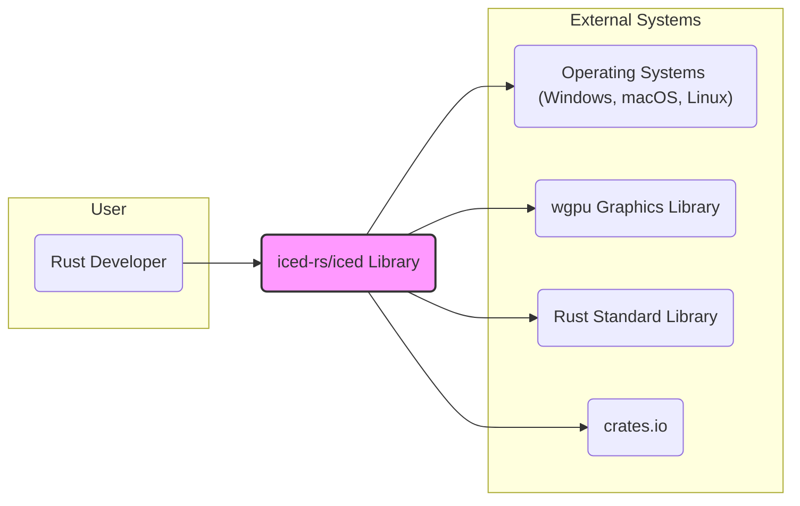

# BUSINESS POSTURE

This project, `iced-rs/iced`, is a cross-platform GUI library for Rust.

- Business Priorities and Goals:
  - Provide a user-friendly and productive framework for Rust developers to create graphical applications.
  - Enable the development of cross-platform applications with a single codebase, targeting desktop (Windows, macOS, Linux) and web (via WebAssembly) environments.
  - Offer a performant and efficient GUI solution leveraging Rust's capabilities.
  - Foster a strong community around the library to ensure its long-term sustainability and growth.
  - Encourage adoption of Rust for GUI application development.

- Business Risks:
  - Adoption risk: Developers may prefer established GUI frameworks or find `iced` too complex or lacking features compared to alternatives.
  - Security vulnerabilities: Bugs in the library could lead to security issues in applications built with `iced`.
  - Performance bottlenecks: Inefficient rendering or resource management could negatively impact application performance and user experience.
  - Community dependency: Reliance on community contributions for maintenance and feature development introduces risks if community support wanes.
  - Platform compatibility issues: Maintaining cross-platform compatibility across diverse operating systems and browser environments can be challenging.

# SECURITY POSTURE

- Existing Security Controls:
  - security control: GitHub repository with version control and history. Implemented in: GitHub.
  - security control: Open-source project, allowing for community security reviews. Implemented in: Project nature.
  - security control: Rust's memory safety features mitigate certain classes of vulnerabilities. Implemented in: Rust language.
  - accepted risk: Reliance on external dependencies (crates) which may have their own vulnerabilities. Accepted risk: Dependency management.
  - accepted risk: Potential for vulnerabilities in the core library code. Accepted risk: Software development.

- Recommended Security Controls:
  - security control: Implement automated dependency scanning to identify vulnerabilities in dependencies.
  - security control: Integrate static analysis security testing (SAST) tools into the CI/CD pipeline to detect potential code-level vulnerabilities.
  - security control: Establish a clear vulnerability reporting and response process.
  - security control: Conduct regular security code reviews, especially for critical components and contributions.
  - security control: Provide security guidelines and best practices for developers using `iced` to build applications.

- Security Requirements:
  - Authentication: Not directly applicable to the library itself. Applications built with `iced` may require authentication, which should be implemented by the application developer using appropriate methods outside of the `iced` library.
  - Authorization: Not directly applicable to the library itself. Applications built with `iced` will likely require authorization, which should be implemented by the application developer. `iced` should provide mechanisms to facilitate secure UI rendering based on application-level authorization decisions.
  - Input Validation: Applications built with `iced` must perform thorough input validation on all user inputs received through the GUI to prevent injection attacks (e.g., cross-site scripting if rendering web content, command injection if interacting with system commands). `iced` should provide safe and robust input handling mechanisms to assist developers in implementing input validation.
  - Cryptography: Not directly required by the core `iced` library. If applications built with `iced` require cryptography, they should use well-vetted, external cryptography libraries. `iced` should not implement custom cryptography. If `iced` provides any utilities related to data handling, ensure they do not inadvertently introduce cryptographic vulnerabilities.

# DESIGN

## C4 CONTEXT



- Context Diagram Elements:
  - - Name: Rust Developer
    - Type: User
    - Description: Software developers who use the `iced-rs/iced` library to build GUI applications in Rust.
    - Responsibilities: Develop GUI applications using the `iced` library. Integrate `iced` into their projects. Provide feedback and contributions to the `iced` project.
    - Security controls: Secure development practices in applications built with `iced`.

  - - Name: iced-rs/iced Library
    - Type: System
    - Description: A cross-platform GUI library written in Rust, providing components and tools for building graphical user interfaces.
    - Responsibilities: Provide a robust and user-friendly API for GUI development. Handle UI rendering and event management. Abstract platform-specific details.
    - Security controls: Input sanitization within the library (where applicable). Memory safety enforced by Rust. Vulnerability scanning and code reviews of the library codebase.

  - - Name: Operating Systems (Windows, macOS, Linux)
    - Type: External System
    - Description: Target operating systems where applications built with `iced` are deployed.
    - Responsibilities: Provide the underlying platform for running applications. Manage system resources. Handle system-level security.
    - Security controls: Operating system level security controls (firewall, access control, patching).

  - - Name: wgpu Graphics Library
    - Type: External System
    - Description: A WebGPU implementation that `iced` uses for hardware-accelerated graphics rendering.
    - Responsibilities: Provide low-level graphics rendering capabilities. Interface with GPU hardware.
    - Security controls: Security controls within the `wgpu` library. Dependency management for `wgpu`.

  - - Name: Rust Standard Library
    - Type: External System
    - Description: The standard library for the Rust programming language, providing core functionalities used by `iced`.
    - Responsibilities: Provide fundamental data structures, utilities, and system interfaces.
    - Security controls: Security controls within the Rust standard library.

  - - Name: crates.io
    - Type: External System
    - Description: The package registry for Rust crates, where the `iced` library is published and distributed.
    - Responsibilities: Host and distribute Rust crates. Manage crate versions and dependencies.
    - Security controls: crates.io security measures to prevent malicious packages.

## C4 CONTAINER

```mermaid
flowchart LR
    subgraph "User"
        Developer("Rust Developer")
    end
    subgraph "iced-rs/iced Library"
        CoreLib("Core Library")
        Examples("Examples & Demos")
        Docs("Documentation")
    end
    subgraph "External Systems"
        OS("Operating Systems")
        WGPU("wgpu")
        RustStd("Rust Standard Library")
        CratesIO("crates.io")
        RustCompiler("Rust Compiler")
    end

    Developer --> CoreLib
    Developer --> Examples
    Developer --> Docs

    CoreLib --> WGPU
    CoreLib --> OS
    CoreLib --> RustStd

    Examples --> CoreLib
    Examples --> OS

    Docs --> CoreLib

    RustCompiler --> CoreLib
    RustCompiler --> Examples
    RustCompiler --> Docs

    CoreLib --> CratesIO

    style "iced-rs/iced Library" fill:#f9f,stroke:#333,stroke-width:2px
```

- Container Diagram Elements:
  - - Name: Core Library
    - Type: Container (Rust Library)
    - Description: The main `iced` crate, containing the core logic for UI elements, layout, event handling, and rendering.
    - Responsibilities: Provide the API for building GUI applications. Manage UI state and updates. Render UI elements using `wgpu`. Handle user input events.
    - Security controls: Input sanitization within UI components. Memory safety enforced by Rust. Regular code reviews and vulnerability scanning.

  - - Name: Examples & Demos
    - Type: Container (Rust Applications)
    - Description: Example applications and demos showcasing the features and usage of the `iced` library.
    - Responsibilities: Demonstrate how to use `iced`. Provide practical examples for developers. Serve as test cases for the library.
    - Security controls: Code reviews of example applications. Ensure examples follow security best practices where applicable (e.g., input handling).

  - - Name: Documentation
    - Type: Container (Documentation Website/Files)
    - Description: Documentation for the `iced` library, including API documentation, tutorials, and guides.
    - Responsibilities: Provide comprehensive documentation for developers. Explain concepts and usage patterns.
    - Security controls: Secure hosting of documentation website. Review documentation content for accuracy and security advice.

  - - Name: Rust Compiler
    - Type: External System (Tool)
    - Description: The Rust compiler used to build the `iced` library and applications using it.
    - Responsibilities: Compile Rust code into executable binaries or libraries.
    - Security controls: Security of the Rust compiler toolchain.

  - - Name: Operating Systems, wgpu, Rust Standard Library, crates.io
    - Type: External Systems
    - Description: Same as in the Context Diagram.
    - Responsibilities: Same as in the Context Diagram.
    - Security controls: Same as in the Context Diagram.

## DEPLOYMENT

Deployment scenario: Desktop application deployment (e.g., for Windows).

```mermaid
flowchart LR
    subgraph "Developer Machine"
        DevEnv("Developer Environment")
    end
    subgraph "Build Environment"
        CI("CI/CD System (GitHub Actions)")
        RustToolchain("Rust Toolchain")
        DependencyCache("Dependency Cache (crates.io Cache)")
        Builder("Build Agent")
    end
    subgraph "Target Environment (User Machine)"
        UserOS("User Operating System (Windows)")
        UserHardware("User Hardware (CPU, GPU, Memory)")
        DeployedApp("Deployed Iced Application")
    end

    DevEnv --> CI
    CI --> RustToolchain
    CI --> DependencyCache
    CI --> Builder
    RustToolchain --> Builder
    DependencyCache --> Builder
    Builder --> DeployedApp
    DeployedApp --> UserOS
    UserOS --> UserHardware

    style "Developer Machine" fill:#eee,stroke:#333,stroke-width:1px
    style "Build Environment" fill:#eee,stroke:#333,stroke-width:1px
    style "Target Environment (User Machine)" fill:#eee,stroke:#333,stroke-width:1px
```

- Deployment Diagram Elements:
  - - Name: Developer Environment
    - Type: Environment
    - Description: The local development machine used by Rust developers to write code and test applications.
    - Responsibilities: Code development, local testing, and initiating builds.
    - Security controls: Developer machine security practices (OS hardening, antivirus, etc.). Code repository access control.

  - - Name: CI/CD System (GitHub Actions)
    - Type: Environment
    - Description: GitHub Actions workflow used for automated building, testing, and potentially publishing the `iced` library and examples.
    - Responsibilities: Automate build process. Run tests. Package build artifacts.
    - Security controls: Secure configuration of CI/CD pipelines. Access control to CI/CD system. Secrets management for credentials.

  - - Name: Rust Toolchain
    - Type: Software
    - Description: Rust compiler, Cargo build system, and related tools used in the build process.
    - Responsibilities: Compile Rust code. Manage dependencies. Create executable binaries.
    - Security controls: Use of trusted Rust toolchain versions. Verification of toolchain integrity.

  - - Name: Dependency Cache (crates.io Cache)
    - Type: Data Store
    - Description: A cache of downloaded Rust crates from crates.io to speed up the build process.
    - Responsibilities: Store downloaded dependencies. Provide dependencies to the build process.
    - Security controls: Integrity checks of cached dependencies. Secure access to the cache.

  - - Name: Build Agent
    - Type: Compute
    - Description: The server or virtual machine that executes the build steps in the CI/CD pipeline.
    - Responsibilities: Execute build commands. Compile code. Run tests.
    - Security controls: Hardened build agent environment. Secure access to build agent. Regular patching and updates.

  - - Name: User Operating System (Windows)
    - Type: Environment
    - Description: The user's Windows operating system where the deployed `iced` application runs.
    - Responsibilities: Run the application. Provide system resources.
    - Security controls: User OS security controls (firewall, antivirus, user account controls).

  - - Name: User Hardware (CPU, GPU, Memory)
    - Type: Infrastructure
    - Description: The physical hardware on the user's machine.
    - Responsibilities: Provide computing resources for the application.
    - Security controls: Physical security of user hardware (not directly related to `iced` library security).

  - - Name: Deployed Iced Application
    - Type: Software
    - Description: The application built using `iced` and deployed on the user's machine.
    - Responsibilities: Provide GUI functionality to the user. Interact with the user and the operating system.
    - Security controls: Application-level security controls (input validation, authorization, secure data handling).

## BUILD

```mermaid
flowchart LR
    subgraph "Developer"
        Dev("Developer Machine")
    end
    subgraph "Version Control"
        GitHubRepo("GitHub Repository")
    end
    subgraph "CI/CD System"
        CIBuild("CI Build System (GitHub Actions)")
        DependencyCheck("Dependency Check (cargo audit, etc.)")
        SAST("SAST Scanner (Clippy, etc.)")
        RustCompilerBuild("Rust Compiler & Build")
        ArtifactStorage("Artifact Storage")
    end

    Dev --> GitHubRepo
    GitHubRepo --> CIBuild

    CIBuild --> DependencyCheck
    CIBuild --> SAST
    CIBuild --> RustCompilerBuild

    RustCompilerBuild --> ArtifactStorage

    style "Developer" fill:#eee,stroke:#333,stroke-width:1px
    style "CI/CD System" fill:#eee,stroke:#333,stroke-width:1px
```

- Build Process Elements:
  - - Name: Developer Machine
    - Type: Environment
    - Description: Developer's local machine where code is written and changes are committed.
    - Responsibilities: Code development and committing changes to the repository.
    - Security controls: Developer machine security practices. Code review before commit.

  - - Name: GitHub Repository
    - Type: Code Repository
    - Description: The central repository hosting the `iced-rs/iced` source code.
    - Responsibilities: Version control, code storage, collaboration.
    - Security controls: Access control to the repository. Branch protection. Audit logs.

  - - Name: CI Build System (GitHub Actions)
    - Type: Automation System
    - Description: GitHub Actions workflows that automate the build, test, and potentially release process.
    - Responsibilities: Automated build execution. Running security checks. Packaging artifacts.
    - Security controls: Secure CI/CD configuration. Access control to CI/CD workflows. Secrets management.

  - - Name: Dependency Check (cargo audit, etc.)
    - Type: Security Tool
    - Description: Tools used to scan dependencies for known vulnerabilities.
    - Responsibilities: Identify vulnerable dependencies. Report vulnerabilities.
    - Security controls: Regularly updated vulnerability database. Automated execution in CI/CD.

  - - Name: SAST Scanner (Clippy, etc.)
    - Type: Security Tool
    - Description: Static analysis security testing tools used to identify potential code-level vulnerabilities and code quality issues.
    - Responsibilities: Analyze code for potential security flaws and coding errors. Report findings.
    - Security controls: Regularly updated rule sets. Automated execution in CI/CD.

  - - Name: Rust Compiler & Build
    - Type: Build Tool
    - Description: The Rust compiler and build system (Cargo) used to compile the code and create build artifacts.
    - Responsibilities: Compile Rust code. Link libraries. Create executable binaries and libraries.
    - Security controls: Use of trusted Rust toolchain. Build process isolation.

  - - Name: Artifact Storage
    - Type: Data Storage
    - Description: Storage location for build artifacts (e.g., compiled libraries, binaries).
    - Responsibilities: Store build artifacts. Make artifacts available for distribution or deployment.
    - Security controls: Access control to artifact storage. Integrity checks of artifacts.

# RISK ASSESSMENT

- Critical Business Processes:
  - Adoption and usage of the `iced` library by Rust developers.
  - Community contributions and maintenance of the library.
  - Development of secure and performant applications using `iced`.
  - Distribution of the `iced` library through crates.io.

- Data to Protect and Sensitivity:
  - Source code of the `iced` library: High sensitivity. Integrity and confidentiality are important to prevent malicious modifications and maintain trust.
  - Documentation: Medium sensitivity. Integrity is important to ensure accurate and safe usage guidance.
  - Build artifacts (libraries, binaries): Medium sensitivity. Integrity is crucial to prevent distribution of compromised artifacts.
  - Community contributions: Low to Medium sensitivity. Intellectual property of contributors, but generally intended for public use.

# QUESTIONS & ASSUMPTIONS

- Questions:
  - What are the specific target applications or use cases for `iced`? (e.g., desktop utilities, embedded systems, web applications).
  - Are there any specific regulatory compliance requirements for applications built with `iced`? (e.g., GDPR, HIPAA, PCI DSS).
  - What is the expected level of security for applications built with `iced`? (e.g., basic security, high security for sensitive data).
  - Are there any specific performance requirements or constraints for applications built with `iced`?

- Assumptions:
  - The primary goal of `iced` is to provide a general-purpose, cross-platform GUI library for Rust.
  - Security is a concern for the `iced` project and applications built with it, but not necessarily the absolute highest priority compared to usability and performance.
  - Applications built with `iced` will handle user input and potentially sensitive data, requiring attention to input validation and secure data handling at the application level.
  - The `iced` project relies on community contributions and open-source development practices.