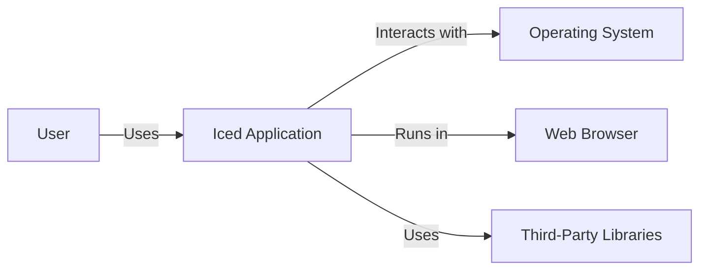
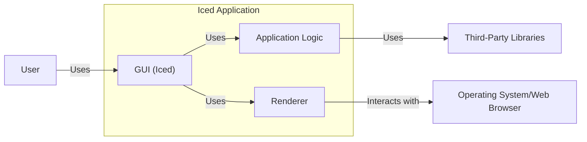
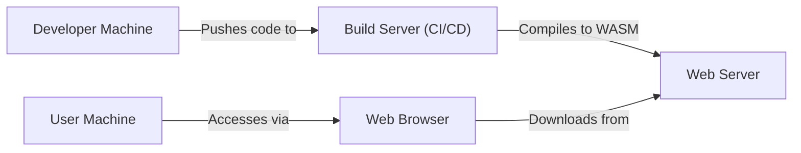
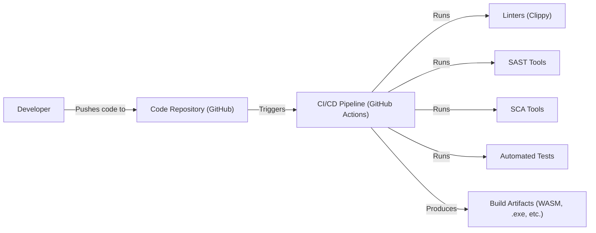

# BUSINESS POSTURE

The Iced project is a cross-platform GUI library for Rust. It appears to be an open-source project, likely driven by a community of contributors with a potential mix of individual and corporate users.

Priorities and Goals:

*   Provide a robust and efficient GUI toolkit for Rust developers.
*   Enable cross-platform development (Windows, macOS, Linux, Web).
*   Offer a clean and maintainable codebase.
*   Foster a welcoming and active community.
*   Potentially attract commercial users or sponsors.

Business Risks:

*   Reputational damage due to security vulnerabilities in the library.
*   Loss of user trust if applications built with Iced are easily compromised.
*   Legal issues if vulnerabilities lead to data breaches or other damages.
*   Reduced adoption if the library is perceived as insecure.
*   Difficulty attracting contributors if the project has a poor security record.
*   Supply chain attacks if dependencies are compromised.

# SECURITY POSTURE

Existing Security Controls (based on the GitHub repository):

*   security control: Code Reviews: Pull requests are used, implying code review before merging. (Observed in the contribution guidelines and general GitHub workflow).
*   security control: Static Analysis: Some level of static analysis is likely used, given the use of Rust (which has built-in safety features) and potentially Clippy (a Rust linter). This is not explicitly stated but is a common practice in the Rust ecosystem.
*   security control: Dependency Management: Cargo (Rust's package manager) is used, providing some level of dependency management. (Observed in the `Cargo.toml` files).
*   security control: Fuzzing: The repository contains a `fuzz` directory, indicating that fuzz testing is being performed.
*   security control: Issue Tracking: GitHub Issues are used to track bugs and feature requests, including potential security vulnerabilities.

Accepted Risks:

*   accepted risk: Cross-platform compatibility may introduce platform-specific vulnerabilities that are difficult to anticipate and mitigate comprehensively.
*   accepted risk: Reliance on third-party dependencies (crates) introduces the risk of supply chain attacks.
*   accepted risk: The project is under active development, meaning that new vulnerabilities may be introduced with new features or changes.
*   accepted risk: As an open-source project, the security posture relies heavily on community contributions and vigilance, which can be variable.

Recommended Security Controls:

*   security control: Implement a comprehensive Security Development Lifecycle (SDL) process, including threat modeling, security training for contributors, and regular security audits.
*   security control: Integrate static application security testing (SAST) tools into the CI/CD pipeline to automatically scan for vulnerabilities on every commit.
*   security control: Perform regular dynamic application security testing (DAST) to identify runtime vulnerabilities.
*   security control: Establish a clear vulnerability disclosure policy and a process for handling security reports.
*   security control: Implement Software Composition Analysis (SCA) to track and manage dependencies, including identifying and mitigating known vulnerabilities in third-party crates.
*   security control: Consider using a memory-safe language subset or additional memory safety tools if feasible, given Rust's existing focus on memory safety.
*   security control: Sign releases to ensure the integrity of distributed binaries.

Security Requirements:

*   Authentication: Not directly applicable to the Iced library itself, as it's a GUI toolkit. However, applications built with Iced may require authentication mechanisms, which should be implemented securely by the application developers.
*   Authorization: Similar to authentication, authorization is the responsibility of applications built with Iced, not the library itself.
*   Input Validation: Iced should provide mechanisms for input validation to prevent common vulnerabilities like cross-site scripting (XSS) in web-based applications and buffer overflows in native applications.  This is crucial for any GUI library. Input sanitization should be a core feature.
*   Cryptography: If Iced handles any sensitive data (e.g., user input that is later encrypted), it should use strong, well-vetted cryptographic libraries and algorithms.  The library itself may not directly implement cryptography, but it should facilitate secure handling of data that might be used in cryptographic operations.

# DESIGN

## C4 CONTEXT

Element Descriptions:

*   Element:
    *   Name: User
    *   Type: Person
    *   Description: A person who interacts with an application built using the Iced library.
    *   Responsibilities: Provides input to the application, views the application's output, and interacts with the application's interface.
    *   Security controls: N/A (External to the system)

*   Element:
    *   Name: Iced Application
    *   Type: Software System
    *   Description: An application built using the Iced GUI library.
    *   Responsibilities: Provides a graphical user interface, handles user input, processes data, and interacts with the operating system or web browser.
    *   Security controls: Input validation, output encoding, secure handling of user data, secure communication with external systems (if applicable).

*   Element:
    *   Name: Operating System
    *   Type: Software System
    *   Description: The underlying operating system (Windows, macOS, Linux) on which the Iced application runs (for native applications).
    *   Responsibilities: Provides system resources, manages processes, handles file system access, and provides network connectivity.
    *   Security controls: OS-level security features (e.g., ASLR, DEP), user permissions, sandboxing.

*   Element:
    *   Name: Web Browser
    *   Type: Software System
    *   Description: The web browser in which the Iced application runs (for web-based applications).
    *   Responsibilities: Renders the application's UI, handles user input, and provides a JavaScript runtime environment.
    *   Security controls: Browser security features (e.g., same-origin policy, content security policy), sandboxing.

*   Element:
    *   Name: Third-Party Libraries
    *   Type: Software System
    *   Description: External libraries (crates) that the Iced library and Iced applications depend on.
    *   Responsibilities: Provide specific functionalities used by Iced or the application.
    *   Security controls: Dependency management, vulnerability scanning, regular updates.

## C4 CONTAINER

Element Descriptions:

*   Element:
    *   Name: User
    *   Type: Person
    *   Description: A person who interacts with the Iced application.
    *   Responsibilities: Provides input, views output, interacts with the UI.
    *   Security controls: N/A (External to the system)

*   Element:
    *   Name: Application Logic
    *   Type: Container
    *   Description: The core logic of the application built with Iced.
    *   Responsibilities: Handles business logic, processes data, manages application state.
    *   Security controls: Input validation, output encoding, secure data handling, secure communication.

*   Element:
    *   Name: GUI (Iced)
    *   Type: Container
    *   Description: The Iced GUI library components.
    *   Responsibilities: Provides widgets, handles user input events, manages layout, and interacts with the renderer.
    *   Security controls: Input validation, output encoding, secure handling of user input, prevention of XSS (for web).

*   Element:
    *   Name: Renderer
    *   Type: Container
    *   Description: The rendering engine that draws the UI.
    *   Responsibilities: Translates Iced's UI description into platform-specific drawing commands.
    *   Security controls: Protection against buffer overflows, secure handling of graphics resources.

*   Element:
    *   Name: Operating System/Web Browser
    *   Type: Software System
    *   Description: The underlying OS or web browser.
    *   Responsibilities: Provides system resources, renders the UI (for native), or provides a runtime environment (for web).
    *   Security controls: OS/browser security features.

*   Element:
    *   Name: Third-Party Libraries
    *   Type: Software System
    *   Description: External libraries used by the application logic.
    *   Responsibilities: Provide specific functionalities.
    *   Security controls: Dependency management, vulnerability scanning.

## DEPLOYMENT

Possible Deployment Solutions:

1.  Native Application (Windows, macOS, Linux):
    *   Compilation to a standalone executable.
    *   Distribution via platform-specific package managers (e.g., .exe, .dmg, .deb).
    *   Manual download and execution.

2.  Web Application (WASM):
    *   Compilation to WebAssembly (WASM).
    *   Deployment to a web server.
    *   Accessed via a web browser.

3.  Hybrid Approach:
    *   Using a framework like Tauri or Electron to package the WASM application as a native application.

Chosen Deployment Solution (Web Application - WASM):

Element Descriptions:

*   Element:
    *   Name: Developer Machine
    *   Type: Infrastructure Node
    *   Description: The machine used by developers to write and test code.
    *   Responsibilities: Code development, local testing.
    *   Security controls: Secure coding practices, local security tools.

*   Element:
    *   Name: Build Server (CI/CD)
    *   Type: Infrastructure Node
    *   Description: A server that automates the build and deployment process.
    *   Responsibilities: Compiles the code, runs tests, and deploys the application.
    *   Security controls: Access control, secure build environment, SAST, SCA.

*   Element:
    *   Name: Web Server
    *   Type: Infrastructure Node
    *   Description: A server that hosts the compiled WASM application and related assets.
    *   Responsibilities: Serves the application to users.
    *   Security controls: Web server security configuration, HTTPS, firewall.

*   Element:
    *   Name: User Machine
    *   Type: Infrastructure Node
    *   Description: The machine used by users to access the application.
    *   Responsibilities: Runs the web browser.
    *   Security controls: Browser security settings, antivirus software.

*   Element:
    *   Name: Web Browser
    *   Type: Software
    *   Description: The web browser used to access the Iced application.
    *   Responsibilities: Renders the application, handles user input.
    *   Security controls: Browser security features, sandboxing.

## BUILD

Build Process Description:

1.  Developer pushes code changes to the GitHub repository.
2.  GitHub Actions (or another CI/CD system) is triggered.
3.  The CI/CD pipeline performs the following steps:
    *   Runs linters (e.g., Clippy) to check for code style and potential errors.
    *   Runs SAST tools to scan for security vulnerabilities in the source code.
    *   Runs SCA tools to identify and analyze dependencies for known vulnerabilities.
    *   Executes automated tests (unit tests, integration tests, etc.).
    *   If all checks and tests pass, compiles the code into the appropriate build artifacts (e.g., WASM for web, executables for native).
4.  The build artifacts are stored and made available for deployment.

Security Controls:

*   security control: Secure Coding Practices: Developers follow secure coding guidelines.
*   security control: Code Review: All code changes are reviewed before merging.
*   security control: CI/CD Pipeline: Automated build and testing process.
*   security control: Linters: Enforce code style and identify potential errors.
*   security control: SAST: Static Application Security Testing to identify vulnerabilities in the source code.
*   security control: SCA: Software Composition Analysis to manage and secure dependencies.
*   security control: Automated Tests: Ensure code quality and functionality.
*   security control: Signed Commits: Verify the integrity and authenticity of code changes.

# RISK ASSESSMENT

Critical Business Processes:

*   Providing a reliable and secure GUI library for developers.
*   Maintaining the reputation and trust of the Iced project.
*   Ensuring the security of applications built with Iced.

Data to Protect:

*   Source Code: Sensitivity - Medium (Public repository, but integrity is crucial).
*   User Data (within applications built with Iced): Sensitivity - Varies greatly depending on the application. Iced itself doesn't directly handle user data, but applications built with it might. This is the most critical data to consider, from the perspective of an Iced user.
*   Contributor Information (e.g., email addresses): Sensitivity - Low.
*   Build Artifacts: Sensitivity - Medium (Integrity is crucial to prevent distribution of compromised versions).

# QUESTIONS & ASSUMPTIONS

Questions:

*   What is the specific threat model for applications built with Iced? (This needs to be defined by the application developers, but Iced should provide guidance.)
*   What level of security assurance is required for different types of applications built with Iced (e.g., web vs. native, high-security vs. low-security)?
*   Are there any specific regulatory requirements that apply to applications built with Iced (e.g., GDPR, HIPAA)?
*   What is the process for handling security vulnerabilities reported by external researchers?
*   How are dependencies managed and updated to address known vulnerabilities?
*   What are the specific security features provided by Iced for input validation and output encoding?
*   Are there plans to integrate any formal verification methods to prove the correctness and security of critical components?

Assumptions:

*   assumption: The Iced project is primarily concerned with providing a secure foundation for building GUI applications, but the ultimate responsibility for application security rests with the application developers.
*   assumption: The Iced community is actively involved in identifying and addressing security concerns.
*   assumption: The use of Rust provides some inherent memory safety benefits, but additional security measures are still necessary.
*   assumption: The project aims to follow best practices for secure software development, but there may be resource constraints that limit the implementation of all recommended security controls.
*   assumption: The primary target audience is developers who are already familiar with Rust and its security features.
*   assumption: The project will continue to evolve, and the security posture will need to be regularly reassessed and updated.