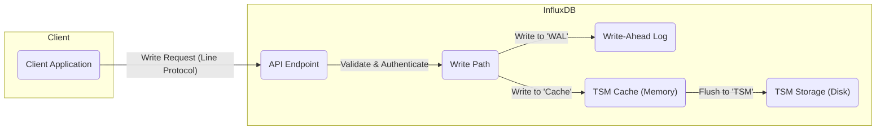
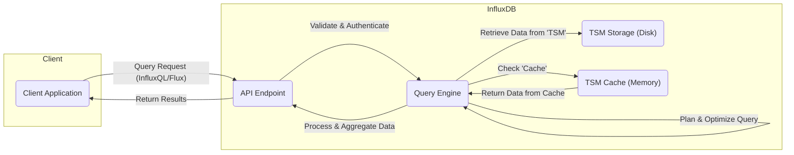

# Project Design Document: InfluxDB

**Version:** 1.1
**Date:** October 26, 2023
**Author:** AI Software Architect

## 1. Introduction

This document provides an enhanced architectural design of InfluxDB, a time-series database, based on the information available in the provided GitHub repository: [https://github.com/influxdata/influxdb](https://github.com/influxdata/influxdb). This revised document aims to provide even greater clarity and detail regarding the system's components, their interactions, and data flow, further strengthening its suitability for subsequent threat modeling activities.

## 2. Goals and Objectives

The primary goals of this design document are:

*   To provide a comprehensive and detailed overview of the InfluxDB architecture.
*   To clearly identify key components, their specific responsibilities, and interactions.
*   To precisely illustrate the data flow within the system for both write and read operations.
*   To highlight potential security considerations with more specific examples relevant to threat modeling.
*   To serve as a robust and informative foundation for future threat modeling exercises.

## 3. High-Level Architecture

InfluxDB is designed as a specialized time-series database optimized for high-throughput ingestion, efficient storage, and rapid querying of time-stamped data.

*   **Clients:** External applications, services, or users that interact with InfluxDB to write or query time-series data.
*   **InfluxDB Core:** The central processing unit responsible for managing data ingestion, storage mechanisms, query execution, and overall system management.
*   **Storage Engine:** The underlying system responsible for the persistent storage and retrieval of time-series data, optimized for time-based access patterns.

## 4. Component Details

This section provides a more detailed breakdown of the key components within the InfluxDB architecture, emphasizing their specific functions and interactions.

*   **API (Application Programming Interface):**
    *   **Responsibility:** Serves as the primary interface for client interaction.
    *   **Functionality:**
        *   Exposes endpoints for writing data points using the Line Protocol.
        *   Provides query endpoints supporting InfluxQL and Flux query languages.
        *   Handles client authentication and authorization before processing requests.
        *   Manages request routing and load balancing (in clustered setups).
*   **Query Engine:**
    *   **Responsibility:** Processes and executes data queries.
    *   **Functionality:**
        *   Parses and validates incoming queries written in InfluxQL or Flux.
        *   Optimizes query execution plans to efficiently retrieve data.
        *   Interacts with the Storage Engine to fetch relevant data.
        *   Performs aggregations, transformations, and calculations as specified in the query.
        *   Returns query results to the client via the API.
*   **Write Path:**
    *   **Responsibility:** Manages the ingestion of incoming data points.
    *   **Functionality:**
        *   Receives data points from the API.
        *   Performs initial data validation and preprocessing.
        *   Writes incoming data to the Write-Ahead Log (WAL) for durability and immediate recovery.
        *   Writes data to in-memory caches (TSM cache) for optimized write performance.
        *   Manages the flushing of data from the cache to the Time-Structured Merge Tree (TSM) files on disk.
*   **Storage Engine (TSM - Time-Structured Merge Tree):**
    *   **Responsibility:** Provides persistent and efficient storage for time-series data.
    *   **Functionality:**
        *   Organizes data into immutable, time-sorted files (TSM files).
        *   Utilizes indexing mechanisms to enable fast retrieval of data based on time and tags.
        *   Performs background compaction and merging of TSM files to optimize storage utilization and query performance.
        *   Manages data retention policies, automatically removing data that falls outside the defined retention period.
*   **Meta Store:**
    *   **Responsibility:** Stores critical metadata about the InfluxDB instance.
    *   **Functionality:**
        *   Persists information about databases, retention policies, and measurements.
        *   Stores user credentials and their associated permissions for authentication and authorization.
        *   In clustered environments, manages shard information, data distribution across nodes, and cluster topology.
        *   Typically implemented using an embedded key-value store like BoltDB.
*   **WAL (Write-Ahead Log):**
    *   **Responsibility:** Ensures data durability and facilitates recovery in case of failures.
    *   **Functionality:**
        *   Provides a persistent, ordered record of all write operations before they are committed to the TSM engine.
        *   Allows InfluxDB to replay write operations from the WAL upon restart after a crash, ensuring no data loss.
*   **Subscription Service (Continuous Queries and Subscriptions):**
    *   **Responsibility:** Enables automated data processing and real-time data streams.
    *   **Functionality:**
        *   Allows users to define continuous queries that automatically execute at specified intervals and store their results back into InfluxDB.
        *   Supports subscriptions, enabling external systems to receive real-time streams of data matching specific criteria.
*   **Clustering Components (if applicable):**
    *   **Meta Nodes:**
        *   **Responsibility:** Manage the global state and metadata of the cluster.
        *   **Functionality:** Store cluster metadata, handle schema changes, and coordinate data distribution.
    *   **Data Nodes:**
        *   **Responsibility:** Store and serve the actual time-series data.
        *   **Functionality:** Handle write and read requests for the data shards they own.
    *   **Gossip Protocol:**
        *   **Responsibility:** Facilitates communication and membership management between nodes.
        *   **Functionality:** Allows nodes to discover each other, share status information, and detect failures.
    *   **Data Replication:**
        *   **Responsibility:** Ensures data availability and fault tolerance.
        *   **Functionality:** Replicates data across multiple data nodes, providing redundancy in case of node failures.
*   **Authentication and Authorization:**
    *   **Responsibility:** Controls access to InfluxDB resources.
    *   **Functionality:**
        *   Authenticates users based on provided credentials (e.g., username/password, API tokens).
        *   Authorizes user actions based on defined roles and permissions, controlling access to databases, measurements, and specific operations.

## 5. Data Flow

The following diagrams illustrate the typical data flow for write and read operations within InfluxDB.

### 5.1. Write Data Flow

*   A client application sends a write request containing time-series data, typically formatted using the Line Protocol, to the InfluxDB API endpoint.
*   The API endpoint receives the request, performs validation of the data format, and authenticates the client.
*   The validated and authenticated request is then passed to the Write Path component.
*   The Write Path immediately persists the incoming data to the Write-Ahead Log ('WAL') to ensure durability.
*   Concurrently, the data is written to the in-memory TSM Cache ('Cache') for fast access during subsequent reads.
*   Periodically, or when the cache reaches a certain threshold, the data is flushed from the TSM Cache to the persistent TSM Storage ('TSM') on disk.

### 5.2. Read Data Flow

*   A client application sends a query request, written in either InfluxQL or Flux, to the InfluxDB API endpoint.
*   The API endpoint receives the query request and performs validation and authentication of the client.
*   The validated request is forwarded to the Query Engine ('QE').
*   The Query Engine parses the query, develops an optimized execution plan, and determines the necessary data sources.
*   The Query Engine first checks the TSM Cache ('Cache') for relevant data to serve the query quickly.
*   If the required data is not fully available in the cache, the Query Engine retrieves the remaining data from the TSM Storage ('TSM') on disk.
*   The Query Engine then processes and aggregates the retrieved data according to the query specifications.
*   Finally, the processed query results are returned to the client application via the API endpoint.

## 6. Security Considerations

This section outlines key security considerations relevant for threat modeling, categorized for clarity.

*   **Authentication and Authorization:**
    *   **Threats:** Brute-force attacks on login credentials, unauthorized access due to weak passwords, privilege escalation by compromised accounts.
    *   **Considerations:** Strength of password hashing algorithms, enforcement of strong password policies, multi-factor authentication options, granular role-based access control (RBAC).
*   **Data Protection (Confidentiality and Integrity):**
    *   **Threats:** Unauthorized access to sensitive time-series data, data breaches, tampering with data in transit or at rest.
    *   **Considerations:** Encryption of data at rest (e.g., using disk encryption), encryption of data in transit (TLS/SSL for API communication), secure key management practices.
*   **Network Security:**
    *   **Threats:** Man-in-the-middle attacks, eavesdropping on network traffic, unauthorized access to InfluxDB ports and services.
    *   **Considerations:** Use of firewalls to restrict network access, secure network configurations, regular security audits of network infrastructure.
*   **Input Validation:**
    *   **Threats:** Injection attacks (e.g., SQL injection if InfluxQL is not properly handled, command injection), cross-site scripting (XSS) if InfluxDB has a web interface.
    *   **Considerations:** Strict input validation and sanitization for all data received via the API, parameterized queries to prevent injection vulnerabilities.
*   **Availability and Resilience:**
    *   **Threats:** Denial-of-service (DoS) and distributed denial-of-service (DDoS) attacks, resource exhaustion, single points of failure.
    *   **Considerations:** Rate limiting on API endpoints, robust error handling and recovery mechanisms, deployment in a highly available clustered configuration, regular backups and disaster recovery planning.
*   **Auditing and Logging:**
    *   **Threats:** Lack of visibility into security events, difficulty in detecting and responding to security incidents.
    *   **Considerations:** Comprehensive logging of authentication attempts, data access, administrative actions, and errors; secure storage and monitoring of audit logs.
*   **Software Vulnerabilities:**
    *   **Threats:** Exploitation of known vulnerabilities in InfluxDB or its dependencies.
    *   **Considerations:** Regular patching and updates to the latest stable versions of InfluxDB, vulnerability scanning, and adherence to secure development practices.

## 7. Deployment Considerations

InfluxDB offers flexibility in deployment options, each with its own security implications.

*   **Single Instance Deployment:**
    *   **Description:** A single InfluxDB server handles all operations.
    *   **Security Considerations:**  All security measures rely on the single instance. Compromise of this instance means full compromise of the data. Focus on host-level security, strong access controls, and robust backup strategies.
*   **Clustered Deployment:**
    *   **Description:** Multiple InfluxDB nodes work together, providing scalability and high availability.
    *   **Security Considerations:** Requires secure communication between nodes (e.g., using TLS), secure management of cluster membership and metadata, and careful consideration of data replication security.
*   **Cloud-Based Deployment (Managed Services):**
    *   **Description:** Utilizing managed InfluxDB services offered by cloud providers.
    *   **Security Considerations:** Leverage the security features provided by the cloud provider (e.g., network isolation, access control lists). Understand the shared responsibility model and ensure proper configuration of cloud security settings.

## 8. Future Considerations

This design document reflects the current understanding of InfluxDB's architecture. Future developments and enhancements may introduce new components or modify existing ones, potentially impacting the security landscape. Continuous monitoring of project updates and security advisories is crucial. Potential future areas of focus include:

*   Enhanced authentication and authorization mechanisms.
*   Further improvements to data encryption capabilities.
*   More granular auditing and logging features.
*   Integration with modern security tools and frameworks.

This enhanced design document provides a more detailed and structured foundation for conducting thorough threat modeling exercises on InfluxDB. The added clarity and specific examples aim to facilitate a deeper understanding of potential vulnerabilities and inform effective mitigation strategies.