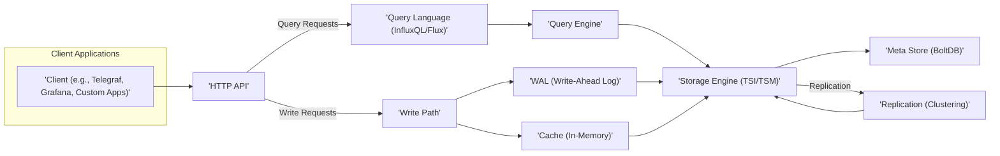

# Project Design Document: InfluxDB - Improved

**Version:** 2.0
**Date:** October 26, 2023
**Author:** Gemini (AI Expert)
**Project:** InfluxDB - Time Series Database

## 1. Introduction

This document provides an enhanced and more detailed architectural design of the InfluxDB project, based on the open-source repository available at [https://github.com/influxdata/influxdb](https://github.com/influxdata/influxdb). This improved design document aims to offer a deeper understanding of the system's components and interactions, making it even more suitable for comprehensive threat modeling and security analysis. It expands on the previous version with more granular details and specific security considerations.

## 2. Goals

*   Provide a clear and detailed description of the InfluxDB architecture, including internal workings of key components.
*   Identify the major components and their specific responsibilities, focusing on security-relevant aspects.
*   Illustrate the data flow within the system with more granular steps and interactions.
*   Highlight key security considerations relevant to each component and interaction, including potential vulnerabilities and mitigation strategies.
*   Serve as a robust and informative document for subsequent threat modeling activities, enabling identification of a wider range of potential threats.

## 3. Non-Goals

*   Provide an exhaustive code-level analysis of every function or module.
*   Detail every minor implementation choice within each component.
*   Include performance benchmarks or detailed scalability metrics, unless directly relevant to security considerations (e.g., resource exhaustion).
*   Cover the entire InfluxData platform ecosystem beyond the core InfluxDB database, unless directly interacting with it.

## 4. Architectural Overview

InfluxDB is a purpose-built time-series database engineered for high-throughput ingestion, compression, and querying of time-stamped data. Its architecture is optimized for handling massive volumes of data from various sources, making it suitable for use cases like monitoring, IoT, and analytics.

### 4.1. High-Level Architecture Diagram

### 4.2. Component Details

*   **Client Applications:** These are external entities that interact with InfluxDB. They can be data producers (writing metrics or events) or data consumers (querying and visualizing data). They utilize the HTTP API for communication.
*   **HTTP API:** This is the primary entry point for interacting with InfluxDB. It exposes RESTful endpoints for writing data (e.g., `/write`), querying data (e.g., `/query`), and administrative tasks. It handles:
    *   Authentication and authorization of incoming requests.
    *   Parsing and routing requests to the appropriate internal components.
    *   Handling different content types (e.g., JSON, Line Protocol).
    *   Implementing rate limiting and other protective measures.
*   **Query Language (InfluxQL/Flux):** These are the domain-specific languages used to retrieve and manipulate data stored in InfluxDB.
    *   **InfluxQL:** A SQL-like language for querying time-series data.
    *   **Flux:** A more powerful data scripting and query language designed for time-series data manipulation and analysis.
*   **Query Engine:** This component is responsible for:
    *   Parsing queries written in InfluxQL or Flux.
    *   Optimizing query execution plans.
    *   Interacting with the Storage Engine to retrieve the necessary data.
    *   Performing calculations and aggregations as specified in the query.
    *   Returning the results to the client via the HTTP API.
*   **Write Path:** This component orchestrates the process of ingesting data into InfluxDB. It involves several steps:
    *   Receiving data points from the HTTP API.
    *   Validating the data format and content.
    *   Buffering incoming writes in an in-memory cache.
    *   Writing data to the **WAL (Write-Ahead Log)** for durability.
    *   Flushing data from the cache to the **Storage Engine**.
*   **Storage Engine (TSI/TSM):** This is the core data storage layer of InfluxDB.
    *   **TSM (Time-Structured Merge Tree):** This is the primary storage format for time-series data. It is optimized for high write throughput and efficient compression. Data is organized into files based on time ranges and series.
    *   **TSI (Time Series Index):** This is an index that allows for efficient retrieval of series based on tags. It is crucial for fast query performance, especially when filtering by tags.
    *   Data is further organized into **shards**, which are independent units of storage for a specific time range. This allows for parallel processing and easier management.
    *   The storage engine handles data compaction and retention policy enforcement.
*   **Meta Store (BoltDB):** This embedded key/value store is used to persist metadata about the InfluxDB instance, including:
    *   Database and retention policy definitions.
    *   User credentials and permissions.
    *   Shard metadata (location, ownership).
    *   Continuous query definitions.
*   **Replication (Clustering):** InfluxDB supports clustering for high availability and horizontal scalability.
    *   Data is replicated across multiple nodes to ensure data durability and availability in case of node failures.
    *   Write requests are typically written to a quorum of nodes.
    *   Query requests can be served by any node containing the relevant data.
*   **WAL (Write-Ahead Log):** Before data is written to the main storage engine, it is first written to the WAL. This ensures durability and allows for recovery in case of crashes or failures.
*   **Cache (In-Memory):** Incoming write requests are initially buffered in an in-memory cache for performance. This allows for batching writes to the storage engine and reduces disk I/O.

### 4.3. Data Flow

#### 4.3.1. Write Path (Detailed)

1. A client application sends a write request containing time-series data (e.g., in Line Protocol format) to the **HTTP API**.
2. The **HTTP API** authenticates and authorizes the request, verifying credentials and permissions.
3. The **HTTP API** parses the incoming data.
4. The parsed data points are passed to the **Write Path**.
5. The **Write Path** validates the data points (e.g., timestamp format, data types).
6. The validated data points are written to the **WAL (Write-Ahead Log)** for durability.
7. The data points are also added to an **in-memory cache**.
8. Periodically, or when the cache reaches a certain size, the data is flushed from the cache to the **Storage Engine (TSM)**.
9. The **Storage Engine (TSI)** index is updated with the new series and tag information.
10. Metadata updates (e.g., new series or tags) may be written to the **Meta Store (BoltDB)**.
11. If replication is enabled, the write operation is propagated to other nodes in the cluster, and the WAL entries are replayed on those nodes.

#### 4.3.2. Read Path (Detailed)

1. A client application sends a query request (InfluxQL or Flux) to the **HTTP API**.
2. The **HTTP API** authenticates and authorizes the request.
3. The query string is passed to the **Query Language** component for parsing and validation.
4. The parsed query is sent to the **Query Engine**.
5. The **Query Engine** analyzes the query and determines the optimal execution plan. This involves identifying the relevant databases, retention policies, and shards.
6. The **Query Engine** interacts with the **Storage Engine (TSI)** to identify the specific TSM files containing the requested data based on time ranges and tag filters.
7. The **Query Engine** retrieves the relevant data blocks from the **Storage Engine (TSM)**.
8. The **Query Engine** performs any necessary calculations, aggregations, or transformations on the retrieved data.
9. The results are formatted and returned to the client application via the **HTTP API**.

## 5. Security Considerations

This section provides a more in-depth look at the security considerations for each component and interaction within the InfluxDB architecture, highlighting potential vulnerabilities and mitigation strategies.

### 5.1. Client Applications

*   **Credential Management:** Securely store and manage InfluxDB credentials. Avoid embedding credentials directly in code. Utilize environment variables or secrets management systems.
*   **Input Sanitization:** Sanitize data before sending it to InfluxDB to prevent potential injection attacks, even though InfluxDB should also perform server-side validation.
*   **Secure Communication:** Always use HTTPS (TLS) to encrypt communication between clients and the InfluxDB API to protect data in transit from eavesdropping and tampering.
*   **Rate Limiting (Client-Side):** Implement client-side rate limiting to avoid overwhelming the InfluxDB instance, especially during error scenarios or attacks.

### 5.2. HTTP API

*   **Authentication and Authorization:**
    *   **Authentication Methods:** InfluxDB supports various authentication methods, including username/password, tokens, and mutual TLS. Enforce strong password policies and regularly rotate API tokens.
    *   **Authorization Controls:** Implement fine-grained authorization controls to restrict access to specific databases, retention policies, and operations based on user roles or permissions.
    *   **Principle of Least Privilege:** Grant only the necessary permissions to users and applications.
*   **Input Validation:** Implement robust input validation on all API endpoints to prevent common injection attacks such as:
    *   **InfluxQL/Flux Injection:** Carefully sanitize or parameterize user-provided input used in query construction to prevent malicious queries.
    *   **Command Injection:** Avoid executing arbitrary commands based on user input.
    *   **Cross-Site Scripting (XSS):** If rendering user-provided data in API responses (e.g., error messages), ensure proper encoding to prevent XSS attacks.
*   **Rate Limiting:** Implement rate limiting on API endpoints to prevent denial-of-service (DoS) attacks and protect against resource exhaustion.
*   **TLS Encryption:** Enforce HTTPS for all API communication. Ensure proper TLS configuration, including strong cipher suites and certificate management.
*   **CORS Configuration:** Properly configure Cross-Origin Resource Sharing (CORS) to restrict access to the API from unauthorized domains, mitigating potential cross-site request forgery (CSRF) attacks.
*   **Security Headers:** Implement security headers (e.g., `Content-Security-Policy`, `X-Frame-Options`, `Strict-Transport-Security`) to enhance security and mitigate common web vulnerabilities.
*   **Error Handling:** Avoid exposing sensitive information in error messages.

### 5.3. Query Language (InfluxQL/Flux) and Query Engine

*   **Query Injection:** Be extremely cautious when constructing queries dynamically based on user input. Always use parameterized queries or proper escaping mechanisms to prevent query injection vulnerabilities.
*   **Resource Limits:** Configure and enforce limits on query execution time, memory usage, and CPU consumption to prevent malicious or poorly written queries from consuming excessive resources and impacting the performance of the database.
*   **Authorization Enforcement:** The query engine must strictly enforce the authorization policies defined for users and databases, ensuring users can only access data they are permitted to see.

### 5.4. Write Path

*   **Data Validation:** Implement strict data validation on the write path to ensure data integrity and prevent malicious or malformed data from being written to the database. This includes validating timestamps, data types, and tag formats.
*   **Denial of Service:** Protect the write path from being overwhelmed by a large volume of write requests. Implement mechanisms like buffering, backpressure, and queue management to handle spikes in traffic.
*   **Write Amplification:** Be aware of potential write amplification issues and optimize the write path to minimize unnecessary disk I/O.

### 5.5. Storage Engine (TSI/TSM)

*   **Data at Rest Encryption:** Consider encrypting data at rest to protect sensitive information stored on disk. This can be achieved through operating system-level encryption or by using features provided by the underlying storage infrastructure.
*   **Access Control:** Implement proper file system permissions to restrict access to the underlying data files (TSM and TSI files). Only the InfluxDB process should have read and write access.
*   **Data Integrity:** Implement mechanisms (e.g., checksums) to detect and prevent data corruption. Regularly perform data integrity checks.
*   **Secure Compaction:** Ensure that data compaction processes are secure and do not introduce vulnerabilities.

### 5.6. Meta Store (BoltDB)

*   **Access Control:** Secure access to the BoltDB files, as they contain sensitive metadata, including user credentials. Restrict file system access to the InfluxDB process.
*   **Backup and Recovery:** Implement regular backups of the meta store to prevent data loss and ensure the ability to recover from failures. Securely store backup files.
*   **Encryption at Rest:** Consider encrypting the BoltDB files at rest, as they contain sensitive information.

### 5.7. Replication (Clustering)

*   **Secure Communication:** Ensure secure communication between nodes in the cluster, preferably using TLS encryption for inter-node traffic.
*   **Authentication and Authorization:** Implement authentication and authorization mechanisms for inter-node communication to prevent unauthorized nodes from joining the cluster or accessing data.
*   **Data Consistency:** Implement robust mechanisms to ensure data consistency across all nodes in the cluster and handle potential conflicts.

## 6. Deployment Considerations

The security posture of an InfluxDB deployment is significantly influenced by the deployment environment.

*   **Network Security:** Properly configure firewalls and network segmentation to restrict access to the InfluxDB instance. Only allow necessary ports and protocols.
*   **Operating System Security:** Harden the underlying operating system by applying security patches, disabling unnecessary services, and configuring appropriate user permissions.
*   **Dependency Management:** Keep all dependencies (libraries, packages) up to date to patch known security vulnerabilities. Regularly scan for vulnerabilities.
*   **Resource Management:** Properly allocate resources (CPU, memory, disk) to prevent resource exhaustion attacks.
*   **Monitoring and Logging:** Implement comprehensive monitoring and logging of InfluxDB activity, including authentication attempts, query execution, and error messages, to detect and respond to security incidents. Securely store and analyze logs.

## 7. Future Considerations

*   **Role-Based Access Control (RBAC):** Implement more granular RBAC mechanisms for managing user permissions, allowing for more precise control over access to data and operations.
*   **Audit Logging:** Implement detailed audit logging to track user actions, data modifications, and administrative operations for compliance and security auditing purposes.
*   **Integration with Security Tools:** Consider integration with security information and event management (SIEM) systems, intrusion detection/prevention systems (IDS/IPS), and vulnerability scanners for enhanced threat detection and response capabilities.
*   **Secure Secrets Management:** Implement secure secrets management practices for storing and accessing sensitive information like API keys and database credentials.

This improved design document provides a more comprehensive and detailed understanding of the InfluxDB architecture, specifically focusing on security considerations. It serves as a valuable resource for conducting thorough threat modeling and implementing appropriate security controls to protect InfluxDB deployments.