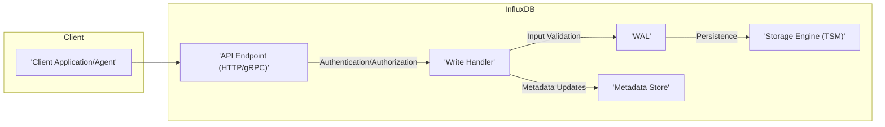
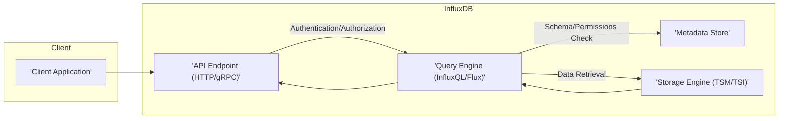
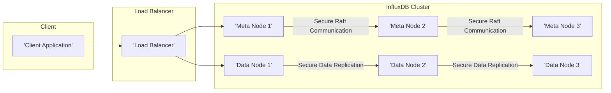

## Project Design Document: InfluxDB (Improved)

**1. Introduction**

This document provides an enhanced architectural design of the InfluxDB project, an open-source time-series database. This improved document aims to provide a more detailed and nuanced understanding of the system's architecture, specifically tailored for subsequent threat modeling activities. It outlines the key components, data flows, and interactions within the InfluxDB system, with a stronger emphasis on security implications.

**2. Goals**

* Provide a comprehensive and refined overview of the InfluxDB architecture.
* Identify key components and their functionalities with greater detail.
* Describe the data flow within the system, including write and query paths, with a focus on security-relevant interactions.
* Highlight important security considerations within the design, including potential vulnerabilities and mitigation strategies.
* Serve as a robust and detailed basis for future threat modeling exercises.

**3. Scope**

This document focuses on the core architectural components of InfluxDB as represented in the provided GitHub repository (https://github.com/influxdata/influxdb). It covers the major functional areas, including data ingestion, storage, query processing, and clustering. While it still avoids delving into every single configuration option, it provides more context and detail regarding key functionalities and potential security implications within the core system architecture.

**4. Target Audience**

This document is intended for:

* Security engineers and architects involved in threat modeling and security assessments.
* Developers working on or integrating with InfluxDB, requiring a deeper understanding of its internal workings.
* Operations teams responsible for deploying, managing, and securing InfluxDB environments.

**5. Architectural Overview**

InfluxDB is designed as a high-performance time-series database optimized for ingesting, storing, and querying timestamped data. The architecture is structured around several key areas, each with specific responsibilities and security considerations:

* **Client Interaction Layer:**  Manages how external entities communicate with InfluxDB.
* **Data Ingestion Pipeline:**  Handles the process of receiving and preparing data for storage.
* **Query Processing Engine:**  Responsible for interpreting and executing data retrieval requests.
* **Data Storage Subsystem:**  Manages the persistent storage and organization of time-series data.
* **Metadata Management:**  Stores and manages information about the database structure and configuration.
* **Clustering and Replication (Optional):** Enables scalability and high availability through distributed architecture.

**6. Detailed Component Design**

Here's a more detailed breakdown of the key components within the InfluxDB architecture, with added context for security considerations:

* **API (HTTP/gRPC):**
    * Provides the primary interface for interacting with InfluxDB, exposing endpoints for various operations.
    * **Security Consideration:**  API endpoints are potential attack vectors. Proper authentication, authorization, input validation, and rate limiting are crucial. The choice between HTTP and gRPC can impact security due to different protocol characteristics and available security features.
    * Supports various methods for writing data (e.g., line protocol, JSON) and querying data (InfluxQL, Flux).
    * Can be accessed via standard HTTP requests or gRPC calls, depending on the InfluxDB version and configuration.

* **Write Handler:**
    * Responsible for receiving and processing incoming write requests from the API.
    * **Security Consideration:**  Must implement robust input validation to prevent injection attacks and ensure data integrity. Handles authentication and authorization checks for write operations.
    * Parses the incoming data, validates its format and schema, and prepares it for storage.
    * Routes the validated data to the appropriate storage engine and WAL.

* **Query Engine (InfluxQL/Flux):**
    * Parses and executes queries written in InfluxQL (for InfluxDB 1.x) or Flux (for InfluxDB 2.x and later).
    * **Security Consideration:**  Vulnerable to query injection attacks if not properly designed. Authorization checks are performed to ensure users can only access permitted data. Query performance and resource consumption need to be managed to prevent denial-of-service.
    * Optimizes query execution plans to efficiently retrieve data.
    * Interacts with the metadata store to understand the database schema and with the storage engine to fetch data.

* **Storage Engine (TSI/TSM):**
    * Responsible for the persistent storage and retrieval of time-series data.
    * **Security Consideration:**  Data at rest is a primary security concern. While InfluxDB doesn't inherently provide encryption at rest, securing the underlying file system and storage volumes is critical. Access control to these files is also important.
    * **TSM (Time-Structured Merge Tree):** The core storage format, optimized for high write throughput and efficient compression of time-series data.
    * **TSI (Time Series Index):** An optional, in-memory index for high-cardinality data, significantly improving query performance for queries involving tags.

* **WAL (Write-Ahead Log):**
    * Ensures data durability and consistency by writing all incoming data to a persistent log file before committing it to the storage engine.
    * **Security Consideration:**  The WAL contains sensitive data in transit. Access to the WAL files should be restricted.
    * Used for recovery purposes in case of system failures or crashes.

* **Metadata Store:**
    * Stores metadata about databases, users, retention policies, continuous queries, subscriptions, and other system-level configurations.
    * **Security Consideration:**  Compromise of the metadata store can have significant security implications, potentially allowing unauthorized access or modification of the database structure and user permissions. Access to the metadata store should be strictly controlled.
    * Typically implemented using an embedded key-value store (e.g., BoltDB in earlier versions, or an internal implementation in later versions).

* **Subscription Service (for Continuous Queries):**
    * Manages subscriptions for continuous queries, which automatically execute in the background and write results back to InfluxDB.
    * **Security Consideration:**  Continuous queries execute with the permissions of the user who created them. Maliciously crafted continuous queries could be used to exfiltrate or manipulate data.
    * Schedules and executes continuous queries based on defined intervals.

* **Clustering Components (for clustered deployments):**
    * **Meta Store (Raft Consensus):** A distributed consensus mechanism (typically Raft) for managing cluster metadata, ensuring consistency and fault tolerance across meta nodes.
        * **Security Consideration:**  Secure communication and authentication between meta nodes are crucial to prevent unauthorized nodes from joining the cluster or tampering with metadata.
    * **Data Nodes:** Individual InfluxDB instances responsible for storing and querying data shards.
        * **Security Consideration:**  Secure communication between data nodes is essential. Data replication processes should also be secured.
    * **Gossip Protocol:** Used for node discovery, cluster membership management, and failure detection.
        * **Security Consideration:**  The gossip protocol should be secured to prevent malicious nodes from disrupting the cluster or injecting false information.
    * **Data Replication:** Mechanisms for replicating data across multiple data nodes to ensure high availability and data durability.
        * **Security Consideration:**  Data in transit during replication should be encrypted. Access control to replicated data on different nodes is also important.

**7. Data Flow**

The following outlines the typical data flow within InfluxDB for both write and query operations, with a focus on security-relevant steps.

**7.1. Write Data Flow:**

* **'Client Application/Agent'**: Sends time-series data points to InfluxDB via the API.
* **'API Endpoint (HTTP/gRPC)'**: Receives the write request and performs initial **authentication and authorization** checks.
* **'Write Handler'**:  Performs **robust input validation** to sanitize and verify the incoming data.
* **'WAL'**: The validated data is written to the WAL for durability before being written to the storage engine. Access to the WAL should be restricted.
* **'Storage Engine (TSM)'**: The data is persisted in the TSM storage engine. Security of the underlying storage is critical.
* **'Metadata Store'**: Metadata related to the write (e.g., new series, tags) might be updated. Access control to the metadata store is important.

**7.2. Query Data Flow:**

* **'Client Application'**: Sends a query to InfluxDB via the API.
* **'API Endpoint (HTTP/gRPC)'**: Receives the query request and performs **authentication and authorization**.
* **'Query Engine (InfluxQL/Flux)'**: Parses and analyzes the query. It consults the **'Metadata Store'** to check the schema and user permissions before accessing data.
* **'Storage Engine (TSM/TSI)'**: The query engine retrieves the relevant data from the TSM storage engine (potentially using the TSI index). Access control to the storage layer is crucial.
* **'Query Engine (InfluxQL/Flux)'**: Processes the retrieved data according to the query.
* **'API Endpoint (HTTP/gRPC)'**: Returns the query results to the client. Ensure secure transmission of results.

**7.3. Clustered Data Flow (Simplified):**

* **'Client Application'**: Sends requests to a load balancer.
* **'Load Balancer'**: Distributes requests across the InfluxDB cluster.
* **'Meta Node 1'**, **'Meta Node 2'**, **'Meta Node 3'**: Manage cluster metadata using a Raft consensus protocol. **Secure communication** between meta nodes is vital.
* **'Data Node 1'**, **'Data Node 2'**, **'Data Node 3'**: Store and process the actual time-series data. Data is replicated across multiple data nodes using **secure data replication** mechanisms.

**8. Security Considerations**

The following are key security considerations within the InfluxDB architecture, expanded with potential threats and mitigation strategies:

* **Authentication and Authorization:**
    * **Threats:** Unauthorized access to data, modification of data, or administrative actions.
    * **Mitigation:** Implement strong authentication mechanisms (e.g., password policies, API keys, mutual TLS). Utilize role-based access control (RBAC) to restrict access based on user roles and privileges. Regularly review and update user permissions.
    * InfluxDB provides mechanisms for authenticating users and controlling access to databases and resources.
    * Different versions of InfluxDB have varying levels of granularity in access control.
    * Securely storing and managing user credentials is crucial.

* **Data Encryption:**
    * **Threats:** Exposure of sensitive data if storage media is compromised or network traffic is intercepted.
    * **Mitigation:**
        * **At Rest:** Implement encryption at the storage layer using operating system-level encryption (e.g., LUKS, dm-crypt) or volume encryption provided by cloud providers.
        * **In Transit:** Enforce TLS/SSL for all client-server communication (HTTP API) and inter-node communication in clustered deployments. Configure gRPC to use secure channels.
    * **At Rest:** InfluxDB itself does not inherently provide encryption at rest for the underlying data files. This often needs to be handled at the operating system or storage layer.
    * **In Transit:** Communication between clients and InfluxDB should be encrypted using TLS/SSL. gRPC also provides built-in encryption options.

* **Input Validation:**
    * **Threats:** InfluxQL/Flux injection attacks, leading to unauthorized data access or manipulation.
    * **Mitigation:** Implement strict input validation on all data points and queries received through the API. Use parameterized queries or prepared statements to prevent injection vulnerabilities. Sanitize user-provided input.
    * InfluxDB needs to properly validate all incoming data and queries to prevent injection attacks (e.g., InfluxQL injection).

* **Network Security:**
    * **Threats:** Unauthorized access to InfluxDB instances, denial-of-service attacks.
    * **Mitigation:** Implement firewalls to restrict network access to only necessary ports and IP addresses. Utilize network segmentation to isolate InfluxDB instances. Consider using a Web Application Firewall (WAF) to protect the HTTP API.
    * Restricting network access to InfluxDB instances is essential. Firewalls and network segmentation should be implemented.

* **Auditing:**
    * **Threats:** Difficulty in detecting and investigating security incidents.
    * **Mitigation:** Enable and regularly review audit logs to track administrative actions, data access, and authentication attempts. Integrate audit logs with a SIEM system for centralized monitoring and alerting.
    * Logging and auditing of administrative actions and data access can help in detecting and investigating security incidents.

* **Rate Limiting:**
    * **Threats:** Denial-of-service attacks by overwhelming the server with requests.
    * **Mitigation:** Implement rate limiting on API endpoints to restrict the number of requests from a single source within a given timeframe.
    * Implementing rate limiting on API endpoints can help prevent denial-of-service attacks.

* **Secure Configuration:**
    * **Threats:** Exploitation of default or insecure configurations.
    * **Mitigation:** Review and harden default configurations. Disable unnecessary features and ports. Follow security best practices for deployment and configuration. Regularly update InfluxDB to patch known vulnerabilities.
    * Default configurations should be reviewed and hardened. Unnecessary features or ports should be disabled.

* **Dependency Management:**
    * **Threats:** Vulnerabilities in third-party libraries used by InfluxDB.
    * **Mitigation:** Regularly update InfluxDB and its dependencies to patch known vulnerabilities. Implement a process for tracking and managing dependencies.
    * Keeping dependencies up-to-date is crucial to address known vulnerabilities.

* **Clustering Security:**
    * **Threats:** Unauthorized nodes joining the cluster, tampering with cluster metadata, eavesdropping on inter-node communication.
    * **Mitigation:** Implement authentication and authorization for inter-node communication. Encrypt communication between nodes. Secure the gossip protocol.
    * Secure communication between nodes in a cluster is important. Authentication and encryption should be used for inter-node communication.

**9. Deployment Considerations**

InfluxDB can be deployed in various configurations, each with its own security implications:

* **Single Instance:** Suitable for development or small-scale deployments. Security relies heavily on securing the host operating system and network.
* **Clustered Deployment:** Provides high availability and scalability but introduces additional security complexities related to inter-node communication and distributed consensus. Requires careful planning and configuration of meta and data nodes, with a strong focus on secure communication and authentication.
* **Cloud Deployments:** Managed InfluxDB offerings on cloud platforms often provide built-in security features, but it's crucial to understand the shared responsibility model and configure cloud-specific security settings appropriately.

**10. Future Considerations**

* **Enhanced Security Features:**  Future development could focus on more granular access control mechanisms, built-in encryption at rest options, and more comprehensive auditing capabilities.
* **Integration with Security Tools:**  Deeper integration with security information and event management (SIEM) systems and other security tools could enhance security monitoring and incident response.
* **Improved Input Validation:**  Continuous improvement of input validation mechanisms to address emerging attack vectors and language features.

**11. Diagrams (Summary)**

The Mermaid diagrams embedded within the "Data Flow" section provide visual representations of the key data paths within InfluxDB, highlighting security-relevant interactions and potential points of vulnerability. These diagrams are essential for understanding the system's architecture from a security perspective.

This improved document provides a more detailed and security-focused understanding of the InfluxDB architecture, serving as a more robust foundation for comprehensive threat modeling activities. Further analysis and exploration of specific components, configurations, and deployment scenarios will be necessary for a complete security assessment.