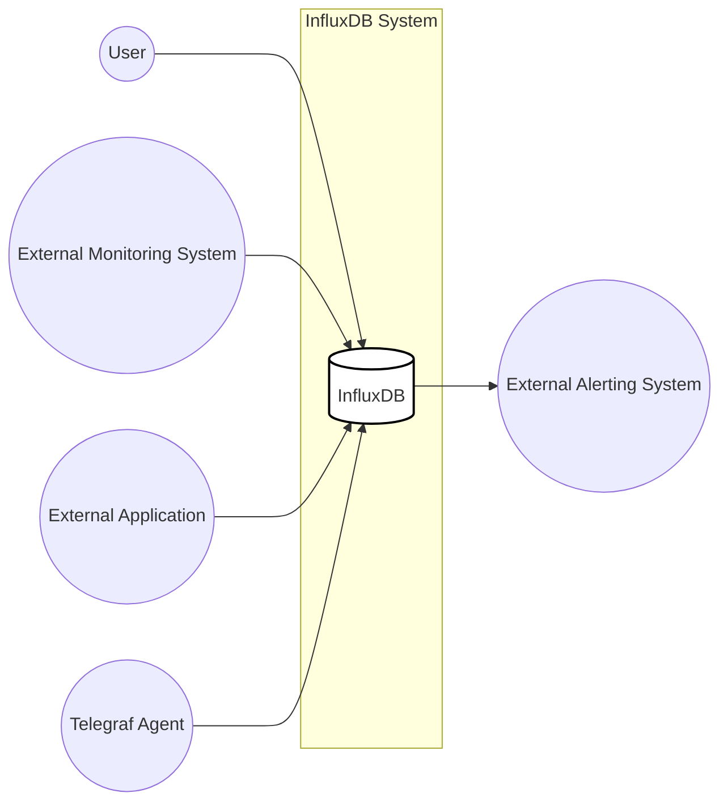
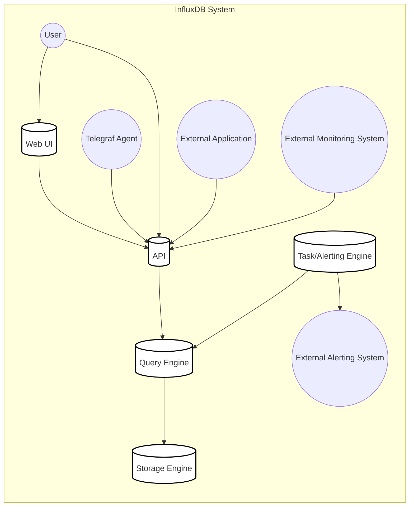
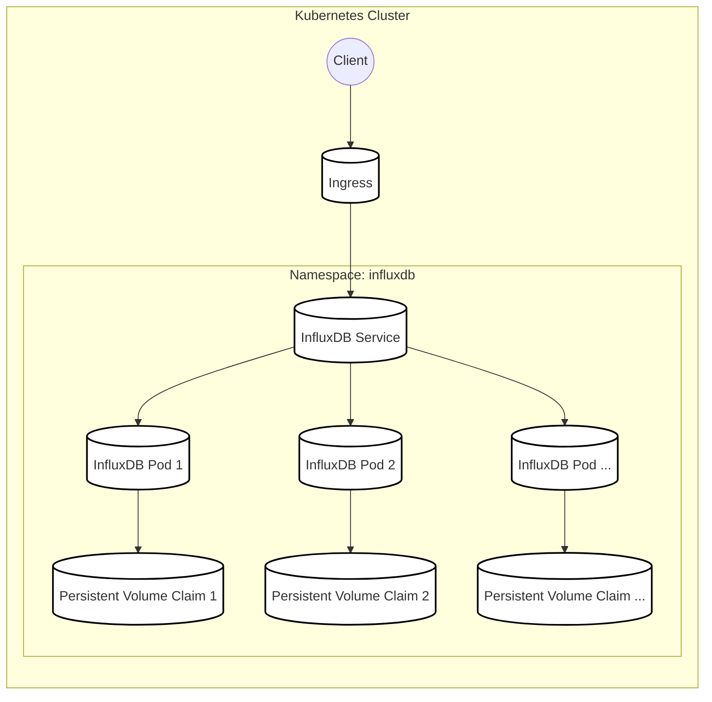
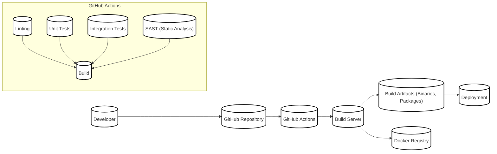

Okay, let's create a design document for the InfluxDB project, focusing on aspects relevant for threat modeling.

# BUSINESS POSTURE

InfluxDB is a time series database designed to handle high write and query loads. It is a core component of the InfluxData platform, used for monitoring, application metrics, IoT sensor data, and real-time analytics.

Business Priorities:

*   Reliability: InfluxDB must be highly available and resilient to failures, as it's often used in mission-critical monitoring and alerting systems. Downtime can directly impact business operations.
*   Performance: The database needs to handle massive amounts of time-series data with high ingest and query speeds. Performance bottlenecks can lead to delayed insights and impact decision-making.
*   Scalability: InfluxDB should scale horizontally to accommodate growing data volumes and user demands without significant performance degradation.
*   Usability: Ease of use for developers and operators is crucial for adoption and efficient operation. This includes simple installation, configuration, and query language.
*   Data Integrity: Ensuring the accuracy and consistency of stored data is paramount. Data loss or corruption can lead to incorrect analysis and flawed business decisions.

Business Risks:

*   Data Loss/Corruption: Loss of critical monitoring or operational data due to software bugs, hardware failures, or malicious attacks.
*   System Downtime: Unavailability of the database, preventing access to real-time data and disrupting monitoring/alerting pipelines.
*   Performance Degradation: Slow query responses or ingest rates, hindering real-time analysis and decision-making.
*   Unauthorized Access: Exposure of sensitive time-series data to unauthorized users or external attackers.
*   Data Breaches: Exfiltration of sensitive data due to vulnerabilities in the database or related components.
*   Compliance Violations: Failure to meet regulatory requirements related to data privacy and security (e.g., GDPR, HIPAA).

# SECURITY POSTURE

Existing Security Controls:

*   security control: Authentication: InfluxDB supports user authentication with username/password and JWT (JSON Web Token) based authentication. (Described in InfluxDB documentation and API endpoints).
*   security control: Authorization: Role-based access control (RBAC) is implemented to manage user permissions and restrict access to specific resources. (Described in InfluxDB documentation and API endpoints).
*   security control: TLS/SSL Encryption: InfluxDB can be configured to use TLS/SSL for encrypting communication between clients and the server, as well as between nodes in a cluster. (Described in InfluxDB configuration options).
*   security control: API Security: The InfluxDB API uses token-based authentication to secure endpoints. (Described in InfluxDB API documentation).
*   security control: Input Validation: InfluxDB performs input validation on data and queries to prevent injection attacks and other data-related vulnerabilities. (Implemented in the query parser and data ingestion pipeline).
*   security control: Auditing: InfluxDB provides some level of auditing, logging requests and actions performed by users. (Described in InfluxDB documentation).

Accepted Risks:

*   accepted risk: Limited protection against sophisticated DDoS attacks: While InfluxDB has some basic rate limiting, it may be vulnerable to large-scale distributed denial-of-service attacks. Mitigation may require external solutions like cloud-based DDoS protection services.
*   accepted risk: Complexity of securing a distributed cluster: Properly securing a multi-node InfluxDB cluster requires careful configuration and management of network security, authentication, and authorization across all nodes.
*   accepted risk: Potential for vulnerabilities in third-party dependencies: Like any software, InfluxDB relies on third-party libraries, which may contain vulnerabilities that could be exploited.

Recommended Security Controls:

*   security control: Enhanced Auditing: Implement more comprehensive audit logging, including detailed information about data modifications, configuration changes, and user login/logout events.
*   security control: Intrusion Detection/Prevention System (IDS/IPS): Deploy an IDS/IPS to monitor network traffic and detect/prevent malicious activity targeting the InfluxDB server.
*   security control: Regular Security Audits and Penetration Testing: Conduct periodic security assessments and penetration tests to identify and address vulnerabilities proactively.
*   security control: Web Application Firewall (WAF): If exposing InfluxDB API directly to the internet, use a WAF to protect against common web attacks.
*   security control: Secrets Management: Integrate with a secrets management solution (e.g., HashiCorp Vault) to securely store and manage sensitive credentials, API keys, and TLS certificates.
*   security control: Data at Rest Encryption: Implement encryption for data stored on disk to protect against unauthorized access in case of physical theft or server compromise.

Security Requirements:

*   Authentication:
    *   Support for strong password policies (length, complexity, expiration).
    *   Multi-factor authentication (MFA) for enhanced security.
    *   Integration with existing identity providers (e.g., LDAP, Active Directory, OAuth 2.0).
*   Authorization:
    *   Fine-grained access control to restrict user permissions at the database, measurement, and field levels.
    *   Ability to define custom roles with specific privileges.
    *   Regular review and auditing of user permissions.
*   Input Validation:
    *   Strict validation of all user inputs, including queries, data points, and configuration parameters.
    *   Protection against SQL injection, NoSQL injection, and other injection attacks.
    *   Sanitization of data to prevent cross-site scripting (XSS) vulnerabilities in web interfaces.
*   Cryptography:
    *   Use of strong, industry-standard encryption algorithms for TLS/SSL (e.g., AES-256, TLS 1.3).
    *   Proper key management practices, including secure storage and rotation of encryption keys.
    *   Hashing of passwords using strong, salted hashing algorithms (e.g., bcrypt, Argon2).
    *   Data at rest encryption using industry standard algorithms.

# DESIGN

## C4 CONTEXT

Element List:

*   1.  Name: User
    2.  Type: Person
    3.  Description: A person interacting with InfluxDB, either directly through the CLI/UI or indirectly through applications.
    4.  Responsibilities:
        *   Writing data to InfluxDB.
        *   Querying data from InfluxDB.
        *   Managing InfluxDB configuration.
        *   Monitoring InfluxDB performance.
    5.  Security controls:
        *   Authentication (username/password, JWT).
        *   Authorization (RBAC).

*   1.  Name: External Monitoring System
    2.  Type: External System
    3.  Description: A system that monitors InfluxDB's performance and health.
    4.  Responsibilities:
        *   Collecting metrics from InfluxDB.
        *   Generating alerts based on predefined thresholds.
    5.  Security controls:
        *   Authentication (API key, TLS/SSL).
        *   Authorization (limited access to monitoring data).

*   1.  Name: External Application
    2.  Type: External System
    3.  Description: An application that interacts with InfluxDB to store or retrieve data.
    4.  Responsibilities:
        *   Sending data to InfluxDB.
        *   Querying data from InfluxDB.
    5.  Security controls:
        *   Authentication (API key, TLS/SSL).
        *   Authorization (limited access to specific data).

*   1.  Name: Telegraf Agent
    2.  Type: Software System
    3.  Description: An agent that collects and sends metrics to InfluxDB.
    4.  Responsibilities:
        *   Collecting metrics from various sources.
        *   Sending data to InfluxDB.
    5.  Security controls:
        *   Authentication (API key, TLS/SSL).
        *   Authorization (limited access to write data).
        *   Secure communication with InfluxDB.

*   1.  Name: InfluxDB
    2.  Type: Software System
    3.  Description: The core time series database.
    4.  Responsibilities:
        *   Storing time series data.
        *   Processing queries.
        *   Managing users and permissions.
        *   Providing an API for data interaction.
    5.  Security controls:
        *   Authentication (username/password, JWT).
        *   Authorization (RBAC).
        *   TLS/SSL encryption.
        *   Input validation.
        *   Auditing.

*   1.  Name: External Alerting System
    2.  Type: External System
    3.  Description: A system that receives alerts from InfluxDB.
    4.  Responsibilities:
        *   Receiving alerts from InfluxDB.
        *   Notifying users or systems about alerts.
    5.  Security controls:
        *   Secure communication with InfluxDB.

## C4 CONTAINER

Element List:

*   1.  Name: API
    2.  Type: Container
    3.  Description: Provides an HTTP API for interacting with InfluxDB.
    4.  Responsibilities:
        *   Handling client requests.
        *   Authenticating and authorizing users.
        *   Routing requests to the appropriate internal components.
        *   Returning responses to clients.
    5.  Security controls:
        *   Authentication (username/password, JWT).
        *   Authorization (RBAC).
        *   TLS/SSL encryption.
        *   Input validation.
        *   Rate limiting.

*   1.  Name: Storage Engine
    2.  Type: Container
    3.  Description: Manages the storage and retrieval of time series data.
    4.  Responsibilities:
        *   Writing data to disk.
        *   Reading data from disk.
        *   Managing data retention policies.
        *   Optimizing data storage for performance.
    5.  Security controls:
        *   Data at rest encryption (recommended).
        *   Access control to storage files.

*   1.  Name: Query Engine
    2.  Type: Container
    3.  Description: Processes queries and retrieves data from the storage engine.
    4.  Responsibilities:
        *   Parsing and validating queries.
        *   Executing queries against the storage engine.
        *   Returning results to the API.
    5.  Security controls:
        *   Input validation.
        *   Protection against query injection attacks.

*   1.  Name: Web UI
    2.  Type: Container
    3.  Description: Provides a web-based user interface for interacting with InfluxDB.
    4.  Responsibilities:
        *   Displaying data visualizations.
        *   Allowing users to execute queries.
        *   Managing InfluxDB configuration.
    5.  Security controls:
        *   Authentication (username/password, JWT).
        *   Authorization (RBAC).
        *   TLS/SSL encryption.
        *   Protection against XSS attacks.

*   1.  Name: Task/Alerting Engine
    2.  Type: Container
    3.  Description: Executes background tasks and manages alerting rules.
    4.  Responsibilities:
        *   Running scheduled tasks.
        *   Evaluating alerting rules.
        *   Sending alerts to external systems.
    5.  Security controls:
        *   Secure communication with external systems.
        *   Input validation for task and alert configurations.

*   1.  Name: Telegraf Agent
    2.  Type: Software System
    3.  Description: An agent that collects and sends metrics to InfluxDB.
    4.  Responsibilities:
        *   Collecting metrics from various sources.
        *   Sending data to InfluxDB.
    5.  Security controls:
        *   Authentication (API key, TLS/SSL).
        *   Authorization (limited access to write data).
        *   Secure communication with InfluxDB.

*   1.  Name: User
    2.  Type: Person
    3.  Description: A person interacting with InfluxDB, either directly through the CLI/UI or indirectly through applications.
    4.  Responsibilities:
        *   Writing data to InfluxDB.
        *   Querying data from InfluxDB.
        *   Managing InfluxDB configuration.
        *   Monitoring InfluxDB performance.
    5.  Security controls:
        *   Authentication (username/password, JWT).
        *   Authorization (RBAC).

*   1.  Name: External Application
    2.  Type: External System
    3.  Description: An application that interacts with InfluxDB to store or retrieve data.
    4.  Responsibilities:
        *   Sending data to InfluxDB.
        *   Querying data from InfluxDB.
    5.  Security controls:
        *   Authentication (API key, TLS/SSL).
        *   Authorization (limited access to specific data).

*   1.  Name: External Monitoring System
    2.  Type: External System
    3.  Description: A system that monitors InfluxDB's performance and health.
    4.  Responsibilities:
        *   Collecting metrics from InfluxDB.
        *   Generating alerts based on predefined thresholds.
    5.  Security controls:
        *   Authentication (API key, TLS/SSL).
        *   Authorization (limited access to monitoring data).

*   1.  Name: External Alerting System
    2.  Type: External System
    3.  Description: A system that receives alerts from InfluxDB.
    4.  Responsibilities:
        *   Receiving alerts from InfluxDB.
        *   Notifying users or systems about alerts.
    5.  Security controls:
        *   Secure communication with InfluxDB.

## DEPLOYMENT

Possible Deployment Solutions:

1.  Single Node: Simplest deployment, suitable for development, testing, or small-scale production environments.
2.  Docker Container: Deploying InfluxDB within a Docker container provides portability and isolation.
3.  Kubernetes: For large-scale, highly available deployments, Kubernetes can be used to manage InfluxDB clusters.
4.  Cloud-Specific Deployments (e.g., AWS, GCP, Azure): Cloud providers offer managed InfluxDB services or provide tools for deploying InfluxDB on their infrastructure.
5.  InfluxDB Cloud: InfluxData's managed cloud service.

Chosen Solution (for detailed description): Kubernetes

Element List:

*   1.  Name: Client
    2.  Type: External System
    3.  Description: Any system or user accessing InfluxDB.
    4.  Responsibilities:
        *   Connecting to InfluxDB.
        *   Sending requests.
        *   Receiving responses.
    5.  Security controls:
        *   TLS/SSL encryption.
        *   Authentication.

*   1.  Name: Ingress
    2.  Type: Kubernetes Resource
    3.  Description: Exposes the InfluxDB service to external traffic.
    4.  Responsibilities:
        *   Routing external traffic to the InfluxDB service.
        *   TLS termination (optional).
    5.  Security controls:
        *   TLS/SSL configuration.
        *   Network policies.

*   1.  Name: InfluxDB Service
    2.  Type: Kubernetes Resource
    3.  Description: A stable endpoint for accessing InfluxDB pods.
    4.  Responsibilities:
        *   Load balancing traffic across InfluxDB pods.
        *   Providing a single point of access.
    5.  Security controls:
        *   Network policies.

*   1.  Name: InfluxDB Pod (1, 2, ...)
    2.  Type: Kubernetes Pod
    3.  Description: A running instance of the InfluxDB container.
    4.  Responsibilities:
        *   Running the InfluxDB software.
        *   Handling requests.
        *   Storing data.
    5.  Security controls:
        *   All InfluxDB security controls (authentication, authorization, etc.).
        *   Network policies.
        *   Pod security policies.

*   1.  Name: Persistent Volume Claim (1, 2, ...)
    2.  Type: Kubernetes Resource
    3.  Description: Requests storage for the InfluxDB pods.
    4.  Responsibilities:
        *   Providing persistent storage for InfluxDB data.
    5.  Security controls:
        *   Storage-level encryption (if supported by the underlying storage provider).
        *   Access control to the persistent volume.

## BUILD

InfluxDB uses a combination of Go build tools and shell scripts for its build process. GitHub Actions is used for CI/CD.

Build Process Description:

1.  Developer commits code to the GitHub repository.
2.  GitHub Actions triggers a workflow on code push or pull request.
3.  The workflow runs on a build server.
4.  Linting (using tools like `golangci-lint`) is performed to check code style and identify potential issues.
5.  Unit tests are executed to verify the correctness of individual components.
6.  Integration tests are run to test the interaction between different parts of the system.
7.  Static analysis security testing (SAST) is performed using tools like `gosec` to identify potential security vulnerabilities in the code.
8.  The code is built using Go build tools, creating binaries and packages.
9.  Docker images are built and pushed to a Docker registry.
10. Build artifacts are made available for deployment.

Security Controls in Build Process:

*   security control: Linting: Enforces code style and helps prevent common coding errors.
*   security control: Unit and Integration Tests: Verify the correctness of the code and help prevent regressions.
*   security control: SAST: Identifies potential security vulnerabilities in the code before deployment.
*   security control: Dependency Management: Go modules are used to manage dependencies, and tools like `dependabot` can be used to automatically update dependencies and address known vulnerabilities.
*   security control: Build Automation: GitHub Actions provides a consistent and reproducible build process.
*   security control: Artifact Signing: (Recommended) Build artifacts (binaries and Docker images) should be digitally signed to ensure their integrity and authenticity.
*   security control: Software Composition Analysis (SCA): (Recommended) Use SCA tools to identify and manage vulnerabilities in third-party dependencies.

# RISK ASSESSMENT

Critical Business Processes:

*   Real-time monitoring and alerting: InfluxDB is often used to monitor critical systems and applications, generating alerts when issues arise.
*   Data-driven decision-making: InfluxDB provides the data needed for real-time analysis and informed business decisions.
*   Operational visibility: InfluxDB provides insights into the performance and health of IT infrastructure and applications.

Data Sensitivity:

*   Metrics Data: This can include performance metrics, system logs, application events, and business-related data. The sensitivity of this data varies greatly depending on the specific use case. Some metrics may be publicly available, while others may contain confidential business information or personally identifiable information (PII).
*   Configuration Data: This includes usernames, passwords, API keys, and other sensitive configuration settings. This data is highly sensitive and must be protected from unauthorized access.
*   User Data: If InfluxDB is used to store user-related information (e.g., user profiles, activity logs), this data may be subject to privacy regulations like GDPR.

Data Sensitivity Levels:

*   Public: Data that can be freely shared without any risk.
*   Internal: Data that is intended for internal use only and should not be exposed to the public.
*   Confidential: Data that is highly sensitive and could cause significant harm if exposed.
*   Restricted: Data that is subject to strict regulatory requirements (e.g., PII, financial data).

# QUESTIONS & ASSUMPTIONS

Questions:

*   What specific compliance requirements (e.g., GDPR, HIPAA, PCI DSS) apply to the InfluxDB deployments?
*   What is the expected data volume and growth rate? This will impact scalability requirements.
*   What are the specific performance requirements (e.g., query latency, ingest rate)?
*   What are the existing disaster recovery and business continuity plans?
*   What level of access do different user groups require?
*   Are there any specific security concerns or known vulnerabilities that need to be addressed?
*   What is the network topology and security architecture of the environment where InfluxDB will be deployed?
*   What are the specific alerting requirements and integrations with external systems?
*   What are the retention policies for different types of data stored in InfluxDB?
*   What are the procedures for managing and rotating secrets (e.g., API keys, passwords)?

Assumptions:

*   BUSINESS POSTURE: The primary use case is for time-series data storage and analysis, with a focus on performance, reliability, and scalability.
*   SECURITY POSTURE: Basic security controls (authentication, authorization, TLS/SSL) are in place, but there is room for improvement.
*   DESIGN: The deployment will be on Kubernetes, and a multi-node cluster will be used for high availability and scalability. The build process is automated using GitHub Actions.
*   The organization has a moderate risk appetite, balancing the need for security with the desire for agility and innovation.
*   There is a dedicated operations team responsible for managing and maintaining the InfluxDB deployment.
*   Regular backups of the InfluxDB data will be performed.
*   The network environment where InfluxDB is deployed has basic security controls (e.g., firewalls, network segmentation).
*   Users accessing InfluxDB will be trained on basic security best practices.
*   The organization has a process for responding to security incidents.
*   Third-party dependencies are regularly reviewed and updated.