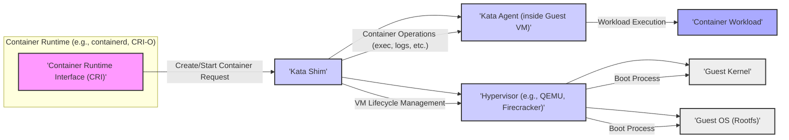
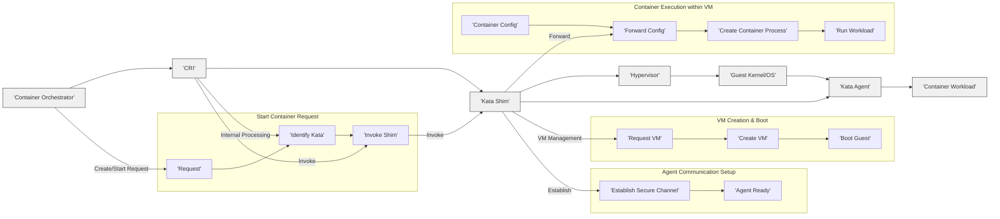

# Project Design Document: Kata Containers

**Version:** 1.1
**Date:** October 26, 2023
**Author:** AI Software Architect

## 1. Introduction

This document provides a detailed architectural overview of the Kata Containers project, intended as a foundation for subsequent threat modeling activities. It clearly outlines the system's components, their interactions, and the data flow within the architecture. Kata Containers is an open-source project enabling container workloads to run in lightweight virtual machines (VMs), offering strong isolation and enhanced security compared to traditional container runtimes. This approach combines the deployment agility of containers with the workload isolation of VMs.

## 2. Goals

The primary goals of this design document are to:

*   Clearly define the major components of the Kata Containers architecture and their specific roles.
*   Illustrate the interactions and relationships between these components using diagrams.
*   Describe the data flow involved in the lifecycle of a container managed by Kata Containers.
*   Provide a comprehensive foundation for identifying potential security vulnerabilities, attack surfaces, and trust boundaries during threat modeling exercises.

## 3. High-Level Architecture

The following diagram illustrates the high-level architecture of Kata Containers, emphasizing the interaction between the container runtime and the isolated VM.

## 4. Detailed Component Descriptions

This section provides a detailed description of each component involved in the Kata Containers architecture, outlining their responsibilities and interactions:

*   **Container Runtime Interface (CRI):**
    *   Standard interface for container orchestrators (e.g., Kubernetes) to manage containers.
    *   Receives high-level requests for container lifecycle management (create, start, stop, delete).
    *   Abstracts the underlying container runtime implementation.
*   **Kata Shim:**
    *   A lightweight process acting as the direct interface between the CRI and the Kata Container instance (the VM).
    *   Manages the lifecycle of the associated virtual machine.
    *   Interacts with the hypervisor to create, start, stop, and destroy the VM.
    *   Establishes secure communication channels with the Kata Agent running inside the guest VM (typically using `virtio-vsock`).
    *   Translates container-level operations into VM-level actions.
    *   Handles streaming of container output (logs, exec commands).
*   **Hypervisor:**
    *   The virtualization layer responsible for creating and managing the lightweight virtual machine.
    *   Provides hardware virtualization and isolation for the guest VM's resources (CPU, memory, devices).
    *   Examples include QEMU (using its lightweight `qemu-lite` mode) and Firecracker.
    *   Enforces the isolation boundary between the host and the guest VM.
*   **Guest Kernel:**
    *   The operating system kernel running within the isolated guest VM.
    *   A minimal kernel optimized for container workloads, often built using projects like `linuxkit`.
    *   Manages resources within the guest VM and executes the container workload.
*   **Guest OS (Rootfs):**
    *   The root file system for the guest operating system.
    *   Contains the necessary libraries, utilities, and the Kata Agent to function.
    *   Typically a minimal and secure image to reduce the attack surface.
*   **Kata Agent:**
    *   A process running within the guest VM.
    *   Receives commands from the Kata Shim.
    *   Responsible for managing the container lifecycle *inside* the VM.
    *   Uses standard container tools (like `runc` or a similar OCI runtime) to create and manage container processes.
    *   Manages networking and storage namespaces for the container within the VM.
    *   Reports container status back to the Kata Shim.
*   **Container Workload:**
    *   The actual application or service running inside the container within the guest VM.
    *   Isolated from other containers and the host OS by the virtualization layer.

## 5. Data Flow

The following steps describe the typical data flow during the lifecycle of a container managed by Kata Containers, from creation to execution:

1. A container orchestrator (e.g., Kubernetes) sends a request to the **'Container Runtime Interface (CRI)'** to create and start a container.
2. The CRI determines that Kata Containers is the designated runtime for this container and invokes the **'Kata Shim'**.
3. The **'Kata Shim'** communicates with the **'Hypervisor'** to create a new lightweight virtual machine. This includes specifying:
    *   VM resources (CPU, memory).
    *   The kernel image to boot.
    *   The initial root file system image.
    *   Networking configuration.
4. The **'Hypervisor'** boots the **'Guest Kernel'** within the newly created VM, using the provided kernel and root file system.
5. Once the guest OS has booted, the **'Kata Agent'** starts within the guest VM.
6. The **'Kata Shim'** establishes a secure communication channel with the **'Kata Agent'** inside the guest VM (e.g., using `virtio-vsock`).
7. The CRI provides container configuration details (e.g., container image, environment variables, command to execute) to the **'Kata Shim'**.
8. The **'Kata Shim'** forwards these container configuration details to the **'Kata Agent'**.
9. The **'Kata Agent'** uses this information to:
    *   Pull the specified container image (if not already present).
    *   Create the necessary namespaces and cgroups within the guest VM for the container.
    *   Use an OCI runtime (like `runc`) to create and start the **'Container Workload'** process within the isolated environment of the guest VM.
10. Communication between the **'Container Workload'** and the external network or other containers typically involves virtual network devices managed by the Kata Agent and the hypervisor.

The following diagram illustrates this data flow:

## 6. Security Considerations (High-Level)

Kata Containers prioritizes strong isolation for container workloads through hardware virtualization. Key security considerations include:

*   **Strong Workload Isolation:** Each container runs in its own isolated VM, providing a strong security boundary and preventing direct access or interference between containers and the host.
*   **Reduced Host Kernel Attack Surface:** Container workloads do not directly interact with the host kernel, minimizing the impact of potential vulnerabilities in the host.
*   **Minimal Guest OS:** The guest OS is typically a minimal image, reducing the attack surface within the VM.
*   **Hypervisor as a Security Boundary:** The hypervisor is a critical security component, responsible for enforcing isolation. Its security is paramount.
*   **Secure Communication:** Secure communication channels (e.g., `virtio-vsock`) between the Kata Shim and Kata Agent are crucial to prevent unauthorized control of the guest VM.
*   **Memory Isolation:** Hardware virtualization ensures memory isolation between VMs, preventing information leakage.
*   **Device Virtualization:** Virtualized devices limit the guest VM's direct access to host hardware, reducing potential attack vectors.
*   **Trust Boundary:** The hypervisor represents a significant trust boundary. Vulnerabilities here could compromise the entire system.
*   **Supply Chain Security:** The security of the guest kernel and root file system images is important. Using trusted and verified images is recommended.

## 7. Deployment Model

Kata Containers is designed for environments requiring strong container isolation and integrates seamlessly with container orchestration platforms:

*   **Integration with Kubernetes:** Kata Containers implements the CRI, allowing it to be used as a runtime within Kubernetes. Kubernetes manages the container lifecycle, and when a pod is scheduled to run with the Kata runtime, the CRI implementation delegates the execution to the Kata Shim.
*   **Multi-tenancy:** Ideal for multi-tenant environments where strong isolation between tenants' workloads is necessary.
*   **Security-Sensitive Applications:** Suitable for applications with strict security requirements, where the isolation provided by VMs is beneficial.
*   **Edge Computing:** Can be deployed in resource-constrained edge environments, leveraging lightweight hypervisors like Firecracker.
*   **Configuration:**  Typically configured through the container runtime (e.g., containerd or CRI-O) by specifying Kata Containers as the runtime class for specific workloads.

## 8. Assumptions and Constraints

The following assumptions and constraints are relevant to this design:

*   **Trusted Host OS:** The security of the host operating system is a fundamental assumption. A compromised host OS could potentially undermine the isolation provided by Kata Containers.
*   **Secure Hypervisor Configuration and Operation:** It is assumed that the hypervisor is correctly configured and operated securely, following security best practices.
*   **Secure Communication Channels:** The communication channels between the Kata Shim and Kata Agent are assumed to be secure and authenticated.
*   **Focus on Workload Isolation:** The primary security benefit of Kata Containers is workload isolation. Other security aspects, such as network policies and access control, are typically managed by the orchestration platform.
*   **Supported Hardware Architectures:** Kata Containers has specific hardware requirements for virtualization support. This design assumes deployment on compatible hardware.
*   **Resource Availability:** Sufficient resources (CPU, memory) are available on the host to run the guest VMs.
*   **Image Integrity:** The integrity and security of the container images used within Kata Containers are assumed. Vulnerable images can still pose risks within the isolated environment.

This document provides a detailed architectural overview of Kata Containers, serving as a valuable resource for threat modeling. The detailed component descriptions, data flow diagrams, and security considerations offer a solid foundation for identifying potential security risks and designing appropriate mitigations.