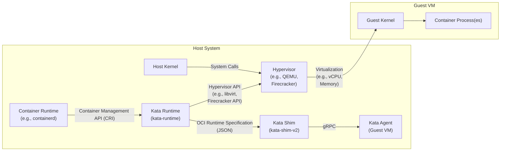
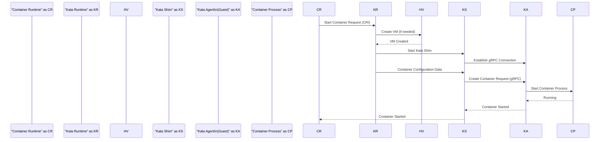

# Project Design Document: Kata Containers

**Version:** 1.1
**Date:** October 26, 2023
**Author:** AI Cloud & Security Architect

## 1. Introduction

This document provides a detailed design overview of the Kata Containers project, focusing on aspects relevant to security and threat modeling. It describes the system's architecture, key components, their interactions, and relevant security considerations.

Kata Containers is an open-source project that enables running container workloads in lightweight virtual machines (VMs). This approach combines the isolation and security benefits of VMs with the speed and operational efficiency of container runtimes. By launching each container or pod within its own isolated VM, Kata Containers significantly reduces the attack surface and potential impact of container escape vulnerabilities.

## 2. Goals

The primary goals of this design document are to:

*   Provide a clear and detailed explanation of the Kata Containers architecture and its components.
*   Illustrate the interactions and communication pathways between different components.
*   Identify critical interfaces, data flows, and trust boundaries within the system.
*   Offer sufficient technical detail to facilitate comprehensive threat modeling activities.

## 3. High-Level Architecture

Kata Containers introduces a secure container runtime environment by leveraging virtualization technology. Instead of executing container processes directly on the host kernel, Kata Containers orchestrates the creation and management of lightweight VMs for each container or a group of containers (pods).

**Key Components:**

*   **Container Runtime (e.g., containerd, CRI-O):** Manages the overall lifecycle of containers, including image pulling, container creation, starting, stopping, and deletion. It communicates with the Kata Runtime through the standard Container Runtime Interface (CRI).
*   **Kata Runtime (kata-runtime):** Implements the CRI interface and acts as the primary orchestrator for Kata Containers. It determines when and how to create and manage the lightweight VMs, interacting with the hypervisor and the Kata Shim.
*   **Kata Shim (kata-shim-v2):** A lightweight, per-container process responsible for the direct management of a container within its assigned VM. It communicates with the Kata Agent inside the guest VM using gRPC. The `v2` indicates the current generation of the shim.
*   **Kata Agent (Guest VM):** Runs within the guest VM and acts as an intermediary between the Kata Shim on the host and the container processes within the VM. It handles container lifecycle management within the VM, including namespace creation, process execution, resource management, and communication with the host.
*   **Hypervisor (e.g., QEMU, Firecracker):** Provides the hardware virtualization layer, creating and managing the isolated VMs. Kata Containers supports various hypervisors, each with its own security characteristics.
*   **Host Kernel:** The operating system kernel running on the host machine. It provides the underlying resources and capabilities for the container runtime and hypervisor.
*   **Guest Kernel:** The operating system kernel running inside the lightweight VM. It is typically a minimal, security-focused kernel optimized for container workloads.
*   **Container Process(es):** The actual application processes running inside the container within the isolated guest VM.

## 4. Detailed Component Breakdown

This section provides a more in-depth look at the key components and their functionalities, highlighting aspects relevant to security.

### 4.1. Kata Runtime (kata-runtime)

*   **Purpose:**  Acts as the central control point for managing Kata Containers, bridging the container runtime and the virtualization infrastructure.
*   **Key Responsibilities:**
    *   Receiving container lifecycle requests from the container runtime via the CRI (gRPC).
    *   Interpreting the OCI Runtime Specification to understand container configuration.
    *   Deciding whether to create a new VM or reuse an existing one (for pod-level sharing).
    *   Selecting and interacting with the appropriate hypervisor through its API (e.g., libvirt for QEMU, the Firecracker API).
    *   Managing the lifecycle of the VM, including creation, startup, shutdown, and resource allocation.
    *   Spawning and managing the Kata Shim process for each container.
    *   Handling networking and storage setup for the guest VM.
*   **Interfaces:**
    *   **CRI (gRPC):** Receives container management requests (e.g., CreateContainer, StartContainer, StopContainer) from the container runtime.
    *   **Hypervisor API (e.g., libvirt API, Firecracker API):**  Used to control the hypervisor, including VM creation, resource allocation, and device management.
    *   **Filesystem:** Accesses configuration files, VM images, and potentially shared volumes.
    *   **Unix Sockets:** Communicates with the Kata Shim processes.

### 4.2. Kata Shim (kata-shim-v2)

*   **Purpose:**  Provides a direct interface to manage a single container instance running within a guest VM.
*   **Key Responsibilities:**
    *   Receiving container-specific commands from the Kata Runtime (e.g., start, stop, exec).
    *   Establishing a secure gRPC connection with the Kata Agent running inside the associated guest VM.
    *   Translating container management requests into actions for the Kata Agent.
    *   Streaming container I/O (standard input, standard output, standard error) between the container runtime and the container process.
    *   Monitoring the health and status of the container process.
*   **Interfaces:**
    *   **gRPC:** Secure communication channel with the Kata Agent in the guest VM. This is a critical interface for command and control.
    *   **Unix Sockets:** Receives commands from the Kata Runtime.
    *   **Filesystem:** May access container image layers or shared volumes mounted into the container.

### 4.3. Kata Agent (Guest VM)

*   **Purpose:**  Manages the execution of container processes within the isolated guest VM environment.
*   **Key Responsibilities:**
    *   Receiving container management requests from the Kata Shim via gRPC.
    *   Creating and managing namespaces (e.g., PID, network, mount) and cgroups within the guest VM to isolate the container process.
    *   Executing the container's main process.
    *   Managing virtual network interfaces and routing within the guest VM.
    *   Mounting volumes and managing the container's filesystem within the VM.
    *   Reporting container status and resource usage back to the Kata Shim.
*   **Interfaces:**
    *   **gRPC:** Receives commands and sends responses to the Kata Shim on the host.
    *   **System Calls:** Interacts directly with the guest kernel to manage processes, namespaces, and resources.
    *   **VirtIO:** Communicates with virtualized hardware devices provided by the hypervisor.

### 4.4. Hypervisor

*   **Purpose:**  Provides the fundamental hardware virtualization layer, ensuring strong isolation between the host and guest VMs, and between different guest VMs.
*   **Key Responsibilities:**
    *   Creating and managing lightweight VMs (also known as microVMs).
    *   Enforcing hardware-level isolation of CPU, memory, and other resources.
    *   Providing virtualized hardware devices (e.g., network cards, block devices) to the guest VMs.
    *   Implementing security features such as memory isolation (e.g., Intel VT-d).
*   **Interfaces:**
    *   **API (e.g., libvirt API, Firecracker API):** Used by the Kata Runtime to control the lifecycle and configuration of the VMs.

## 5. Data Flow

This section illustrates the typical data flow involved in starting a container using Kata Containers, highlighting the communication pathways between components.

1. **Container Start Request:** A user or orchestrator (e.g., Kubernetes) sends a request to the container runtime (e.g., containerd) to start a container.
2. **CRI Request to Kata Runtime:** The container runtime forwards the request to the Kata Runtime via the CRI interface (gRPC).
3. **VM Creation/Selection:** The Kata Runtime determines if a new VM needs to be created for this container (or pod). If so, it interacts with the hypervisor API to create a new lightweight VM.
4. **Kata Shim Initialization:** The Kata Runtime starts a Kata Shim process on the host, associated with the specific container.
5. **gRPC Connection Establishment:** The Kata Shim establishes a secure gRPC connection with the Kata Agent running inside the newly created (or existing) guest VM.
6. **Container Configuration Transmission:** The Kata Runtime provides the container configuration details (e.g., image, command, environment variables) to the Kata Shim.
7. **Container Creation Request to Agent:** The Kata Shim forwards the container creation request to the Kata Agent via the gRPC connection.
8. **Namespace and Process Setup:** The Kata Agent creates the necessary namespaces and cgroups within the guest VM and then starts the container's main process.
9. **Process Execution:** The container process executes within the isolated guest VM.
10. **I/O Streaming:**  Standard input, output, and error streams for the container are proxied between the container process, the Kata Agent, the Kata Shim, and the container runtime.

## 6. Key Security Considerations

Kata Containers enhances container security through hardware virtualization. Key security features and considerations include:

*   **Strong Hardware-Based Isolation:** Each container (or pod) runs within its own isolated VM, providing a strong security boundary enforced by the hypervisor. This significantly mitigates container escape vulnerabilities.
*   **Reduced Host Kernel Attack Surface:** Container workloads do not directly interact with the host kernel, limiting the impact of potential host kernel vulnerabilities on container security.
*   **Minimal Guest OS:** The use of a minimal guest operating system reduces the attack surface within the VM itself.
*   **Secure Boot for Guest VM:** Kata Containers supports secure boot for the guest VM, ensuring the integrity of the guest kernel and preventing the execution of unauthorized code during boot.
*   **Memory Isolation:**  Hypervisors utilize hardware features like Intel VT-d to provide memory isolation between VMs, preventing unauthorized memory access.
*   **Secure Communication Channels:** Communication between the Kata Shim and Kata Agent is secured using gRPC, often with TLS encryption.
*   **Resource Limits Enforcement:** The hypervisor and guest OS enforce resource limits, preventing denial-of-service attacks and resource contention.
*   **Trust Boundary:** The primary trust boundary lies between the host system and the guest VM. The security of the guest VM relies on the integrity of the hypervisor and the guest kernel.

## 7. Assumptions and Constraints

*   **Trusted Host Operating System:** The security of Kata Containers fundamentally depends on the security of the underlying host operating system and the hypervisor. A compromised host OS can potentially compromise the entire system.
*   **Secure Hypervisor Configuration:** Proper and secure configuration of the chosen hypervisor is critical for maintaining isolation and security. Misconfigurations can introduce vulnerabilities.
*   **Secure Container Image Source:** Kata Containers provides isolation, but it does not inherently protect against vulnerabilities within the container images themselves. Using trusted and scanned images is crucial.
*   **Network Security Policies:** Network security policies and configurations on the host and within the guest VMs are essential for controlling network access and preventing unauthorized communication.
*   **Resource Availability:** Sufficient host resources (CPU, memory) are required to run the lightweight VMs. Resource exhaustion on the host can impact the performance and availability of containers.

## 8. Future Considerations

*   **Enhanced Attestation Mechanisms:** Further integration with remote attestation technologies to cryptographically verify the integrity and configuration of the guest VM before workload execution.
*   **Confidential Computing Integration:** Exploring and integrating with confidential computing technologies (e.g., Intel SGX, AMD SEV) to further protect sensitive container workloads by encrypting data in use within the VM.
*   **Improved Resource Management and Optimization:** Continuously optimizing resource utilization and reducing the overhead associated with running containers in VMs.
*   **Support for Emerging Hypervisor Technologies:** Keeping pace with advancements in virtualization technologies to leverage new security features and performance improvements.

## 9. Conclusion

This document provides a detailed technical design overview of the Kata Containers project, emphasizing aspects relevant to security and threat modeling. The description of the architecture, components, and their interactions, along with the identified security considerations, provides a solid foundation for understanding the security properties of Kata Containers and for conducting comprehensive threat analysis. Understanding the trust boundaries and communication pathways is crucial for identifying potential attack vectors and designing appropriate security mitigations.