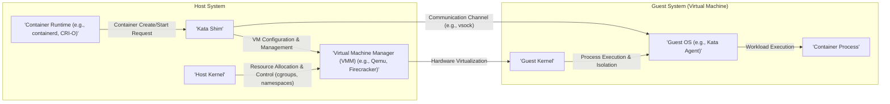
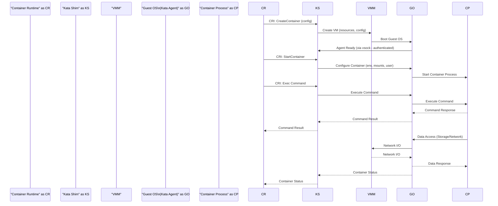

## Project Design Document: Kata Containers - Improved

**1. Introduction**

This document provides a detailed design overview of the Kata Containers project. It aims to describe the architecture, key components, and interactions within the system. This document will serve as a foundation for subsequent threat modeling activities.

**2. Goals**

* Provide a comprehensive and clear description of the Kata Containers architecture.
* Identify key components, their specific responsibilities, and their security relevance.
* Illustrate the data flow and interactions between components with more detail.
* Highlight security-relevant aspects of the design, including potential vulnerabilities.
* Serve as a robust basis for identifying potential threats and vulnerabilities during threat modeling.

**3. Scope**

This document covers the core architecture of Kata Containers, focusing on the runtime environment for executing container workloads with hardware virtualization-based isolation. It includes the interaction with container runtimes like containerd and CRI-O, the virtual machine manager (VMM), the guest operating system, and the container workload itself. This document focuses on the control plane and data plane interactions within the Kata Containers architecture.

**4. High-Level Architecture**

**5. Component Descriptions**

* **Container Runtime (e.g., containerd, CRI-O):**
    * Role: Manages the lifecycle of containers on the host system. It receives requests to create, start, stop, and delete containers based on specifications (e.g., OCI image).
    * Interaction with Kata: The container runtime uses the Container Runtime Interface (CRI) to delegate the execution of containers intended to run with virtualization to the Kata Shim.
    * Responsibilities:
        * Image management (pulling, storing).
        * Resource allocation at a high level.
        * Network namespace creation and management.
        * Storage volume management.
        * Enforcing security policies defined at the container runtime level (e.g., security profiles).
    * Security Considerations:
        * Vulnerabilities in the container runtime can lead to container escapes or host compromise, even when using Kata.
        * Misconfigured security policies can weaken the isolation provided by Kata.
        * Secure image management is crucial to prevent running malicious containers.

* **Kata Shim:**
    * Role: Acts as a CRI implementation specifically for Kata Containers. It orchestrates the creation and management of the virtual machine that will host the container workload.
    * Responsibilities:
        * Receiving container lifecycle requests from the container runtime via the CRI.
        * Creating and configuring the virtual machine based on the container request. This includes specifying CPU, memory, and other hardware resources.
        * Selecting and starting the Virtual Machine Manager (VMM).
        * Establishing a secure communication channel with the guest OS (Kata Agent) within the VM.
        * Forwarding container commands (e.g., `exec`, `attach`) from the container runtime to the guest OS.
        * Collecting and reporting container status and metrics back to the container runtime.
    * Security Considerations:
        * A highly privileged component running on the host. Vulnerabilities here could lead to complete host compromise.
        * The security of the communication channel with the guest OS is paramount to prevent unauthorized access or manipulation.
        * Improper handling of container configurations could lead to insecure VM setups.

* **Virtual Machine Manager (VMM) (e.g., Qemu, Firecracker):**
    * Role: Provides the hardware virtualization layer, creating and managing the virtual machine environment for the container. It emulates hardware and enforces isolation between the host and the guest.
    * Responsibilities:
        * Emulating hardware resources (CPU, memory, network interfaces, block devices).
        * Enforcing memory isolation and CPU virtualization.
        * Managing the lifecycle of the virtual machine (start, stop, pause).
        * Providing mechanisms for inter-VM communication (e.g., virtio-serial).
    * Security Considerations:
        * The VMM is a significant attack surface. Vulnerabilities in the VMM can lead to guest escape, allowing an attacker to break out of the VM and potentially compromise the host.
        * Secure configuration of the VMM is crucial (e.g., minimizing emulated devices, using secure boot).
        * Keeping the VMM up-to-date with security patches is essential.

* **Host Kernel:**
    * Role: The operating system kernel of the host system. It provides the underlying infrastructure and resources for container runtimes and VMMs.
    * Responsibilities:
        * Managing system resources (CPU scheduling, memory management, I/O operations).
        * Providing the necessary kernel modules for virtualization (e.g., KVM).
        * Enforcing security policies at the host level (e.g., SELinux, AppArmor, cgroup restrictions).
        * Managing namespaces and cgroups used by container runtimes.
    * Security Considerations:
        * The host kernel's security is fundamental. Vulnerabilities here can impact all containers and the host itself, potentially bypassing Kata's isolation.
        * Proper configuration and hardening of the host kernel are crucial.

* **Guest Kernel:**
    * Role: The operating system kernel running inside the virtual machine. It manages resources within the isolated VM environment.
    * Responsibilities:
        * Managing resources (CPU, memory, devices) within the virtual machine.
        * Providing the necessary system calls and interfaces for the Guest OS (Kata Agent) and the container process.
        * Handling communication with the VMM through virtualized hardware interfaces.
    * Security Considerations:
        * While isolated by the VMM, vulnerabilities in the guest kernel could be exploited if an attacker gains initial access to the guest environment.
        * A minimal and hardened guest kernel reduces the attack surface.

* **Guest OS (e.g., Kata Agent):**
    * Role: A minimal operating system running within the virtual machine, responsible for managing the container process and facilitating communication with the Kata Shim. The Kata Agent is a key component here, acting as the init process within the guest.
    * Responsibilities:
        * Receiving commands and configurations from the Kata Shim via the communication channel.
        * Setting up the container environment within the VM (e.g., creating namespaces, setting up file systems).
        * Starting and managing the container process.
        * Providing networking and storage access for the container within the VM's context.
        * Reporting container status and metrics back to the Kata Shim.
    * Security Considerations:
        * The Kata Agent handles sensitive operations within the guest. Secure coding practices are essential to prevent vulnerabilities.
        * The security of the communication protocol with the Kata Shim is critical. Authentication and authorization mechanisms are necessary.

* **Container Process:**
    * Role: The actual application or workload running inside the container, isolated within the virtual machine.
    * Responsibilities: Performing the intended function of the containerized application.
    * Security Considerations:
        * While isolated by the virtual machine, vulnerabilities within the container process itself can still be exploited by attackers who manage to gain access to the guest environment.
        * Standard container security best practices (e.g., running as a non-root user, minimizing privileges) should still be followed.

**6. Data Flow**

The following outlines the typical data flow during the creation and execution of a Kata Container:

1. **Container Creation Request:** The container runtime receives a request to create a new container, specifying the image and configuration.
2. **CRI Invoke (CreateContainer):** The container runtime, recognizing it's a Kata Container, invokes the `CreateContainer` gRPC call on the Kata Shim via the CRI. This includes container configuration details.
3. **VM Configuration and Creation:** The Kata Shim uses the provided configuration to instruct the VMM to create a new virtual machine. This involves allocating resources (CPU, memory), configuring network interfaces, and setting up storage.
4. **Guest OS Image Loading and Boot:** The VMM loads the guest OS image into the newly created VM's memory and initiates the boot process of the Guest Kernel.
5. **Agent Initialization and Communication Establishment:** The Guest Kernel boots, and the Kata Agent starts within the guest OS. The Kata Agent establishes a secure communication channel (e.g., using `vsock`) with the Kata Shim on the host. This often involves mutual authentication.
6. **CRI Invoke (StartContainer):** The container runtime invokes the `StartContainer` gRPC call on the Kata Shim.
7. **Container Configuration Transmission:** The Kata Shim sends detailed container configuration information (e.g., environment variables, mounts, user ID) to the Kata Agent via the secure communication channel.
8. **Container Environment Setup:** The Kata Agent sets up the container environment within the VM, including creating necessary namespaces, setting up file system mounts, and configuring networking within the guest.
9. **Container Process Execution:** The Kata Agent executes the container's entrypoint process within the configured environment.
10. **Command Execution (e.g., `exec`):** When the container runtime needs to execute a command inside the running container, it sends an `Exec` request to the Kata Shim. The Kata Shim forwards this request to the Kata Agent.
11. **Command Execution within Guest:** The Kata Agent executes the command within the container's namespaces and reports the output and exit code back to the Kata Shim.
12. **Data Access:** The container process interacts with storage (either directly attached virtual disks or shared file systems) and network resources, all within the confines of the virtual machine. Network traffic typically goes through virtual network interfaces managed by the VMM.
13. **Status Updates:** The Kata Agent periodically reports the status of the container process (running, stopped, etc.) back to the Kata Shim, which relays it to the container runtime.

**7. Security Considerations**

* **Strong Virtual Machine Isolation:** The primary security benefit of Kata Containers is the strong isolation provided by hardware virtualization, significantly reducing the risk of container escape and host compromise compared to traditional Linux containers.
* **VMM Vulnerabilities:**  Vulnerabilities in the chosen VMM (Qemu, Firecracker) remain a critical concern. Exploiting these vulnerabilities could allow an attacker to escape the guest VM and potentially compromise the host. Regular patching and secure configuration are essential.
* **Guest Kernel Security:** While isolated, vulnerabilities in the guest kernel could be exploited if an attacker gains initial access to the guest environment (e.g., through a compromised application). A minimal and hardened guest kernel reduces the attack surface.
* **Kata Shim Security:** The Kata Shim is a highly privileged component running on the host. Security vulnerabilities in the Shim could lead to complete host compromise. Secure coding practices, thorough testing, and regular security audits are crucial.
* **Secure Communication Channel:** The communication channel between the Kata Shim and the Guest OS (e.g., `vsock`) must be secured with strong authentication and encryption to prevent eavesdropping, tampering, or unauthorized control.
* **Resource Management and Limits:** Proper configuration of resource limits (CPU, memory, I/O) for the virtual machine is necessary to prevent denial-of-service attacks against the host or other containers.
* **Container Image Security:** While Kata provides strong isolation, it doesn't inherently secure the contents of the container image. Vulnerabilities within the application running inside the container can still be exploited if an attacker gains access to the guest environment. Image scanning and vulnerability management remain important.
* **Host Kernel Security:** The underlying host kernel's security posture directly impacts the overall security of the Kata Containers environment. A vulnerable host kernel can undermine the isolation provided by Kata.
* **Supply Chain Security:** Ensuring the integrity and security of all components in the Kata Containers supply chain (including the VMM, guest OS image, and Kata Shim itself) is crucial to prevent the introduction of malicious code.
* **Secure Boot of Guest VM:** Implementing secure boot for the guest VM can help ensure the integrity of the guest OS and prevent the loading of malicious kernels or bootloaders.
* **Minimizing Attack Surface:**  Using a minimal guest OS and VMM configuration reduces the potential attack surface within the virtual machine.
* **Secrets Management:** Securely managing secrets and credentials used by the containerized application is important, even within the isolated VM.

**8. Assumptions and Constraints**

* It is assumed that the underlying hardware supports the necessary virtualization extensions (e.g., Intel VT-x, AMD-V) and that these extensions are enabled.
* The security of the host operating system and its kernel is a prerequisite for the security of Kata Containers.
* The chosen VMM is configured securely, adhering to security best practices, and is kept up-to-date with the latest security patches.
* Secure and authenticated communication channels are established and maintained between the Kata Shim and the Guest OS.
* Standard container security best practices (e.g., image scanning, least privilege within the container) are followed for the container workloads running within Kata Containers.
* The guest OS image used is trusted and regularly updated with security patches.

**9. Future Considerations (Out of Scope for Initial Threat Modeling)**

* Deeper integration with hardware security features like Intel SGX or AMD SEV for enhanced confidentiality and integrity.
* Advanced networking configurations and security policies within the guest VM, such as network segmentation and micro-segmentation.
* Support for different VMMs and their specific security characteristics and hardening options.
* Fine-grained resource control and isolation within the guest VM.
* Integration with security monitoring and auditing tools for the guest VM environment.

This improved document provides a more detailed and comprehensive understanding of the Kata Containers architecture, highlighting key security considerations and providing a stronger foundation for subsequent threat modeling activities.