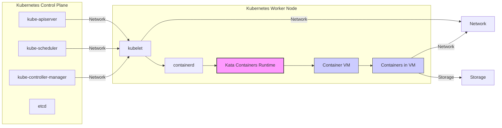

# BUSINESS POSTURE

- Business Priorities and Goals:
  - Secure Containerization: Provide a secure container runtime environment that isolates workloads and protects against container escape vulnerabilities.
  - Workload Isolation: Ensure strong isolation between containers, comparable to virtual machines, to prevent cross-container interference and security breaches.
  - Compatibility: Maintain compatibility with standard container ecosystems and orchestration platforms like Kubernetes and Docker.
  - Performance: Offer a balance between security and performance, minimizing overhead compared to traditional virtual machines while providing enhanced security compared to native containers.
  - Open Source Collaboration: Foster an open and collaborative community to drive innovation and adoption of secure container technologies.

- Most Important Business Risks:
  - Security Vulnerabilities: Risk of vulnerabilities in the Kata Containers runtime, hypervisor, or related components that could be exploited to compromise container isolation or the host system.
  - Integration Challenges: Risk of integration issues with existing container orchestration platforms, leading to operational complexities or instability.
  - Performance Overhead: Risk of performance degradation compared to native containers, potentially impacting application performance and user experience.
  - Adoption Barriers: Risk of slow adoption due to complexity, lack of awareness, or perceived overhead compared to less secure container runtimes.
  - Supply Chain Security: Risk of compromised dependencies or build processes introducing vulnerabilities into the Kata Containers distribution.

# SECURITY POSTURE

- Existing Security Controls:
  - security control: Secure coding practices are likely followed by the open-source community contributing to the project. (Described in project's development guidelines, if available).
  - security control: Regular security audits and vulnerability scanning are likely performed by the community and security researchers. (Described in project's security documentation, if available).
  - security control: Use of memory-safe languages like Go and Rust in some components to reduce the risk of memory-related vulnerabilities. (Implicit in the project's codebase).
  - security control: Strong isolation provided by hardware virtualization (Intel VT-x/AMD-V) to separate containers. (Architectural design of Kata Containers).
  - security control: Minimalist guest kernel and initramfs to reduce the attack surface within the container VM. (Design principle of Kata Containers).
  - security control: Rootless container support to reduce the privileges required for running containers. (Feature of Kata Containers).

- Accepted Risks:
  - accepted risk: Complexity of managing virtual machines compared to native containers, potentially leading to misconfigurations.
  - accepted risk: Performance overhead associated with virtualization, which might be noticeable for certain workloads.
  - accepted risk: Reliance on the security of the underlying hypervisor and hardware virtualization features.
  - accepted risk: Potential for vulnerabilities in third-party dependencies used by Kata Containers.

- Recommended Security Controls:
  - security control: Implement automated security testing (SAST, DAST, SCA) in the CI/CD pipeline to identify vulnerabilities early in the development process.
  - security control: Establish a formal security incident response plan to handle security vulnerabilities and breaches effectively.
  - security control: Conduct regular penetration testing to proactively identify and address security weaknesses.
  - security control: Implement a robust supply chain security strategy, including dependency scanning and verification of build artifacts.
  - security control: Provide security hardening guidelines and best practices for deploying and configuring Kata Containers.

- Security Requirements:
  - Authentication:
    - Requirement: Kata Containers itself does not directly handle user authentication. Authentication is typically managed by the container orchestration platform (e.g., Kubernetes) or the host operating system.
    - Requirement: Secure communication channels (e.g., TLS) should be used for communication between Kata Containers components and with external systems.
  - Authorization:
    - Requirement: Kata Containers should enforce authorization policies defined by the container orchestration platform to control access to container resources and operations.
    - Requirement: Role-Based Access Control (RBAC) should be supported to manage permissions for different users and roles interacting with Kata Containers.
    - Requirement: Least privilege principle should be applied to all Kata Containers components and processes.
  - Input Validation:
    - Requirement: All inputs to Kata Containers components, including API requests, configuration files, and container images, must be thoroughly validated to prevent injection attacks and other input-related vulnerabilities.
    - Requirement: Input validation should be performed at multiple layers, including at the API level, within container runtime components, and in the guest kernel.
  - Cryptography:
    - Requirement: Cryptographic mechanisms should be used to protect sensitive data at rest and in transit, such as container images, secrets, and communication channels.
    - Requirement: Strong cryptographic algorithms and protocols should be used, and key management practices should be secure.
    - Requirement: Support for encrypted container images and secure secret management should be provided.

# DESIGN

## C4 CONTEXT

```mermaid
graph LR
    subgraph "Container Orchestration Platform"
        C[Container Orchestrator (e.g., Kubernetes)]
    end
    subgraph "Users"
        A[Developers]
        B[Operators]
    end
    D[Container Registry]
    E[Kata Containers]
    F[Hardware Infrastructure]

    A --> C
    B --> C
    C --> E
    C --> D
    E --> F
    D --> E

    style E fill:#f9f,stroke:#333,stroke-width:2px
```

- Context Diagram Elements:
  - - Name: Developers
    - Type: Person
    - Description: Software developers who build and package applications as containers.
    - Responsibilities: Develop containerized applications, define container specifications, and push container images to registries.
    - Security controls: Code signing of container images (potentially), secure development practices.
  - - Name: Operators
    - Type: Person
    - Description: System administrators and operations teams responsible for deploying, managing, and monitoring containerized applications and infrastructure.
    - Responsibilities: Deploy and manage container orchestration platforms, configure and monitor Kata Containers, and ensure the security and stability of the container environment.
    - Security controls: Access control to infrastructure and orchestration platform, security monitoring and logging.
  - - Name: Container Orchestrator (e.g., Kubernetes)
    - Type: Software System
    - Description: A platform for automating deployment, scaling, and management of containerized applications. Manages the lifecycle of containers, including scheduling, networking, and storage.
    - Responsibilities: Orchestrate containers, manage networking and storage, enforce policies, and interact with container runtimes like Kata Containers.
    - Security controls: Authentication and authorization of users and services, network policies, RBAC, audit logging, secret management.
  - - Name: Container Registry
    - Type: Software System
    - Description: A storage and distribution system for container images. Holds container images that are pulled by the container orchestrator to run containers.
    - Responsibilities: Store and serve container images, manage image versions and tags, and potentially perform vulnerability scanning of images.
    - Security controls: Access control to images, image signing and verification, vulnerability scanning, content trust.
  - - Name: Kata Containers
    - Type: Software System
    - Description: A secure container runtime that uses lightweight virtual machines to provide strong isolation for containers. It acts as a container runtime interface (CRI) implementation for container orchestrators.
    - Responsibilities: Create and manage secure container environments using lightweight VMs, isolate containers from each other and the host, and provide a standard container runtime interface.
    - Security controls: Hardware virtualization, minimal guest OS, secure boot, memory isolation, seccomp/AppArmor/SELinux profiles within the guest VM.
  - - Name: Hardware Infrastructure
    - Type: Infrastructure
    - Description: The physical or virtual servers that host the container orchestration platform and Kata Containers. Provides the underlying compute, network, and storage resources.
    - Responsibilities: Provide reliable and secure hardware resources for running containers.
    - Security controls: Physical security of data centers, firmware security, hardware-based security features (e.g., TPM, Secure Boot), operating system hardening.

## C4 CONTAINER

```mermaid
graph LR
    subgraph "Kata Containers"
        subgraph "Runtime"
            A[Runtime Core]
            B[Agent]
            C[Shim]
        end
        D[Hypervisor (e.g., Qemu, Firecracker)]
        E[Guest Kernel]
        F[Guest Initramfs]
    end
    G[Container Orchestrator API]

    G --> C
    C --> A
    A --> D
    D --> E
    D --> F
    A --> B
    B -- Communication --> E

    style D fill:#ccf,stroke:#333,stroke-width:1px
    style E fill:#ccf,stroke:#333,stroke-width:1px
    style F fill:#ccf,stroke:#333,stroke-width:1px
```

- Container Diagram Elements:
  - - Name: Runtime Core
    - Type: Container
    - Description: The main component of the Kata Containers runtime. It manages the lifecycle of containers, interacts with the hypervisor, and communicates with the agent inside the guest VM.
    - Responsibilities: Container lifecycle management (create, start, stop, delete), VM management, image management, networking setup, storage management, communication with the agent and shim.
    - Security controls: Input validation, secure communication with other components, privilege separation, resource limits.
  - - Name: Agent
    - Type: Container
    - Description: Runs inside the guest VM and is responsible for managing containers within the VM. It communicates with the Runtime Core to execute container operations.
    - Responsibilities: Container management within the VM, process management, resource isolation within the VM, execution of commands from the Runtime Core.
    - Security controls: Minimal attack surface, secure communication with Runtime Core, process isolation within the VM, seccomp/AppArmor/SELinux profiles within the guest VM.
  - - Name: Shim
    - Type: Container
    - Description: A lightweight process that acts as an intermediary between the container orchestrator and the Runtime Core. It is responsible for process supervision and signal forwarding.
    - Responsibilities: Container process supervision, signal handling, communication with the container orchestrator and Runtime Core.
    - Security controls: Minimal privileges, input validation, secure communication.
  - - Name: Hypervisor (e.g., Qemu, Firecracker)
    - Type: Container
    - Description: The virtualization software that creates and manages the lightweight virtual machines for containers.
    - Responsibilities: VM creation and management, hardware virtualization, resource isolation between VMs, secure boot (if enabled).
    - Security controls: Hardened configuration, vulnerability management, secure boot, memory protection features.
  - - Name: Guest Kernel
    - Type: Container
    - Description: A minimal Linux kernel running inside the guest VM. Provides the operating system environment for containers within the VM.
    - Responsibilities: Operating system functionality within the VM, process scheduling, memory management, device drivers, system calls.
    - Security controls: Minimal attack surface, kernel hardening, security patches, seccomp/AppArmor/SELinux profiles.
  - - Name: Guest Initramfs
    - Type: Container
    - Description: Initial RAM filesystem loaded by the guest kernel at boot time. Contains essential utilities and scripts to set up the guest VM environment.
    - Responsibilities: Initial VM setup, mounting root filesystem, starting the agent.
    - Security controls: Minimal content, secure configuration, integrity checks.

## DEPLOYMENT

- Deployment Options:
  - Kubernetes Cluster: Kata Containers is commonly deployed as a container runtime within a Kubernetes cluster.
  - Standalone Docker: Kata Containers can also be used with standalone Docker deployments, replacing the default `runc` runtime.
  - Cloud Environments: Kata Containers can be deployed in various cloud environments, leveraging cloud provider infrastructure.

- Detailed Deployment (Kubernetes Cluster):



- Deployment Diagram Elements:
  - - Name: kube-apiserver
    - Type: Software
    - Description: Kubernetes API server, the front-end for the Kubernetes control plane.
    - Responsibilities: Exposes the Kubernetes API, authenticates and authorizes requests.
    - Security controls: TLS encryption, authentication and authorization mechanisms, audit logging.
  - - Name: kube-scheduler
    - Type: Software
    - Description: Kubernetes scheduler, responsible for scheduling pods to worker nodes.
    - Responsibilities: Pod scheduling based on resource requirements and constraints.
    - Security controls: Secure communication with API server, RBAC.
  - - Name: kube-controller-manager
    - Type: Software
    - Description: Kubernetes controller manager, runs core control loops like node controller, replication controller, etc.
    - Responsibilities: Node management, replication management, endpoint management, etc.
    - Security controls: Secure communication with API server, RBAC.
  - - Name: etcd
    - Type: Software
    - Description: Kubernetes backing store, a distributed key-value store used to store Kubernetes cluster data.
    - Responsibilities: Persistent storage of Kubernetes cluster state.
    - Security controls: Access control, encryption at rest and in transit, backups.
  - - Name: kubelet
    - Type: Software
    - Description: Agent that runs on each Kubernetes worker node. It is responsible for registering the node with the control plane, managing pods and containers on the node.
    - Responsibilities: Node registration, pod and container lifecycle management on the node, communication with the container runtime.
    - Security controls: Node authentication and authorization, secure communication with API server, resource limits.
  - - Name: containerd
    - Type: Software
    - Description: Container runtime daemon, manages the container lifecycle on the worker node. In this case, it delegates container creation to Kata Containers.
    - Responsibilities: Container image management, container lifecycle management, CRI implementation.
    - Security controls: Namespaces, cgroups, seccomp, AppArmor/SELinux, secure image handling.
  - - Name: Kata Containers Runtime
    - Type: Software
    - Description: Kata Containers runtime, integrated with containerd as the CRI implementation. Creates and manages secure container VMs.
    - Responsibilities: Secure container VM creation and management, container isolation.
    - Security controls: Hardware virtualization, minimal guest OS, secure boot, memory isolation.
  - - Name: Container VM
    - Type: Infrastructure
    - Description: Lightweight virtual machine created by Kata Containers to run containers.
    - Responsibilities: Provides isolated environment for containers.
    - Security controls: VM isolation, resource limits, minimal guest OS.
  - - Name: Containers in VM
    - Type: Software
    - Description: Actual containerized applications running inside the Kata Containers VM.
    - Responsibilities: Run application workloads.
    - Security controls: Application-level security controls, resource limits within the VM.
  - - Name: Network
    - Type: Infrastructure
    - Description: Network infrastructure connecting Kubernetes components and containers.
    - Responsibilities: Network connectivity for Kubernetes cluster and containers.
    - Security controls: Network segmentation, network policies, encryption in transit (TLS).
  - - Name: Storage
    - Type: Infrastructure
    - Description: Storage infrastructure used by Kubernetes and containers for persistent data.
    - Responsibilities: Persistent storage for applications and Kubernetes data.
    - Security controls: Access control, encryption at rest, backups.

## BUILD

```mermaid
graph LR
    A[Developer] --> B{Code Changes};
    B --> C[Version Control System (e.g., GitHub)];
    C --> D[CI/CD Pipeline (e.g., GitHub Actions)];
    D --> E{Build Process (Compilation, Testing, Security Scans)};
    E --> F[Artifact Repository (e.g., Container Registry)];
    F --> G[Deployment Environment];

    subgraph "CI/CD Pipeline (e.g., GitHub Actions)"
        style D fill:#ccf,stroke:#333,stroke-width:1px
        H[Source Code Checkout]
        I[Dependency Management]
        J[Compilation/Build]
        K[Unit Tests]
        L[Integration Tests]
        M[SAST/Linting]
        N[Container Image Build]
        O[Container Image Scan (Vulnerability)]
        P[Artifact Upload]

        D --> H
        H --> I
        I --> J
        J --> K
        K --> L
        J --> M
        M --> N
        N --> O
        O --> P
    end

    style F fill:#ccf,stroke:#333,stroke-width:1px
```

- Build Process Description:
  - Developer commits code changes to a Version Control System (e.g., GitHub).
  - CI/CD pipeline (e.g., GitHub Actions) is triggered upon code changes (e.g., push, pull request).
  - CI/CD pipeline performs the following steps:
    - Source Code Checkout: Clones the source code repository.
    - Dependency Management: Resolves and downloads project dependencies.
    - Compilation/Build: Compiles the code and builds executables or libraries.
    - Unit Tests: Executes unit tests to verify code functionality.
    - Integration Tests: Executes integration tests to verify component interactions.
    - SAST/Linting: Performs Static Application Security Testing (SAST) and code linting to identify potential security vulnerabilities and code quality issues.
    - Container Image Build: Builds container images for Kata Containers components or related tools.
    - Container Image Scan (Vulnerability): Scans container images for known vulnerabilities using vulnerability scanners.
    - Artifact Upload: Uploads build artifacts (binaries, container images, etc.) to an artifact repository (e.g., Container Registry).
  - Artifacts are then deployed to the target deployment environment.

- Build Process Security Controls:
  - security control: Automated build process using CI/CD pipeline to ensure consistency and repeatability.
  - security control: Version control system (e.g., Git) to track code changes and enable rollback.
  - security control: Static Application Security Testing (SAST) tools integrated into the pipeline to detect code-level vulnerabilities.
  - security control: Dependency scanning to identify vulnerabilities in third-party libraries and dependencies.
  - security control: Container image scanning to detect vulnerabilities in container images.
  - security control: Code linting to enforce coding standards and improve code quality.
  - security control: Unit and integration tests to verify code functionality and reduce bugs.
  - security control: Secure artifact repository to store and manage build artifacts.
  - security control: Access control to CI/CD pipeline and artifact repository to restrict unauthorized access and modifications.
  - security control: Supply chain security practices, such as verifying checksums of dependencies and using trusted base images.

# RISK ASSESSMENT

- Critical Business Processes:
  - Secure execution of containerized workloads: Protecting applications and data running in containers from unauthorized access, modification, or disclosure.
  - Maintaining isolation between containerized workloads: Preventing cross-container contamination and ensuring that a security breach in one container does not impact others.
  - Protecting the host system from container escape vulnerabilities: Ensuring that containers cannot break out of their isolation and compromise the underlying host operating system or infrastructure.
  - Ensuring the integrity and confidentiality of container images and related artifacts: Protecting the software supply chain and preventing the introduction of malicious components.

- Data Sensitivity:
  - Kata Containers itself does not directly handle application data. However, it provides a secure environment for containers that may process sensitive data.
  - Data sensitivity depends on the applications running within Kata Containers. It can range from public data to highly confidential and regulated data (e.g., PII, financial data, health records).
  - The sensitivity of data within containers should be assessed based on the specific applications and use cases.
  - Metadata related to container configurations and runtime operations might also be considered sensitive and require protection.

# QUESTIONS & ASSUMPTIONS

- BUSINESS POSTURE Questions:
  - What are the specific compliance requirements (e.g., PCI DSS, HIPAA, GDPR) that Kata Containers aims to help address?
  - What is the target market and user base for Kata Containers (e.g., enterprises, service providers, security-conscious organizations)?
  - What are the key differentiators of Kata Containers compared to other secure container runtime solutions?

- BUSINESS POSTURE Assumptions:
  - The primary business driver for Kata Containers is to provide a more secure container runtime environment than traditional runtimes like `runc`.
  - Security is a top priority for organizations considering adopting Kata Containers.
  - Kata Containers is intended to be used in environments where strong workload isolation and security are critical requirements.

- SECURITY POSTURE Questions:
  - What is the process for reporting and addressing security vulnerabilities in Kata Containers?
  - Are there any specific security certifications or attestations for Kata Containers?
  - What are the recommended security hardening guidelines for deploying and configuring Kata Containers in production environments?

- SECURITY POSTURE Assumptions:
  - The Kata Containers project has an active security community and follows responsible disclosure practices.
  - Security is a primary design consideration throughout the Kata Containers development lifecycle.
  - Users of Kata Containers are expected to implement additional security controls at the application and infrastructure levels.

- DESIGN Questions:
  - What are the performance implications of using Kata Containers compared to native containers for different types of workloads?
  - What are the resource requirements (CPU, memory, storage) for running Kata Containers and container VMs?
  - How does Kata Containers handle networking and storage for containers within VMs?

- DESIGN Assumptions:
  - Kata Containers is designed to be compatible with existing container orchestration platforms and tools.
  - The architecture of Kata Containers is modular and extensible, allowing for integration with different hypervisors and hardware platforms.
  - The performance overhead of virtualization is acceptable for use cases where strong security isolation is paramount.