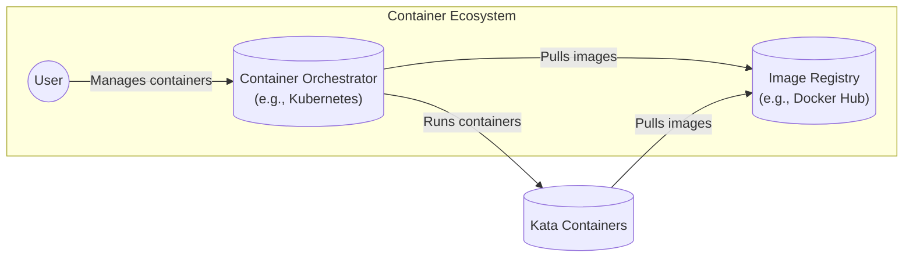
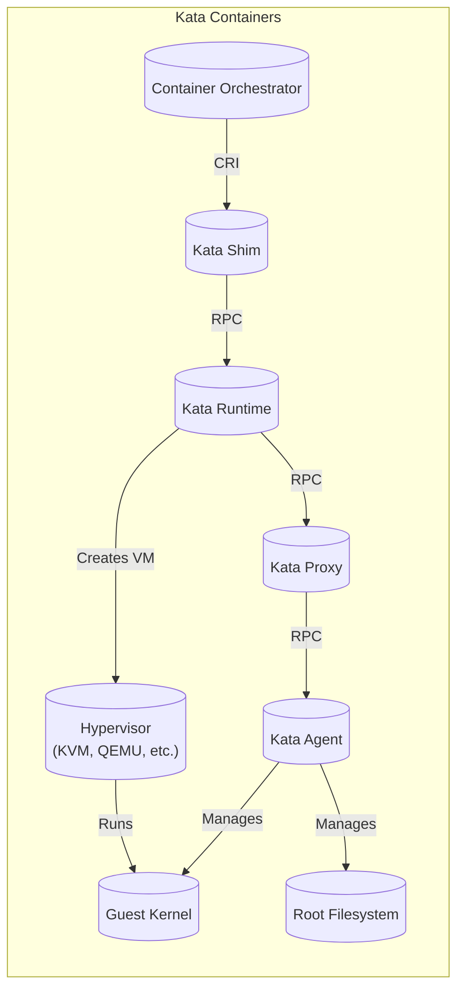
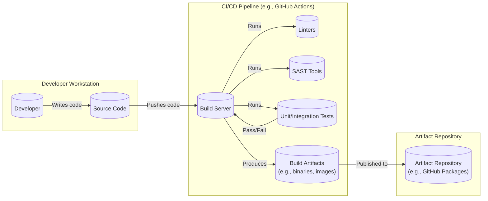

# Kata Containers Project Design Document

## BUSINESS POSTURE

Kata Containers is an open-source project that aims to combine the security advantages of virtual machines (VMs) with the speed and manageability of containers. It's designed to be a more secure container runtime, particularly for multi-tenant environments or where untrusted workloads are run. The project is likely positioned for organizations that prioritize security and isolation, possibly in regulated industries or those dealing with sensitive data.

Business Priorities:

*   Provide a highly secure container runtime.
*   Maintain compatibility with container management tools (e.g., Kubernetes, Docker).
*   Offer performance comparable to traditional containers.
*   Foster an active open-source community.
*   Attract adoption from organizations with stringent security requirements.

Business Goals:

*   Become a leading secure container runtime solution.
*   Integrate seamlessly into existing container ecosystems.
*   Achieve widespread adoption in security-conscious environments.
*   Continuously improve security and performance.

Most Important Business Risks:

*   Security vulnerabilities in the Kata Containers runtime could compromise the isolation of containers, leading to data breaches or system compromise.
*   Performance issues or compatibility problems could hinder adoption and limit the project's impact.
*   Failure to keep up with evolving container standards and technologies could make Kata Containers obsolete.
*   Lack of community engagement or contributor support could slow down development and innovation.
*   Competition from other secure container runtime solutions could limit market share.

## SECURITY POSTURE

Existing Security Controls:

*   security control: Hardware virtualization: Kata Containers leverages hardware virtualization (KVM, Xen, etc.) to provide strong isolation between containers. This is a fundamental security control. (Implemented in the runtime and agent components).
*   security control: Minimal guest kernel: Kata Containers uses a highly optimized, minimal guest kernel to reduce the attack surface. (Described in the architecture documentation and implemented in the OS image).
*   security control: Agent in guest VM: A lightweight agent runs inside the guest VM to manage the container lifecycle, further isolating the host from container processes. (Implemented in the agent component).
*   security control: OCI compatibility: Kata Containers is designed to be compatible with the Open Container Initiative (OCI) specifications, ensuring interoperability with container management tools. (Described in the documentation and tested through integration tests).
*   security control: Regular security audits and vulnerability scanning: The project likely undergoes regular security reviews and uses vulnerability scanning tools. (Implied by the project's focus on security).
*   security control: Community involvement: An active open-source community helps identify and address security issues. (Evidenced by the GitHub repository and community activity).

Accepted Risks:

*   accepted risk: Performance overhead: Due to the use of virtualization, there might be a slight performance overhead compared to traditional containers. This is a trade-off for enhanced security.
*   accepted risk: Resource consumption: Kata Containers may consume slightly more resources (CPU, memory) than traditional containers due to the VM overhead.
*   accepted risk: Complexity: The architecture of Kata Containers is more complex than traditional container runtimes, which could potentially introduce new attack vectors.

Recommended Security Controls:

*   security control: Implement seccomp profiles: Enforce system call filtering using seccomp to restrict the actions containers can perform.
*   security control: Integrate with SELinux or AppArmor: Use mandatory access control (MAC) systems like SELinux or AppArmor to further enhance isolation and security.
*   security control: Implement image signing and verification: Ensure that only trusted container images are run by verifying their digital signatures.
*   security control: Regular penetration testing: Conduct regular penetration tests by independent security experts to identify and address vulnerabilities.
*   security control: Security-focused code reviews: Emphasize security during code reviews, using checklists and tools to identify potential vulnerabilities.

Security Requirements:

*   Authentication:
    *   The system must authenticate communication between the Kata Containers runtime, agent, and container management tools (e.g., Kubernetes).
    *   Consider using mutual TLS (mTLS) for secure communication.
*   Authorization:
    *   The system must enforce authorization policies to control access to resources and operations within the Kata Containers environment.
    *   Integrate with existing authorization mechanisms in container orchestration platforms (e.g., Kubernetes RBAC).
*   Input Validation:
    *   All input from external sources (e.g., container images, configuration files, API requests) must be rigorously validated to prevent injection attacks and other vulnerabilities.
*   Cryptography:
    *   Use strong cryptographic algorithms and protocols for secure communication and data protection.
    *   Properly manage cryptographic keys and certificates.

## DESIGN

### C4 CONTEXT



C4 Context Element Descriptions:

*   Element:
    *   Name: User
    *   Type: Person
    *   Description: Represents a user interacting with the container ecosystem.
    *   Responsibilities: Manages containers, deploys applications, configures the container orchestrator.
    *   Security controls: Authentication and authorization mechanisms provided by the container orchestrator.

*   Element:
    *   Name: Container Orchestrator (e.g., Kubernetes)
    *   Type: Software System
    *   Description: A system that manages and orchestrates containers, such as Kubernetes.
    *   Responsibilities: Schedules containers, manages deployments, handles networking, provides APIs for container management.
    *   Security controls: RBAC, network policies, pod security policies, authentication and authorization mechanisms.

*   Element:
    *   Name: Image Registry (e.g., Docker Hub)
    *   Type: Software System
    *   Description: A repository for storing and distributing container images.
    *   Responsibilities: Stores container images, manages image tags, provides an API for pulling and pushing images.
    *   Security controls: Authentication, authorization, image scanning, potentially image signing.

*   Element:
    *   Name: Kata Containers
    *   Type: Software System
    *   Description: A secure container runtime that uses hardware virtualization to isolate containers.
    *   Responsibilities: Creates and manages secure containers, interacts with the container orchestrator, pulls container images.
    *   Security controls: Hardware virtualization, minimal guest kernel, agent in guest VM, OCI compatibility.

### C4 CONTAINER



C4 Container Element Descriptions:

*   Element:
    *   Name: Kata Runtime
    *   Type: Container
    *   Description: The main component of Kata Containers that manages the lifecycle of secure containers.
    *   Responsibilities: Creates and manages VMs, interacts with the hypervisor, handles container creation and deletion requests.
    *   Security controls: Runs in the host context, but interacts with other components using secure communication channels.

*   Element:
    *   Name: Kata Agent
    *   Type: Container
    *   Description: A lightweight agent that runs inside the guest VM.
    *   Responsibilities: Manages container processes within the VM, communicates with the Kata Runtime.
    *   Security controls: Runs inside the isolated VM, reducing the attack surface on the host.

*   Element:
    *   Name: Kata Shim
    *   Type: Container
    *   Description: An intermediary between the container orchestrator (e.g., Kubernetes) and the Kata Runtime.
    *   Responsibilities: Translates container management requests from the orchestrator into Kata Runtime commands.
    *   Security controls: Runs in the host context, but interacts with other components using secure communication channels.

*   Element:
    *   Name: Kata Proxy
    *   Type: Container
    *   Description: Facilitates communication between the Kata Runtime and the Kata Agent.
    *   Responsibilities: Relays messages between the runtime and the agent.
    *   Security controls: Runs in the host context, but interacts with other components using secure communication channels.

*   Element:
    *   Name: Guest Kernel
    *   Type: Container
    *   Description: A minimal, optimized kernel that runs inside the guest VM.
    *   Responsibilities: Provides the kernel for the containerized processes.
    *   Security controls: Highly optimized and minimal to reduce the attack surface.

*   Element:
    *   Name: Hypervisor (KVM, QEMU, etc.)
    *   Type: Container
    *   Description: The virtualization technology used to create and manage VMs.
    *   Responsibilities: Provides hardware virtualization capabilities.
    *   Security controls: Hardware-assisted virtualization provides strong isolation.

*   Element:
    *   Name: Root Filesystem
    *   Type: Container
    *   Description: The filesystem for the container, typically based on a container image.
    *   Responsibilities: Provides the file system environment for the container.
    *   Security controls: Image integrity checks, potentially read-only filesystem.

*   Element:
    *   Name: Container Orchestrator
    *   Type: External System
    *   Description: System that manages containers, e.g. Kubernetes.
    *   Responsibilities: Orchestrates containers.
    *   Security controls: RBAC, network policies, pod security policies, authentication and authorization mechanisms.

### DEPLOYMENT

Deployment Solutions:

1.  Kubernetes with Kata Containers as a runtime class.
2.  Docker with Kata Containers configured as a runtime.
3.  Standalone deployment using `kata-runtime` directly (less common, primarily for development/testing).

Chosen Solution: Kubernetes with Kata Containers as a runtime class.

```mermaid
graph LR
    subgraph "Kubernetes Cluster"
        subgraph "Node 1"
            Kubelet[("Kubelet")]
            Containerd[("Containerd")]
            KataRuntime[("Kata Runtime")]
            Hypervisor[("Hypervisor")]
            VM[("VM (Kata Container)")]
            Kubelet -- "CRI" --> Containerd
            Containerd -- "RuntimeClass" --> KataRuntime
            KataRuntime -- "Creates" --> VM
            VM -- "Runs" --> Pod[("Pod")]
        end
        subgraph "Node 2"
           Kubelet2[("Kubelet")]
           Containerd2[("Containerd")]
           ContainerRuntime[("Container Runtime\n(e.g., runc)")]
           Kubelet2 -- "CRI" --> Containerd2
           Containerd2 -- "Default Runtime" --> ContainerRuntime
           ContainerRuntime -- "Creates" --> Pod2[("Pod")]
        end

        APIserver[("API Server")]
        ControlPlane[("Control Plane\n(etcd, scheduler, etc.)")]

        APIserver -- "" --> Kubelet
        APIserver -- "" --> Kubelet2
        ControlPlane -- "" --> APIserver
    end
```

Deployment Element Descriptions:

*   Element:
    *   Name: Kubernetes Cluster
    *   Type: Deployment Environment
    *   Description: The environment where Kata Containers will be deployed.
    *   Responsibilities: Provides the infrastructure for running containerized workloads.
    *   Security controls: Network policies, RBAC, pod security policies, node-level security configurations.

*   Element:
    *   Name: Node 1, Node 2
    *   Type: Physical/Virtual Machine
    *   Description: A worker node in the Kubernetes cluster.
    *   Responsibilities: Runs containerized workloads.
    *   Security controls: Node-level security configurations, potentially hardware security features.

*   Element:
    *   Name: Kubelet
    *   Type: Software Component
    *   Description: The Kubernetes agent that runs on each node.
    *   Responsibilities: Manages pods and containers on the node, communicates with the API server.
    *   Security controls: Authenticates with the API server, enforces pod security policies.

*   Element:
    *   Name: Containerd
    *   Type: Software Component
    *   Description: A container runtime that manages the complete container lifecycle.
    *   Responsibilities: Pulls images, creates containers, manages container execution.
    *   Security controls: Integrates with container runtimes like Kata Containers and runc.

*   Element:
    *   Name: Kata Runtime
    *   Type: Software Component
    *   Description: The Kata Containers runtime.
    *   Responsibilities: Creates and manages secure containers using VMs.
    *   Security controls: Hardware virtualization, minimal guest kernel, agent in guest VM.

*   Element:
    *   Name: Hypervisor
    *   Type: Software Component
    *   Description: The virtualization technology (e.g., KVM, QEMU).
    *   Responsibilities: Provides hardware virtualization capabilities.
    *   Security controls: Hardware-assisted virtualization.

*   Element:
    *   Name: VM (Kata Container)
    *   Type: Virtual Machine
    *   Description: The virtual machine that isolates the container.
    *   Responsibilities: Provides a secure, isolated environment for the container.
    *   Security controls: Hardware virtualization, minimal guest kernel.

*   Element:
    *   Name: Pod
    *   Type: Kubernetes Pod
    *   Description: A Kubernetes pod running inside a Kata Container.
    *   Responsibilities: Runs the containerized application.
    *   Security controls: Inherits security controls from the Kata Container and Kubernetes.

*   Element:
    *   Name: Container Runtime (e.g., runc)
    *   Type: Software Component
    *   Description: A traditional container runtime, such as runc.
    *   Responsibilities: Creates and manages containers using namespaces and cgroups.
    *   Security controls: Relies on kernel-level isolation mechanisms.

*   Element:
    *   Name: API Server
    *   Type: Software Component
    *   Description: The Kubernetes API server.
    *   Responsibilities: Provides the API for managing the cluster.
    *   Security controls: Authentication, authorization, TLS encryption.

*   Element:
    *   Name: Control Plane (etcd, scheduler, etc.)
    *   Type: Software Components
    *   Description: The Kubernetes control plane components.
    *   Responsibilities: Manages the cluster state, schedules pods, etc.
    *   Security controls: Authentication, authorization, etcd encryption.

### BUILD



Build Process Description:

1.  Developers write code and push it to a Git repository (e.g., GitHub).
2.  A CI/CD pipeline (e.g., GitHub Actions) is triggered by the code push.
3.  The build server checks out the code.
4.  Linters (e.g., shellcheck, gofmt) are run to check code style and identify potential issues.
5.  Static Application Security Testing (SAST) tools (e.g., gosec) are run to scan the code for security vulnerabilities.
6.  Unit and integration tests are executed to verify the functionality of the code.
7.  If all checks and tests pass, build artifacts (e.g., binaries, container images) are created.
8.  The build artifacts are published to an artifact repository (e.g., GitHub Packages, a container registry).

Security Controls in Build Process:

*   security control: Code review: All code changes should be reviewed by at least one other developer before being merged.
*   security control: Linting: Linters are used to enforce coding standards and identify potential errors.
*   security control: SAST: Static analysis tools are used to scan for security vulnerabilities.
*   security control: Automated testing: Unit and integration tests are run automatically to ensure code quality and prevent regressions.
*   security control: Dependency management: Dependencies are carefully managed and scanned for known vulnerabilities.
*   security control: Artifact signing: Build artifacts can be digitally signed to ensure their integrity and authenticity.
*   security control: Supply chain security: Measures are taken to secure the software supply chain, such as using trusted base images and verifying the integrity of dependencies.

## RISK ASSESSMENT

Critical Business Processes to Protect:

*   Containerized application deployment and execution.
*   Management of containerized workloads.
*   Isolation of containers from each other and the host system.
*   Secure communication between container management components.

Data to Protect and Sensitivity:

*   Container images: Sensitivity depends on the contents of the image (e.g., application code, configuration data, secrets). Could range from public to highly confidential.
*   Configuration data: Sensitivity depends on the specific configuration (e.g., API keys, database credentials). Could range from low to highly confidential.
*   Application data: Sensitivity depends on the application (e.g., customer data, financial records, personal information). Could range from low to highly confidential.
*   Logs: Sensitivity depends on the content of the logs (e.g., user activity, system events). Could contain sensitive information.

## QUESTIONS & ASSUMPTIONS

Questions:

*   What specific compliance requirements (e.g., PCI DSS, HIPAA) must Kata Containers meet?
*   What is the expected threat model for the environments where Kata Containers will be deployed?
*   What are the performance requirements for Kata Containers?
*   What are the existing security tools and processes in place within the organization?
*   What level of support and maintenance is expected for Kata Containers?
*   What is the process for reporting and handling security vulnerabilities in Kata Containers?

Assumptions:

*   BUSINESS POSTURE: The organization deploying Kata Containers prioritizes security over performance.
*   BUSINESS POSTURE: The organization has a mature container management infrastructure (e.g., Kubernetes).
*   SECURITY POSTURE: The organization has a security team responsible for managing and monitoring the security of the container environment.
*   SECURITY POSTURE: The organization has a process for vulnerability management and incident response.
*   DESIGN: Kata Containers will be deployed in a Kubernetes environment.
*   DESIGN: The organization will use a secure container registry.
*   DESIGN: The organization will implement appropriate network security controls to isolate the container environment.