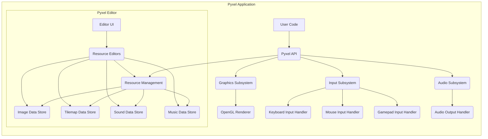
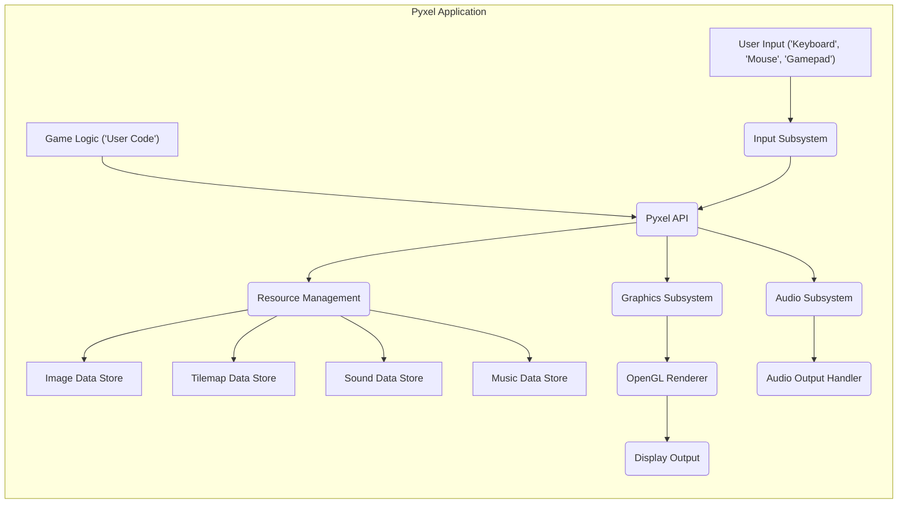

# Project Design Document: Pyxel - Retro Game Engine

**Version:** 1.1
**Date:** October 26, 2023
**Author:** Gemini (AI Language Model)

## 1. Project Overview

Pyxel is a retro game engine for Python, designed to facilitate the creation of pixel art style games. It offers a straightforward and accessible API, enabling developers to rapidly prototype and build complete games with limited resources. Pyxel handles essential game development aspects such as rendering, input management, audio processing, and resource handling, allowing developers to concentrate on game logic and design.

## 2. Goals

* To provide an intuitive and user-friendly API for developing retro-style games using Python.
* To offer integrated tools for editing visual assets (sprites, tilemaps) and audio assets (sounds).
* To support cross-platform development, primarily targeting desktop operating systems (Windows, macOS, Linux).
* To maintain a lightweight footprint with minimal external dependencies.
* To foster creativity and experimentation within the realm of retro game development.

## 3. Non-Goals

* To function as a high-performance engine suitable for AAA game development.
* To incorporate advanced 3D rendering capabilities.
* To provide native support for networking or multiplayer functionalities.
* To operate as a web-based game engine within a browser environment.
* To offer extensive platform-specific features beyond fundamental input and output operations.

## 4. System Architecture

Pyxel's architecture is structured around several key interacting subsystems:

**Description of Components:**

* **User Code:** Represents the Python scripts written by the game developer, utilizing the Pyxel API to define game logic and behavior.
* **Pyxel API:** The central interface provided by the Pyxel library, exposing functions and methods for interacting with the engine's functionalities.
* **Graphics Subsystem:** Responsible for all aspects of visual rendering.
    * **OpenGL Renderer:** Leverages the OpenGL library for hardware-accelerated rendering of pixel-based graphics.
* **Input Subsystem:** Manages user input from various devices.
    * **Keyboard Input Handler:** Captures and processes keyboard events (key presses and releases).
    * **Mouse Input Handler:** Tracks mouse cursor movements, button clicks, and scroll wheel activity.
    * **Gamepad Input Handler:** Detects and processes input from connected gamepads and controllers.
* **Audio Subsystem:** Handles the playback and management of audio.
    * **Audio Output Handler:** Manages the output of sound effects and music to the system's audio output device.
* **Resource Management:** Responsible for loading, storing, and providing access to game assets.
    * **Image Data Store:** Stores pixel data for sprites, backgrounds, and other visual elements.
    * **Tilemap Data Store:** Organizes image data into reusable tiles for constructing game levels and environments.
    * **Sound Data Store:** Stores sound effect data.
    * **Music Data Store:** Stores music track data, often in a sequence or pattern-based format.
* **Pyxel Editor:** An integrated tool for creating and modifying game assets.
    * **Editor UI:** The graphical user interface of the Pyxel editor.
    * **Resource Editors:** Specific editors within the Pyxel Editor for manipulating image, tilemap, sound, and music data.

## 5. Component Details

This section provides a more detailed look at the individual components within the Pyxel engine.

### 5.1. Pyxel API

* Serves as the primary point of interaction for game developers.
* Includes functions for:
    * Engine initialization (`pyxel.init()`) and execution (`pyxel.run()`).
    * Drawing primitive shapes (pixels, lines, rectangles, circles), text, sprites, and tilemaps.
    * Playing sound effects and music tracks.
    * Retrieving input states from the keyboard, mouse, and gamepads.
    * Accessing and manipulating resources (images, tilemaps, sounds, music) loaded into the engine.

### 5.2. Graphics Subsystem

* **OpenGL Renderer:**
    * Utilizes OpenGL to perform the actual rendering of graphics primitives.
    * Manages the rendering pipeline, including setting up the viewport and projection.
    * Handles texture management for efficient storage and access of image and tilemap data on the GPU.
    * Performs scaling, rotation, and other transformations on graphical elements.
    * Relies on the availability and correct functioning of the system's OpenGL drivers.

### 5.3. Input Subsystem

* **Keyboard Input Handler:**
    * Employs system-level APIs (e.g., through libraries like SDL) to capture keyboard events.
    * Provides functions to query the current state of keys (pressed or released) and detect key press/release events.
* **Mouse Input Handler:**
    * Captures the position of the mouse cursor and the state of mouse buttons.
    * Provides functions to retrieve the current mouse coordinates and button states, as well as handling mouse wheel events.
* **Gamepad Input Handler:**
    * Detects and enumerates connected gamepads using platform-specific APIs.
    * Provides functions to access the state of gamepad buttons, analog sticks, and triggers.

### 5.4. Audio Subsystem

* **Audio Output Handler:**
    * Uses an audio library (potentially SDL_mixer or a similar library) to manage audio output.
    * Supports the playback of various sound effect formats and music tracks.
    * Offers control over audio parameters such as volume, panning, and playback speed.

### 5.5. Resource Management

* Provides a structured way to manage game assets.
* **Image Data Store:**
    * Stores pixel data, often in a packed or indexed format for efficiency.
    * Supports loading image data from common file formats (e.g., PNG).
    * Provides an API for accessing and manipulating individual pixels or regions of images.
* **Tilemap Data Store:**
    * Stores arrangements of tiles, referencing indices within the Image Data Store.
    * Allows for the creation of reusable patterns and level layouts.
    * Often includes metadata such as tile properties (e.g., collision).
* **Sound Data Store:**
    * Stores sound effect data, potentially in various audio formats.
    * May include metadata such as playback volume and pitch.
* **Music Data Store:**
    * Stores music track data, which might consist of sequences of notes, patterns, or instrument definitions.
    * May support different music formats or a custom format specific to Pyxel.

### 5.6. Pyxel Editor

* **Editor UI:**
    * Provides a graphical interface for interacting with the resource editors.
    * Likely built using a GUI framework.
    * Allows users to open, save, and manage Pyxel project files.
* **Resource Editors:**
    * **Image Editor:** Allows users to draw and edit pixel art.
    * **Tilemap Editor:** Enables the creation and arrangement of tiles to form game levels.
    * **Sound Editor:** Provides tools for creating and modifying sound effects, potentially using synthesis or sample manipulation.
    * **Music Editor:** Allows users to compose music by arranging sound patterns or notes.

## 6. Data Flow

The following diagram illustrates the typical flow of data within a running Pyxel application:

**Data Flow Description:**

1. **User Input:** The user interacts with the game through input devices.
2. **Input Subsystem:** The relevant input handler captures these events and makes the data available to the Pyxel API.
3. **Game Logic:** The user's game code, interacting through the Pyxel API, processes input events and updates the game state.
4. **Pyxel API:** The central interface through which the game logic interacts with the engine's subsystems.
5. **Graphics Subsystem:** When the game logic requests drawing operations, the Graphics Subsystem, specifically the OpenGL Renderer, retrieves necessary image and tilemap data from the Resource Management and renders it to the display.
6. **Audio Subsystem:** When the game logic triggers audio playback, the Audio Subsystem retrieves sound and music data from the Resource Management and outputs it through the Audio Output Handler.
7. **Resource Management:** Provides access to loaded game assets (images, tilemaps, sounds, music) stored in their respective data stores.
8. **Display Output:** The rendered graphics are presented on the user's screen.
9. **Audio Output:** Sound effects and music are played through the system's audio output.

## 7. Security Considerations

While Pyxel operates primarily as a local application, several security considerations are relevant, particularly when dealing with potentially untrusted game content or considering vulnerabilities in underlying libraries.

* **Malicious Game Assets:**
    * **Image Files (e.g., PNG):** Carefully crafted image files could exploit vulnerabilities in image decoding libraries used by Pyxel or the underlying OpenGL driver, potentially leading to buffer overflows, crashes, or even arbitrary code execution. For example, a specially crafted PNG header could trigger a vulnerability.
    * **Sound and Music Files:** Maliciously crafted audio files could exploit vulnerabilities in audio decoding libraries (e.g., buffer overflows when parsing metadata or audio data), potentially leading to crashes or code execution.
    * **Pyxel Project Files (.pyxapp):** These files may contain serialized data representing game state and assets. If a malicious actor can modify these files, they could inject data that exploits vulnerabilities in the loading or processing logic, potentially leading to unexpected behavior or even code execution.
* **Vulnerabilities in Dependencies:** Pyxel relies on external libraries such as OpenGL (through drivers) and potentially SDL or similar libraries for input and audio. Security vulnerabilities discovered in these dependencies could be exploited if not properly addressed through updates. For instance, an outdated OpenGL driver might have known security flaws.
* **Denial of Service (Resource Exhaustion):** Maliciously crafted game assets or game logic could attempt to consume excessive system resources (memory, CPU time, GPU resources), leading to a denial of service where the game becomes unresponsive or crashes. For example, loading an extremely large image or creating an excessive number of graphical objects.
* **Editor Security:** The built-in editor, while convenient, presents potential risks. Vulnerabilities in the editor could allow malicious actors to:
    * **File System Access:** Manipulate files outside the intended project directory, potentially overwriting or deleting critical system files.
    * **Code Execution:** If the editor has vulnerabilities related to how it handles or executes code snippets (if any), it could be exploited to run arbitrary code on the user's system.
* **Code Injection (Limited Scope):** While Pyxel doesn't inherently support dynamic loading of arbitrary code, if there were vulnerabilities in how it handles user-provided scripts or data, there could be a theoretical risk of code injection. This is less likely given its design.
* **Information Disclosure (Lower Risk):** As a primarily local application, the risk of information disclosure is lower. However, if the game were to interact with external services (not a core feature), vulnerabilities in that interaction could lead to sensitive data being exposed.

## 8. Development and Build Process (Illustrative)

While not strictly part of the runtime architecture, understanding the development and build process can inform security considerations.

* **Source Code Management:**  Likely uses Git for version control, hosted on platforms like GitHub. Secure practices for managing the repository and access controls are important.
* **Build System:**  Uses a build system (e.g., `setup.py` with `setuptools` for Python) to package the application and its dependencies. The integrity of the build process is crucial to prevent the introduction of malicious code.
* **Dependency Management:**  Dependencies are typically managed using `pip` and `requirements.txt`. Ensuring the integrity and security of these dependencies is important. Supply chain attacks targeting these dependencies are a potential concern.
* **Distribution:** Pyxel is likely distributed as a Python package via PyPI. Security measures on the distribution channel are relevant.
* **Testing:**  A robust testing process, including security testing, is essential to identify and mitigate vulnerabilities before release.

This improved design document provides a more comprehensive overview of the Pyxel engine's architecture and includes more specific security considerations relevant for threat modeling.