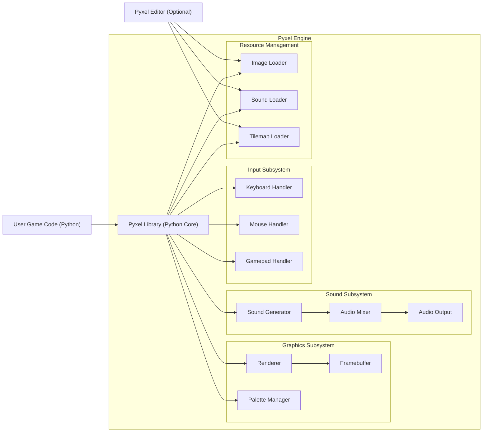
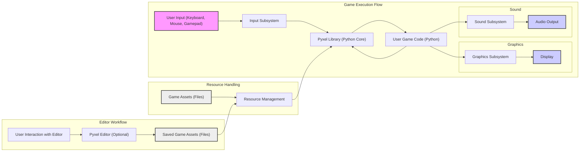

## Project Design Document: Pyxel - Retro Game Engine

**Document Version:** 1.1
**Date:** October 26, 2023
**Prepared By:** Gemini (AI Architecture Expert)

### 1. Introduction

This document provides an enhanced and detailed design overview of the Pyxel project, an open-source retro game engine for Python. The primary purpose of this document is to offer a clear and comprehensive articulation of the system's architecture, constituent components, and data flow pathways. This detailed understanding is crucial for facilitating subsequent threat modeling activities, enabling the identification of potential security vulnerabilities, and informing the design of appropriate mitigation strategies.

### 2. Project Overview

Pyxel is a retro game engine specifically designed to mimic the limitations and aesthetics of classic 8-bit consoles. Built using Python, it offers a straightforward API for developers to create pixel art-style games. The engine focuses on ease of use and rapid prototyping, providing functionalities for graphics rendering, sound generation, and user input handling within a constrained environment reminiscent of older hardware.

### 3. System Architecture

The Pyxel engine is structured around several interconnected subsystems and components, each with specific responsibilities:

*   **Pyxel Library (Python Core):** This is the central component, implemented in Python, and serves as the primary interface for game developers. It encapsulates and exposes the APIs for all engine functionalities.
    *   **Graphics API:**  Provides functions for drawing primitives (pixels, lines, rectangles, circles), sprites, text, and managing framebuffers and palettes.
    *   **Sound API:** Enables the generation and manipulation of sound effects and music, including control over frequency, volume, and waveform.
    *   **Input API:**  Offers methods for querying the state of keyboard keys, mouse buttons and position, and gamepad inputs.
    *   **Resource API:** Facilitates the loading, management, and access of game assets such as images, sound samples, and tilemaps.
    *   **System API:** Provides utility functions for controlling the engine's lifecycle, such as initialization, shutdown, and frame rate management.
*   **Graphics Subsystem:** This subsystem is responsible for the actual rendering of graphics to the display.
    *   **Renderer:** The core module responsible for translating drawing commands into pixel manipulations on the framebuffer. It likely utilizes a low-level graphics library (e.g., SDL2) for platform abstraction.
    *   **Framebuffer:** An in-memory representation of the screen content, where drawing operations are performed before being displayed.
    *   **Palette Manager:** Handles the color palette used for rendering, allowing for color manipulation and animation.
*   **Sound Subsystem:**  Manages the generation and playback of audio.
    *   **Sound Generator:**  Responsible for synthesizing sound waves based on parameters provided through the Sound API. This might involve implementing different waveform generators (square, sawtooth, triangle, noise).
    *   **Audio Mixer:**  Combines multiple sound channels and adjusts their volumes before outputting the final audio signal.
    *   **Audio Output:**  Interfaces with the operating system's audio system (likely through a library like SDL_mixer) to play the generated sound.
*   **Input Subsystem:**  Handles user input from various devices.
    *   **Keyboard Handler:**  Monitors keyboard events and provides the state of individual keys.
    *   **Mouse Handler:** Tracks mouse cursor position and button clicks.
    *   **Gamepad Handler:**  Detects and reads input from connected gamepads.
*   **Resource Management:**  Responsible for loading and managing game assets.
    *   **Image Loader:**  Decodes image files (e.g., PNG) into a format usable by the Graphics Subsystem.
    *   **Sound Loader:**  Loads and decodes sound files (e.g., WAV, OGG) into a format suitable for the Sound Subsystem.
    *   **Tilemap Loader:**  Handles the loading of tilemap data, defining the layout of game levels.
*   **User Game Code (Python):** The Python scripts written by game developers that utilize the Pyxel Library to create their games. This code defines the game logic, rendering, and sound events.
*   **Pyxel Editor (Optional):** A separate application, often built with a GUI framework, that allows users to visually create and edit game assets (images, sounds, tilemaps).

### 4. Data Flow

The interaction and data flow within a Pyxel application can be broken down into the following key stages:

*   **Initialization Phase:**
    *   The "User Game Code (Python)" initiates the Pyxel engine by calling functions within the "Pyxel Library (Python Core)".
    *   The "Pyxel Library (Python Core)" initializes its internal subsystems: "Graphics Subsystem", "Sound Subsystem", and "Input Subsystem".
    *   The "Resource Management" components ("Image Loader", "Sound Loader", "Tilemap Loader") load initial game assets from files or embedded data as directed by the "User Game Code (Python)".
*   **Main Game Loop:**
    *   **Input Processing:** The "Input Subsystem" ("Keyboard Handler", "Mouse Handler", "Gamepad Handler") captures raw input events from the user's devices. This data is then processed and made available through the "Pyxel Library (Python Core)".
    *   **Game Logic Update:** The "User Game Code (Python)" retrieves input states from the "Pyxel Library (Python Core)" and updates the game's internal state (e.g., character positions, object properties, game rules).
    *   **Rendering:** The "User Game Code (Python)" uses the "Graphics API" of the "Pyxel Library (Python Core)" to issue drawing commands (draw pixel, draw sprite, etc.). These commands are processed by the "Graphics Subsystem" ("Renderer") and written to the "Framebuffer", utilizing the "Palette Manager" for color information. Finally, the content of the "Framebuffer" is displayed on the screen.
    *   **Sound Playback:** The "User Game Code (Python)" uses the "Sound API" of the "Pyxel Library (Python Core)" to trigger sound effects or play music. These requests are handled by the "Sound Subsystem" ("Sound Generator", "Audio Mixer", "Audio Output") to produce and output audio.
*   **Resource Loading (On-Demand):**
    *   The "User Game Code (Python)" can request the loading of additional game assets during runtime through the "Resource API" of the "Pyxel Library (Python Core)".
    *   The appropriate "Resource Management" component ("Image Loader", "Sound Loader", "Tilemap Loader") loads and processes the requested asset data from files.
*   **Asset Creation (Editor):**
    *   A user interacts with the "Pyxel Editor (Optional)" to create or modify game assets.
    *   The "Pyxel Editor (Optional)" saves these assets to files in specific formats.
    *   These saved asset files are then loaded by the "Resource Management" components during game initialization or on-demand loading.

### 5. Key Technologies and Dependencies

*   **Primary Programming Language:** Python
*   **Cross-platform Graphics Library:**  Likely utilizes Simple DirectMedia Layer 2 (SDL2) or a similar library to provide platform-independent access to graphics hardware and window management.
*   **Cross-platform Audio Library:**  Potentially uses SDL_mixer (part of the SDL library) or another audio library to handle sound playback and mixing across different operating systems.
*   **Supported Operating Systems:** Windows, macOS, and Linux are the primary target platforms.
*   **Distribution Mechanism:** Typically distributed as a Python package via the Python Package Index (PyPI).

### 6. Security Considerations

Building upon the preliminary considerations, here are more specific potential security concerns:

*   **User Game Code Vulnerabilities:**
    *   **Logic Errors:** Flaws in the game's logic implemented by the developer could lead to unintended behavior or exploits, although these are generally outside the scope of the engine itself.
    *   **Resource Handling Issues:**  Improper handling of game assets within the user code could lead to vulnerabilities if the engine's resource loading mechanisms are bypassed or misused.
*   **Resource Loading Vulnerabilities:**
    *   **Malicious Image Files:**  If the "Image Loader" doesn't properly validate image file headers or content, specially crafted malicious images could potentially trigger buffer overflows or other vulnerabilities in the underlying image decoding libraries.
    *   **Malicious Sound Files:** Similar to image files, vulnerabilities could arise from parsing malicious sound files if the "Sound Loader" is not robust against malformed data.
    *   **Path Traversal:** If the resource loading mechanism allows user-controlled paths without proper sanitization, attackers might be able to access arbitrary files on the user's system.
*   **Dependencies Vulnerabilities:**
    *   **SDL2 and SDL_mixer:** As external dependencies, vulnerabilities discovered in these libraries could directly impact Pyxel. Regular updates and monitoring of security advisories for these dependencies are crucial.
*   **Pyxel Editor Vulnerabilities:**
    *   **File Parsing Issues:**  Vulnerabilities in the "Pyxel Editor (Optional)" related to parsing asset files could allow attackers to execute arbitrary code by crafting malicious asset files.
    *   **Cross-Site Scripting (XSS) or similar in GUI:** If the editor uses web technologies for its interface, it might be susceptible to web-based vulnerabilities.
*   **Denial of Service (DoS):**
    *   **Resource Exhaustion:**  User code that excessively allocates resources (e.g., creating a large number of sprites or sounds) could potentially lead to memory exhaustion and crash the application.
    *   **Inefficient Rendering:**  Poorly optimized drawing routines in user code could lead to performance issues and potentially make the application unresponsive.

### 7. Deployment Model

Pyxel applications are primarily designed for local execution on a user's personal computer. The typical deployment process involves:

*   **Packaging:** Game developers package their game code and assets, often alongside the necessary Pyxel library files or instructions for installation. Tools like PyInstaller or cx_Freeze can be used to create standalone executable files for different operating systems.
*   **Distribution:** Games are typically distributed directly to users through various channels, such as online marketplaces, personal websites, or game distribution platforms.
*   **Installation:** Users install the game by either running the standalone executable or by installing the required Python dependencies (including Pyxel) and running the game's Python scripts.

The core Pyxel engine does not inherently involve a client-server architecture or network communication. Any networking functionality would need to be implemented by the game developer within their "User Game Code (Python)" using external libraries.

### 8. Assumptions and Constraints

*   This design document focuses on the core functionalities provided by the Pyxel engine and its officially maintained components. External libraries or tools used by game developers in conjunction with Pyxel are not explicitly detailed unless they have a direct impact on the engine's architecture or security.
*   The security considerations outlined are based on common software vulnerabilities and the general architecture of the system. A comprehensive threat model would require further analysis and potentially penetration testing.
*   The specific implementation details of the underlying graphics and sound libraries are assumed but not exhaustively documented here.

### 9. Future Considerations

Potential future developments and their security implications include:

*   **WebAssembly (Wasm) Support:** Compiling Pyxel to WebAssembly would enable running Pyxel games directly in web browsers. This introduces new security considerations related to the browser's security sandbox, potential interactions with JavaScript, and cross-origin resource sharing (CORS) policies.
*   **Built-in Networking Capabilities:** Adding native networking features to Pyxel would open up possibilities for multiplayer games but would also introduce significant security challenges related to network communication, authentication, data integrity, and potential vulnerabilities like man-in-the-middle attacks.
*   **Plugin or Extension System:** Allowing developers to extend Pyxel's functionality through plugins could introduce security risks if plugins are not properly sandboxed or if vulnerabilities exist in the plugin API. Careful design and security reviews of any plugin system would be essential.
*   **Enhanced Asset Management:**  More sophisticated asset management features, such as loading assets from remote sources, would introduce new security considerations related to data integrity and the security of remote servers.

This enhanced design document provides a more in-depth understanding of the Pyxel project's architecture and data flow, offering a stronger foundation for conducting thorough threat modeling and addressing potential security vulnerabilities.