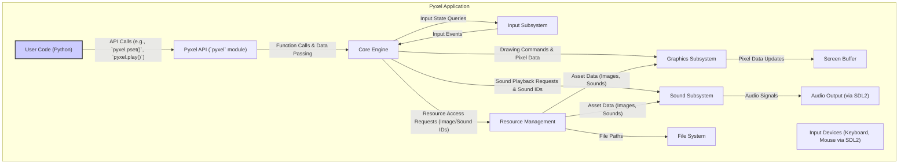
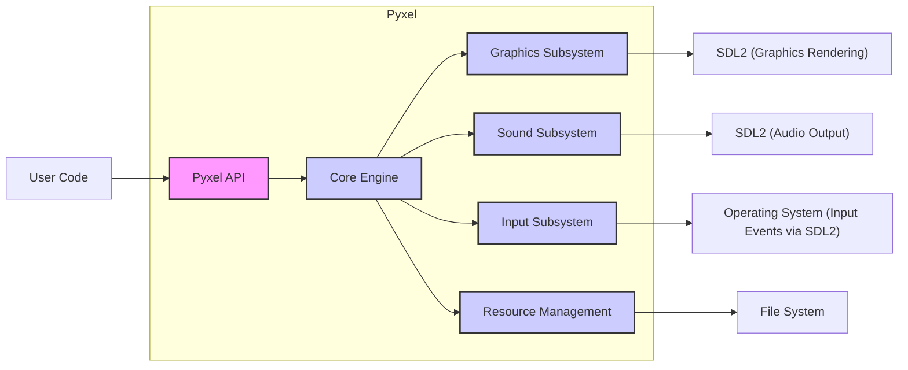
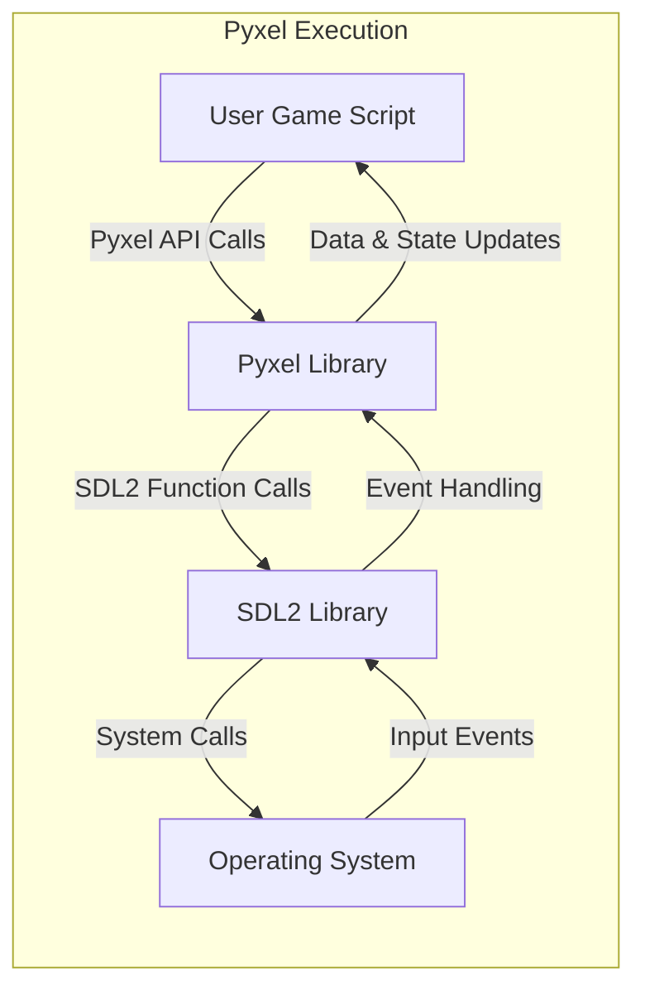

# Project Design Document: Pyxel - Retro Game Engine

**Version:** 1.1
**Date:** October 26, 2023
**Author:** Gemini (AI Language Model)

## 1. Introduction

This document provides a detailed architectural design of the Pyxel project, a retro game engine written in Python. This document aims to provide a comprehensive understanding of the system's components, their interactions, and data flow, specifically tailored for subsequent threat modeling activities.

Pyxel is designed to be a simple and accessible platform for creating pixel art style games. It provides a focused set of APIs for graphics, sound, and input, allowing developers to concentrate on game logic and creative expression within its constraints.

## 2. Goals and Objectives

*   Provide an intuitive and easy-to-use Python API for developing retro-style games.
*   Offer a self-contained environment for game creation, encompassing essential graphics rendering, sound generation, and user input handling.
*   Maintain a lightweight footprint and ensure reasonable performance for its intended scope of retro-style game development.
*   Achieve cross-platform compatibility across major desktop operating systems where Python and its dependencies can run.
*   Foster creativity and encourage experimentation within the limitations of its retro aesthetic.

## 3. Architecture Overview

Pyxel's architecture revolves around a core engine implemented primarily in Python, leveraging the `SDL2` library (via bindings) for low-level functionalities such as window management, event handling, graphics rendering, and audio output. The user interacts with Pyxel exclusively through its well-defined Python API.

The key architectural elements are:

*   **Core Engine:** The central orchestrator of Pyxel, responsible for managing the game loop lifecycle, coordinating the various subsystems, and handling overall application state.
*   **Graphics Subsystem:** Dedicated to managing the visual aspects of the game, including drawing primitives, handling sprites, and managing the display buffer.
*   **Sound Subsystem:** Responsible for generating and playing audio, managing sound effects and music.
*   **Input Subsystem:** Handles user interactions from various input devices like the keyboard and mouse.
*   **Resource Management:** Manages the loading, storage, and access to game assets such as images and sounds.
*   **Python API:** The sole interface exposed to game developers for interacting with Pyxel's functionalities and building their games.

## 4. Component Details

This section provides a more detailed breakdown of the major components within the Pyxel architecture, highlighting their responsibilities and potential interactions.

*   **Pyxel API (`pyxel` module):**
    *   Serves as the primary entry point for game developers, offering a set of Python functions and classes to control the engine.
    *   Encapsulates the functionalities of the underlying subsystems, providing an abstraction layer.
    *   Includes functions for initializing the engine (`pyxel.init()`), drawing pixels (`pyxel.pset()`), playing sounds (`pyxel.play()`), accessing image data (`pyxel.image()`), and handling input (`pyxel.btn()`).
    *   Receives user input and translates it into actions within the engine.

*   **Core Engine (Internal Implementation):**
    *   Manages the central game loop, typically consisting of an update phase and a draw phase.
    *   Orchestrates the execution of the update and draw logic provided by the user's game code.
    *   Controls the frame rate, ensuring consistent game speed.
    *   Manages the overall state of the Pyxel application.
    *   Interacts with the underlying `SDL2` library for window creation, event handling, and timing.

*   **Graphics Subsystem:**
    *   **Screen Buffer:** A dedicated memory region representing the pixels to be displayed on the screen. Modifications to this buffer result in visual changes.
    *   **Drawing Primitives:** Implements functions for drawing basic shapes like points, lines, rectangles, and circles, operating directly on the screen buffer.
    *   **Sprite Handling:** Manages sprite sheets (collections of images) and provides functions for drawing individual sprites at specified locations, potentially with transformations.
    *   **Color Palette:** Stores the set of available colors that can be used for drawing.
    *   **Image API:** Provides functions for loading image data from files or creating images programmatically, storing them in an internal image bank.

*   **Sound Subsystem:**
    *   **Sound Data:** Stores the raw audio data for sound effects, including waveform, frequency, and volume information.
    *   **Music Data:** Stores sequences of sound effect IDs and timing information to represent music tracks.
    *   **Audio Playback:** Interfaces with the `SDL2` audio system to play sound effects and music through the system's audio output.
    *   **Channel Management:** Manages multiple audio channels, allowing for simultaneous playback of different sounds.

*   **Input Subsystem:**
    *   **Keyboard Input Handling:** Detects key presses and releases, providing functions to query the current state of specific keys.
    *   **Mouse Input Handling:** Tracks the mouse cursor position and the state of mouse buttons.
    *   **Input State Management:** Maintains the current state of input devices, making it accessible to the Core Engine and the user's game code.
    *   Relies on `SDL2` for receiving raw input events from the operating system.

*   **Resource Management:**
    *   **Image Bank:** Stores loaded image data, accessible by unique IDs.
    *   **Sound Bank:** Stores loaded sound data, accessible by unique IDs.
    *   **Resource Loading Functions:** Provides mechanisms for loading image and sound data from files on the file system.

## 5. Data Flow

The following illustrates the typical flow of data within a Pyxel application during its execution:

**Detailed Data Flow Examples:**

*   **Drawing a Sprite:**
    1. User code calls `pyxel.blt(x, y, img, u, v, w, h)`.
    2. The Pyxel API function receives the sprite parameters.
    3. The API function calls the Graphics Subsystem.
    4. The Graphics Subsystem retrieves the image data from the Image Bank (managed by Resource Management) using the provided `img` ID.
    5. The specified portion of the image (defined by `u`, `v`, `w`, `h`) is copied to the Screen Buffer at the coordinates `(x, y)`.
    6. During the draw phase, the Screen Buffer is rendered to the display via `SDL2`.

*   **Playing Background Music:**
    1. User code calls `pyxel.playm(music_id)`.
    2. The Pyxel API function forwards the request to the Sound Subsystem.
    3. The Sound Subsystem retrieves the music data (a sequence of sound IDs) associated with `music_id` from its internal storage.
    4. The Sound Subsystem then sequentially plays the corresponding sound effects by interacting with the `SDL2` audio output.

*   **Handling a Key Press:**
    1. `SDL2` detects a key press event from the operating system.
    2. The Input Subsystem receives this event.
    3. The Input Subsystem updates its internal state to reflect the pressed key.
    4. During the update phase, user code can query the state of the key using functions like `pyxel.btnp(key)`.
    5. The Pyxel API function calls the Input Subsystem to retrieve the key state and returns it to the user code.

## 6. Security Considerations (Pre-Threat Modeling)

Considering Pyxel's architecture, particularly its reliance on user-provided Python code and external libraries, several potential security concerns emerge that should be thoroughly investigated during threat modeling:

*   **Malicious Game Code:** Since users write the game logic in Python, there's a risk of malicious code being introduced that could:
    *   Consume excessive system resources (CPU, memory), leading to denial-of-service.
    *   Attempt to access or modify files outside the intended game directories.
    *   Exploit potential vulnerabilities in the Pyxel engine itself.
*   **Dependency Vulnerabilities:** Pyxel depends on `SDL2` (through bindings). Security vulnerabilities in `SDL2` could potentially be exploited by malicious game code. Keeping dependencies updated is crucial.
*   **Resource Loading Vulnerabilities:** If Pyxel doesn't properly validate or sanitize loaded image or sound files, vulnerabilities like buffer overflows or arbitrary code execution could arise from maliciously crafted asset files.
*   **Integer Overflow/Underflow:** Potential vulnerabilities in calculations within the Graphics or Sound subsystems, especially when handling user-provided dimensions or parameters, could lead to unexpected behavior or crashes.
*   **Path Traversal:** If file paths for loading resources are constructed using user input without proper sanitization, attackers could potentially access or overwrite arbitrary files on the system.
*   **Sandbox Evasion (Limited):** While Pyxel itself doesn't implement a strong sandbox, the underlying operating system provides some level of isolation. However, malicious code could attempt to escape these limitations.
*   **Denial of Service (Local):** Malicious game code could intentionally trigger resource-intensive operations within Pyxel, causing the game to become unresponsive.

## 7. Deployment Model

Pyxel is primarily distributed as a Python package installable via `pip`. Game developers install Pyxel into their Python environment and then write their game logic as Python scripts that import and utilize the `pyxel` module. These scripts are executed using a standard Python interpreter, which interacts with the installed Pyxel library and its dependencies (including `SDL2`). The resulting games are typically run locally on the user's machine.

## 8. Diagrams

### 8.1. Component Diagram

### 8.2. Data Flow Diagram (Simplified)

## 9. Future Considerations

*   **Expanded Platform Support:**  Porting Pyxel to other platforms (e.g., mobile, web via WebAssembly) would introduce new security considerations specific to those environments.
*   **Networking Integration:** Adding networking capabilities for multiplayer games or online features would significantly increase the attack surface and necessitate careful security design.
*   **Plugin or Extension System:** Allowing users to extend Pyxel's functionality through plugins would require a robust security model to prevent malicious plugins from compromising the system. This would involve sandboxing and potentially code signing.
*   **Improved Resource Handling Security:** Implementing more rigorous validation and sanitization of loaded assets could mitigate potential vulnerabilities related to malicious image or sound files.

This document provides a more detailed and refined architectural overview of Pyxel, specifically focusing on aspects relevant to threat modeling. It serves as a solid foundation for identifying potential security vulnerabilities and designing appropriate mitigation strategies.