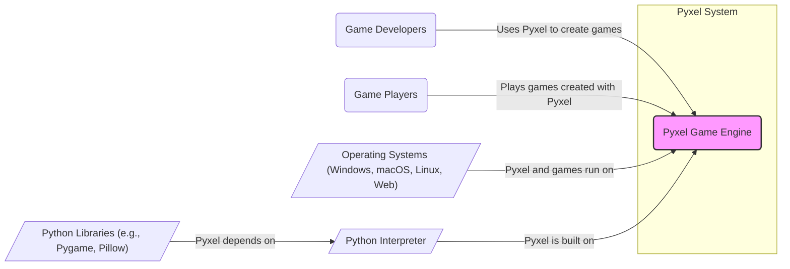
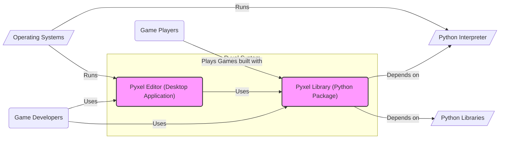

# BUSINESS POSTURE

- Business Priorities and Goals:
  - Provide an accessible and easy-to-use retro game engine for Python developers.
  - Enable the creation of pixel art style games with a focus on simplicity and fun.
  - Foster a community of game developers and retro game enthusiasts.
  - Offer a cross-platform solution for game development and deployment.

- Business Risks:
  - Reputation damage due to security vulnerabilities in the engine, potentially affecting games built with it.
  - Limited adoption if the engine is perceived as unreliable or difficult to use.
  - Lack of community support if the project is not actively maintained or lacks documentation.
  - Potential for compatibility issues across different operating systems and Python versions.
  - Risk of supply chain attacks if dependencies are compromised.
  - For companies using pyxel in commercial projects, risks associated with vulnerabilities in games impacting their users and brand.

# SECURITY POSTURE

- Existing Security Controls:
  - security control: Open Source Code - The source code is publicly available on GitHub, allowing for community review and potential identification of vulnerabilities. (Implemented: GitHub Repository)
  - security control: Standard Python Security Practices - Pyxel is built using Python, benefiting from general Python security best practices and ecosystem security tools. (Implemented: Python Language Ecosystem)
  - accepted risk: Limited Formal Security Audits - As an open-source project, dedicated security audits might not be regularly performed.
  - accepted risk: Community-Driven Security - Security relies on community contributions and the maintainer's responsiveness to reported issues.
  - accepted risk: Dependency Vulnerabilities - Pyxel depends on external Python libraries, which might have their own vulnerabilities.

- Recommended Security Controls:
  - security control: Implement Automated Security Scanning - Integrate SAST (Static Application Security Testing) and dependency scanning tools into the development and build process to automatically detect potential vulnerabilities.
  - security control: Establish Vulnerability Reporting Process - Create a clear process for users and developers to report security vulnerabilities, including a dedicated security contact and a defined response plan.
  - security control: Provide Security Guidelines for Game Developers - Offer documentation and best practices for developers using Pyxel to build games securely, especially regarding input validation and data handling.
  - security control: Regularly Update Dependencies - Keep dependencies up to date to patch known vulnerabilities in underlying libraries.
  - security control: Code Review Process - Implement a code review process for contributions, with a focus on identifying potential security issues.

- Security Requirements:
  - Authentication: Not directly applicable to the Pyxel engine itself. Authentication requirements would be relevant for games built using Pyxel if they require user accounts or online features.
  - Authorization: Similar to authentication, authorization is primarily relevant for games built with Pyxel that need to control access to features or data based on user roles or permissions.
  - Input Validation:
    - Requirement: Pyxel engine should handle various input types (keyboard, mouse, gamepad, audio, file inputs) robustly and prevent crashes or unexpected behavior due to malformed input.
    - Requirement: Games built with Pyxel must implement input validation to protect against injection attacks and ensure data integrity, especially when handling user-provided data.
  - Cryptography:
    - Requirement: If games built with Pyxel require secure communication (e.g., online multiplayer) or data storage (e.g., save games with sensitive information), they should utilize appropriate cryptographic libraries and practices. Pyxel engine itself might not directly require cryptography, but should not hinder its use in games.

# DESIGN

## C4 CONTEXT



- Context Diagram Elements:
  - - Name: Pyxel Game Engine
    - Type: Software System
    - Description: A retro game engine written in Python, providing APIs and tools for creating pixel art style games.
    - Responsibilities: Provides functionalities for graphics rendering, sound, input handling, resource management, and game logic execution.
    - Security controls: Input validation within the engine to handle various data types safely, dependency management to ensure secure libraries are used.
  - - Name: Game Developers
    - Type: Person
    - Description: Software developers who use Pyxel to create games.
    - Responsibilities: Develop game logic, create game assets, utilize Pyxel APIs, and package games for distribution.
    - Security controls: Responsible for secure coding practices in their game development, including input validation, secure data handling, and appropriate use of cryptography if needed.
  - - Name: Game Players
    - Type: Person
    - Description: End-users who play games created using Pyxel.
    - Responsibilities: Interact with games, provide input, and experience the game content.
    - Security controls: Limited direct security controls. Security relies on the robustness of the Pyxel engine and the security practices of game developers.
  - - Name: Operating Systems (Windows, macOS, Linux, Web)
    - Type: Software System
    - Description: The platforms on which Pyxel and games built with it are executed. Includes desktop operating systems and web browsers for web-based games.
    - Responsibilities: Provides the runtime environment for Pyxel and games, including system resources, libraries, and user interface.
    - Security controls: Operating system security features, such as process isolation, memory protection, and access control. Web browsers provide sandboxing for web-based games.
  - - Name: Python Interpreter
    - Type: Software System
    - Description: The Python runtime environment required to execute Pyxel and Python-based games.
    - Responsibilities: Executes Python code, manages memory, and provides access to system resources.
    - Security controls: Python interpreter security features, including safe execution of code and protection against certain types of vulnerabilities.
  - - Name: Python Libraries (e.g., Pygame, Pillow)
    - Type: Software System
    - Description: External Python libraries that Pyxel depends on for specific functionalities, such as graphics, audio, and image processing.
    - Responsibilities: Provide specific functionalities to Pyxel.
    - Security controls: Security of these libraries is crucial. Pyxel relies on the security practices of these external projects. Dependency scanning and updates are important.

## C4 CONTAINER



- Container Diagram Elements:
  - - Name: Pyxel Library (Python Package)
    - Type: Container - Library
    - Description: The core Pyxel engine distributed as a Python package, providing APIs for game development.
    - Responsibilities: Graphics rendering, sound playback, input handling, resource management, game logic execution.
    - Security controls: Input validation within the library, dependency management, potentially code signing for the Python package distribution.
  - - Name: Pyxel Editor (Desktop Application)
    - Type: Container - Application
    - Description: A desktop application providing a graphical user interface for creating and editing game assets (images, sounds, tilesets) and running Pyxel games.
    - Responsibilities: Asset creation and editing, game execution environment, project management.
    - Security controls: Input validation for file handling and user inputs, protection against cross-site scripting (if using web technologies within the editor), secure update mechanism for the editor application itself.
  - - Name: Python Interpreter
    - Type: Container - Runtime Environment
    - Description: The Python runtime environment that executes the Pyxel Library and games.
    - Responsibilities: Executes Python code, manages memory, provides access to system resources.
    - Security controls: Python interpreter security features, operating system level security controls.
  - - Name: Python Libraries
    - Type: Container - Libraries
    - Description: External Python libraries used by Pyxel Library.
    - Responsibilities: Provide functionalities to Pyxel Library.
    - Security controls: Dependency scanning and updates, relying on the security of external libraries.
  - - Name: Operating Systems
    - Type: Container - Infrastructure
    - Description: The operating systems on which Pyxel Editor and Python Interpreter run.
    - Responsibilities: Provides the runtime environment for applications.
    - Security controls: Operating system security features, access control, process isolation.

## DEPLOYMENT

- Deployment Options:
  - Desktop Application (Windows, macOS, Linux): Distribute games as standalone executables for different operating systems.
  - Web Browser (HTML5): Compile games to WebAssembly or JavaScript for deployment on web browsers.
  - Mobile Platforms (Android, iOS): Package games for mobile app stores (less common for Pyxel due to desktop focus, but potentially feasible).

- Detailed Deployment (Desktop Application - Windows):

```mermaid
flowchart LR
    subgraph "Developer Machine"
        DevMachine[/"Developer Machine"/]
        GameCode[/"Game Code & Assets"/]
        PyxelLibDev[/"Pyxel Library (Dev)"/]
        PythonDev[/"Python Interpreter (Dev)"/]
        DevMachine -- "Develops with" --> GameCode
        DevMachine -- "Uses" --> PyxelLibDev
        DevMachine -- "Uses" --> PythonDev
    end
    subgraph "Build Environment"
        BuildServer[/"Build Server"/]
        BuildScript[/"Build Script"/]
        PyxelLibBuild[/"Pyxel Library (Build)"/]
        PythonBuild[/"Python Interpreter (Build)"/]
        BuildServer -- "Executes" --> BuildScript
        BuildServer -- "Uses" --> PyxelLibBuild
        BuildServer -- "Uses" --> PythonBuild
        BuildScript -- "Packages" --> GameExecutable[/"Game Executable (Windows)"/]
    end
    subgraph "User Machine"
        UserMachine[/"User Machine (Windows)"/]
        GameExecutableUser[/"Game Executable (Windows)"/]
        PyxelLibUser[/"Pyxel Library (User)"/]
        PythonUser[/"Python Interpreter (User)"/]
        UserMachine -- "Runs" --> GameExecutableUser
        UserMachine -- "Uses" --> PyxelLibUser
        UserMachine -- "Uses" --> PythonUser
        GameExecutableUser -- "Includes" --> PyxelLibUser
        GameExecutableUser -- "Requires" --> PythonUser
    end
    GameCode -- "Pushed to" --> BuildServer
    style DevMachine fill:#e0e0ff,stroke:#333,stroke-width:1px
    style BuildServer fill:#ffe0e0,stroke:#333,stroke-width:1px
    style UserMachine fill:#e0ffe0,stroke:#333,stroke-width:1px
    linkStyle 0,1,2,3,4,5,6,7,8,9,10,11,12,13,14,15,16,17 stroke:#999,stroke-width:1px
```

- Deployment Diagram Elements (Desktop Application - Windows):
  - - Name: Developer Machine
    - Type: Environment - Development
    - Description: The local machine used by game developers to write code, create assets, and test games.
    - Responsibilities: Game development, local testing.
    - Security controls: Developer machine security practices, code repository access control.
  - - Name: Build Server
    - Type: Environment - Build
    - Description: A server dedicated to automating the build process, compiling game code, and packaging executables.
    - Responsibilities: Automated build process, packaging, code compilation.
    - Security controls: Access control to the build server, secure build scripts, vulnerability scanning during build, secure storage of build artifacts.
  - - Name: User Machine (Windows)
    - Type: Environment - User
    - Description: The end-user's Windows machine where the game is executed.
    - Responsibilities: Running the game, providing input, experiencing the game.
    - Security controls: Operating system security features, user account controls, antivirus software.
  - - Name: Game Code & Assets
    - Type: Artifact - Source Code
    - Description: The source code of the game and associated assets (images, sounds, etc.).
    - Responsibilities: Game logic, game content.
    - Security controls: Version control system, access control to the repository.
  - - Name: Pyxel Library (Dev/Build/User)
    - Type: Artifact - Library
    - Description: Instances of the Pyxel library used in development, build, and user environments.
    - Responsibilities: Game engine functionalities.
    - Security controls: In build environment, ensure libraries are from trusted sources. In user environment, the library is bundled with the game executable.
  - - Name: Python Interpreter (Dev/Build/User)
    - Type: Artifact - Runtime Environment
    - Description: Python interpreter instances in development, build, and user environments.
    - Responsibilities: Execution of Python code.
    - Security controls: In build environment, use a controlled and secure Python environment. In user environment, either require users to have Python installed or bundle a minimal Python runtime with the game.
  - - Name: Build Script
    - Type: Artifact - Script
    - Description: Scripts used to automate the build process.
    - Responsibilities: Automating build steps, packaging.
    - Security controls: Secure scripting practices, access control to modify build scripts.
  - - Name: Game Executable (Windows)
    - Type: Artifact - Executable
    - Description: The packaged executable file for the game, ready to be distributed to users.
    - Responsibilities: Distributable game application.
    - Security controls: Code signing of the executable, distribution through trusted channels.

## BUILD

```mermaid
flowchart LR
    Developer[/"Developer"/] -- "Writes Code & Assets" --> LocalRepo[/"Local Repository"/]
    LocalRepo -- "Pushes Code" --> RemoteRepo[/"Remote Repository (GitHub)"/]
    RemoteRepo -- "Triggers Build" --> CI[/"CI/CD System (GitHub Actions)"/]
    CI -- "Fetches Code & Dependencies" --> BuildEnv[/"Build Environment"/]
    BuildEnv -- "Runs Security Checks (SAST, Linters)" --> BuildEnv
    BuildEnv -- "Compiles & Packages" --> BuildArtifacts[/"Build Artifacts (Executables, Packages)"/]
    BuildArtifacts -- "Signs Artifacts (Code Signing)" --> SignedArtifacts[/"Signed Build Artifacts"/]
    SignedArtifacts -- "Publishes" --> Distribution[/"Distribution Channels (GitHub Releases, PyPI)"/]
    style LocalRepo fill:#e0e0ff,stroke:#333,stroke-width:1px
    style RemoteRepo fill:#e0e0ff,stroke:#333,stroke-width:1px
    style CI fill:#ffe0e0,stroke:#333,stroke-width:1px
    style BuildEnv fill:#ffe0e0,stroke:#333,stroke-width:1px
    style BuildArtifacts fill:#e0ffe0,stroke:#333,stroke-width:1px
    style SignedArtifacts fill:#e0ffe0,stroke:#333,stroke-width:1px
```



- Build Process Description:
  - Developer writes code and creates game assets on their local machine.
  - Code and assets are committed to a local Git repository.
  - Changes are pushed to a remote Git repository (e.g., GitHub).
  - Pushing to the remote repository triggers a CI/CD pipeline (e.g., GitHub Actions).
  - The CI/CD system fetches the code and necessary dependencies into a build environment.
  - Security checks are performed in the build environment, including SAST (Static Application Security Testing) and linters to identify potential vulnerabilities and code quality issues.
  - The code is compiled and packaged into build artifacts (e.g., executables for different platforms, Python packages).
  - Build artifacts are signed using code signing certificates to ensure integrity and authenticity.
  - Signed build artifacts are published to distribution channels, such as GitHub Releases for binaries and PyPI for Python packages.

# RISK ASSESSMENT

- Critical Business Processes:
  - Maintaining the integrity and availability of the Pyxel engine and related tools.
  - Protecting the reputation of the Pyxel project and its maintainers.
  - Ensuring the security and reliability of games built using Pyxel (indirectly, but important for community trust).
  - Secure distribution of Pyxel library and editor to prevent supply chain attacks.

- Data to Protect and Sensitivity:
  - Pyxel Source Code: High sensitivity - Confidentiality and integrity are crucial to prevent unauthorized modifications or exposure of vulnerabilities.
  - Build Artifacts (Pyxel Library, Editor, Examples): Medium sensitivity - Integrity is important to ensure users download legitimate and untampered software. Availability is also important for users to access the engine.
  - Game Assets Created with Pyxel (by users): Sensitivity depends on the game and user. For Pyxel project itself, less sensitive, but for game developers, their assets are valuable IP.
  - User Data (Potentially in games built with Pyxel): Sensitivity depends entirely on the game. Could range from low (no user data) to high (personal or sensitive user information). Pyxel engine itself does not handle user data, but games built with it might.

# QUESTIONS & ASSUMPTIONS

- BUSINESS POSTURE:
  - Question: Is Pyxel primarily intended for hobbyist game developers or is there a target audience of professional/commercial game developers?
  - Assumption: Primarily for hobbyist and indie game developers, but could be used for educational purposes or rapid prototyping in commercial settings.
  - Question: Are there any specific business goals related to community growth or monetization for the Pyxel project itself?
  - Assumption: Focus is on community growth and providing a valuable free tool, rather than direct monetization of the Pyxel engine itself.

- SECURITY POSTURE:
  - Question: Are there any existing security guidelines or documentation for Pyxel developers?
  - Assumption: Limited formal security documentation exists currently.
  - Question: Is there a designated security contact or process for reporting vulnerabilities in Pyxel?
  - Assumption: Security vulnerability reporting is likely handled through general issue reporting channels on GitHub.
  - Question: What is the tolerance for security risks in the Pyxel project? (Startup vs. Fortune 500 context)
  - Assumption: As an open-source hobby project, risk tolerance might be higher than a Fortune 500 company, but maintaining a secure and reliable engine is still important for community trust and adoption.

- DESIGN:
  - Question: What is the intended scope of this design document - is it focused solely on the Pyxel engine itself, or also encompassing games built with Pyxel?
  - Assumption: Primarily focused on the Pyxel engine (library and editor) and its build/deployment processes. Security considerations for games built with Pyxel are addressed at a high level.
  - Question: What are the key dependencies of Pyxel, and are there plans to minimize or manage these dependencies for security and stability?
  - Assumption: Pyxel relies on standard Python libraries. Dependency management and updates are important for maintaining security.
  - Question: What are the typical deployment scenarios for games built with Pyxel?
  - Assumption: Primarily desktop applications for Windows, macOS, and Linux, with potential for web-based deployment. Mobile deployment is less common.