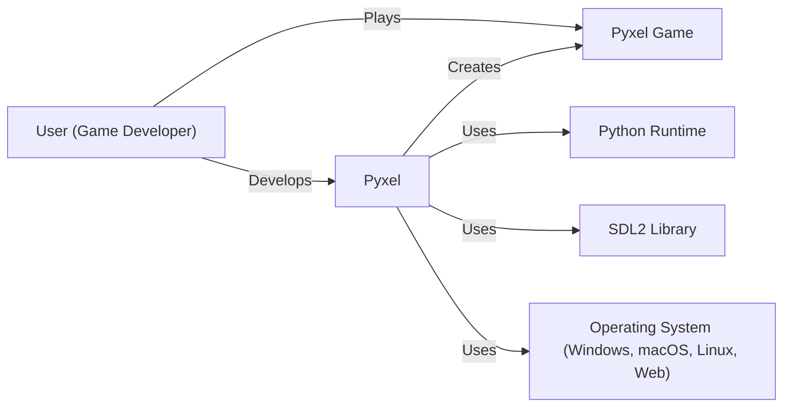
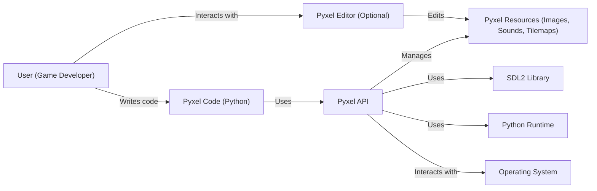
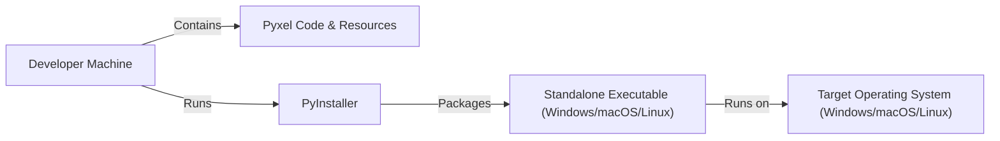
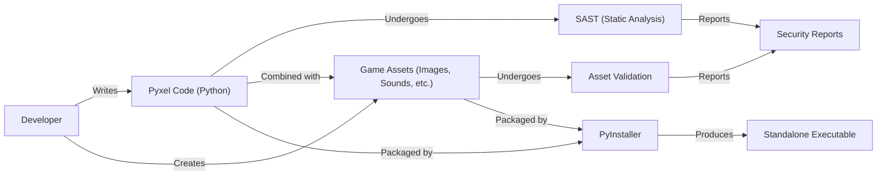

# BUSINESS POSTURE

Business Priorities and Goals:

*   Provide an easy-to-use and accessible game development framework for beginners and hobbyists.
*   Offer a retro-style game engine with a focus on pixel art and simple game mechanics.
*   Foster a community around the project, encouraging user contributions and shared learning.
*   Maintain a low barrier to entry, both in terms of technical skill and cost (open-source).
*   Ensure cross-platform compatibility (Windows, Mac, Linux, Web).

Most Important Business Risks:

*   Malicious code injection through user-provided assets (e.g., images, sounds, scripts).
*   Vulnerabilities in the framework that could be exploited to crash or compromise user systems.
*   Dependency on third-party libraries that may introduce security risks or become unmaintained.
*   Lack of sufficient documentation or support, leading to user frustration and abandonment.
*   Intellectual property infringement (e.g., unauthorized use of copyrighted assets).

# SECURITY POSTURE

Existing Security Controls:

*   security control: The project is open-source, allowing for community review and contributions to security. (Described in the GitHub repository's README and contribution guidelines).
*   security control: Basic input handling for image and audio files (implied, but needs further clarification in documentation). (Partially visible in the source code).
*   security control: Use of Python, which offers some built-in security features compared to lower-level languages. (Implicit in the choice of language).

Accepted Risks:

*   accepted risk: Limited built-in protection against advanced exploitation techniques. The focus is on simplicity and ease of use, which may necessitate accepting some security trade-offs.
*   accepted risk: Reliance on external contributors for security reviews and fixes.
*   accepted risk: Potential for vulnerabilities in third-party dependencies.

Recommended Security Controls:

*   security control: Implement robust input validation and sanitization for all user-provided assets (images, audio, tilemaps, etc.). This should include checks for file type, size, dimensions, and potentially content scanning for malicious patterns.
*   security control: Integrate a static analysis security testing (SAST) tool into the development workflow to identify potential vulnerabilities in the code.
*   security control: Regularly audit and update third-party dependencies to mitigate known vulnerabilities. Consider using a dependency management tool with security features.
*   security control: Implement a Content Security Policy (CSP) for the web-based version of Pyxel to prevent cross-site scripting (XSS) attacks.
*   security control: Provide clear documentation on security best practices for Pyxel developers, including guidance on handling user input and avoiding common vulnerabilities.
*   security control: Consider sandboxing or isolating the execution of user-provided scripts (if applicable) to limit the potential impact of malicious code.

Security Requirements:

*   Authentication: Not directly applicable, as Pyxel is a game development framework, not a service requiring user accounts. However, if online features like asset sharing are added, authentication would become crucial.
*   Authorization: Not directly applicable in the current context. If features like collaborative editing or access control to resources are added, authorization mechanisms would be needed.
*   Input Validation: Crucial. All user-provided data (images, audio, tilemaps, scripts) must be rigorously validated and sanitized to prevent injection attacks and other vulnerabilities. Specific checks should be implemented based on the data type and its intended use.
*   Cryptography: Not a primary concern for the core framework. However, if features like secure communication or data storage are added, appropriate cryptographic techniques should be used.

# DESIGN

## C4 CONTEXT

Element List:

*   Element:
    *   Name: User (Game Developer)
    *   Type: Person
    *   Description: A person who uses Pyxel to create games.
    *   Responsibilities: Writes code, creates assets, tests and debugs games, deploys games.
    *   Security controls: Follows security best practices for software development, uses strong passwords (if applicable), keeps their system secure.

*   Element:
    *   Name: Pyxel
    *   Type: Software System
    *   Description: The Pyxel game engine itself.
    *   Responsibilities: Provides APIs for game development, handles input, renders graphics, plays audio, manages resources.
    *   Security controls: Input validation, sanitization, dependency management, regular security audits, SAST integration.

*   Element:
    *   Name: Pyxel Game
    *   Type: Software System
    *   Description: A game created using the Pyxel engine.
    *   Responsibilities: Implements game logic, uses Pyxel APIs, interacts with the user.
    *   Security controls: Inherits security controls from Pyxel, game-specific input validation.

*   Element:
    *   Name: Python Runtime
    *   Type: Software System
    *   Description: The Python interpreter that executes Pyxel and Pyxel game code.
    *   Responsibilities: Executes Python code, manages memory, provides access to system resources.
    *   Security controls: Python's built-in security features, regular updates to the Python runtime.

*   Element:
    *   Name: SDL2 Library
    *   Type: Software System
    *   Description: A cross-platform development library used by Pyxel for low-level graphics, audio, and input handling.
    *   Responsibilities: Provides a hardware abstraction layer, handles window creation, renders graphics, plays audio, processes input events.
    *   Security controls: Regular updates to the SDL2 library, secure configuration of SDL2.

*   Element:
    *   Name: Operating System (Windows, macOS, Linux, Web)
    *   Type: Software System
    *   Description: The underlying operating system on which Pyxel and Pyxel games run.
    *   Responsibilities: Provides system resources, manages processes, handles file I/O, network communication.
    *   Security controls: OS-level security features (e.g., firewalls, antivirus), regular OS updates.

## C4 CONTAINER

Element List:

*   Element:
    *   Name: User (Game Developer)
    *   Type: Person
    *   Description: A person who uses Pyxel to create games.
    *   Responsibilities: Writes code, creates assets, tests and debugs games, deploys games.
    *   Security controls: Follows security best practices, uses strong passwords (if applicable), keeps their system secure.

*   Element:
    *   Name: Pyxel Editor (Optional)
    *   Type: Container (Application)
    *   Description: An optional graphical editor for creating and managing Pyxel resources.
    *   Responsibilities: Provides a user interface for editing images, sounds, and tilemaps.
    *   Security controls: Input validation, sanitization, secure handling of file I/O.

*   Element:
    *   Name: Pyxel Code (Python)
    *   Type: Container (Code)
    *   Description: The Python code written by the game developer using the Pyxel API.
    *   Responsibilities: Implements game logic, handles user input, controls game flow.
    *   Security controls: Secure coding practices, input validation, avoidance of common vulnerabilities.

*   Element:
    *   Name: Pyxel Resources (Images, Sounds, Tilemaps)
    *   Type: Container (Data)
    *   Description: The assets used by the Pyxel game, such as images, sounds, and tilemaps.
    *   Responsibilities: Stores game assets in a specific format.
    *   Security controls: Input validation, sanitization, file type verification, size limits.

*   Element:
    *   Name: Pyxel API
    *   Type: Container (Library)
    *   Description: The core Pyxel library that provides the game development functions.
    *   Responsibilities: Provides APIs for graphics, audio, input, resource management.
    *   Security controls: Input validation, sanitization, secure coding practices, regular security audits.

*   Element:
    *   Name: SDL2 Library
    *   Type: Container (Library)
    *   Description: A cross-platform development library used by Pyxel.
    *   Responsibilities: Provides a hardware abstraction layer, handles window creation, renders graphics, plays audio, processes input events.
    *   Security controls: Regular updates to the SDL2 library, secure configuration of SDL2.

*   Element:
    *   Name: Python Runtime
    *   Type: Container (Runtime)
    *   Description: The Python interpreter.
    *   Responsibilities: Executes Python code, manages memory, provides access to system resources.
    *   Security controls: Python's built-in security features, regular updates to the Python runtime.

*   Element:
    *   Name: Operating System
    *   Type: Container (Operating System)
    *   Description: The underlying operating system.
    *   Responsibilities: Provides system resources, manages processes, handles file I/O, network communication.
    *   Security controls: OS-level security features (e.g., firewalls, antivirus), regular OS updates.

## DEPLOYMENT

Possible Deployment Solutions:

1.  Standalone Executable (Windows, macOS, Linux): Using tools like PyInstaller or Nuitka to package the Python code and dependencies into a single executable file.
2.  Web Deployment (HTML5): Using tools like Brython or Transcrypt to compile the Python code to JavaScript and run it in a web browser.
3.  Manual Distribution: Providing the Python source code and instructions for users to run it with their own Python installation.

Chosen Solution (Detailed Description): Standalone Executable (using PyInstaller)

Element List:

*   Element:
    *   Name: Developer Machine
    *   Type: Infrastructure Node (Computer)
    *   Description: The computer used by the game developer to write and build the game.
    *   Responsibilities: Hosts the development environment, runs build tools.
    *   Security controls: Secure development environment, up-to-date software, antivirus, firewall.

*   Element:
    *   Name: Pyxel Code & Resources
    *   Type: Data
    *   Description: The Python source code and game assets.
    *   Responsibilities: Contains the game logic and assets.
    *   Security controls: Secure coding practices, input validation, asset sanitization.

*   Element:
    *   Name: PyInstaller
    *   Type: Software
    *   Description: A tool that packages Python code and its dependencies into a standalone executable.
    *   Responsibilities: Bundles the Python interpreter, libraries, and game code into a single file.
    *   Security controls: Use a trusted version of PyInstaller, verify the integrity of the downloaded package.

*   Element:
    *   Name: Standalone Executable (Windows/macOS/Linux)
    *   Type: Software
    *   Description: The final executable file that can be run on the target operating system.
    *   Responsibilities: Runs the Pyxel game.
    *   Security controls: Inherits security controls from the build process and Pyxel itself.

*   Element:
    *   Name: Target Operating System (Windows/macOS/Linux)
    *   Type: Infrastructure Node (Operating System)
    *   Description: The operating system on which the game will be played.
    *   Responsibilities: Provides the runtime environment for the executable.
    *   Security controls: OS-level security features, regular updates.

## BUILD

Build Process Description:

1.  Developer: The game developer writes the Pyxel code in Python and creates the game assets (images, sounds, tilemaps).
2.  Code: The Python code is written using a text editor or IDE.
3.  Assets: Game assets are created using image editors, audio editors, and potentially the Pyxel Editor.
4.  SAST (Static Analysis): A static analysis security testing (SAST) tool (e.g., Bandit, Pylint with security plugins) is run on the Python code to identify potential vulnerabilities.
5.  Asset Validation: Custom scripts or tools are used to validate and sanitize the game assets, checking for file types, sizes, dimensions, and potentially malicious content.
6.  Results: The SAST tool and asset validation scripts generate reports indicating any detected issues.
7.  Code & Assets: The validated code and assets are combined.
8.  PyInstaller: PyInstaller is used to package the Python code, the Pyxel library, its dependencies (including SDL2), and the game assets into a standalone executable file.
9.  Executable: The output is a standalone executable file that can be distributed to players.

Security Controls in Build Process:

*   SAST: Identifies potential vulnerabilities in the code.
*   Asset Validation: Prevents malicious or malformed assets from being included in the game.
*   Dependency Management: Regularly updating and auditing third-party dependencies (including Pyxel and SDL2) to mitigate known vulnerabilities.
*   Secure Build Environment: Ensuring the developer's machine and build environment are secure.

# RISK ASSESSMENT

Critical Business Processes to Protect:

*   Game development workflow: Ensuring developers can create and build games without interruption or compromise.
*   Distribution of games: Protecting the integrity of the distributed game files to prevent tampering or malware injection.
*   User experience: Ensuring players can run games safely and without encountering security issues.
*   Reputation: Maintaining the trust and confidence of users and the broader game development community.

Data to Protect and Sensitivity:

*   Game code (Source Code): Sensitivity - Medium. Contains the game logic and intellectual property. Unauthorized access could lead to code theft or modification.
*   Game assets (Images, Sounds, Tilemaps): Sensitivity - Low to Medium. Depending on whether the assets are original creations or licensed content. Unauthorized use could lead to copyright infringement.
*   User data (if any): Sensitivity - High (if collected). If the game collects any user data (e.g., high scores, preferences), it must be protected according to privacy regulations (e.g., GDPR, CCPA). Pyxel itself doesn't collect user data, but games built with it *could*.

# QUESTIONS & ASSUMPTIONS

Questions:

*   Are there any plans to add online features to Pyxel, such as asset sharing, multiplayer support, or user accounts? This would significantly impact the security requirements.
*   What level of support is provided for user-created scripts or mods? This could introduce additional security risks.
*   What specific image and audio formats are supported by Pyxel? This is important for defining precise input validation rules.
*   What is the process for reporting and addressing security vulnerabilities discovered in Pyxel?
*   Is there a mechanism for verifying the integrity of downloaded Pyxel releases or game executables?

Assumptions:

*   BUSINESS POSTURE: The primary goal is to provide a simple and accessible game development framework, with security being a secondary but important consideration.
*   SECURITY POSTURE: The project relies heavily on community contributions and open-source review for security. There is limited budget for dedicated security personnel or advanced security tooling.
*   DESIGN: The core Pyxel framework does not handle sensitive user data directly. Any data collection or online features would be the responsibility of individual game developers using Pyxel. The deployment model will primarily focus on standalone executables and potentially web-based deployment.