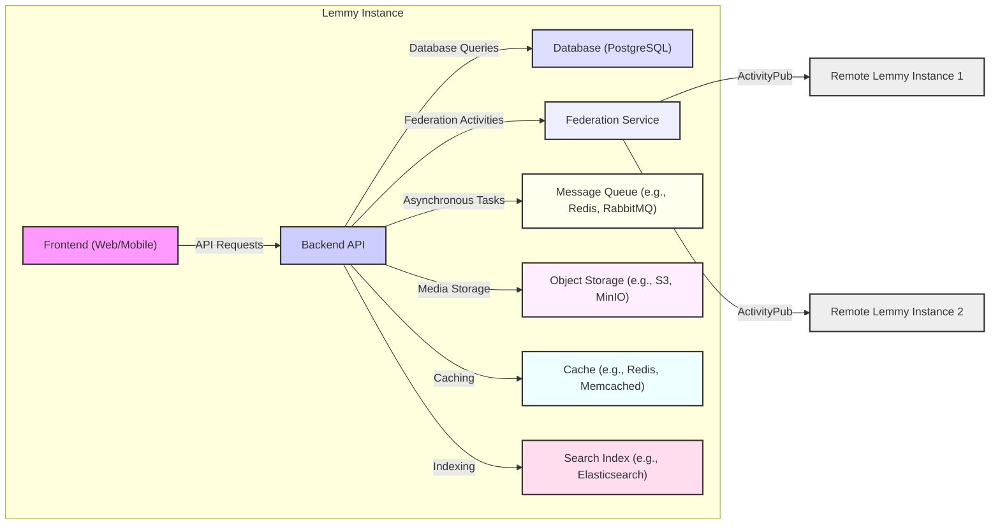
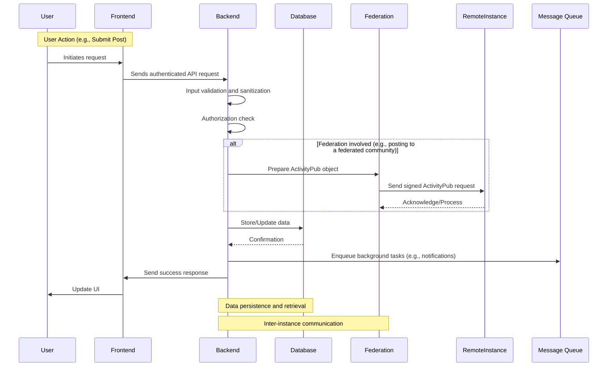
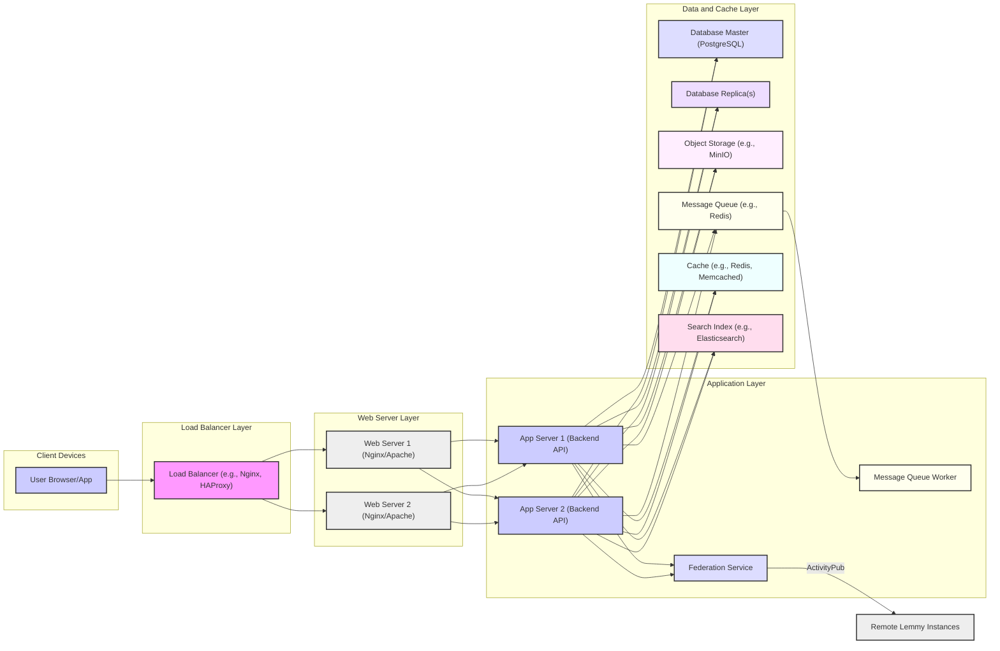

# Project Design Document: Lemmy - Federated Link Aggregator

**Version:** 1.1
**Date:** October 26, 2023
**Author:** AI Software Architect

## 1. Introduction

This document provides an enhanced architectural design of the Lemmy project, a self-hosted link aggregation and discussion platform. This document is intended to serve as a robust foundation for subsequent threat modeling activities. It outlines the key components, data flows, and interactions within the system with increased detail and clarity.

### 1.1. Purpose

The purpose of this document is to provide a comprehensive and detailed overview of the Lemmy architecture, with a strong focus on aspects relevant to security vulnerabilities and potential attack vectors. It will serve as a definitive reference point for identifying threats, understanding attack surfaces, and designing appropriate mitigation strategies.

### 1.2. Scope

This document covers the core components of the Lemmy application, including the frontend, backend, database, federation layer, and supporting services. It also describes the intricate interactions between these components and with external systems, emphasizing data flow and trust boundaries.

### 1.3. Audience

This document is primarily intended for security engineers and architects responsible for threat modeling and security assessments. It is also valuable for developers needing a deep understanding of the system architecture and its security implications.

## 2. System Overview

Lemmy is a federated, open-source alternative to centralized social news aggregation platforms. Users organize themselves into communities, submit links and text posts, vote on content, and engage in threaded discussions through comments. The decentralized nature of Lemmy, enabled by federation, is a core architectural and security consideration.

### 2.1. Key Features

*   **User Account Management:** Secure registration, login (including potential multi-factor authentication), profile creation and modification, account deletion.
*   **Community Ecosystem:** Creation, configuration (including moderation rules), and management of communities (instances).
*   **Content Submission and Interaction:** Submission of links and text-based posts, upvoting and downvoting of posts and comments, saving content.
*   **Comment System:** Threaded commenting with support for markdown formatting, editing, and deletion.
*   **Federation and Inter-Instance Communication:**  Subscription to remote communities, sharing of posts and comments across instances using the ActivityPub protocol.
*   **Moderation Capabilities:** Tools for community moderators to manage content (e.g., removing posts/comments), manage users (e.g., banning), and configure community settings.
*   **Search Functionality:** Indexing and searching for posts, comments, communities, and users within the instance and potentially across federated instances.
*   **Notification System:** Real-time notifications for user interactions (e.g., replies, mentions, votes).
*   **Application Programming Interface (API):** A well-defined API (likely RESTful) for programmatic interaction with the platform, used by the frontend and potentially third-party applications.

## 3. Architectural Design

The Lemmy architecture is designed around a modular approach, separating concerns into distinct components that communicate with each other.

*   **Frontend (Web/Mobile):**  The user interface, responsible for rendering the application and handling user interactions. This is typically a Single Page Application (SPA) built with technologies like React or Vue.js.
*   **Backend API:** The core application logic, implemented as a RESTful API. It handles requests from the frontend, interacts with the database and other services, and enforces business rules and security policies.
*   **Database (PostgreSQL):**  The primary persistent data store, responsible for storing all application data in a structured manner.
*   **Federation Service:**  A dedicated component responsible for handling communication with other Lemmy instances using the ActivityPub protocol. This includes sending and receiving activities (e.g., creating posts, following users).
*   **Message Queue (e.g., Redis, RabbitMQ):**  Used for asynchronous task processing, such as sending notifications, processing federated activities, and handling background jobs. This improves responsiveness and reliability.
*   **Object Storage (e.g., S3, MinIO):**  Stores binary data, such as user avatars, community icons, and potentially media attachments in posts.

### 3.1. Component Diagram

### 3.2. Data Flow Diagram

This diagram illustrates the flow of data for key user interactions, highlighting potential security touchpoints.

### 3.3. Deployment Diagram (Conceptual)

This diagram illustrates a common deployment architecture for Lemmy, highlighting network boundaries and component interactions.

## 4. Data Management

This section details how data is stored, accessed, and managed within the Lemmy ecosystem, with a focus on sensitive information.

### 4.1. Data Storage

*   **Database (PostgreSQL):** Stores structured data including:
    *   User authentication credentials (hashed passwords, salts).
    *   User profiles (usernames, email addresses, preferences).
    *   Community metadata (names, descriptions, moderators).
    *   Post content (titles, URLs, text).
    *   Comment content.
    *   Vote information.
    *   Moderation actions and logs.
    *   Federation state (followed instances, blocks).
*   **Object Storage (Optional):** Stores unstructured binary data:
    *   User avatars.
    *   Community icons.
    *   Potentially attached media (images, videos).
*   **Message Queue (Optional):** Stores messages for asynchronous processing.
*   **Cache (Optional):** Stores frequently accessed data for performance optimization.
*   **Search Index (Optional):** Stores indexed data for efficient search operations.

### 4.2. Sensitive Data

The following data elements are considered highly sensitive and require robust protection mechanisms:

*   **User Credentials:** Hashed passwords and salts.
*   **Email Addresses:** Used for account recovery, notifications, and potentially private communication.
*   **IP Addresses:** Logged for security and moderation purposes, can be used for tracking and identification.
*   **Private Messages (if implemented):** Direct, non-public communication between users.
*   **API Keys/Tokens:**  If third-party integrations are supported.

## 5. Security Considerations

This section elaborates on the security considerations inherent in the Lemmy architecture, highlighting potential threats and existing security measures.

### 5.1. Authentication and Authorization

*   **User Authentication:** Secure password hashing algorithms (e.g., Argon2) with unique salts. Consideration for multi-factor authentication (MFA). Protection against brute-force attacks (rate limiting, account lockout).
*   **Session Management:** Securely generated and managed session tokens (e.g., HTTP-only, Secure flags). Protection against session fixation and hijacking.
*   **Authorization:** Role-Based Access Control (RBAC) to manage permissions for users, moderators, and administrators. Enforcing the principle of least privilege.
*   **Federated Authentication:** Securely verifying signatures of ActivityPub requests to ensure authenticity and integrity of federated actions. Handling of trust relationships between instances.

### 5.2. Input Validation and Output Encoding

*   **Robust Input Validation:** Server-side validation of all user-provided data to prevent injection attacks (SQL injection, cross-site scripting (XSS), command injection). Using parameterized queries for database interactions.
*   **Contextual Output Encoding:** Encoding data appropriately before rendering it in the frontend to prevent XSS vulnerabilities. Utilizing templating engines with built-in auto-escaping features.

### 5.3. Federation Security

*   **ActivityPub Protocol Security:** Strict adherence to the ActivityPub specification and best practices for secure communication. Proper verification of signatures and handling of actor identifiers.
*   **Instance Blocking and Silencing:** Mechanisms to allow instance administrators to block or silence malicious or misbehaving federated instances.
*   **Content Moderation in a Federated Context:** Challenges of moderating content originating from other instances. Strategies for handling reported content and potentially defederating from problematic instances.

### 5.4. Data Protection

*   **Encryption at Rest:** Encryption of sensitive data stored in the database and object storage using appropriate encryption algorithms.
*   **Encryption in Transit:** Mandatory use of HTTPS for all client-server communication and for inter-instance communication. Enforcing TLS with strong ciphers.

### 5.5. Rate Limiting and Abuse Prevention

*   **API Rate Limiting:** Implementing rate limits on API endpoints to prevent denial-of-service attacks and abuse. Differentiating rate limits based on authentication status.
*   **CAPTCHA or Similar Mechanisms:** To prevent automated bot activity for actions like registration and posting.

### 5.6. Logging and Monitoring

*   **Comprehensive Security Logging:** Logging of authentication attempts, authorization failures, moderation actions, and other security-relevant events.
*   **Security Monitoring and Alerting:**  Implementing systems to monitor logs for suspicious activity and generate alerts.
*   **Regular Security Audits:** Periodic review of the codebase and infrastructure for potential vulnerabilities.

## 6. Assumptions and Constraints

*   **Database Technology:** PostgreSQL is the assumed database system.
*   **Federation Standard:** ActivityPub is the protocol used for federation.
*   **Security Best Practices:** The design assumes adherence to established web application security principles and secure coding practices.
*   **Open Source Nature:** The codebase is publicly available, which allows for community review but also requires careful attention to security.
*   **Deployment Environment:** The specific deployment environment can vary, but the design considers common cloud and self-hosted scenarios.

## 7. Future Considerations

*   **Enhanced Federation Security Features:** Exploring more granular control over federated content and interactions.
*   **Plugin or Extension System:**  Designing with security in mind to prevent vulnerabilities introduced by third-party extensions.
*   **Improved Moderation Workflows:**  Developing more sophisticated tools for managing content and user behavior in a federated environment.
*   **Decentralized Identity Solutions:**  Exploring integration with decentralized identity systems for enhanced user control.

This enhanced document provides a more detailed and nuanced understanding of the Lemmy architecture, specifically tailored for threat modeling. It highlights potential attack surfaces, data flows, and security considerations, providing a solid foundation for identifying and mitigating potential vulnerabilities.
