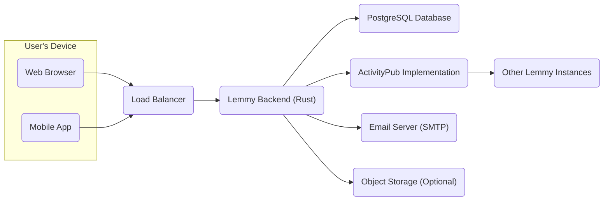
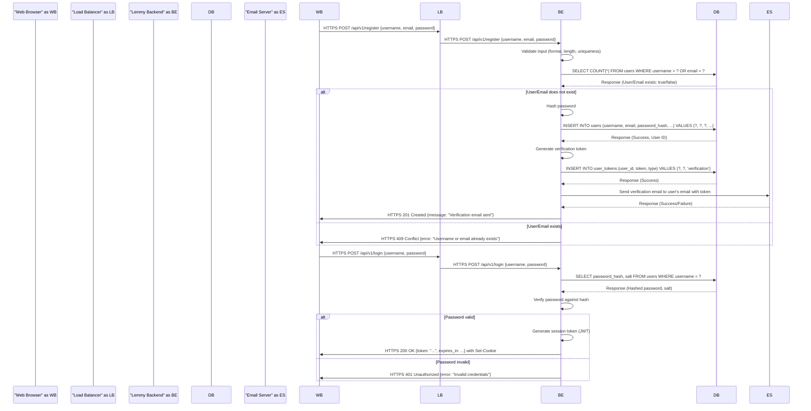
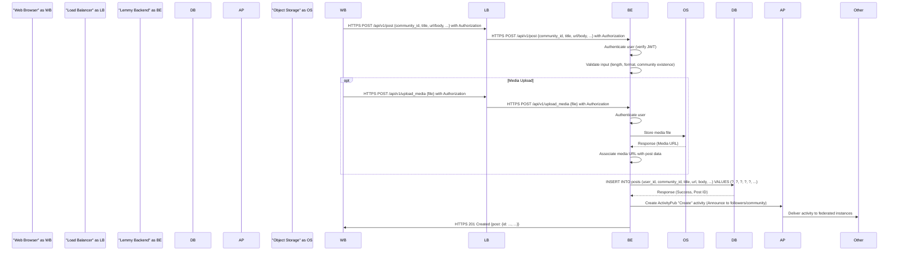
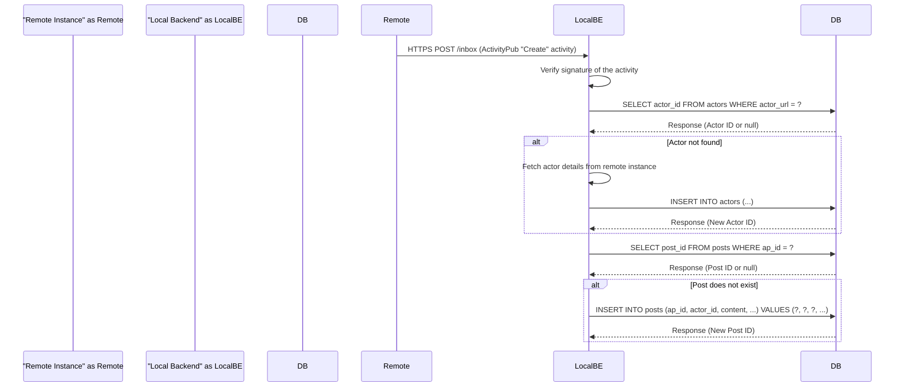

## Project Design Document: Lemmy

**Version:** 1.1
**Date:** October 26, 2023
**Author:** AI Software Architect

### 1. Introduction

This document provides an enhanced architectural design of the Lemmy project, an open-source link aggregator and forum software. This detailed design will serve as a robust foundation for subsequent threat modeling activities, enabling a comprehensive security analysis of the system. The design focuses on the key components, their interactions, and the data flows within the Lemmy application, providing more granular detail than the previous version.

### 2. Goals

*   Provide a more detailed definition of the major components of the Lemmy application, including their key responsibilities.
*   Elaborate on the interactions and data flow between these components, including specific data types and communication methods.
*   Offer more detailed visual representations of the system architecture and key processes.
*   Clearly identify the technologies and dependencies involved, with brief justifications where relevant.
*   Establish a stronger and more granular foundation for future threat modeling exercises.

### 3. High-Level Architecture

Lemmy employs a client-server architecture with a federated model. Individual Lemmy instances operate autonomously but can interact with each other to share content and user interactions via the ActivityPub protocol.

### 4. Component Details

This section provides a more detailed breakdown of the key components within the Lemmy architecture, outlining their specific responsibilities and functionalities.

*   **User's Device:**
    *   Represents the client-side interface through which users interact with Lemmy.
        *   **Web Browser:** Utilizes standard web technologies (HTML, CSS, JavaScript) to render the user interface and communicate with the backend via HTTPS.
        *   **Mobile App:** Native or hybrid applications that interact with the Lemmy backend's API, typically using RESTful principles over HTTPS.

*   **Load Balancer:**
    *   Distributes incoming user traffic across multiple instances of the Lemmy backend to ensure high availability and scalability.
        *   May perform SSL/TLS termination, offloading encryption/decryption from the backend servers.
        *   Can implement health checks to ensure traffic is only routed to healthy backend instances.

*   **Lemmy Backend (Rust):**
    *   The core application logic, implemented in Rust for performance and safety.
        *   **API Gateway:** Handles incoming API requests from the frontend and other services.
        *   **Authentication and Authorization:** Manages user registration, login, session management (typically using JWTs or similar), and access control based on roles and permissions.
        *   **Content Management:**  Handles the creation, retrieval, updating, and deletion of posts, comments, communities, and user profiles. Includes input validation and sanitization.
        *   **Moderation Logic:** Implements rules and workflows for content moderation, including reporting, banning, and content removal.
        *   **Notification System:** Manages and delivers notifications to users (e.g., new replies, mentions).
        *   **Search Indexing:**  Integrates with a search engine (e.g., Elasticsearch) to provide search functionality for content and users.
        *   **Federation Handler:**  Manages the sending and receiving of ActivityPub activities.
        *   **Background Job Processing:** Handles asynchronous tasks like sending emails or processing federated updates.

*   **PostgreSQL Database:**
    *   The primary relational database used for persistent data storage.
        *   Stores user accounts (usernames, hashed passwords, email addresses, preferences).
        *   Stores content data (posts, comments, community details, timestamps, relationships).
        *   Stores voting information (upvotes, downvotes).
        *   Stores moderation logs and reports.
        *   Stores federation-related data (remote actors, inbox/outbox).

*   **ActivityPub Implementation:**
    *   Handles the federation aspects of Lemmy, enabling communication and data sharing with other compatible instances.
        *   **Outbox:**  Manages the creation and delivery of activities initiated by the local instance (e.g., new posts, follows).
        *   **Inbox:**  Receives and processes activities from remote instances.
        *   **Actor Management:**  Stores information about remote users and instances.
        *   **Signature Verification:** Verifies the authenticity of incoming ActivityPub requests using cryptographic signatures.

*   **Other Lemmy Instances:**
    *   Represents other independent Lemmy instances within the fediverse.
        *   Interacts with the local Lemmy instance by sending and receiving ActivityPub activities over HTTPS.

*   **Email Server (SMTP):**
    *   Used for sending transactional emails.
        *   Account verification emails during registration.
        *   Password reset emails.
        *   Notification emails (optional, depending on user preferences).

*   **Object Storage (Optional):**
    *   Provides scalable storage for media files.
        *   Stores images and videos uploaded by users.
        *   Can be a local file system or a cloud-based service like AWS S3, MinIO, or similar.

### 5. Data Flow Diagrams

This section provides more detailed illustrations of data flow for key user interactions, highlighting specific data elements and communication pathways.

#### 5.1. User Registration and Login (Detailed)

#### 5.2. Posting Content (Detailed with Optional Media)

#### 5.3. Federated Interaction (Receiving and Processing a Post)

### 6. Security Considerations (Detailed)

This section expands on the security considerations, providing more specific examples and potential threats related to each component and data flow.

*   **User's Device:**
    *   **Threats:** Cross-Site Scripting (XSS), Man-in-the-Middle (MITM) attacks.
    *   **Mitigations:** Content Security Policy (CSP), HTTPS enforcement, secure cookie flags (HttpOnly, Secure).

*   **Load Balancer:**
    *   **Threats:** DDoS attacks, misconfiguration leading to information disclosure.
    *   **Mitigations:** Rate limiting, firewall rules, regular security audits.

*   **Lemmy Backend (Rust):**
    *   **Threats:** SQL Injection, Cross-Site Request Forgery (CSRF), authentication bypass, authorization flaws, insecure API endpoints.
    *   **Mitigations:** Input validation and sanitization, parameterized queries, CSRF tokens, robust authentication and authorization mechanisms (e.g., OAuth 2.0), API rate limiting, regular security audits and penetration testing.

*   **PostgreSQL Database:**
    *   **Threats:** Data breaches, unauthorized access, SQL injection (if not mitigated in the backend).
    *   **Mitigations:** Strong password policies, encryption at rest, network segmentation, least privilege access control, regular backups.

*   **ActivityPub Implementation:**
    *   **Threats:** Spoofed activities, denial-of-service through malicious federated traffic, information leakage through improperly handled federated data.
    *   **Mitigations:** Strict signature verification, rate limiting on incoming federated requests, careful handling and validation of data from remote instances.

*   **Email Server (SMTP):**
    *   **Threats:** Email spoofing, phishing attacks originating from the platform, insecure email transmission.
    *   **Mitigations:** SPF, DKIM, DMARC records, TLS encryption for email transmission.

*   **Object Storage (Optional):**
    *   **Threats:** Unauthorized access to stored media, data breaches.
    *   **Mitigations:** Access control policies, encryption at rest and in transit, secure generation of pre-signed URLs for access.

### 7. Technologies Used

*   **Backend:** Rust (chosen for performance, memory safety, and concurrency)
*   **Frontend:** TypeScript, React (common choice for building interactive web applications)
*   **Database:** PostgreSQL (robust, open-source relational database with good support for JSON and full-text search)
*   **Federation Protocol:** ActivityPub (the standard decentralized social networking protocol)
*   **Communication Protocol:** HTTPS (essential for secure communication)
*   **Load Balancer:** (e.g., Nginx, HAProxy - popular choices for their performance and features)
*   **Object Storage:** (e.g., AWS S3, MinIO - scalable and reliable storage solutions)
*   **Email Server:** SMTP (standard protocol for sending emails)

### 8. Future Considerations

*   Implementation details of specific API endpoints and their request/response structures.
*   Detailed deployment architecture, including containerization (Docker) and orchestration (Kubernetes).
*   Monitoring and logging infrastructure (e.g., Prometheus, Grafana, ELK stack).
*   Backup and recovery strategies and disaster recovery planning.
*   Specific security controls and policies to be implemented.

This improved design document provides a more granular and detailed understanding of the Lemmy project's architecture, offering a stronger foundation for comprehensive threat modeling and security analysis. The enhanced descriptions of components, data flows, and security considerations will be invaluable in identifying potential vulnerabilities and designing effective security mitigations.