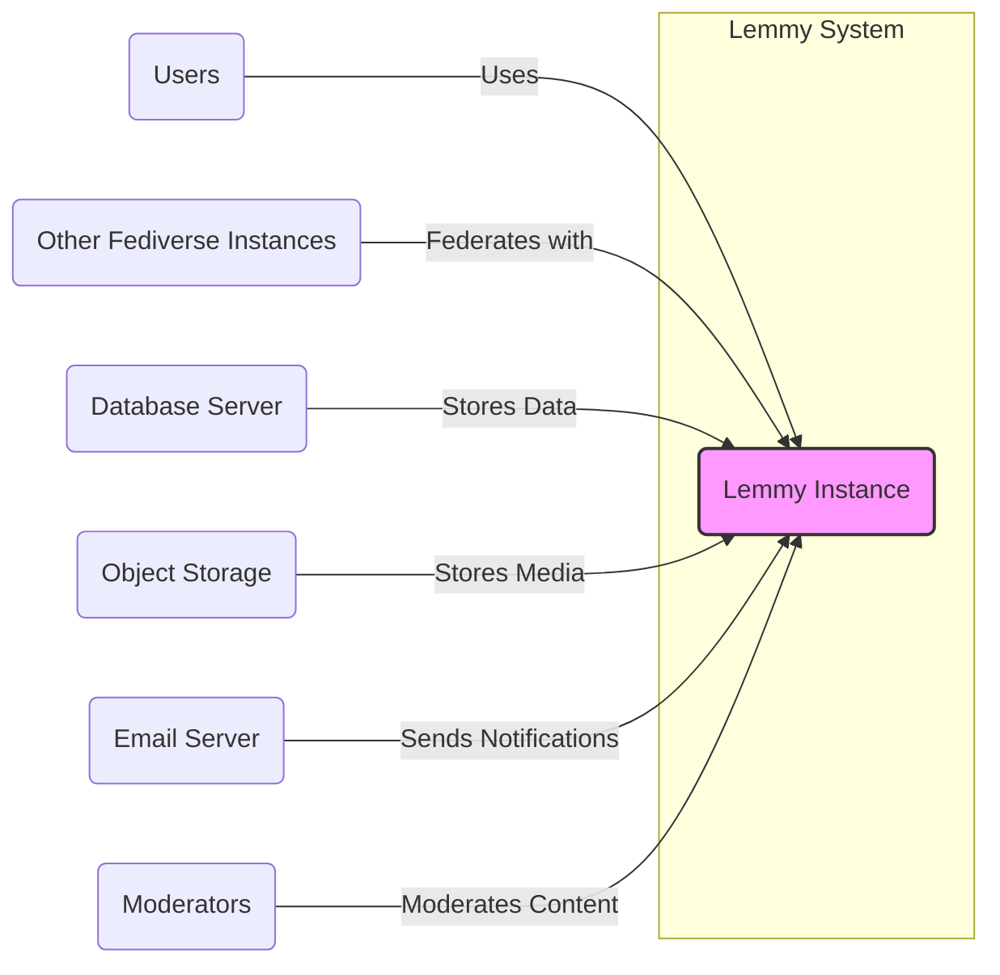

# BUSINESS POSTURE

Lemmy is a federated link aggregator, aiming to provide a decentralized alternative to platforms like Reddit. It prioritizes user privacy and community control by being open-source and part of the Fediverse.

- Business priorities and goals:
  - Provide a decentralized social media platform.
  - Offer an alternative to centralized platforms with a focus on user privacy and community governance.
  - Foster a community-driven and open-source ecosystem.
  - Enable users to control their data and online experience.
  - Support interoperability with other Fediverse platforms.

- Business risks:
  - Moderation challenges in a decentralized environment.
  - Difficulty in achieving network effects and user adoption compared to established centralized platforms.
  - Potential for misuse and abuse due to decentralization and open nature.
  - Reliance on community contributions for development and maintenance.
  - Complexity of managing a federated system and ensuring interoperability.

# SECURITY POSTURE

Lemmy, being an open-source project, benefits from community scrutiny, which can contribute to identifying and addressing security vulnerabilities. As a federated platform handling user-generated content and personal data, security is crucial.

- Existing security controls:
  - security control: HTTPS enforced for web traffic (standard web server configuration). Implemented in: Deployment configuration (e.g., reverse proxy setup).
  - security control: Regular software updates for dependencies (Rust crates, Node.js packages). Implemented in: Project's dependency management (Cargo.toml, package.json) and CI/CD pipelines.
  - security control: Input sanitization and output encoding to prevent common web vulnerabilities (likely implemented within the Rust backend and Typescript frontend code). Implemented in: Source code of backend and frontend applications.
  - security control: Rate limiting to mitigate abuse and denial-of-service attacks (likely implemented in the backend application or reverse proxy). Implemented in: Backend application code or reverse proxy configuration.
  - accepted risk: Potential vulnerabilities in third-party dependencies. Mitigation: Regular dependency updates and vulnerability scanning.
  - accepted risk: Community-driven security audits might be less frequent or comprehensive than professional audits. Mitigation: Encourage community contributions and seek external security audits when feasible.

- Recommended security controls:
  - security control: Implement a robust Content Security Policy (CSP) to mitigate Cross-Site Scripting (XSS) attacks.
  - security control: Regularly perform static and dynamic application security testing (SAST/DAST) on both backend and frontend code.
  - security control: Implement database security best practices, including principle of least privilege for database access and regular backups.
  - security control: Implement comprehensive logging and monitoring for security events and anomalies.
  - security control: Conduct regular security audits and penetration testing, especially before major releases.
  - security control: Implement a vulnerability disclosure program to encourage responsible reporting of security issues.
  - security control: Secure secret management for API keys, database credentials, and other sensitive information.

- Security requirements:
  - Authentication:
    - Requirement: Secure user authentication mechanism to verify user identity.
    - Requirement: Support for password-based authentication and potentially federated authentication (e.g., OAuth, WebAuthn).
    - Requirement: Protection against brute-force attacks on login endpoints (e.g., account lockout, rate limiting).
  - Authorization:
    - Requirement: Role-based access control (RBAC) to manage user permissions and access to features (e.g., admin, moderator, user).
    - Requirement: Fine-grained authorization to control access to specific resources and actions (e.g., posting, commenting, moderating).
    - Requirement: Consistent authorization enforcement across backend and frontend.
  - Input validation:
    - Requirement: Server-side input validation for all user-provided data to prevent injection attacks (e.g., SQL injection, command injection, XSS).
    - Requirement: Client-side input validation for user experience and early error detection, but not as a primary security control.
    - Requirement: Validation of file uploads to prevent malicious file uploads.
  - Cryptography:
    - Requirement: Use of strong encryption algorithms for sensitive data at rest and in transit.
    - Requirement: Secure storage of cryptographic keys and secrets.
    - Requirement: Proper implementation of cryptographic protocols (e.g., TLS for HTTPS).
    - Requirement: Hashing of passwords using strong hashing algorithms with salt.

# DESIGN

## C4 CONTEXT



- Context Diagram Elements:
  - Element:
    - Name: Lemmy Instance
    - Type: Software System
    - Description: The Lemmy application itself, providing link aggregation and social networking features within the Fediverse.
    - Responsibilities:
      - Handles user requests (web and API).
      - Manages content creation, storage, and retrieval.
      - Implements federation with other Fediverse instances.
      - Enforces security controls and business logic.
    - Security controls:
      - Input validation.
      - Authorization.
      - Authentication.
      - Rate limiting.
      - HTTPS encryption.
      - Logging and monitoring.

  - Element:
    - Name: Users
    - Type: Person
    - Description: Individuals who interact with the Lemmy instance to browse content, create posts, comments, and communities.
    - Responsibilities:
      - Accessing Lemmy through web browsers or mobile applications.
      - Creating and consuming content.
      - Interacting with other users and communities.
    - Security controls:
      - Strong passwords.
      - Multi-factor authentication (if implemented).
      - Awareness of phishing and social engineering attacks.

  - Element:
    - Name: Other Fediverse Instances
    - Type: Software System
    - Description: Other instances of Lemmy or compatible Fediverse platforms (e.g., Mastodon, Pleroma) that Lemmy federates with.
    - Responsibilities:
      - Exchanging data with the Lemmy instance according to the ActivityPub protocol.
      - Participating in federated timelines and communities.
    - Security controls:
      - Adherence to Fediverse protocols and security best practices.
      - Instance-level security configurations.

  - Element:
    - Name: Database Server
    - Type: Software System
    - Description: A database system (e.g., PostgreSQL) used by Lemmy to store persistent data, including user accounts, posts, comments, communities, and relationships.
    - Responsibilities:
      - Storing and retrieving data for the Lemmy application.
      - Ensuring data integrity and availability.
      - Managing database access and security.
    - Security controls:
      - Access control lists (ACLs).
      - Encryption at rest (if configured).
      - Regular backups.
      - Database hardening.

  - Element:
    - Name: Object Storage
    - Type: Software System
    - Description: Object storage (e.g., AWS S3, MinIO) used to store media files, such as images and videos uploaded by users.
    - Responsibilities:
      - Storing and serving media files.
      - Ensuring data durability and availability.
      - Managing access to stored objects.
    - Security controls:
      - Access control policies.
      - Encryption at rest and in transit.
      - Regular backups.

  - Element:
    - Name: Email Server
    - Type: Software System
    - Description: An email server (e.g., SMTP server) used by Lemmy to send email notifications to users, such as password reset emails and subscription updates.
    - Responsibilities:
      - Sending emails on behalf of the Lemmy instance.
      - Ensuring email delivery and reliability.
    - Security controls:
      - SMTP authentication.
      - TLS encryption for email transmission.
      - SPF, DKIM, and DMARC records to prevent email spoofing.

  - Element:
    - Name: Moderators
    - Type: Person
    - Description: Users with elevated privileges who are responsible for moderating content and enforcing community guidelines within Lemmy instances.
    - Responsibilities:
      - Reviewing and moderating user-generated content.
      - Enforcing community rules and guidelines.
      - Managing user reports and appeals.
    - Security controls:
      - Strong authentication for moderator accounts.
      - Audit logging of moderator actions.
      - Principle of least privilege for moderator roles.

## C4 CONTAINER

```mermaid
flowchart LR
    subgraph "Lemmy Instance"
        A("Lemmy Backend" <br> "Rust")
        B("Lemmy Frontend" <br> "Typescript/React")
    end
    C("Web Browser") -- "HTTPS" --> B
    B -- "HTTPS/API" --> A
    A -- "Database Connection" --> D("Database Server" <br> "PostgreSQL")
    A -- "Object Storage API" --> E("Object Storage" <br> "S3/MinIO")
    A -- "SMTP" --> F("Email Server")
    style A fill:#f9f,stroke:#333,stroke-width:2px
    style B fill:#f9f,stroke:#333,stroke-width:2px
```

- Container Diagram Elements:
  - Element:
    - Name: Lemmy Backend
    - Type: Container - Application
    - Description: The backend application of Lemmy, written in Rust. It handles API requests, business logic, data persistence, federation, and background tasks.
    - Responsibilities:
      - API endpoint for frontend and other systems.
      - User authentication and authorization.
      - Content management and moderation logic.
      - Federation with other Fediverse instances (ActivityPub).
      - Database interaction.
      - Object storage interaction.
      - Email notifications.
    - Security controls:
      - Input validation.
      - Authorization checks.
      - Secure API design.
      - Rate limiting.
      - Database connection security.
      - Secure handling of secrets.
      - Logging and monitoring.

  - Element:
    - Name: Lemmy Frontend
    - Type: Container - Application
    - Description: The frontend application of Lemmy, written in Typescript and React. It provides the user interface for interacting with Lemmy through web browsers.
    - Responsibilities:
      - User interface for browsing content, creating posts, comments, and communities.
      - Rendering data received from the backend API.
      - Handling user interactions and events.
      - Client-side input validation.
    - Security controls:
      - Output encoding to prevent XSS.
      - Content Security Policy (CSP).
      - Secure handling of user sessions (cookies, tokens).
      - Regular updates of frontend dependencies.

  - Element:
    - Name: Web Browser
    - Type: Container - Client
    - Description: User's web browser used to access the Lemmy frontend application.
    - Responsibilities:
      - Rendering the Lemmy frontend application.
      - Sending HTTP requests to the frontend application.
      - Displaying content to the user.
    - Security controls:
      - Browser security features (e.g., same-origin policy, XSS protection).
      - User awareness of browser security settings and extensions.

  - Element:
    - Name: Database Server (PostgreSQL)
    - Type: Container - Database
    - Description: PostgreSQL database server used by the Lemmy backend to store persistent data.
    - Responsibilities:
      - Persistent storage of application data.
      - Data retrieval and querying.
      - Data integrity and consistency.
    - Security controls:
      - Database access control.
      - Database hardening.
      - Encryption at rest (if configured).
      - Regular backups.

  - Element:
    - Name: Object Storage (S3/MinIO)
    - Type: Container - Storage
    - Description: Object storage service (e.g., AWS S3, MinIO) used to store media files.
    - Responsibilities:
      - Storage of media files.
      - Serving media files to users.
      - Data durability and availability.
    - Security controls:
      - Access control policies.
      - Encryption at rest and in transit.
      - Regular backups.

  - Element:
    - Name: Email Server
    - Type: Container - External System
    - Description: External email server used by the Lemmy backend to send email notifications.
    - Responsibilities:
      - Sending emails.
      - Email delivery.
    - Security controls:
      - SMTP authentication.
      - TLS encryption for email transmission.
      - SPF, DKIM, and DMARC records.

## DEPLOYMENT

Lemmy can be deployed in various environments, from single-server setups to more complex, scalable architectures. A common deployment architecture involves using Docker containers and a reverse proxy like Nginx.

- Deployment Architecture: Dockerized deployment on a single server or cluster.

```mermaid
flowchart LR
    subgraph "Server"
        A("Reverse Proxy" <br> "Nginx")
        B("Lemmy Backend Container")
        C("Lemmy Frontend Container")
        D("Database Container" <br> "PostgreSQL")
        E("Object Storage Container" <br> "MinIO")
    end
    F("Internet") -- "HTTPS (443)" --> A
    A -- "HTTP (Backend Port)" --> B
    A -- "HTTP (Frontend Port)" --> C
    B -- "Database Port" --> D
    B -- "Object Storage Port" --> E
    style A fill:#f9f,stroke:#333,stroke-width:2px
    style B fill:#f9f,stroke:#333,stroke-width:2px
    style C fill:#f9f,stroke:#333,stroke-width:2px
    style D fill:#f9f,stroke:#333,stroke-width:2px
    style E fill:#f9f,stroke:#333,stroke-width:2px
```

- Deployment Diagram Elements:
  - Element:
    - Name: Server
    - Type: Infrastructure - Server
    - Description: A physical or virtual server hosting the Lemmy instance.
    - Responsibilities:
      - Providing the infrastructure for running Lemmy containers.
      - Network connectivity.
      - Resource allocation (CPU, memory, storage).
    - Security controls:
      - Operating system hardening.
      - Firewall configuration.
      - Regular security patching.
      - Intrusion detection/prevention systems (IDS/IPS).

  - Element:
    - Name: Reverse Proxy (Nginx)
    - Type: Infrastructure - Software
    - Description: Nginx reverse proxy server handling incoming HTTP/HTTPS requests, SSL termination, and routing traffic to backend and frontend containers.
    - Responsibilities:
      - SSL/TLS termination.
      - Routing requests to backend and frontend containers.
      - Load balancing (if multiple backend/frontend instances).
      - Web Application Firewall (WAF) capabilities (if configured).
      - Rate limiting.
    - Security controls:
      - HTTPS configuration.
      - Web Application Firewall (WAF) rules (if used).
      - Rate limiting configuration.
      - Regular security updates.

  - Element:
    - Name: Lemmy Backend Container
    - Type: Container - Docker Container
    - Description: Docker container running the Lemmy backend application.
    - Responsibilities:
      - Running the Lemmy backend application.
      - Exposing backend API.
    - Security controls:
      - Container image security scanning.
      - Principle of least privilege for container runtime.
      - Resource limits for container.

  - Element:
    - Name: Lemmy Frontend Container
    - Type: Container - Docker Container
    - Description: Docker container running the Lemmy frontend application.
    - Responsibilities:
      - Running the Lemmy frontend application.
      - Serving static frontend assets.
    - Security controls:
      - Container image security scanning.
      - Principle of least privilege for container runtime.
      - Resource limits for container.

  - Element:
    - Name: Database Container (PostgreSQL)
    - Type: Container - Docker Container
    - Description: Docker container running the PostgreSQL database server.
    - Responsibilities:
      - Running the PostgreSQL database server.
      - Persistent data storage.
    - Security controls:
      - Database container image security scanning.
      - Database access control within container.
      - Volume encryption for persistent data (if needed).
      - Regular backups.

  - Element:
    - Name: Object Storage Container (MinIO)
    - Type: Container - Docker Container
    - Description: Docker container running the MinIO object storage server (or using external service like AWS S3).
    - Responsibilities:
      - Running the object storage server.
      - Storing media files.
    - Security controls:
      - Object storage container image security scanning.
      - Access control policies within object storage.
      - Encryption at rest and in transit.
      - Regular backups.

  - Element:
    - Name: Internet
    - Type: Environment - External Network
    - Description: The public internet from which users access the Lemmy instance.
    - Responsibilities:
      - Providing network connectivity for users.
    - Security controls:
      - No direct control from Lemmy instance, rely on network security best practices and user awareness.

## BUILD

The build process for Lemmy likely involves compiling the Rust backend, building the Typescript frontend, and creating Docker images. A typical CI/CD pipeline using GitHub Actions could be used for automation.

```mermaid
flowchart LR
    A("Developer") -- "Code Changes" --> B("GitHub Repository")
    B -- "Webhook" --> C("GitHub Actions CI")
    subgraph "GitHub Actions CI"
        D("Build Backend" <br> "Rust Compilation")
        E("Build Frontend" <br> "Typescript Build")
        F("Run Tests" <br> "Unit & Integration Tests")
        G("Security Scans" <br> "SAST, Dependency Scan")
        H("Build Docker Images")
    end
    C --> D --> E --> F --> G --> H
    H -- "Push Images" --> I("Container Registry" <br> "Docker Hub/GHCR")
    style C fill:#f9f,stroke:#333,stroke-width:2px
    style D fill:#f9f,stroke:#333,stroke-width:2px
    style E fill:#f9f,stroke:#333,stroke-width:2px
    style F fill:#f9f,stroke:#333,stroke-width:2px
    style G fill:#f9f,stroke:#333,stroke-width:2px
    style H fill:#f9f,stroke:#333,stroke-width:2px
    style I fill:#f9f,stroke:#333,stroke-width:2px
```

- Build Process Elements:
  - Element:
    - Name: Developer
    - Type: Person
    - Description: Software developers contributing code to the Lemmy project.
    - Responsibilities:
      - Writing and committing code changes.
      - Performing local testing.
      - Code reviews.
    - Security controls:
      - Secure coding practices.
      - Code review process.
      - Access control to the code repository.

  - Element:
    - Name: GitHub Repository
    - Type: Software System - Version Control
    - Description: GitHub repository hosting the Lemmy source code.
    - Responsibilities:
      - Version control of source code.
      - Collaboration platform for developers.
      - Triggering CI/CD pipelines.
    - Security controls:
      - Access control to the repository.
      - Branch protection rules.
      - Audit logging of repository actions.

  - Element:
    - Name: GitHub Actions CI
    - Type: Software System - CI/CD
    - Description: GitHub Actions workflows automating the build, test, and deployment process.
    - Responsibilities:
      - Automated build process.
      - Running tests.
      - Performing security scans.
      - Building and publishing Docker images.
    - Security controls:
      - Secure CI/CD pipeline configuration.
      - Secret management for CI/CD workflows.
      - Isolation of build environments.
      - Audit logging of CI/CD actions.

  - Element:
    - Name: Build Backend (Rust Compilation)
    - Type: Build Step
    - Description: Step in the CI/CD pipeline that compiles the Rust backend code.
    - Responsibilities:
      - Compiling Rust code into executable binaries.
      - Dependency resolution.
    - Security controls:
      - Use of trusted build environments.
      - Dependency vulnerability scanning.

  - Element:
    - Name: Build Frontend (Typescript Build)
    - Type: Build Step
    - Description: Step in the CI/CD pipeline that builds the Typescript frontend code.
    - Responsibilities:
      - Compiling Typescript code.
      - Bundling frontend assets.
    - Security controls:
      - Use of trusted build environments.
      - Dependency vulnerability scanning.

  - Element:
    - Name: Run Tests (Unit & Integration Tests)
    - Type: Build Step
    - Description: Step in the CI/CD pipeline that executes unit and integration tests.
    - Responsibilities:
      - Automated testing of code functionality.
      - Identifying and preventing regressions.
    - Security controls:
      - Secure test environments.
      - Test coverage for security-relevant code.

  - Element:
    - Name: Security Scans (SAST, Dependency Scan)
    - Type: Build Step
    - Description: Step in the CI/CD pipeline that performs static application security testing (SAST) and dependency vulnerability scanning.
    - Responsibilities:
      - Identifying potential security vulnerabilities in code and dependencies.
      - Generating security reports.
    - Security controls:
      - Integration of SAST and dependency scanning tools.
      - Configuration of security scanning tools.
      - Review and remediation of security findings.

  - Element:
    - Name: Build Docker Images
    - Type: Build Step
    - Description: Step in the CI/CD pipeline that builds Docker images for the backend and frontend applications.
    - Responsibilities:
      - Creating container images.
      - Image optimization.
    - Security controls:
      - Base image selection and hardening.
      - Minimizing image size.
      - Security scanning of container images.

  - Element:
    - Name: Container Registry (Docker Hub/GHCR)
    - Type: Software System - Container Registry
    - Description: Container registry (e.g., Docker Hub, GitHub Container Registry) used to store and distribute Docker images.
    - Responsibilities:
      - Storing container images.
      - Providing access to container images for deployment.
    - Security controls:
      - Access control to the container registry.
      - Image signing and verification.
      - Vulnerability scanning of stored images.

# RISK ASSESSMENT

- Critical business processes:
  - User registration and login.
  - Content creation and moderation (posts, comments, communities).
  - Federation with other instances.
  - User data management.
  - Notification delivery.

- Data sensitivity:
  - User credentials (passwords, potentially federated identities): Highly sensitive. Requires strong encryption and secure storage.
  - User profile information (username, email, bio): Sensitive. Requires protection against unauthorized access and disclosure.
  - User-generated content (posts, comments, messages): Moderately sensitive. Requires moderation and protection against misuse and abuse.
  - IP addresses and activity logs: Moderately sensitive. Can be used for abuse detection and security monitoring, but also raise privacy concerns.

# QUESTIONS & ASSUMPTIONS

- Questions:
  - What is the intended scale of deployment (number of users, instances)?
  - Are there specific compliance requirements (e.g., GDPR, HIPAA)?
  - What is the organization's risk tolerance?
  - Are there existing security policies or standards that need to be followed?
  - What are the performance and availability requirements?
  - Is there a dedicated security team or person responsible for security?

- Assumptions:
  - The project aims for a reasonably secure platform, considering it handles user data and content.
  - Standard web security best practices are intended to be followed.
  - The deployment environment is assumed to be a standard cloud or server infrastructure.
  - The project is open to implementing recommended security controls.
  - The target audience is general internet users interested in decentralized social media.