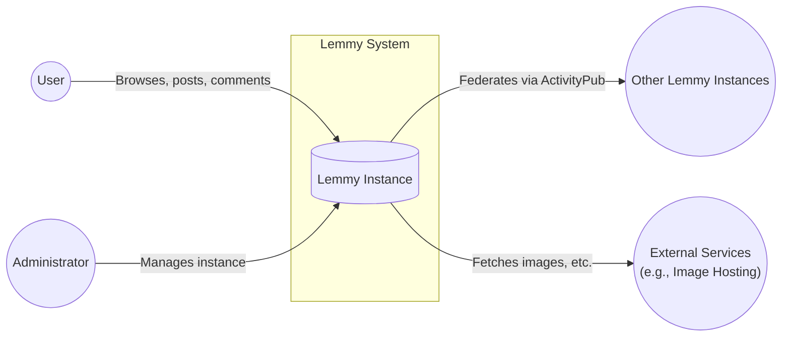
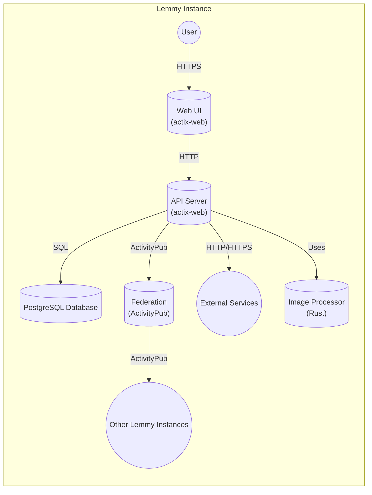
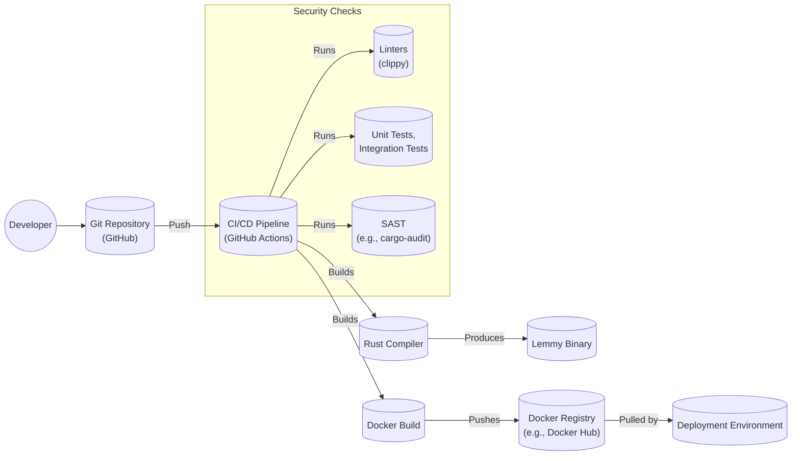

Okay, let's create a design document for the Lemmy project, focusing on aspects relevant for threat modeling.

# BUSINESS POSTURE

Lemmy is a federated link aggregator and forum platform, similar in concept to Reddit.  Its primary business goals and priorities appear to be:

*   Provide a decentralized and censorship-resistant alternative to centralized platforms like Reddit.
*   Foster a sense of community ownership and control.
*   Enable users to share, discuss, and discover content.
*   Grow a healthy and active user base.
*   Maintain a sustainable and scalable platform.

Based on these, the most important business risks are:

*   **Reputational Damage:**  Incidents like security breaches, data leaks, widespread spam/abuse, or extended downtime could severely damage Lemmy's reputation and deter users.
*   **Federation Instability:**  Issues with federation (e.g., instances defederating, inconsistent data, malicious instances) could undermine the core value proposition of decentralization.
*   **Legal and Regulatory Risks:**  Hosting user-generated content carries inherent legal risks, particularly related to copyright infringement, illegal content, and data privacy regulations (e.g., GDPR, CCPA).
*   **Scalability Challenges:**  Rapid growth could strain the platform's infrastructure and development resources, leading to performance issues and instability.
*   **Community Fragmentation:**  Lack of effective moderation tools or community guidelines could lead to toxic communities and user churn.
*   **Spam and Abuse:**  Open registration and federation make Lemmy a potential target for spam, malicious content, and coordinated attacks.
*   **Lack of Funding/Sustainability:** As an open-source project, long-term sustainability depends on community contributions and potentially donations.  Lack of resources could hinder development and maintenance.

# SECURITY POSTURE

Based on the provided GitHub repository, here's an assessment of Lemmy's security posture:

*   security control: Uses Rust, a memory-safe language, which mitigates many common vulnerabilities like buffer overflows. (Implemented in the codebase).
*   security control: Employs a web application framework (actix-web) that likely provides some built-in security features like CSRF protection (needs verification). (Implemented in the codebase).
*   security control: Uses a relational database (PostgreSQL) with parameterized queries, reducing the risk of SQL injection. (Implemented in the codebase).
*   security control: Implements user authentication and authorization mechanisms. (Implemented in the codebase).
*   security control: Supports HTTPS for secure communication. (Mentioned in documentation, likely enforced in production deployments).
*   security control: Federation uses ActivityPub, a standard protocol with some built-in security considerations. (Implemented in the codebase).
*   security control: Includes rate limiting to mitigate brute-force attacks and abuse. (Implemented in the codebase).
*   security control: Provides some level of input sanitization and validation. (Implemented in the codebase).
*   security control: Dockerized deployment simplifies setup and improves consistency, potentially reducing configuration errors. (Implemented in deployment configuration).
*   security control: Includes basic documentation on security considerations and reporting vulnerabilities. (Present in the repository).
*   accepted risk: Federation inherently introduces trust boundaries between instances.  A malicious instance could potentially inject harmful content or disrupt the network.
*   accepted risk: Moderation relies heavily on individual instance administrators and community moderators.  Inconsistent moderation policies could lead to issues.
*   accepted risk: The project is relatively young, and its security posture is likely still evolving.  There may be undiscovered vulnerabilities.
*   accepted risk: Reliance on third-party libraries and dependencies introduces potential supply chain risks.

Recommended Security Controls (High Priority):

*   Implement a robust Content Security Policy (CSP) to mitigate XSS vulnerabilities.
*   Conduct regular security audits and penetration testing.
*   Establish a clear vulnerability disclosure program.
*   Implement comprehensive logging and monitoring to detect and respond to security incidents.
*   Provide detailed security hardening guidelines for instance administrators.
*   Implement two-factor authentication (2FA) for user accounts.
*   Consider using a Web Application Firewall (WAF) to protect against common web attacks.
*   Implement robust image and file upload validation to prevent malicious file uploads.

Security Requirements:

*   Authentication:
    *   Strong password policies (length, complexity, reuse).
    *   Protection against brute-force attacks (account lockout, rate limiting).
    *   Secure password reset mechanisms.
    *   Support for 2FA.
    *   Secure session management (e.g., HTTP-only cookies, secure flags).

*   Authorization:
    *   Role-based access control (RBAC) for different user roles (e.g., user, moderator, admin).
    *   Fine-grained permissions for specific actions (e.g., creating posts, deleting comments, banning users).
    *   Ensure that users can only access and modify data they are authorized to.

*   Input Validation:
    *   Strict validation of all user-supplied input (posts, comments, usernames, etc.).
    *   Use of allow-lists rather than deny-lists where possible.
    *   Sanitization of input to prevent XSS and other injection attacks.
    *   Validation of data types, lengths, and formats.

*   Cryptography:
    *   Use of strong, industry-standard cryptographic algorithms (e.g., Argon2 for password hashing, TLS 1.3 for HTTPS).
    *   Secure storage of sensitive data (e.g., API keys, database credentials).
    *   Proper key management practices.
    *   Secure random number generation.

*   Federation Security:
    *   Verification of instance identities.
    *   Mechanisms to prevent impersonation of instances.
    *   Secure communication between instances (e.g., HTTPS).
    *   Mechanisms to detect and mitigate malicious instances.

# DESIGN

## C4 CONTEXT



Element Description:

*   Element:
    *   Name: User
    *   Type: Person
    *   Description: A person who interacts with a Lemmy instance to browse, post, comment, and interact with content.
    *   Responsibilities: Browsing content, creating posts and comments, voting, interacting with other users, managing their profile.
    *   Security controls: Authentication, authorization, rate limiting, input validation.

*   Element:
    *   Name: Lemmy Instance
    *   Type: Software System
    *   Description: A single instance of the Lemmy software, hosting communities and content.
    *   Responsibilities: Handling user requests, storing data, federating with other instances, enforcing community rules.
    *   Security controls: All listed in the Security Posture section.

*   Element:
    *   Name: Other Lemmy Instances
    *   Type: Software System
    *   Description: Other independently operated Lemmy instances that federate with this instance.
    *   Responsibilities: Hosting their own communities and content, exchanging data with other instances via ActivityPub.
    *   Security controls: Relies on the security of each individual instance; federation protocol security.

*   Element:
    *   Name: External Services
    *   Type: Software System
    *   Description: Third-party services used by Lemmy, such as image hosting providers.
    *   Responsibilities: Providing specific services (e.g., image storage, CDN).
    *   Security controls: Relies on the security of the external service; secure communication (HTTPS).

*   Element:
    *   Name: Administrator
    *   Type: Person
    *   Description: A person who manages and maintains a Lemmy instance.
    *   Responsibilities: Configuring the instance, managing users, moderating content, ensuring uptime.
    *   Security controls: Strong authentication, authorization, secure access to server infrastructure.

## C4 CONTAINER



Element Description:

*   Element:
    *   Name: Web UI
    *   Type: Web Application
    *   Description: The user interface that users interact with in their browsers.  Built using actix-web.
    *   Responsibilities: Rendering HTML, handling user interactions, communicating with the API server.
    *   Security controls: Input validation, output encoding, CSRF protection (if provided by actix-web), CSP.

*   Element:
    *   Name: API Server
    *   Type: Web Application
    *   Description: The backend API server that handles requests from the Web UI and other clients. Built using actix-web.
    *   Responsibilities: Handling API requests, authenticating users, authorizing actions, interacting with the database and other services.
    *   Security controls: Authentication, authorization, input validation, rate limiting, secure communication (HTTPS).

*   Element:
    *   Name: PostgreSQL Database
    *   Type: Database
    *   Description: The relational database that stores Lemmy's data (users, posts, comments, communities, etc.).
    *   Responsibilities: Storing and retrieving data, ensuring data integrity.
    *   Security controls: Access control, parameterized queries (SQL injection prevention), encryption at rest (if configured), regular backups.

*   Element:
    *   Name: Federation (ActivityPub)
    *   Type: Component
    *   Description: The component responsible for handling federation with other Lemmy instances using the ActivityPub protocol.
    *   Responsibilities: Sending and receiving messages with other instances, managing subscriptions, handling remote user interactions.
    *   Security controls: Secure communication (HTTPS), validation of incoming messages, instance verification (if implemented).

*   Element:
    *   Name: Other Lemmy Instances
    *   Type: Software System
    *   Description: Other independently operated Lemmy instances.
    *   Responsibilities: Same as in the Context diagram.
    *   Security controls: Same as in the Context diagram.

*   Element:
    *   Name: External Services
    *   Type: Software System
    *   Description: Third-party services used by Lemmy.
    *   Responsibilities: Same as in the Context diagram.
    *   Security controls: Same as in the Context diagram.

*   Element:
    *   Name: Image Processor
    *   Type: Component
    *   Description: Component responsible for processing and resizing images.
    *   Responsibilities: Handling image uploads, resizing images, generating thumbnails.
    *   Security controls: Input validation (image file type, size), secure file storage, protection against image processing vulnerabilities (e.g., ImageTragick).

## DEPLOYMENT

Lemmy can be deployed in several ways:

1.  **Manual Installation:**  Installing the necessary dependencies (Rust, PostgreSQL, etc.) and building the software from source.
2.  **Docker Compose:**  Using the provided `docker-compose.yml` file to deploy Lemmy and its dependencies in Docker containers.
3.  **Ansible:** Using the provided Ansible playbook for automated deployment.
4.  **Kubernetes:**  Deploying Lemmy to a Kubernetes cluster (requires creating Kubernetes manifests).

The **Docker Compose** method is likely the most common and straightforward for smaller instances, so we'll describe that in detail.

```mermaid
graph LR
    subgraph Deployment Environment (Docker Host)
        subgraph Docker Network
            lemmy_web[("lemmy-ui\n(Web UI)")]
            lemmy_server[("lemmy\n(API Server)")]
            lemmy_db[("postgres\n(Database)")]
            lemmy_pictrs[("pict-rs\n(Image Processor)")]
        end
        Internet(("Internet"))
        ReverseProxy[("Reverse Proxy\n(e.g., nginx, Caddy)")]

        Internet -- "HTTPS" --> ReverseProxy
        ReverseProxy -- "HTTP" --> lemmy_web
        lemmy_web -- "HTTP" --> lemmy_server
        lemmy_server -- "Database Connection" --> lemmy_db
        lemmy_server -- "HTTP" --> lemmy_pictrs
    end
```

Element Description:

*   Element:
    *   Name: Docker Host
    *   Type: Infrastructure
    *   Description: The server or virtual machine that runs Docker Engine and hosts the Lemmy containers.
    *   Responsibilities: Providing the runtime environment for the containers.
    *   Security controls: Operating system security hardening, firewall, secure access to the host.

*   Element:
    *   Name: Docker Network
    *   Type: Network
    *   Description: A private network created by Docker Compose for the Lemmy containers to communicate with each other.
    *   Responsibilities: Isolating the containers from the external network.
    *   Security controls: Network isolation, firewall rules (if configured on the host).

*   Element:
    *   Name: lemmy-ui (Web UI)
    *   Type: Container
    *   Description: The container running the Lemmy Web UI.
    *   Responsibilities: Serving the web interface to users.
    *   Security controls: Same as in the Container diagram.

*   Element:
    *   Name: lemmy (API Server)
    *   Type: Container
    *   Description: The container running the Lemmy API server.
    *   Responsibilities: Handling API requests, interacting with the database and other services.
    *   Security controls: Same as in the Container diagram.

*   Element:
    *   Name: postgres (Database)
    *   Type: Container
    *   Description: The container running the PostgreSQL database.
    *   Responsibilities: Storing and retrieving Lemmy's data.
    *   Security controls: Same as in the Container diagram; data volume persistence should be secured.

*   Element:
    *   Name: pict-rs (Image Processor)
    *   Type: Container
    *   Description: The container running the pict-rs image processing service.
    *   Responsibilities: Handling image uploads and processing.
    *   Security controls: Same as in the Container diagram.

*   Element:
    *   Name: Reverse Proxy (e.g., nginx, Caddy)
    *   Type: Server
    *   Description: A reverse proxy server that sits in front of the Lemmy Web UI container.
    *   Responsibilities: Handling HTTPS termination, forwarding requests to the Web UI, potentially caching static assets.
    *   Security controls: HTTPS configuration (TLS certificates), secure configuration, protection against common web attacks.

*   Element:
    *   Name: Internet
    *   Type: Network
    *   Description: The public internet.
    *   Responsibilities: N/A
    *   Security controls: N/A

## BUILD

Lemmy's build process involves several steps, from source code to deployable artifacts (primarily Docker images).



Build Process Description:

1.  **Development:** Developers write code and push changes to the Git repository (GitHub).
2.  **Continuous Integration (CI):**  GitHub Actions is used as the CI/CD pipeline.  When code is pushed, the pipeline is triggered.
3.  **Linting:**  Linters (like `clippy` for Rust) are run to check for code style and potential errors.
4.  **Testing:**  Unit tests and integration tests are executed to ensure code quality and functionality.
5.  **Static Application Security Testing (SAST):**  Tools like `cargo-audit` can be used to scan for known vulnerabilities in dependencies.
6.  **Compilation:** The Rust compiler builds the Lemmy binary.
7.  **Docker Build:**  A Docker image is built, incorporating the compiled binary and other necessary files.
8.  **Docker Push:** The Docker image is pushed to a Docker registry (e.g., Docker Hub).
9.  **Deployment:** The Docker image is pulled from the registry and deployed to the target environment (e.g., using Docker Compose).

Security Controls in Build Process:

*   security control: Use of a memory-safe language (Rust) reduces the risk of memory-related vulnerabilities.
*   security control: Automated CI/CD pipeline ensures consistent and repeatable builds.
*   security control: Linting helps enforce code style and identify potential errors.
*   security control: Automated testing (unit and integration tests) helps ensure code quality and functionality.
*   security control: SAST (e.g., `cargo-audit`) helps identify known vulnerabilities in dependencies.
*   security control: Docker images provide a consistent and isolated runtime environment.
*   security control: Use of a Docker registry allows for versioning and controlled deployment of images.

# RISK ASSESSMENT

*   Critical Business Processes:
    *   User registration and authentication.
    *   Content creation and moderation.
    *   Federation with other instances.
    *   Data storage and retrieval.
    *   Community management.

*   Data Sensitivity:
    *   **User Data:** Usernames, email addresses (potentially), IP addresses, passwords (hashed), profile information, private messages (if implemented).  Sensitivity: **High** (due to PII and potential for privacy violations).
    *   **Post and Comment Data:**  Text, links, images, votes. Sensitivity: **Medium** (depending on the content; potential for copyright infringement, illegal content, or sensitive personal information).
    *   **Community Data:**  Community names, descriptions, rules, moderator information. Sensitivity: **Low to Medium** (depending on the community).
    *   **Federation Data:**  Data exchanged with other instances, including user data, posts, comments, and community information. Sensitivity: **Medium to High** (depending on the data exchanged).
    *   **Logs:**  Server logs, access logs, error logs. Sensitivity: **Medium** (can contain sensitive information like IP addresses, user activity, and error details).

# QUESTIONS & ASSUMPTIONS

*   Questions:
    *   What is the specific threat model used (if any)?
    *   Are there any existing security incident response plans?
    *   What are the specific requirements for data retention and deletion?
    *   What are the plans for scaling the platform?
    *   What are the specific legal and regulatory requirements that apply to Lemmy (based on jurisdiction and target audience)?
    *   Are there any plans for implementing end-to-end encryption for private messages?
    *   What is the process for managing and rotating secrets (e.g., API keys, database credentials)?
    *   How are backups handled, and what is the recovery process?
    *   What level of support is provided for different authentication methods (e.g., OAuth, OpenID Connect)?

*   Assumptions:
    *   BUSINESS POSTURE: The primary goal is to provide a decentralized and censorship-resistant alternative to centralized platforms.  Growth and user adoption are important, but not at the expense of security or decentralization.
    *   SECURITY POSTURE: The development team is aware of basic security principles and has implemented some security controls.  However, the security posture is likely still evolving, and there is room for improvement.  The project relies heavily on community contributions and may have limited resources for dedicated security personnel.
    *   DESIGN: The provided Docker Compose deployment is the primary deployment method for most instances.  The system relies on the security of third-party libraries and services (e.g., actix-web, PostgreSQL, pict-rs).  Federation introduces inherent trust boundaries between instances.