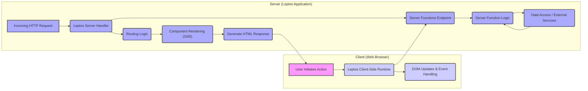

## Project Design Document: Leptos Web Framework (Improved)

**1. Introduction**

This document provides an enhanced architectural design overview of the Leptos web framework. Leptos is a full-stack, isomorphic Rust web framework that leverages fine-grained reactivity for building performant and interactive web applications. This document is specifically tailored to facilitate comprehensive threat modeling by clearly outlining the system's components, data flow, and potential security considerations.

**2. Goals and Objectives**

*   Deliver a refined and more detailed architectural description of the Leptos framework.
*   Clearly articulate the interactions and dependencies between key components.
*   Provide a more granular view of data flow, emphasizing potential security implications at each stage.
*   Strengthen the identification of potential security concerns and attack vectors for effective threat modeling.
*   Serve as an authoritative reference for development, security analysis, and ongoing maintenance.

**3. High-Level Architecture**

The Leptos framework operates within a client-server architecture, supporting both Server-Side Rendering (SSR) for initial page loads and Client-Side Rendering (CSR) for subsequent interactions.

**4. Detailed Architecture and Component Interactions**

The Leptos framework is composed of several interconnected components:

*   **Components:**
    *   **Functionality:**  Represent the fundamental building blocks of the UI, encapsulating structure, styling, and behavior. They manage their internal state and react to changes in data.
    *   **Interaction:** Components are composed of other components and interact through props (input data) and signals (reactive data). They trigger re-rendering of their sub-tree when their reactive dependencies change.
*   **Reactivity System (Signals and Derived Signals):**
    *   **Functionality:** Provides the core mechanism for managing and propagating state changes throughout the application. Signals hold reactive values, and derived signals compute values based on other signals.
    *   **Interaction:** Components subscribe to signals to automatically update when the signal's value changes. Server functions can also update signals, triggering UI updates.
*   **Router:**
    *   **Functionality:**  Handles navigation within the application by mapping URLs to specific components or views. It manages the browser's history and allows for programmatic navigation.
    *   **Interaction:**  The router intercepts browser navigation events and renders the appropriate component based on the current URL. It interacts with components by providing route parameters as props.
*   **Server Functions:**
    *   **Functionality:**  Enables client-side code to directly invoke Rust functions running on the server. This simplifies data fetching and server-side logic execution.
    *   **Interaction:**  Client-side code calls server functions, which are serialized and sent to the server via HTTP requests. The server executes the function and returns a serialized response.
*   **HTML Templating:**
    *   **Functionality:**  Provides macros and mechanisms for defining HTML structures within Rust code, allowing for dynamic content generation.
    *   **Interaction:** Components use the templating system to define their UI structure, incorporating reactive data and event handlers.
*   **Client-Side Runtime:**
    *   **Functionality:**  JavaScript (or WebAssembly) code executed in the browser responsible for DOM manipulation, event handling, and communication with the server (especially for server function calls).
    *   **Interaction:**  The runtime listens for browser events, updates the DOM based on component rendering, and handles the serialization and deserialization of data for server function calls.
*   **Server-Side Logic:**
    *   **Functionality:**  Rust code executed on the server to handle incoming HTTP requests, perform initial rendering (SSR), execute server functions, and interact with databases or external services.
    *   **Interaction:**  The server-side logic receives requests from the client, interacts with the router to determine the appropriate component, renders the component to HTML, and handles server function invocations.
*   **State Management:**
    *   **Functionality:**  Patterns and libraries for managing application-wide state, often built upon the reactivity system. This helps in sharing data and coordinating updates across different parts of the application.
    *   **Interaction:** Components access and update the global state through provided mechanisms (e.g., context, stores), triggering re-renders in dependent components.

**5. Data Flow (Detailed)**

The data flow within a Leptos application differs based on whether it's an initial server-rendered request or a subsequent client-side interaction.

**5.1. Server-Side Rendering (SSR) Data Flow:**

```mermaid
graph LR
    A["Browser Sends HTTP Request"] --> B("Leptos Server Handler Receives Request");
    B --> C("Router Matches Route");
    C --> D("Target Component Identified");
    D --> E("Component Renders on Server");
    E --> F("HTML is Generated");
    F --> G("HTTP Response with HTML Sent to Browser");
    style A fill:#f9f,stroke:#333,stroke-width:2px
    style B fill:#ccf,stroke:#333,stroke-width:2px
    style C fill:#ccf,stroke:#333,stroke-width:2px
    style D fill:#ccf,stroke:#333,stroke-width:2px
    style E fill:#ccf,stroke:#333,stroke-width:2px
    style F fill:#ccf,stroke:#333,stroke-width:2px
    style G fill:#ccf,stroke:#333,stroke-width:2px
```

*   The user's browser sends an HTTP request to the server.
*   The Leptos server handler receives the request.
*   The router analyzes the request URL and matches it to a defined route.
*   The component associated with the matched route is identified.
*   The component is rendered on the server, potentially fetching initial data.
*   HTML is generated based on the component's structure and data.
*   The server sends an HTTP response containing the generated HTML to the browser.

**5.2. Client-Side Rendering (CSR) and Interaction Data Flow:**

```mermaid
graph LR
    A["User Interacts with UI"] --> B("Browser Event Triggered");
    B --> C("Event Handler in Component");
    C --> D("Signal Value Updated");
    D --> E("Dependent Components Re-render");
    E --> F("Virtual DOM Diffing");
    F --> G("DOM Updated by Client-Side Runtime");
    G --> H("Optional: Server Function Call Initiated");
    H --> I("HTTP Request to Server Functions Endpoint");
    I --> J("Server Function Logic Executes");
    J --> K("Data Retrieved/Processed");
    K --> L("Response Sent Back to Client");
    L --> M("Client-Side State Updated");
    M --> E;
    style A fill:#f9f,stroke:#333,stroke-width:2px
    style B fill:#ccf,stroke:#333,stroke-width:2px
    style C fill:#ccf,stroke:#333,stroke-width:2px
    style D fill:#ccf,stroke:#333,stroke-width:2px
    style E fill:#ccf,stroke:#333,stroke-width:2px
    style F fill:#ccf,stroke:#333,stroke-width:2px
    style G fill:#ccf,stroke:#333,stroke-width:2px
    style H fill:#ccf,stroke:#333,stroke-width:2px
    style I fill:#ccf,stroke:#333,stroke-width:2px
    style J fill:#ccf,stroke:#333,stroke-width:2px
    style K fill:#ccf,stroke:#333,stroke-width:2px
    style L fill:#ccf,stroke:#333,stroke-width:2px
    style M fill:#ccf,stroke:#333,stroke-width:2px
```

*   The user interacts with the UI in the browser.
*   A corresponding browser event is triggered.
*   An event handler within a Leptos component is executed.
*   The event handler updates the value of a reactive signal.
*   Components that depend on this signal are marked for re-rendering.
*   The client-side runtime performs a virtual DOM diff to identify changes.
*   The actual DOM is updated efficiently by the client-side runtime.
*   Optionally, the event handler might initiate a call to a server function.
*   An HTTP request is sent to the designated server functions endpoint.
*   The corresponding server function logic is executed on the server.
*   Data is retrieved or processed on the server.
*   A response is sent back to the client.
*   The client-side state is updated based on the server response, potentially triggering further re-renders.

**6. Security Considerations and Potential Attack Vectors**

Each component presents potential security considerations:

*   **Components:**
    *   **Vulnerability:** Cross-Site Scripting (XSS) through rendering unsanitized user input or using `dangerously_set_inner_html` improperly.
    *   **Mitigation:**  Strict input sanitization and output encoding. Avoid `dangerously_set_inner_html` unless absolutely necessary and with extreme caution. Implement Content Security Policy (CSP).
*   **Reactivity System:**
    *   **Vulnerability:**  Logic errors leading to unintended data exposure or manipulation if access control is not properly implemented in component logic.
    *   **Mitigation:**  Careful design and testing of component logic to ensure data integrity and prevent unauthorized access.
*   **Router:**
    *   **Vulnerability:**  Route injection attacks if route parameters are not validated. Lack of authorization checks allowing access to sensitive routes.
    *   **Mitigation:**  Thorough validation of route parameters. Implement robust authentication and authorization middleware to protect routes.
*   **Server Functions:**
    *   **Vulnerability:**  Primary attack surface. Susceptible to injection attacks (SQL, command), insecure deserialization, business logic flaws, and unauthorized access.
    *   **Mitigation:**  Strict input validation and sanitization on the server-side. Implement authentication and authorization for all server functions. Use secure coding practices to prevent injection vulnerabilities. Consider rate limiting and request size limits to prevent abuse.
*   **HTML Templating:**
    *   **Vulnerability:**  XSS if dynamic data is not properly escaped before being inserted into HTML templates.
    *   **Mitigation:**  Utilize Leptos' built-in escaping mechanisms. Avoid manual string concatenation for HTML generation.
*   **Client-Side Runtime:**
    *   **Vulnerability:**  XSS if the runtime renders unsanitized data received from the server. Potential for manipulation through browser developer tools if sensitive logic is exposed.
    *   **Mitigation:**  Ensure all data received from the server is treated as potentially untrusted and sanitized before rendering. Avoid storing sensitive information directly in client-side code.
*   **Server-Side Logic:**
    *   **Vulnerability:**  Standard web server vulnerabilities including injection flaws, authentication and authorization bypasses, insecure data storage, and exposure of sensitive information.
    *   **Mitigation:**  Follow secure coding practices. Implement robust authentication and authorization. Securely configure the server environment. Regularly update dependencies to patch vulnerabilities.
*   **State Management:**
    *   **Vulnerability:**  Exposure of sensitive data if global state is not properly protected. Potential for unintended modifications if access control is not enforced.
    *   **Mitigation:**  Carefully consider the scope and lifetime of state variables. Implement access control mechanisms where necessary. Avoid storing highly sensitive information in client-side state if possible.

**7. Deployment Security Considerations**

Securing the deployment environment is crucial:

*   **HTTPS Enforcement:**  Mandatory use of HTTPS to encrypt all communication between the client and server, protecting against eavesdropping and man-in-the-middle attacks.
*   **Security Headers:**  Properly configure security headers like Content-Security-Policy (CSP), HTTP Strict Transport Security (HSTS), X-Frame-Options, and X-Content-Type-Options to mitigate various client-side attacks.
*   **Regular Updates:**  Maintain up-to-date versions of the Leptos framework, Rust toolchain, and all server dependencies to patch known security vulnerabilities.
*   **Firewall Configuration:**  Implement firewalls to restrict network access to the server, allowing only necessary ports and protocols.
*   **Intrusion Detection and Prevention Systems (IDPS):**  Consider deploying IDPS solutions to monitor for and prevent malicious activity targeting the application.
*   **Secure Secrets Management:**  Avoid storing sensitive credentials directly in code. Utilize secure secrets management solutions.
*   **Regular Security Audits and Penetration Testing:**  Conduct periodic security assessments to identify and address potential vulnerabilities.

**8. Authentication and Authorization**

*   **Authentication:**  The process of verifying the identity of a user. Leptos applications can integrate with various authentication mechanisms, such as:
    *   **Session-based authentication:** Using cookies to maintain user sessions.
    *   **Token-based authentication (e.g., JWT):**  Using tokens for stateless authentication.
    *   **OAuth 2.0:**  Delegating authentication to a third-party provider.
*   **Authorization:**  The process of determining what actions an authenticated user is permitted to perform. Implement authorization checks at various levels:
    *   **Route-level authorization:** Restricting access to specific routes based on user roles or permissions.
    *   **Component-level authorization:** Conditionally rendering UI elements or enabling functionality based on user permissions.
    *   **Server function authorization:**  Verifying user permissions before executing server-side logic.

**9. Threat Model Scope**

This design document focuses on the architectural components and data flow of the Leptos framework itself and applications built upon it. The scope for threat modeling based on this document includes:

*   **Client-side vulnerabilities:**  XSS, client-side logic flaws.
*   **Server-side vulnerabilities:**  Injection attacks, authentication/authorization issues, business logic flaws.
*   **Communication security:**  Protection of data in transit.
*   **Dependencies:**  Potential vulnerabilities in third-party libraries used by Leptos or the application.
*   **Deployment environment security:**  Configuration and security of the hosting infrastructure.

**10. Conclusion**

This improved design document provides a more detailed and security-focused overview of the Leptos web framework. By understanding the architecture, component interactions, and data flow, developers and security analysts can effectively identify potential threats and implement appropriate mitigation strategies. This document serves as a crucial foundation for building secure and robust web applications with Leptos.