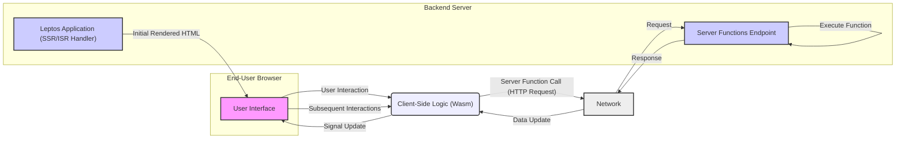
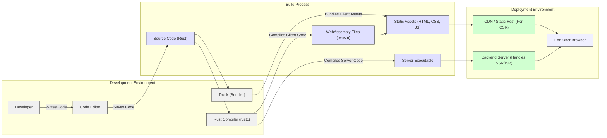

# Project Design Document: Leptos - A Full-Stack, Reactive Web Framework in Rust

**Version:** 1.1
**Date:** October 26, 2023
**Author:** AI Software Architect

## 1. Introduction

This document provides a detailed architectural overview of the Leptos project, a full-stack, reactive web framework written in Rust. This document is intended to serve as a foundation for subsequent threat modeling activities, providing a clear understanding of the system's components, interactions, and data flow. This version improves upon the initial document by providing more granular details and clarifying specific aspects of the architecture relevant to security considerations.

## 2. Project Overview

Leptos is a Rust-based web framework that empowers developers to build interactive web applications leveraging a reactive programming paradigm. It harnesses Rust's performance and safety guarantees while offering a developer-friendly experience for constructing both front-end and back-end functionalities. Key features of Leptos include:

*   **Full-Stack Development:** Facilitates building both client-side user interfaces and server-side logic within a unified framework.
*   **Reactive Programming Model:** Employs signals and derived signals for efficient state management and automatic UI updates in response to data changes.
*   **Server-Side Rendering (SSR):** Enables rendering of components on the server to enhance initial page load performance and improve Search Engine Optimization (SEO).
*   **Client-Side Rendering (CSR):** Allows for the creation of dynamic and highly interactive user experiences directly within the web browser.
*   **Incremental Static Regeneration (ISR):** Offers a hybrid approach by pre-rendering pages at build time and subsequently updating them in the background, balancing performance and data freshness.
*   **Seamless Rust Ecosystem Integration:** Leverages the extensive ecosystem of Rust crates for extending functionality and integrating with other libraries.
*   **WebAssembly (Wasm) Compilation:** Compiles client-side Rust code into WebAssembly, enabling near-native performance within the browser environment.

## 3. System Architecture

The Leptos architecture comprises several key components that work together to deliver full-stack web applications:

*   **Core Library (`leptos` crate):** The foundational library providing the core abstractions and functionalities for building Leptos applications. This includes:
    *   **Reactive Primitives:** Signals, memos, and resources for managing asynchronous data and application state.
    *   **Component Model:** A declarative approach to building UI elements using Rust functions.
    *   **Routing:** Mechanisms for defining and handling navigation within the application, both client-side and server-side.
    *   **Server Functions (`#[server]`):** Attributes and macros for defining functions that can be seamlessly called from the client-side.
    *   **DOM Manipulation Utilities:** Abstractions for interacting with the Document Object Model in a reactive manner.
    *   **Context API:** For sharing data and services across component hierarchies.
*   **Server Functions:**  Specifically designated Rust functions marked with the `#[server]` attribute. These functions execute on the server and are invoked by client-side code. The Leptos framework handles the complexities of serialization, network communication, and deserialization transparently.
*   **Client-Side Rendering (CSR) Environment:** When an application operates in CSR mode, the Rust code is compiled to WebAssembly and executed directly within the user's web browser. The Leptos framework manages the dynamic updating of the DOM in response to changes in reactive signals.
*   **Server-Side Rendering (SSR) Environment:** In SSR mode, upon receiving a request, the Leptos application running on the server renders the necessary components into static HTML. This pre-rendered HTML is then sent to the client's browser, leading to faster initial page loads. The client-side framework then "hydrates" this static HTML, attaching event listeners and making it interactive.
*   **Incremental Static Regeneration (ISR) Environment:** Similar to SSR, ISR begins with server-side rendering at build time. However, it allows for the periodic re-rendering of pages in the background based on predefined intervals or events, ensuring content remains relatively up-to-date without requiring a complete rebuild and redeployment for every change.
*   **End-User Browser:** The environment where the client-side portion of the Leptos application executes. This can be the initial HTML received from the server (in SSR/ISR) or the fully rendered application in CSR mode.
*   **Backend Server:** The server-side environment hosting the Leptos application. This environment is responsible for handling SSR, ISR, and the execution of server functions. This could be a variety of setups, including traditional web servers, application servers, or serverless function platforms.
*   **Build Process:**  A crucial step involving the compilation of Rust code for both the client (targeting WebAssembly) and the server. Tools like `trunk` are commonly employed to manage the build process for client-side assets, including bundling, optimization, and integration with the server build.

## 4. Data Flow

The flow of data within a Leptos application depends on the chosen rendering strategy and the nature of user interactions:

*   **Client-Side Rendering (CSR) Data Flow:**
    *   A user interacts with elements within the application's user interface in the browser.
    *   Event handlers attached to these elements trigger updates to reactive signals managed by Leptos.
    *   Changes in these signals automatically propagate, causing dependent components to re-render and update the Document Object Model (DOM).
    *   When a server function needs to be invoked:
        *   The client-side code initiates an asynchronous HTTP request to the designated endpoint on the backend server.
        *   This request includes the serialized arguments required by the server function.
        *   The backend server receives the request, deserializes the function arguments, and executes the targeted server function.
        *   The server function performs its logic and returns a result.
        *   The result is serialized and sent back to the client's browser in the HTTP response.
        *   The client-side code receives the response, deserializes the data, and updates relevant reactive signals.
        *   These signal updates trigger further UI re-renders, reflecting the data received from the server.
*   **Server-Side Rendering (SSR) Data Flow:**
    *   A user requests a specific page or resource from the server via their browser.
    *   The backend server receives the request and executes the Leptos application.
    *   During execution, Leptos renders the requested components into static HTML markup on the server.
    *   The server sends this pre-rendered HTML as the response to the client's browser.
    *   The browser receives and displays the initial HTML content, providing a faster perceived load time.
    *   In parallel, the browser downloads the client-side Leptos code (compiled to WebAssembly).
    *   Once downloaded, the client-side framework initializes and "hydrates" the existing DOM. This process involves attaching event listeners and establishing the reactive connections, making the static HTML interactive.
    *   Subsequent user interactions and data updates follow the CSR data flow described above.
*   **Incremental Static Regeneration (ISR) Data Flow:**
    *   The initial user request is handled similarly to SSR, serving a pre-rendered HTML page that was generated at build time.
    *   Concurrently, or based on a configured schedule or event, the server may re-render the page in the background.
    *   This background re-rendering fetches the latest data and generates a new version of the static HTML.
    *   Subsequent requests for the same page may then be served with this newly generated, more up-to-date content.
    *   Client-side interactions after the initial page load and hydration follow the standard CSR data flow.



## 5. Key Technologies

*   **Rust:** The core programming language for building both the framework and user applications, providing performance and safety.
*   **WebAssembly (Wasm):** The target compilation format for client-side Rust code, enabling efficient execution within web browsers.
*   **HTML:** The standard markup language for structuring the content and semantics of web pages.
*   **CSS:** The stylesheet language used for controlling the visual presentation and styling of web content.
*   **JavaScript (for Interoperability):** While primarily Rust-centric, Leptos allows for interoperability with existing JavaScript libraries and frameworks when necessary.
*   **HTTP:** The fundamental protocol for communication between the client's browser and the backend server.
*   **WebSockets (Optional):** Enables persistent, bidirectional communication channels for real-time features.
*   **Cargo:** Rust's built-in package manager and build system, used for managing dependencies and compiling the project.
*   **Trunk (Commonly Used):** A popular Wasm web application bundler that simplifies the process of building, bundling, and serving client-side assets for Leptos applications.

## 6. Deployment Model

Leptos offers flexibility in deployment strategies, adapting to different application needs and infrastructure:

*   **Server-Side Rendering (SSR) Deployment:** Requires a server environment capable of executing the compiled Rust application. Common deployment options include:
    *   **Traditional Web Servers:** Utilizing servers like Nginx or Apache as reverse proxies in front of a Rust application server (e.g., built with frameworks like `axum` or `warp`).
    *   **Cloud Compute Instances:** Deploying the application on virtual machines or container instances provided by cloud platforms such as AWS EC2, Google Compute Engine, or Azure Virtual Machines.
    *   **Serverless Functions (with Adaptations):** Deploying the application as serverless functions (e.g., AWS Lambda, Google Cloud Functions, Azure Functions). This often requires specific adapters or configurations to handle HTTP requests and responses appropriately.
*   **Client-Side Rendering (CSR) Deployment:** Simpler deployment as the compiled static assets (HTML, CSS, JavaScript/Wasm) can be served directly:
    *   **Content Delivery Networks (CDNs):** Hosting the static assets on a CDN for global distribution and improved performance.
    *   **Static Site Hosting:** Utilizing services like Netlify, Vercel, or GitHub Pages to host the static files. The backend API, if needed, would be deployed separately.
*   **Incremental Static Regeneration (ISR) Deployment:** Typically requires a server environment with specific capabilities to handle background re-rendering:
    *   **Platforms with Built-in ISR Support:** Some platforms like Vercel and Netlify offer integrated support for ISR.
    *   **Custom Implementations:** Implementing ISR logic within the application and deploying it on a server capable of running background tasks or scheduled jobs.

## 7. Security Considerations (Detailed)

This section expands on the initial security considerations, providing more specific potential vulnerabilities and mitigation strategies relevant to the Leptos architecture.

*   **Server Function Security:**
    *   **Input Validation Vulnerabilities:** Server functions are susceptible to vulnerabilities if they do not rigorously validate input data. This can lead to injection attacks (e.g., SQL injection if interacting with a database, command injection if executing system commands). **Mitigation:** Implement comprehensive input validation using libraries like `serde` for deserialization and custom validation logic. Employ parameterized queries or ORMs to prevent SQL injection. Avoid direct execution of system commands with user-provided input.
    *   **Authorization and Authentication Bypass:**  Improperly implemented or missing authorization checks in server functions can allow unauthorized access to sensitive data or functionality. **Mitigation:** Implement robust authentication mechanisms to verify user identity. Use authorization middleware or checks within server functions to ensure users have the necessary permissions to perform actions.
    *   **Cross-Site Scripting (XSS) via Server Functions:** If server functions return data that is directly rendered on the client without proper sanitization, they can introduce XSS vulnerabilities. **Mitigation:** Sanitize output data before sending it to the client. Utilize Leptos's built-in mechanisms for escaping HTML content when rendering. Consider using Content Security Policy (CSP) headers.
*   **Client-Side Security:**
    *   **Cross-Site Scripting (XSS):** While Rust's memory safety helps, vulnerabilities can still arise from improper handling of user-generated content or integration with JavaScript. **Mitigation:**  Be cautious when using `dangerously_set_inner_html`. Sanitize user-provided data before rendering it. Utilize Leptos's reactive primitives to manage DOM updates safely. Implement a strong Content Security Policy (CSP).
    *   **Cross-Site Request Forgery (CSRF):**  State-changing operations initiated from the client-side can be vulnerable to CSRF attacks. **Mitigation:** Implement anti-CSRF tokens that are included in requests and validated on the server. Utilize `SameSite` cookies where appropriate.
    *   **Dependency Vulnerabilities:**  The project's dependencies (Rust crates) may contain security vulnerabilities. **Mitigation:** Regularly audit and update dependencies using tools like `cargo audit`. Subscribe to security advisories for the crates being used.
*   **Communication Security:**
    *   **Man-in-the-Middle Attacks:** Communication between the client and server is vulnerable if not encrypted. **Mitigation:** Enforce the use of HTTPS for all communication. Ensure proper TLS configuration on the server.
*   **Build Process Security:**
    *   **Supply Chain Attacks:** Malicious code could be introduced during the build process through compromised dependencies or build tools. **Mitigation:** Use trusted build environments. Employ dependency pinning and verification mechanisms. Regularly audit the build process.
*   **State Management Security:**
    *   **Exposure of Sensitive Data in Client-Side State:** Sensitive information stored in client-side reactive signals could be exposed if not handled carefully. **Mitigation:** Avoid storing highly sensitive data directly in client-side state if possible. If necessary, encrypt sensitive data before storing it client-side and decrypt it only when needed.

## 8. Diagrams

### 8.1. Architectural Diagram



### 8.2. Data Flow Diagram (Server Function Call)

```mermaid
sequenceDiagram
    participant "User" as U
    participant "Browser" as B
    participant "Network" as N
    participant "Backend Server" as BS

    U->>B: Initiates Action
    B->>B: Executes Client-Side Logic
    B->>N: Sends HTTP Request (Server Function Call)
    N->>BS: Receives Request
    BS->>BS: Deserialize Arguments
    BS->>BS: Execute Server Function
    BS->>BS: Serialize Response
    BS->>N: Sends HTTP Response
    N->>B: Receives Response
    B->>B: Updates Client-Side State
    B->>U: Updates UI
    style U fill:#ffeeee,stroke:#333,stroke-width:1px
    style B fill:#eeffee,stroke:#333,stroke-width:1px
    style N fill:#eeeeff,stroke:#333,stroke-width:1px
    style BS fill:#ffeeff,stroke:#333,stroke-width:1px
```

## 9. Conclusion

This revised document provides a more detailed and nuanced understanding of the Leptos project's architecture and data flow, specifically highlighting areas relevant to security considerations. This enhanced information will be invaluable for conducting a comprehensive threat model, enabling the identification of potential vulnerabilities and the implementation of appropriate security measures. This document remains a living artifact and will be updated to reflect future developments and insights.