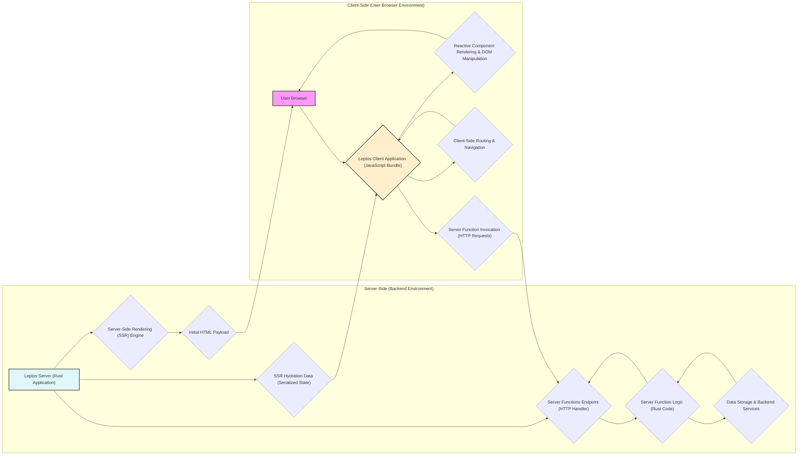

Certainly, let's improve the design document to be even more detailed and focused on threat modeling.

**Improved Project Design Document: Leptos Web Framework Application**

**1. Project Overview**

This document details the design of a web application built using the Leptos Rust web framework ([https://github.com/leptos-rs/leptos](https://github.com/leptos-rs/leptos)). Leptos is chosen for its performance, type safety, and full-stack capabilities, enabling the development of robust and efficient web applications. This document is specifically crafted to facilitate threat modeling, providing a comprehensive view of the application's architecture, components, data flow, and security considerations. The aim is to identify potential vulnerabilities and inform security mitigation strategies throughout the project lifecycle.

**2. Architectural Diagram**

The following diagram illustrates the architecture of a Leptos application, emphasizing the separation between client-side and server-side components and the interaction points relevant for security analysis.

**3. Component Description (Detailed)**

This section provides a detailed description of each component, highlighting their functionality and security implications.

*   **User Browser**: The entry point for user interaction. It executes the client-side application, renders the UI, and initiates requests. Security considerations related to the browser environment include:
    *   Exposure to client-side attacks like XSS if the application is vulnerable.
    *   User privacy and data handling within the browser (cookies, local storage).
    *   Browser security features and vulnerabilities.

*   **Leptos Client Application (JavaScript Bundle)**: The compiled JavaScript code executed in the browser. Key responsibilities and security aspects:
    *   **Reactive Component Rendering & DOM Manipulation**: Manages the UI, updates the DOM based on reactive state changes (Leptos Signals). Vulnerabilities here could lead to DOM-based XSS if component logic is flawed or if external data is not handled securely during rendering.
    *   **Client-Side Routing & Navigation**: Handles in-app navigation without full page reloads. Security considerations include ensuring route authorization is enforced if sensitive views are involved (though typically authorization is server-side).
    *   **Server Function Invocation (HTTP Requests)**: Initiates calls to server functions. Security concerns include:
        *   Properly encoding and escaping data sent to server functions to prevent injection vulnerabilities on the server-side.
        *   Handling responses from server functions securely and preventing client-side vulnerabilities based on server responses.
        *   Protecting API keys or sensitive client-side configurations if used for server function calls.
    *   **Dependency Management**: Relies on JavaScript dependencies (though Leptos minimizes this). Vulnerabilities in these dependencies can impact client-side security.

*   **Reactive Component Rendering & DOM Manipulation**: Leptos's core reactivity system. Components are functions that describe UI and react to changes in Signals (reactive state). Security considerations:
    *   **Cross-Site Scripting (XSS) Prevention**: Ensuring that dynamic content rendered by components is properly escaped and sanitized to prevent XSS attacks. This is crucial when displaying user-generated content or data from external sources.
    *   **State Management Security**:  Managing reactive state (Signals) securely to prevent unintended state manipulation or exposure of sensitive data in the client-side state.

*   **Client-Side Routing & Navigation**: Manages navigation within the client application. Security considerations:
    *   **Route Authorization (Client-Side - Limited)**: While primary authorization should be server-side, client-side routing might have basic checks for user roles or permissions to guide UI behavior. However, this should not be relied upon for security enforcement.

*   **Server Function Invocation (HTTP Requests)**: The mechanism for the client to interact with the server-side logic. Security considerations:
    *   **API Security**: Server function endpoints are effectively the application's API. They need to be secured against unauthorized access and abuse.
    *   **Request Forgery (CSRF)**:  Protecting against Cross-Site Request Forgery attacks when invoking server functions that perform state-changing operations.

*   **Leptos Server (Rust Application)**: The backend server application written in Rust. Key responsibilities and security aspects:
    *   **Server-Side Rendering (SSR) Engine**: Renders the initial HTML. Security considerations:
        *   **SSR Injection Vulnerabilities**: Preventing injection vulnerabilities during server-side rendering, especially if incorporating dynamic content into the rendered HTML.
        *   **Exposure of Sensitive Data**: Avoiding accidental exposure of sensitive data in the server-rendered HTML source code.
    *   **Server Functions Endpoint (HTTP Handler)**: Handles incoming requests for server functions. Security considerations:
        *   **Input Validation**: Thoroughly validating and sanitizing all input received by server functions to prevent injection attacks (SQL, command, code injection, etc.).
        *   **Authorization and Authentication**: Implementing robust authentication and authorization mechanisms to control access to server functions and ensure only authorized users can perform specific actions.
        *   **Rate Limiting and DoS Protection**: Protecting server function endpoints from abuse and denial-of-service attacks.
    *   **Data Storage & Backend Services**: Interacts with databases, external APIs, and other backend services. Security considerations:
        *   **Secure Data Access**: Ensuring secure and authorized access to data storage and backend services.
        *   **Data Integrity and Confidentiality**: Protecting the integrity and confidentiality of data stored and processed on the server-side.
        *   **Dependency Management (Rust Crates)**: Managing dependencies securely and addressing vulnerabilities in Rust crates used in the server application.
    *   **SSR Hydration Data (Serialized State)**:  Serializes necessary state for client-side hydration. Security considerations:
        *   **Data Integrity**: Ensuring the integrity of hydration data to prevent client-side state manipulation.
        *   **Preventing Injection**: Avoiding injection vulnerabilities when generating hydration data.

*   **Server-Side Rendering (SSR) Engine**: Responsible for pre-rendering components to HTML on the server. Security considerations are detailed above under "Leptos Server".

*   **Initial HTML Payload**: The HTML document sent to the browser as the initial response. Security considerations are detailed above under "Leptos Server".

*   **Server Functions Endpoint (HTTP Handler)**: The HTTP endpoint for server function calls. Security considerations are detailed above under "Leptos Server".

*   **Server Function Logic (Rust Code)**: The Rust functions implementing backend logic. Security considerations are detailed above under "Leptos Server".

*   **Data Storage & Backend Services**: Represents databases, file systems, external APIs, etc. Security considerations are detailed above under "Leptos Server".

*   **SSR Hydration Data (Serialized State)**: Data sent to the client for hydration. Security considerations are detailed above under "Leptos Server".

**4. Data Flow (Security Focused)**

This section describes data flow paths, emphasizing security considerations at each step.

*   **Client-Side to Server Function Data Flow (Potentially Sensitive Data)**:
    1. **Data Input in Browser**: User inputs data in the browser (e.g., form fields). *Security Consideration*: Client-side validation can improve user experience but is not a security control. Malicious input can bypass client-side validation.
    2. **Data Serialization**: Client-side JavaScript serializes data (e.g., to JSON) for sending to the server function. *Security Consideration*: Ensure sensitive data is not inadvertently logged or exposed during serialization.
    3. **HTTP Request to Server Function Endpoint**: The serialized data is sent in an HTTP request (typically POST) to the server function endpoint. *Security Consideration*: Use HTTPS to encrypt data in transit. Consider adding CSRF protection headers.
    4. **Server-Side Deserialization**: The Leptos server receives the request and deserializes the data. *Security Consideration*: Deserialization vulnerabilities can occur if the server is not robust against malicious or unexpected data formats.
    5. **Server Function Logic Execution**: The server function processes the deserialized data. *Security Consideration*: This is where input validation and sanitization are critical. Protect against injection attacks by validating all inputs before using them in database queries, system commands, or other operations. Implement proper authorization checks to ensure the user is allowed to perform the requested action.
    6. **Data Storage Interaction (Optional)**: Server function may interact with data storage. *Security Consideration*: Enforce access control to data storage. Use parameterized queries or ORMs to prevent SQL injection. Ensure data at rest is encrypted if necessary.
    7. **Response Serialization**: Server function prepares a response and serializes it. *Security Consideration*: Avoid including sensitive data in responses unless absolutely necessary and ensure it's appropriately protected on the client-side.
    8. **HTTP Response to Client**: The serialized response is sent back to the client. *Security Consideration*: Use HTTPS for response transmission.
    9. **Client-Side Deserialization and Processing**: Client-side JavaScript deserializes and processes the response. *Security Consideration*: Handle responses securely and prevent client-side vulnerabilities based on the response data.

*   **Server-Side Rendering (SSR) Data Flow (Initial Page Load)**:
    1. **Page Request from Browser**: User requests a page.
    2. **Server-Side Data Fetching (Optional)**: Server fetches data needed for rendering. *Security Consideration*: Securely access backend services and data storage.
    3. **Component Rendering on Server**: Leptos SSR engine renders components to HTML. *Security Consideration*: Prevent injection vulnerabilities during rendering. Sanitize data before embedding it in HTML to prevent XSS.
    4. **HTML and Hydration Data Generation**: Server generates the initial HTML and necessary hydration data. *Security Consideration*: Avoid exposing sensitive data in the HTML source or hydration data. Ensure integrity of hydration data.
    5. **HTTP Response with HTML and Hydration Data**: Server sends the HTML and hydration data to the browser. *Security Consideration*: Use HTTPS for transmission.

**5. External Interactions (Security Perspective)**

This section details external systems and services interacted with, focusing on security implications.

*   **Data Storage (Databases, File Systems, Cloud Storage)**: *Security Implications*:
    *   **Authentication and Authorization**: Securely authenticate and authorize access to data storage.
    *   **Data Encryption at Rest and in Transit**: Encrypt sensitive data both when stored and during transmission between the server and data storage.
    *   **Access Control Lists (ACLs) and Permissions**: Implement fine-grained access control to limit access to data based on roles and permissions.
    *   **Regular Security Audits**: Conduct regular security audits of data storage configurations and access patterns.

*   **Third-Party APIs**: *Security Implications*:
    *   **API Key Management**: Securely manage API keys and secrets. Avoid hardcoding them in the application. Use environment variables or secure secret management services.
    *   **HTTPS for API Communication**: Always use HTTPS to communicate with third-party APIs to protect data in transit.
    *   **Input and Output Validation**: Validate data sent to and received from third-party APIs to prevent injection attacks and data integrity issues.
    *   **Rate Limiting and Error Handling**: Implement rate limiting and robust error handling when interacting with third-party APIs to prevent abuse and handle failures gracefully.

*   **Browser APIs (LocalStorage, Cookies, etc.)**: *Security Implications*:
    *   **LocalStorage and SessionStorage Security**: Be cautious about storing sensitive data in `localStorage` or `sessionStorage` as they are vulnerable to XSS attacks. Consider encryption if storing sensitive data client-side.
    *   **Cookie Security**: Use `HttpOnly` and `Secure` flags for cookies to mitigate XSS and man-in-the-middle attacks. Consider `SameSite` attribute for CSRF protection.
    *   **Permissions and Privacy**: Respect user privacy and browser permissions when using APIs like Geolocation, Camera, Microphone, etc.

*   **Authentication and Authorization Services (e.g., OAuth 2.0 Providers, Identity Providers)**: *Security Implications*:
    *   **Secure Authentication Flows**: Implement secure authentication flows (e.g., OAuth 2.0, OpenID Connect).
    *   **Token Management**: Securely manage authentication tokens (access tokens, refresh tokens). Store them securely (e.g., `HttpOnly` cookies, secure storage).
    *   **Authorization Enforcement**: Enforce authorization checks at all relevant points in the application (especially in server functions) to ensure users only access resources they are permitted to.

*   **Logging and Monitoring Services**: *Security Implications*:
    *   **Secure Logging Configuration**: Configure logging securely to prevent sensitive data from being logged unintentionally.
    *   **Log Integrity and Access Control**: Ensure the integrity of logs and control access to log data to prevent tampering or unauthorized access.
    *   **Monitoring for Security Events**: Implement monitoring to detect and respond to security events and anomalies.

**6. Security Considerations (Threat Landscape)**

This section expands on security considerations, outlining potential threats and mitigation strategies.

*   **Client-Side Threats**:
    *   **Cross-Site Scripting (XSS)**: *Threat*: Injection of malicious scripts into the client-side application. *Mitigation*: Strict output encoding and sanitization of user-generated content and data from external sources. Content Security Policy (CSP) can further mitigate XSS.
    *   **DOM-Based XSS**: *Threat*: XSS vulnerabilities arising from client-side JavaScript manipulating the DOM in an unsafe manner. *Mitigation*: Secure coding practices in client-side components, careful handling of URL parameters and client-side data.
    *   **Client-Side Logic Vulnerabilities**: *Threat*: Bugs in client-side JavaScript logic leading to security flaws. *Mitigation*: Thorough testing and code reviews of client-side JavaScript code.
    *   **Dependency Vulnerabilities**: *Threat*: Vulnerabilities in third-party JavaScript libraries. *Mitigation*: Regularly update dependencies and use vulnerability scanning tools. Subresource Integrity (SRI) for external resources.

*   **Server-Side Threats**:
    *   **Injection Attacks (SQL, Command, Code Injection)**: *Threat*: Exploiting vulnerabilities in server-side code to inject malicious code. *Mitigation*: Parameterized queries or ORMs for database interactions. Input validation and sanitization for all user inputs. Principle of least privilege for server-side processes.
    *   **Authentication and Authorization Failures**: *Threat*: Weak or broken authentication and authorization mechanisms. *Mitigation*: Implement robust authentication and authorization using established frameworks and best practices. Use strong password policies and multi-factor authentication where appropriate.
    *   **Server-Side Request Forgery (SSRF)**: *Threat*: Exploiting server-side code to make unauthorized requests to internal or external resources. *Mitigation*: Validate and sanitize URLs used in server-side requests. Use allowlists for allowed destinations. Network segmentation to limit access from the server.
    *   **Deserialization Vulnerabilities**: *Threat*: Exploiting vulnerabilities in data deserialization processes. *Mitigation*: Avoid deserializing untrusted data. If necessary, use secure deserialization libraries and validate deserialized data.
    *   **Exposure of Sensitive Information**: *Threat*: Accidental exposure of sensitive data in server responses, logs, or error messages. *Mitigation*: Carefully review server responses and logs to ensure sensitive data is not exposed. Implement proper error handling and logging practices.
    *   **Dependency Vulnerabilities**: *Threat*: Vulnerabilities in Rust crates used in the server application. *Mitigation*: Regularly update dependencies and use vulnerability scanning tools for Rust crates.

*   **Data Security Threats**:
    *   **Data Breach (Data at Rest)**: *Threat*: Unauthorized access to stored data. *Mitigation*: Encrypt sensitive data at rest. Implement strong access control and monitoring for data access.
    *   **Data Interception (Data in Transit)**: *Threat*: Interception of data during transmission. *Mitigation*: Use HTTPS for all communication between client and server. Use TLS/SSL for communication with backend services.
    *   **Data Tampering**: *Threat*: Unauthorized modification of data. *Mitigation*: Implement data integrity checks (e.g., checksums, digital signatures). Use database transaction mechanisms to ensure data consistency.

*   **Session Management Threats**:
    *   **Session Hijacking**: *Threat*: An attacker steals a valid session ID to impersonate a user. *Mitigation*: Use secure session ID generation and storage (e.g., `HttpOnly`, `Secure` cookies). Implement session timeouts and invalidation.
    *   **Session Fixation**: *Threat*: An attacker forces a user to use a session ID controlled by the attacker. *Mitigation*: Regenerate session IDs after successful login.

*   **Denial of Service (DoS) Threats**:
    *   **Application-Level DoS**: *Threat*: Overloading the application with requests to exhaust resources. *Mitigation*: Implement rate limiting, request throttling, and input validation to prevent resource exhaustion.
    *   **Network-Level DoS**: *Threat*: Overwhelming the server with network traffic. *Mitigation*: Use network firewalls, intrusion detection/prevention systems, and cloud-based DoS protection services.

**7. Assumptions and Trust Boundaries**

This section explicitly states assumptions made in this design document and defines trust boundaries for threat modeling.

*   **Assumptions**:
    *   The underlying Rust runtime and Leptos framework are assumed to be reasonably secure. We will focus on vulnerabilities arising from application logic and configuration built using Leptos.
    *   Deployment environment security is assumed to be managed separately (e.g., secure OS configuration, network security). This document focuses on application-level security.
    *   User browsers are assumed to be generally up-to-date with security patches, but we must still mitigate client-side vulnerabilities that can be exploited even in modern browsers.
    *   External services and APIs are assumed to have their own security measures in place, but we must still secure our interactions with them.

*   **Trust Boundaries**:
    *   **Browser vs. Server**: Clear trust boundary between the user's browser (untrusted environment) and the Leptos server (trusted environment). Data crossing this boundary must be carefully validated and secured.
    *   **Application Code vs. External Data**: Trust boundary between the application's code and external data sources (user input, data from APIs, databases). External data is considered untrusted and must be validated and sanitized before use.
    *   **Server Application vs. Data Storage/Backend Services**: Trust boundary between the Leptos server application and backend services. Authentication and authorization are required for interactions across this boundary.

This improved design document provides a more detailed and security-focused foundation for threat modeling a Leptos web application. It highlights potential vulnerabilities, data flow paths, and security considerations across different components and interaction points, making it more actionable for security analysis and mitigation planning.