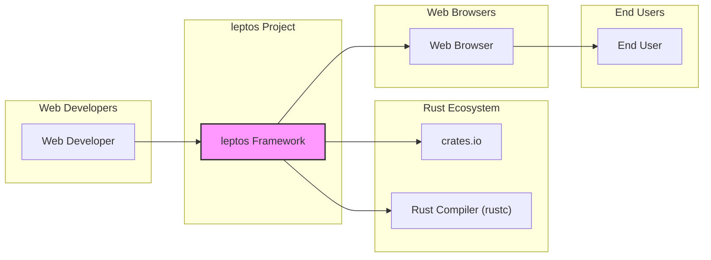

# BUSINESS POSTURE

The leptos project is a full-stack, reactive web framework for Rust, aiming to enable developers to build user interfaces in Rust that run in the browser via WebAssembly and optionally on the server.

Business priorities and goals:
- Provide a robust and performant web framework for Rust developers.
- Foster a thriving community around the leptos framework.
- Enable developers to build modern web applications efficiently and effectively using Rust.
- Promote the adoption of Rust in web development.

Most important business risks:
- Security vulnerabilities in the framework could lead to widespread security issues in applications built with leptos, damaging the framework's reputation and hindering adoption.
- Lack of community support and maintenance could lead to stagnation and decreased usability over time.
- Performance issues or limitations compared to other web frameworks could limit its appeal and adoption.
- Incompatibility with evolving web standards and browser technologies could make the framework obsolete.

# SECURITY POSTURE

Existing security controls:
- security control: Open source project with public code repository on GitHub, allowing for community review and contributions. (Implemented: GitHub repository)
- security control: Standard Rust security practices, leveraging Rust's memory safety features to reduce certain classes of vulnerabilities. (Implemented: inherent to Rust language)
- security control: Dependency management using `cargo` and `crates.io`, which has some level of vulnerability scanning and community review. (Implemented: Rust ecosystem)

Accepted risks:
- accepted risk: Reliance on community contributions for security vulnerability discovery and patching.
- accepted risk: Potential for vulnerabilities in dependencies used by leptos.
- accepted risk: Security of applications built with leptos is ultimately the responsibility of the application developers.

Recommended security controls:
- security control: Implement automated security scanning (SAST, dependency scanning) in the CI/CD pipeline for the leptos repository.
- security control: Establish a clear process for reporting and handling security vulnerabilities, including a security policy and contact information.
- security control: Conduct regular security audits or penetration testing of the leptos framework.
- security control: Provide security guidelines and best practices for developers building applications with leptos in the documentation.

Security requirements:
- Authentication: Not directly applicable to the framework itself, but leptos should facilitate secure authentication mechanisms in applications built with it.
- Authorization: Not directly applicable to the framework itself, but leptos should facilitate secure authorization mechanisms in applications built with it.
- Input validation: Leptos should encourage and facilitate secure input validation practices in applications built with it to prevent vulnerabilities like Cross-Site Scripting (XSS) and injection attacks. The framework itself should be resilient to malicious inputs in its core components.
- Cryptography: Not directly a core requirement for the framework itself, but leptos should not hinder the use of cryptography in applications built with it and may provide utilities or guidance for common cryptographic tasks if relevant.

# DESIGN

## C4 CONTEXT



Context Diagram Elements:

- Element:
    - Name: Web Developer
    - Type: Person
    - Description: Developers who use the leptos framework to build web applications.
    - Responsibilities: Develop web applications using leptos, consume leptos library, report issues and contribute to the framework.
    - Security controls: Secure development practices, secure coding guidelines, vulnerability scanning of their own applications.

- Element:
    - Name: leptos Framework
    - Type: Software System
    - Description: The leptos reactive web framework written in Rust.
    - Responsibilities: Provide components and utilities for building reactive web user interfaces, compile Rust code to WebAssembly, manage application state and rendering.
    - Security controls: Input validation within framework components, secure coding practices in framework development, dependency vulnerability scanning, security audits.

- Element:
    - Name: crates.io
    - Type: Software System
    - Description: The package registry for Rust crates, where leptos and its dependencies are published and downloaded from.
    - Responsibilities: Host and distribute Rust crates, provide dependency resolution, ensure crate integrity.
    - Security controls: Crate verification, malware scanning, access control for publishing crates.

- Element:
    - Name: Rust Compiler (rustc)
    - Type: Software System
    - Description: The Rust compiler used to compile leptos and applications built with it.
    - Responsibilities: Compile Rust code into machine code or WebAssembly, enforce Rust's safety guarantees.
    - Security controls: Compiler hardening, vulnerability management in the compiler itself.

- Element:
    - Name: Web Browser
    - Type: Software System
    - Description: Web browsers used by end users to access applications built with leptos.
    - Responsibilities: Execute WebAssembly code, render web pages, enforce browser security policies (CSP, CORS, etc.).
    - Security controls: Browser security features (sandboxing, Content Security Policy, etc.), regular browser updates.

- Element:
    - Name: End User
    - Type: Person
    - Description: Users who interact with web applications built using leptos in their web browsers.
    - Responsibilities: Use web applications.
    - Security controls: User awareness of phishing and other web-based attacks, browser security settings.

## C4 CONTAINER

```mermaid
flowchart LR
    subgraph "Web Developers"
        WD[Web Developer]
    end
    subgraph "End Users"
        EU[End User]
    end
    subgraph "leptos Project"
        subgraph "leptos Core"
            LC[leptos Core Crate]
        end
        subgraph "leptos Examples"
            LE[leptos Examples Crates]
        end
        subgraph "leptos Documentation"
            LD[leptos Documentation Site]
        end
    end
    subgraph "Rust Ecosystem"
        CRATESIO[crates.io]
        RUSTC["Rust Compiler (rustc)"]
    end
    subgraph "Web Browsers"
        WB[Web Browser]
    end
    WD --> LC
    WD --> LE
    WD --> LD
    LC --> CRATESIO
    LC --> RUSTC
    LE --> LC
    LE --> RUSTC
    LD --> LC
    LD --> RUSTC
    LC --> WB
    LE --> WB
    WB --> EU
    style "leptos Core" fill:#ccf,stroke:#333,stroke-width:1px
    style "leptos Examples" fill:#ccf,stroke:#333,stroke-width:1px
    style "leptos Documentation" fill:#ccf,stroke:#333,stroke-width:1px
```

Container Diagram Elements:

- Element:
    - Name: leptos Core Crate
    - Type: Container - Rust Library
    - Description: The core leptos crate providing the reactive web framework functionality.
    - Responsibilities: Reactive primitives, component model, rendering logic, WebAssembly compilation support.
    - Security controls: Input validation within core components, secure coding practices, automated security scanning, dependency vulnerability management.

- Element:
    - Name: leptos Examples Crates
    - Type: Container - Rust Applications
    - Description: Example applications and demos built using leptos, showcasing framework features.
    - Responsibilities: Demonstrate framework usage, provide learning resources for developers.
    - Security controls: Secure coding practices in example applications, input validation in examples, regular updates to examples to reflect best practices.

- Element:
    - Name: leptos Documentation Site
    - Type: Container - Static Website
    - Description: Documentation website for the leptos framework, providing guides, API references, and tutorials.
    - Responsibilities: Provide comprehensive documentation for developers, host API documentation, tutorials, and examples.
    - Security controls: Protection against website defacement, secure hosting of documentation, input sanitization in documentation generation if user-generated content is involved.

- Element:
    - Name: crates.io
    - Type: Container - Package Registry
    - Description: The package registry for Rust crates.
    - Responsibilities: Host and distribute Rust crates, dependency resolution.
    - Security controls: Crate verification, malware scanning, access control.

- Element:
    - Name: Rust Compiler (rustc)
    - Type: Container - Compiler
    - Description: The Rust compiler.
    - Responsibilities: Compile Rust code.
    - Security controls: Compiler hardening, vulnerability management.

- Element:
    - Name: Web Browser
    - Type: Container - Web Browser
    - Description: User's web browser.
    - Responsibilities: Execute WebAssembly, render web pages.
    - Security controls: Browser security features.

- Element:
    - Name: Web Developer
    - Type: Person
    - Description: Developers using leptos.
    - Responsibilities: Develop applications.
    - Security controls: Secure development practices.

- Element:
    - Name: End User
    - Type: Person
    - Description: Users of leptos applications.
    - Responsibilities: Use applications.
    - Security controls: User awareness.

## DEPLOYMENT

Deployment of leptos itself is primarily about publishing the crates to `crates.io`. However, for applications built with leptos, a common deployment scenario is static site hosting or server-side rendering. Let's consider static site hosting for simplicity.

```mermaid
flowchart LR
    subgraph "Developer Machine"
        DM[Developer Machine]
    end
    subgraph "CI/CD Pipeline"
        GH_ACTIONS["GitHub Actions"]
    end
    subgraph "Static Site Hosting (e.g., Netlify, Vercel, AWS S3)"
        SSH[Static Site Hosting]
    end
    DM --> GH_ACTIONS
    GH_ACTIONS --> SSH
    SSH --> WB[Web Browser]
    style "Static Site Hosting (e.g., Netlify, Vercel, AWS S3)" fill:#efe,stroke:#333,stroke-width:1px
```

Deployment Diagram Elements (Static Site Hosting):

- Element:
    - Name: Developer Machine
    - Type: Infrastructure - Developer Workstation
    - Description: Developer's local machine where they develop leptos applications.
    - Responsibilities: Code development, local testing, committing code changes.
    - Security controls: Endpoint security software, secure coding practices, access control to development environment.

- Element:
    - Name: GitHub Actions
    - Type: Infrastructure - CI/CD Pipeline
    - Description: GitHub Actions workflow used for building and deploying leptos applications.
    - Responsibilities: Automated build process, running tests, deploying application artifacts to static site hosting.
    - Security controls: Secure pipeline configuration, secret management for deployment credentials, vulnerability scanning of build environment, access control to GitHub repository and actions.

- Element:
    - Name: Static Site Hosting (e.g., Netlify, Vercel, AWS S3)
    - Type: Infrastructure - Cloud Service
    - Description: Static site hosting service used to host the built leptos application.
    - Responsibilities: Serve static files, handle web requests, provide CDN for content delivery.
    - Security controls: DDoS protection, web application firewall (WAF), access control to hosting platform, secure configuration of hosting service, HTTPS enforcement.

- Element:
    - Name: Web Browser
    - Type: Infrastructure - End User Browser
    - Description: End user's web browser accessing the deployed leptos application.
    - Responsibilities: Render web application, execute JavaScript/WebAssembly.
    - Security controls: Browser security features, user security awareness.

## BUILD

```mermaid
flowchart LR
    subgraph "Developer"
        DEV[Developer]
    end
    subgraph "GitHub Repository"
        GH_REPO[GitHub Repository]
    end
    subgraph "GitHub Actions CI"
        GH_ACTIONS[GitHub Actions]
        RUSTC["Rust Compiler"]
        CARGO[Cargo Build Tool]
        WASM_OPT["Wasm-opt"]
        SAST["SAST Scanner"]
        DEP_SCAN["Dependency Scanner"]
    end
    subgraph "crates.io"
        CRATESIO[crates.io]
    end
    DEV --> GH_REPO
    GH_REPO --> GH_ACTIONS
    GH_ACTIONS --> RUSTC
    GH_ACTIONS --> CARGO
    GH_ACTIONS --> WASM_OPT
    GH_ACTIONS --> SAST
    GH_ACTIONS --> DEP_SCAN
    GH_ACTIONS --> CRATESIO
    style "GitHub Actions CI" fill:#eee,stroke:#333,stroke-width:1px
```

Build Process Diagram Elements:

- Element:
    - Name: Developer
    - Type: Person
    - Description: Software developer working on leptos.
    - Responsibilities: Writes code, commits changes to the GitHub repository.
    - Security controls: Secure coding practices, code review, access control to development environment.

- Element:
    - Name: GitHub Repository
    - Type: Software System - Version Control
    - Description: GitHub repository hosting the leptos source code.
    - Responsibilities: Version control, code storage, collaboration platform.
    - Security controls: Access control, branch protection, audit logging.

- Element:
    - Name: GitHub Actions
    - Type: Software System - CI/CD
    - Description: GitHub Actions workflow for automated build and testing.
    - Responsibilities: Automate build process, run tests, perform security checks, publish artifacts.
    - Security controls: Secure workflow configuration, secret management, isolated build environment, access control to actions and secrets.

- Element:
    - Name: Rust Compiler (rustc)
    - Type: Tool - Compiler
    - Description: Rust compiler used to compile the code.
    - Responsibilities: Compile Rust code to machine code or WebAssembly.
    - Security controls: Compiler hardening, using a trusted compiler version.

- Element:
    - Name: Cargo Build Tool
    - Type: Tool - Build Tool
    - Description: Rust's package manager and build tool.
    - Responsibilities: Dependency management, build orchestration.
    - Security controls: Dependency vulnerability scanning, using trusted build tool version.

- Element:
    - Name: wasm-opt
    - Type: Tool - WASM Optimizer
    - Description: WebAssembly binary optimizer.
    - Responsibilities: Optimize WebAssembly code for size and performance.
    - Security controls: Using a trusted version of wasm-opt.

- Element:
    - Name: SAST Scanner
    - Type: Tool - Security Scanner
    - Description: Static Application Security Testing scanner to identify potential vulnerabilities in the code.
    - Responsibilities: Automated code analysis for security vulnerabilities.
    - Security controls: Regularly updated scanner rules, integration into CI pipeline, review and remediation of findings.

- Element:
    - Name: Dependency Scanner
    - Type: Tool - Security Scanner
    - Description: Dependency vulnerability scanner to identify known vulnerabilities in project dependencies.
    - Responsibilities: Scan dependencies for known vulnerabilities.
    - Security controls: Regularly updated vulnerability database, integration into CI pipeline, dependency update process.

- Element:
    - Name: crates.io
    - Type: Software System - Package Registry
    - Description: Rust package registry where leptos crates are published.
    - Responsibilities: Host and distribute leptos crates.
    - Security controls: Access control for publishing, crate verification.

# RISK ASSESSMENT

Critical business process: Enabling developers to build secure and performant web applications using Rust. Maintaining the reputation and trustworthiness of the leptos framework.

Data we are trying to protect:
- leptos framework source code: Sensitivity - High. Integrity and confidentiality are important to prevent unauthorized modifications and maintain trust.
- leptos documentation: Sensitivity - Medium. Integrity is important to ensure accurate and safe guidance for developers.
- Build artifacts (crates): Sensitivity - Medium. Integrity is crucial to prevent supply chain attacks.

Data sensitivity levels:
- High: Source code of the framework.
- Medium: Documentation, build artifacts, public website content.
- Low: Publicly available information, issue tracker data.

# QUESTIONS & ASSUMPTIONS

Questions:
- What is the intended target audience for leptos (e.g., hobbyists, startups, enterprise)? This would help tailor security recommendations to the risk appetite of the users.
- Are there any specific compliance requirements that applications built with leptos might need to adhere to (e.g., GDPR, HIPAA)?
- Is there a dedicated security team or individual responsible for security aspects of the leptos project?
- What is the process for handling security vulnerability reports currently?

Assumptions:
- BUSINESS POSTURE: The primary goal is to create a widely adopted and trusted web framework. Security is a key factor for achieving this goal.
- SECURITY POSTURE: Currently, security relies heavily on open-source community review and standard Rust security practices. There is room for improvement in proactive security measures like automated scanning and formalized vulnerability handling.
- DESIGN: The project is structured as a set of Rust crates, with a core crate providing the main framework functionality. Deployment is primarily focused on applications built with leptos, with static site hosting being a common scenario. The build process is automated using GitHub Actions.