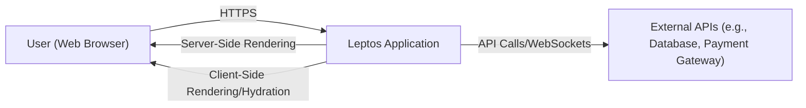
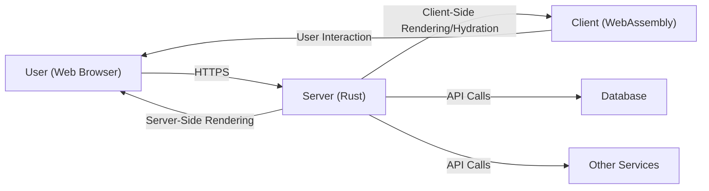

# BUSINESS POSTURE

Leptos is a full-stack, web framework for building web applications in Rust. Based on the provided repository, here's an assessment of the business posture:

Priorities and Goals:

- Enable developers to build fast, reliable, and complex web applications using Rust.
- Provide a modern, reactive framework that leverages Rust's strengths (performance, memory safety).
- Offer a compelling alternative to JavaScript-based frameworks.
- Foster a strong community around the project.
- Provide good documentation and examples to lower the barrier to entry.
- Support both server-side rendering (SSR) and client-side rendering (CSR).
- Provide a good developer experience (DX).

Business Risks:

- Adoption Risk: The success of Leptos depends on attracting developers. Failure to gain traction would limit its impact and sustainability.
- Competition Risk: The web framework landscape is crowded. Leptos competes with established JavaScript frameworks (React, Vue, Angular) and other Rust frameworks.
- Security Risk: As a web framework, vulnerabilities in Leptos could be exploited in applications built with it, leading to data breaches or other security incidents. This is a critical risk.
- Maintenance Risk: The project's long-term viability depends on continued maintenance and development. Abandonment or insufficient maintenance could lead to security issues and compatibility problems.
- Complexity Risk: Rust has a steeper learning curve than many other languages. This could limit the pool of potential contributors and users.
- Ecosystem Maturity Risk: While the Rust ecosystem is growing rapidly, it's still less mature than JavaScript's. This could limit the availability of third-party libraries and tools.

# SECURITY POSTURE

Existing Security Controls:

- security control: Use of Rust: Rust's memory safety features (ownership, borrowing) prevent many common security vulnerabilities like buffer overflows and dangling pointers. (Implemented throughout the codebase)
- security control: Regular updates and dependency management: The project appears to actively manage dependencies, reducing the risk of using vulnerable libraries. (Visible in Cargo.toml and Cargo.lock files)
- security control: Code reviews: Contributions are likely reviewed before being merged, providing a layer of scrutiny. (Inferred from the GitHub workflow)
- security control: Testing: The presence of tests suggests an effort to ensure code correctness and prevent regressions. (Visible in the /tests directory and CI configuration)

Accepted Risks:

- accepted risk: Third-party library vulnerabilities: While dependencies are managed, there's always a risk that a third-party library could contain a vulnerability.
- accepted risk: Potential for undiscovered vulnerabilities in Leptos itself: Despite Rust's safety features, complex software can still contain bugs that could lead to security issues.
- accepted risk: Reliance on the broader Rust and WASM ecosystem: Security issues in the underlying Rust compiler, standard library, or WebAssembly runtime could impact Leptos.

Recommended Security Controls:

- security control: Implement a Content Security Policy (CSP): Provide guidance and examples for implementing a strong CSP to mitigate XSS attacks.
- security control: Implement robust input validation and sanitization: While Rust helps prevent memory safety issues, input validation is still crucial to prevent logic flaws and injection attacks.
- security control: Implement CSRF protection: Provide built-in mechanisms or clear guidance for protecting against Cross-Site Request Forgery attacks.
- security control: Security Audits: Conduct regular security audits, both internal and external, to identify potential vulnerabilities.
- security control: Fuzzing: Integrate fuzzing into the CI/CD pipeline to automatically test for unexpected inputs and edge cases.
- security control: Dependency Scanning: Automate dependency scanning to identify known vulnerabilities in third-party libraries. Integrate this into the CI/CD pipeline.
- security control: Supply Chain Security: Implement measures to secure the software supply chain, such as signing releases and verifying dependencies.

Security Requirements:

- Authentication:
    - The framework should provide utilities or guidance for implementing secure authentication mechanisms (e.g., session management, JWT, OAuth 2.0).
    - Support for secure password storage (e.g., using bcrypt, Argon2).
    - Protection against brute-force attacks (e.g., rate limiting, account lockout).

- Authorization:
    - The framework should provide mechanisms for implementing role-based access control (RBAC) or other authorization models.
    - Granular control over access to resources and functionality.

- Input Validation:
    - All user-provided input must be validated and sanitized to prevent injection attacks (XSS, SQL injection, etc.).
    - Validation should be performed on both the client-side (for user experience) and the server-side (for security).
    - Provide clear guidelines and utilities for developers to implement input validation effectively.

- Cryptography:
    - The framework should provide secure defaults for cryptographic operations.
    - Use of well-vetted cryptographic libraries.
    - Guidance on secure key management.
    - Support for HTTPS (TLS) by default.

# DESIGN

## C4 CONTEXT

Element Description:

- User (Web Browser):
    - Name: User (Web Browser)
    - Type: Person
    - Description: Represents a user interacting with the Leptos application through a web browser.
    - Responsibilities: Initiates requests, renders the user interface, executes client-side logic.
    - Security controls: Browser's built-in security mechanisms (same-origin policy, etc.), HTTPS.

- Leptos Application:
    - Name: Leptos Application
    - Type: Software System
    - Description: The web application built using the Leptos framework.
    - Responsibilities: Handles user requests, renders the UI, interacts with external APIs, manages application state.
    - Security controls: Rust's memory safety, input validation, output encoding, authentication, authorization, CSRF protection, CSP.

- External APIs:
    - Name: External APIs
    - Type: Software System
    - Description: External services that the Leptos application interacts with (e.g., databases, payment gateways, third-party APIs).
    - Responsibilities: Provide specific services to the Leptos application.
    - Security controls: API authentication, authorization, encryption in transit (HTTPS), input validation.

## C4 CONTAINER

Element Description:

- User (Web Browser):
    - Name: User (Web Browser)
    - Type: Person
    - Description: Represents a user interacting with the Leptos application.
    - Responsibilities: Sends requests, renders UI, executes client-side logic.
    - Security controls: Browser's built-in security features, HTTPS.

- Server (Rust):
    - Name: Server (Rust)
    - Type: Container: Rust Web Server
    - Description: The server-side component of the Leptos application, running on a Rust web server (e.g., Actix, Axum).
    - Responsibilities: Handles requests, server-side rendering, interacts with databases and other services.
    - Security controls: Rust's memory safety, input validation, authentication, authorization, secure session management.

- Client (WebAssembly):
    - Name: Client (WebAssembly)
    - Type: Container: WebAssembly
    - Description: The client-side component of the Leptos application, running in the user's browser as WebAssembly.
    - Responsibilities: Handles user interaction, client-side rendering, updates the UI.
    - Security controls: Browser's security sandbox, output encoding, client-side validation (for UX, not security).

- Database:
    - Name: Database
    - Type: Container: Database
    - Description: The database used by the Leptos application.
    - Responsibilities: Stores and retrieves data.
    - Security controls: Database authentication, authorization, encryption at rest, input validation (SQL injection prevention).

- Other Services:
    - Name: Other Services
    - Type: Container: Various
    - Description: Other external services the application might use (e.g., payment gateways, email services).
    - Responsibilities: Provide specific functionalities.
    - Security controls: API authentication, authorization, encryption in transit.

## DEPLOYMENT

Possible deployment solutions:

1.  Traditional Server: Deploy the Leptos application to a virtual machine or bare-metal server running a supported operating system.
2.  Containerized Deployment: Package the application and its dependencies into a Docker container and deploy it to a container orchestration platform like Kubernetes or Docker Swarm.
3.  Serverless Deployment: Deploy the application as serverless functions (e.g., using AWS Lambda, Azure Functions, or Google Cloud Functions). This would require adapting the application to a serverless architecture.
4.  Static Site Hosting: If the application is purely client-side rendered, it can be deployed to static site hosting services like Netlify, Vercel, or GitHub Pages.

Chosen Solution (Containerized Deployment with Kubernetes):

```mermaid
graph LR
    Developer["Developer"] -- "Code Commit" --> GitRepo["Git Repository (e.g., GitHub)"]
    GitRepo -- "Webhook Trigger" --> CI_CD["CI/CD Pipeline (e.g., GitHub Actions)"]
    CI_CD -- "Build & Test" --> DockerRegistry["Docker Registry (e.g., Docker Hub, ECR)"]
    DockerRegistry -- "Pull Image" --> KubernetesCluster["Kubernetes Cluster"]
    KubernetesCluster -- "Deploy" --> Pod["Pod (Leptos App Container)"]
    Pod -- "Expose Service" --> Service["Kubernetes Service"]
    Service -- "Ingress" --> IngressController["Ingress Controller"]
    IngressController -- "HTTPS" --> User["User (Web Browser)"]
    Pod -- "Database Connection" --> Database["Database (e.g., PostgreSQL)"]

```

Element Description:

- Developer:
    - Name: Developer
    - Type: Person
    - Description: The developer writing and committing code.
    - Responsibilities: Writing code, committing changes, triggering deployments.
    - Security controls: Code reviews, secure coding practices.

- Git Repository:
    - Name: Git Repository
    - Type: Code Repository
    - Description: Stores the application's source code (e.g., GitHub, GitLab).
    - Responsibilities: Version control, collaboration.
    - Security controls: Access control, branch protection rules.

- CI/CD Pipeline:
    - Name: CI/CD Pipeline
    - Type: Automation Server
    - Description: Automates the build, test, and deployment process (e.g., GitHub Actions, Jenkins).
    - Responsibilities: Building the application, running tests, creating Docker images, deploying to Kubernetes.
    - Security controls: Secure configuration, limited access, vulnerability scanning.

- Docker Registry:
    - Name: Docker Registry
    - Type: Container Registry
    - Description: Stores Docker images (e.g., Docker Hub, Amazon ECR).
    - Responsibilities: Storing and distributing container images.
    - Security controls: Access control, image signing, vulnerability scanning.

- Kubernetes Cluster:
    - Name: Kubernetes Cluster
    - Type: Container Orchestration Platform
    - Description: Manages the deployment and scaling of containerized applications.
    - Responsibilities: Orchestrating containers, managing resources, providing networking.
    - Security controls: Network policies, RBAC, pod security policies, secrets management.

- Pod:
    - Name: Pod (Leptos App Container)
    - Type: Kubernetes Pod
    - Description: A Kubernetes pod running the Leptos application container.
    - Responsibilities: Running the application.
    - Security controls: Container security context, resource limits.

- Service:
    - Name: Kubernetes Service
    - Type: Kubernetes Service
    - Description: Provides a stable endpoint for accessing the Leptos application pods.
    - Responsibilities: Load balancing, service discovery.
    - Security controls: Network policies.

- Ingress Controller:
    - Name: Ingress Controller
    - Type: Kubernetes Ingress Controller
    - Description: Manages external access to the Kubernetes services.
    - Responsibilities: Routing traffic, TLS termination.
    - Security controls: TLS certificates, access control.

- User (Web Browser):
     - Name: User (Web Browser)
     - Type: Person
     - Description: Represents a user interacting with the Leptos application.
     - Responsibilities: Sends requests, renders UI, executes client-side logic.
     - Security controls: Browser's built-in security features, HTTPS.

- Database:
    - Name: Database
    - Type: Database
    - Description: The database used by the application (e.g., PostgreSQL, MySQL).
    - Responsibilities: Storing and retrieving data.
    - Security controls: Database authentication, authorization, encryption at rest, network isolation.

## BUILD

```mermaid
graph LR
    Developer["Developer"] -- "Code Commit" --> GitRepo["Git Repository (e.g., GitHub)"]
    GitRepo -- "Webhook Trigger" --> CI_CD["CI/CD Pipeline (e.g., GitHub Actions)"]
    CI_CD -- "Checkout Code" --> Workspace["Workspace"]
    Workspace -- "cargo build --release" --> Build["Build (Rust Compiler)"]
    Build -- "cargo test" --> Test["Test (Unit, Integration)"]
    Test -- "Pass/Fail" --> Report["Test Report"]
    Build -- "Create Artifact (Binary)" --> Artifact["Artifact (Binary)"]
    Workspace -- "Dockerfile" --> DockerBuild["Docker Build"]
    DockerBuild -- "Build Image" --> DockerImage["Docker Image"]
    DockerImage -- "Push" --> DockerRegistry["Docker Registry"]
    Report -- "Success" --> DockerBuild
    Report -- "Failure" --> Notify["Notify Developer"]

```

Build Process Description:

1.  Developer commits code to the Git repository.
2.  A webhook triggers the CI/CD pipeline (e.g., GitHub Actions).
3.  The CI/CD pipeline checks out the code into a workspace.
4.  The Rust compiler (`cargo build --release`) builds the application in release mode.
5.  Tests (`cargo test`) are executed (unit tests, integration tests).
6.  A test report is generated.
7.  If tests pass, a Docker image is built using a Dockerfile.
8.  The Docker image is pushed to a Docker registry.
9. If tests fail, the developer is notified.

Security Controls:

- security control: Automated Build: The build process is automated, ensuring consistency and reducing the risk of manual errors.
- security control: Dependency Management: Cargo (Rust's package manager) manages dependencies, ensuring that the correct versions are used.
- security control: Testing: Automated tests (unit, integration) help identify bugs and vulnerabilities early in the development process.
- security control: Release Mode Compilation: Building in release mode enables compiler optimizations and removes debugging information, making the application more secure.
- security control: Containerization: Docker provides isolation and a consistent environment for the application.
- security control: CI/CD Pipeline Security: The CI/CD pipeline itself should be secured (e.g., using secure credentials, limiting access).
- security control: (Recommended) SAST: Integrate Static Application Security Testing (SAST) tools into the CI/CD pipeline to scan the code for vulnerabilities.
- security control: (Recommended) Dependency Scanning: Integrate dependency scanning tools to identify known vulnerabilities in third-party libraries.
- security control: (Recommended) Container Image Scanning: Scan the Docker image for vulnerabilities before pushing it to the registry.

# RISK ASSESSMENT

Critical Business Processes:

- User Interaction: The core process is users interacting with the web application. This includes browsing, submitting forms, and accessing data.
- Data Management: Handling user data, application data, and potentially sensitive information.
- Server-Side Logic: Executing server-side code to process requests, interact with databases, and perform business logic.
- Client-Side Logic: Executing client-side code to provide a responsive user interface.

Data Sensitivity:

- User Data: Depending on the specific application, this could range from low-sensitivity data (e.g., usernames, preferences) to high-sensitivity data (e.g., personal information, financial data).
- Application Data: Data specific to the application's functionality. Sensitivity depends on the application's purpose.
- Session Data: Data related to user sessions (e.g., authentication tokens). This is highly sensitive.
- Configuration Data: Data containing secrets (e.g., API keys, database credentials). This is highly sensitive.

# QUESTIONS & ASSUMPTIONS

Questions:

- What specific types of applications are anticipated to be built with Leptos? (This helps determine the likely data sensitivity and security requirements.)
- What is the expected scale of deployments? (This impacts the choice of deployment architecture and scalability considerations.)
- What are the specific external APIs that Leptos applications are likely to interact with? (This helps assess the security of external dependencies.)
- What level of security expertise is expected from developers using Leptos? (This informs the need for secure defaults and clear security guidance.)
- Are there any specific compliance requirements (e.g., GDPR, HIPAA) that need to be considered?

Assumptions:

- Business Posture:
    - The project aims to be a general-purpose web framework, suitable for a wide range of applications.
    - The project prioritizes developer experience and ease of use, while still maintaining a reasonable level of security.
    - The project is open-source and relies on community contributions.

- Security Posture:
    - Developers using Leptos have a basic understanding of web security principles.
    - The project will provide documentation and examples to guide developers in implementing secure applications.
    - The project will actively address security vulnerabilities reported by the community.

- Design:
    - The primary deployment model will be containerized (e.g., using Docker and Kubernetes).
    - The application will often interact with a database.
    - The application may use both server-side rendering and client-side rendering.
    - The build process will be automated using a CI/CD pipeline.