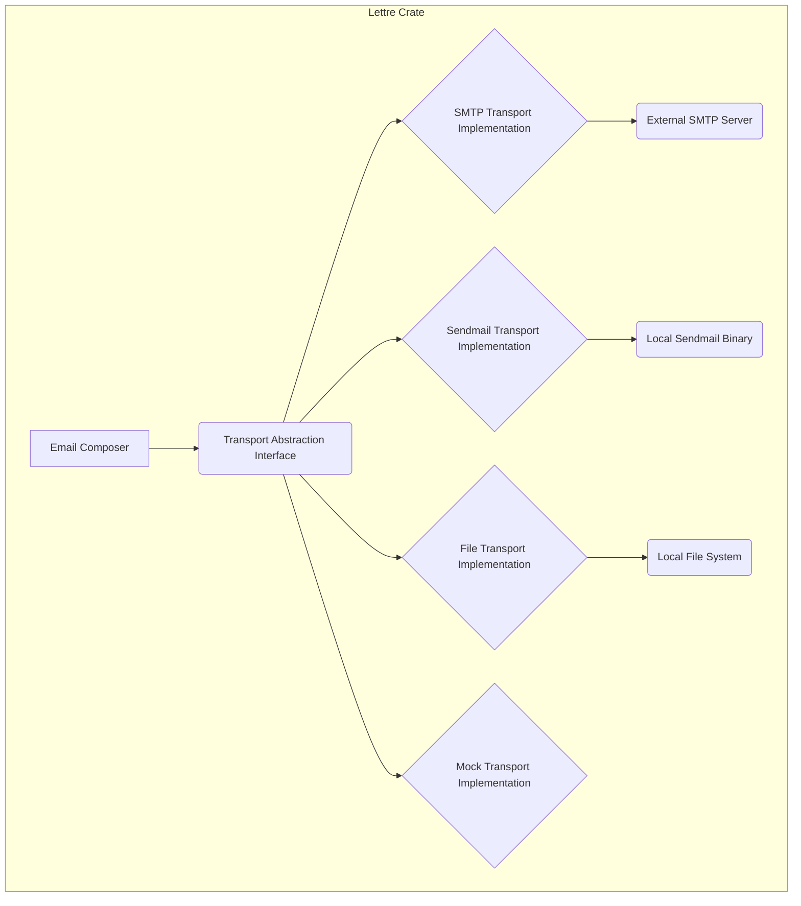
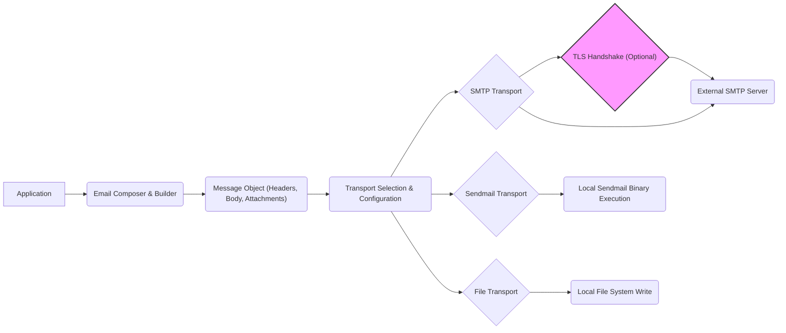

## Project Design Document: Lettre - Email Library for Rust

**Version:** 1.1
**Date:** October 26, 2023
**Author:** Gemini (AI Language Model)

### 1. Introduction

This document provides an enhanced and more detailed design overview of the `lettre` crate, a Rust library for sending emails. This document aims to provide a comprehensive understanding of the library's architecture, components, and data flow, with a particular focus on aspects relevant to threat modeling.

**Project Repository:** https://github.com/lettre/lettre

### 2. Project Overview

`lettre` is a widely used and actively developed email library written in Rust. It offers a flexible and efficient mechanism for composing and dispatching emails using various transport methods. The library abstracts the intricacies of email protocols, enabling developers to concentrate on application-specific logic.

**Project Goals:**

* To offer a dependable and robust solution for sending emails from Rust applications.
* To support a diverse range of email transport protocols, including SMTP, Sendmail, and more.
* To provide a straightforward and intuitive API for email composition and sending.
* To prioritize security and mitigate common email-related vulnerabilities.
* To ensure high performance and efficiency in email operations.
* To maintain comprehensive documentation and ease of use for developers.

### 3. Architecture and Design

#### 3.1. High-Level Architecture

The `lettre` library is designed with a modular architecture, separating concerns into distinct, well-defined components. This separation enhances maintainability and allows for flexibility in choosing transport mechanisms. The core architecture can be visualized as follows:

* **Email Composer:**  Responsible for the construction of email messages. This includes setting headers, defining the message body (plain text and/or HTML), and handling attachments.
* **Transport Abstraction Interface:** Defines a common `Transport` trait that all concrete transport implementations must adhere to. This provides a consistent API for sending emails regardless of the underlying protocol.
* **SMTP Transport Implementation:**  Provides the concrete implementation for sending emails using the Simple Mail Transfer Protocol (SMTP). This involves handling connection management, authentication, and the SMTP protocol commands.
* **Sendmail Transport Implementation:** Implements the functionality to send emails by invoking the local `sendmail` binary.
* **File Transport Implementation:**  A transport mechanism primarily used for testing and debugging, which writes the generated email to a file on the local file system.
* **Mock Transport Implementation:** A non-operational transport implementation used for testing purposes, where emails are not actually sent.
* **External SMTP Server:**  A remote SMTP server that the SMTP Transport interacts with to relay emails.
* **Local Sendmail Binary:** The `sendmail` executable available on the local system.
* **Local File System:** The file system on the machine where the application is running, used by the File Transport.

#### 3.2. Component Breakdown

* **`email` Module:**
    * **`message`:** Defines the core `Message` struct, representing an email. It contains fields for headers, body, sender, recipients, and attachments.
    * **`header`:**  Provides structs and enums for representing and manipulating email headers (e.g., `ContentType`, `Subject`, `From`, `To`). Includes logic for parsing and formatting headers according to RFC standards.
    * **`mime`:**  Handles MIME encoding and decoding for email content and attachments.
    * **`builder`:** Offers a builder pattern (`MessageBuilder`) for constructing `Message` objects in a structured and readable way. This helps ensure that required fields are set.

* **`transport` Module:**
    * **`trait Transport`:** Defines the core interface for sending emails, with methods like `send(&self, envelope: &Envelope, message: &[u8]) -> Result<()>` where `envelope` contains sender and recipient information, and `message` is the raw email content.
    * **`smtp` Module:**
        * **`SmtpTransport`:** The main struct for sending emails via SMTP. Manages connection pooling, authentication state, and TLS configuration.
        * **`client`:** Handles the low-level communication with the SMTP server, including sending commands and receiving responses.
        * **`connection`:** Manages the TCP connection to the SMTP server, including establishing and closing the connection.
        * **`authentication`:** Implements different SMTP authentication mechanisms (Plain, Login, CRAM-MD5).
        * **`extension`:** Handles SMTP extensions like STARTTLS.
    * **`sendmail` Module:**
        * **`SendmailTransport`:**  The struct responsible for sending emails using the `sendmail` binary. It handles the execution of the `sendmail` command and passing the email data.
    * **`file` Module:**
        * **`FileTransport`:** Implements the `Transport` trait by writing the email to a specified file.
    * **`stub` Module (or `mock`):**
        * **`StubTransport`:** A transport implementation that does nothing, useful for testing scenarios where actual email sending is not desired.

* **`address` Module:**
    * **`Mailbox`:** Represents an email address with an optional name.
    * **`Address`:** An enum that can hold either a `Mailbox` or a group of mailboxes.
    * Provides parsing and validation functions for email addresses according to RFC 5322.

* **`error` Module:**
    * Defines various error types that can occur during email processing, such as connection errors, SMTP errors, and encoding errors. This allows for specific error handling.

* **`tokio` Integration (Optional Feature):**
    * Provides asynchronous versions of the `Transport` trait and its implementations, leveraging the `tokio` asynchronous runtime for non-blocking I/O operations.

* **TLS Backend Integrations (`native-tls`, `rustls`, `openssl`):**
    * These optional features provide different TLS implementations for securing SMTP connections. They offer flexibility in choosing the TLS backend based on project requirements and dependencies.

#### 3.3. Data Flow

The typical data flow for sending an email using `lettre` can be broken down into the following steps, highlighting the movement of the email data and control flow:

1. **Application Initiates Email Sending:** The application code creates an instance of a transport (e.g., `SmtpTransport`) and a `Message` object.
2. **Email Composition and Preparation:** The `MessageBuilder` is used to construct the email, including setting headers (sender, recipients, subject), and the body content. This involves string manipulation and potentially MIME encoding for attachments or HTML content.
3. **Transport Method Invocation:** The application calls the `send()` method on the chosen transport, passing the prepared `Message` (or its raw representation) and an `Envelope` containing sender and recipient addresses.
4. **SMTP Transport Processing (Example):**
    * **Connection Establishment:** The `SmtpTransport` establishes a TCP connection to the configured SMTP server. This might involve looking up the server's address and port.
    * **TLS Negotiation (Optional):** If configured, the transport initiates a TLS handshake using the selected TLS backend to encrypt the communication channel. This involves cryptographic operations.
    * **SMTP Handshake:** The transport sends SMTP commands like `EHLO` to identify itself and learn about the server's capabilities.
    * **Authentication (Optional):** If required, the transport performs authentication using the configured credentials and the selected authentication mechanism. This involves sending username and password (or a hashed version) to the server.
    * **Email Transmission:** The transport sends the email content using the `MAIL FROM`, `RCPT TO`, and `DATA` SMTP commands. The `DATA` command is followed by the raw email content, including headers and body.
    * **Response Handling:** The transport receives and parses responses from the SMTP server to ensure successful delivery or to handle errors.
    * **Connection Closure:** The transport closes the connection to the SMTP server.
5. **Sendmail Transport Processing (Example):**
    * **Command Execution:** The `SendmailTransport` executes the `sendmail` binary as a separate process.
    * **Data Piping:** The raw email content is piped to the standard input of the `sendmail` process.
    * **Exit Code Handling:** The transport checks the exit code of the `sendmail` process to determine if the email was sent successfully.
6. **File Transport Processing (Example):**
    * **File Writing:** The `FileTransport` opens the specified file and writes the raw email content to it.
7. **Result Reporting:** The `send()` method returns a `Result`, indicating success or failure, along with any relevant error information.

#### 3.4. Key Interactions

* **Application and `lettre` API:** The primary interaction point is through the public API provided by `lettre`, particularly the `email::builder::MessageBuilder` for composing emails and the various transport implementations in the `transport` module.
* **`SmtpTransport` and External SMTP Servers:** This interaction is governed by the SMTP protocol. Sensitive information like authentication credentials and email content are exchanged. The security of this interaction relies heavily on TLS.
* **`SendmailTransport` and the Local Operating System:** This involves executing an external process. Security considerations include the permissions of the `sendmail` binary and the potential for command injection if input is not carefully handled (though `lettre` aims to prevent this).
* **`lettre` and TLS Backends:** When using secure SMTP, `lettre` interacts with the chosen TLS library to perform cryptographic operations for encryption and authentication. Vulnerabilities in the TLS library could impact `lettre`.

### 4. Security Considerations

This section details security considerations relevant to `lettre`, crucial for threat modeling:

* **Transport Layer Security (TLS):**
    * `lettre` relies on external TLS libraries (`native-tls`, `rustls`, `openssl`) for secure SMTP connections. Vulnerabilities in these libraries could directly impact `lettre`'s security.
    * Proper configuration of TLS is essential, including verifying server certificates to prevent man-in-the-middle attacks.
    * The choice of TLS backend can impact security due to differences in implementation and supported features.
* **SMTP Authentication:**
    * `lettre` supports various SMTP authentication mechanisms. Using strong and secure authentication methods is crucial.
    * Credentials management is the responsibility of the application using `lettre`. Secure storage and handling of credentials are vital.
    * Plaintext authentication methods should be avoided where possible.
* **Input Validation and Email Injection:**
    * While `lettre` provides some basic validation, applications using it must be diligent in validating email addresses, headers, and body content to prevent email injection attacks.
    * Malicious input in email fields could be exploited by mail servers or recipients.
* **Dependency Management:**
    * `lettre` has dependencies, including the TLS backends. Regularly updating dependencies is crucial to patch security vulnerabilities.
    * Supply chain attacks targeting dependencies are a potential risk.
* **Error Handling and Information Disclosure:**
    * Error messages should not reveal sensitive information about the application or the email infrastructure.
    * Proper error handling prevents unexpected behavior that could be exploited.
* **Sendmail Security:**
    * When using `SendmailTransport`, the security of the local `sendmail` installation is paramount. `sendmail` vulnerabilities could be exploited.
    * The permissions under which the `sendmail` command is executed are important.
* **Configuration Security:**
    * SMTP server credentials and other sensitive configuration should be stored securely (e.g., using environment variables, secrets management systems) and not hardcoded.
* **Denial of Service (DoS):**
    * Applications using `lettre` should implement rate limiting or other mechanisms to prevent abuse and potential DoS attacks by sending excessive emails.
    * Resource exhaustion on the mail server is a potential consequence of uncontrolled email sending.
* **Header Injection:**
    * Ensure that user-provided data used in email headers is properly sanitized to prevent header injection attacks, which could lead to spoofing or other malicious activities.

### 5. Deployment Considerations

Deploying applications that use `lettre` involves several considerations:

* **Dependency Management:** Ensure `lettre` and its chosen TLS backend are correctly included in the application's deployment package.
* **TLS Backend Availability:** The chosen TLS backend (`native-tls`, `rustls`, `openssl`) must be available on the target deployment environment.
* **Configuration:**  SMTP server details (host, port, credentials), Sendmail path (if used), and other transport-specific settings need to be configured appropriately for the deployment environment. This configuration should ideally be externalized.
* **Permissions:** When using `SendmailTransport`, ensure the application has the necessary permissions to execute the `sendmail` binary.
* **Network Access:** Ensure the application has network connectivity to the SMTP server if using `SmtpTransport`. Firewall rules might need to be configured.
* **Asynchronous Runtime:** If using the `tokio` integration, ensure a `tokio` runtime is running in the deployment environment.
* **Security Hardening:** Apply appropriate security hardening measures to the deployment environment, including keeping the operating system and libraries up-to-date.

### 6. Future Considerations

Potential future enhancements for `lettre` could include:

* **Built-in DKIM/SPF/DMARC Signing:**  Providing native support for these email authentication mechanisms would enhance security and deliverability.
* **Improved Error Context:** Providing more context-rich error information to aid in debugging and troubleshooting.
* **More Granular Transport Configuration:** Offering more fine-grained control over transport settings, such as connection timeouts and retry policies.
* **Standardized Configuration Options:**  Exploring standard configuration formats or libraries for easier integration.

### 7. Appendix: Mermaid Diagrams

